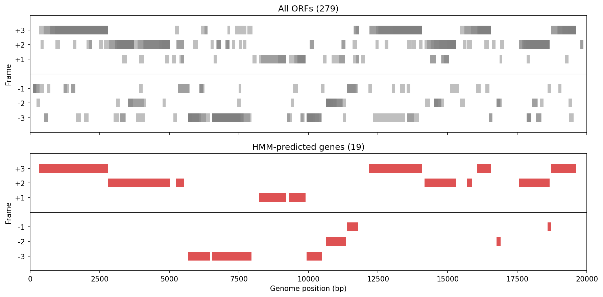
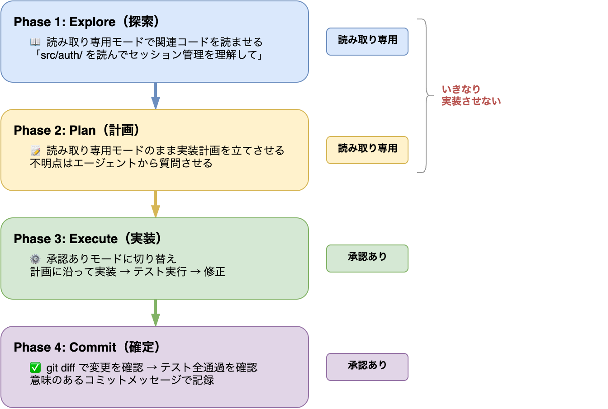

# §0 AIエージェントにコードを書かせる（2026年のベストプラクティス）

[§はじめに](./hajimeni.md)で述べたように、AIコーディングエージェントは「コードを書く」作業を劇的に変えた。しかし、エージェントをただ起動して「作って」と言うだけでは、良いソフトウェアは生まれない。エージェントは強力な道具であるが、道具の使い方を知らなければ、その力を引き出すことはできない。

本章では、AIコーディングエージェントを開発の相棒として使いこなすための基礎を学ぶ。セットアップから始まり、計画→実装→レビューのワークフロー、プロジェクト設定、コンテキスト管理、そしてAIに何を任せ何を自分で判断すべきかまで、実践的なベストプラクティスを体系的に解説する。ここで紹介するワークフローと考え方は、[§1 設計原則 — 良いコードとは何か](./01_design.md)以降のすべての章を通じて繰り返し使うことになる。

本書では概念（「読み取り専用モード」「承認ありモード」等）で記述し、ツール固有の操作は対照表で示す。現在の代表的なツールであるClaude Code CLIとCodex CLIを対照表の例として用いるが、他のAIコーディングエージェント（Cursor、Windsurf等）にも考え方の多くは適用できる。

---

## 0-1. セットアップと基本操作

### なぜCLIを使うのか — ブラウザチャットとの違い

ChatGPTやClaudeのブラウザチャットを使ったことがある読者は多いだろう。「コードを生成してくれるなら、それで十分では？」と思うかもしれない。ここでは、ブラウザチャットとCLIエージェントの能力の違いを具体的に示す。

| 能力 | ブラウザチャット | CLIエージェント |
|------|----------------|----------------|
| ファイル操作 | コピー&ペーストで手動転記 | プロジェクト内のファイルを直接読み書き |
| コマンド実行 | 不可 | ターミナルで直接実行 |
| プロジェクト理解 | 貼り付けたコード断片のみ | ディレクトリ構造・全ファイルを探索 |
| テスト実行 | 不可（手動実行→結果を貼り付け） | テスト実行→失敗検知→自動修正 |
| Git連携 | 不可 | コミット・差分確認・ブランチ操作 |
| 安全制御 | なし（人間が手動で適用） | 3段階の承認モード |

たとえば、RNA-seqカウントデータからPCAプロットを生成するスクリプトを作る場面を想像してほしい。ブラウザチャットでは、まずコードを生成させ、手元のファイルにコピーし、ターミナルで実行し、エラーが出たらそのメッセージをチャットに貼り付けて修正を依頼し、修正コードを再びコピーして……という往復を繰り返す。CLIエージェントなら「samples/ディレクトリのカウントデータを読み込んでPCAプロットを作って」と一言伝えるだけで、エージェントがファイルを探索し、スクリプトを作成し、実行し、エラーがあれば自分で修正してくれる。

もちろん、ブラウザチャットが適している場面もある。概念の説明を聞きたいとき、エラーメッセージの意味を解読したいとき、コードの断片について質問したいとき——こうした「相談」にはブラウザチャットの手軽さが向いている。CLIエージェントはブラウザチャットを否定するものではなく、「手を動かす」作業を任せるための道具である。本書では、この「手を動かせる共同作業者」としてのCLIエージェントを前提に、ソフトウェア開発の作法を学んでいく。

#### エージェントへの指示例

以下は、ブラウザチャットでは不可能だがCLIエージェントなら一言で済む指示の例である。これらがなぜ可能なのかは、上の対照表と照らし合わせてほしい。

> 「このプロジェクトのディレクトリ構造を見て、各ファイルの役割を説明して」

> 「scripts/のPythonスクリプトにテストを書いて、実行して、結果を確認して」

> 「git diffで今回の変更を確認して、変更内容を要約して」

### インストール

AIコーディングエージェントの利用を始めるには、ツールのインストールと認証が必要である。いずれのツールもNode.jsをベースとしており、npmコマンドでインストールできる。

| | Claude Code CLI | Codex CLI |
|--|----------------|-----------|
| インストール | `npm install -g @anthropic-ai/claude-code` | `npm install -g @openai/codex` |
| 前提 | Node.js 18+ | Node.js 18+（またはbrew/バイナリ） |
| 認証 | Claude Pro/Max契約 or Anthropic APIキー | ChatGPT Plus/Pro契約 or OpenAI APIキー |
| 起動 | `claude` | `codex` |

インストールが完了したら、ターミナルで起動コマンドを入力するだけでエージェントとの対話が始まる。初回起動時に認証情報の入力を求められるので、あらかじめAPIキーまたはサブスクリプション契約を用意しておくこと。

### 承認モード — 3段階の安全レベル

AIコーディングエージェントは、ファイルの編集やコマンドの実行など、ローカル環境に直接影響を与える操作を行う。したがって「エージェントにどこまで自由にやらせるか」を制御する仕組みが極めて重要である。

両ツールとも、この制御を3段階の安全レベル——本書では**承認モード**と呼ぶ——で提供している。概念は同じである。

| 安全レベル | 概念 | Claude Code CLI | Codex CLI |
|-----------|------|-------------|-----------|
| 読み取り専用 | コード変更を一切行わず、調査と計画のみ | **Plan Mode** (`Shift+Tab` or `/plan`) | **Read-Only** (`-s read-only`) |
| 承認あり（デフォルト） | 変更のたびに人間が許可 | **Normal Mode** | **Auto**（デフォルト） |
| 全自動 | 編集・実行を自動承認 | **Auto-Accept Mode** (`Shift+Tab`) | `--full-auto` |

**初心者は「承認あり」を基本にすること。** エージェントが提案する変更を一つ一つ確認しながら進めることで、何が行われているかを理解でき、意図しない変更を防げる。全自動モードは、テストが十分に整備され、エージェントの動作に信頼が置けるようになってから使えばよい。

「読み取り専用」モードは、次の[§0-2](#0-2-plan--execute--review-ワークフロー)で説明するPlan→Execute→Reviewワークフローの起点として極めて重要な役割を果たす。

### はじめてのVibe coding体験 — 遺伝子予測を題材に

インストールと承認モードを理解したところで、実際にエージェントと協働してみよう。ここでは小さな細菌ゲノム配列を題材に、「自然言語で指示 → コード生成 → 承認 → 実行 → 結果を判断」というサイクルを体験する。

入力データとして、*E. coli* K-12 MG1655株のゲノム配列から20,000 bpの断片を使用する（GenBank: [U00096.3](https://www.ncbi.nlm.nih.gov/nuccore/U00096.3)、1–20,000 bp）。この領域には *thrA*、*thrB*、*thrC* 等のアノテーション済み遺伝子が含まれており、予測結果の妥当性を既知の情報と照合できる。

#### Step 1: 最初の指示 — 全ORFを検出する

エージェントを起動し、以下のように指示する。

> 「このDNA配列ファイル（FASTA形式）から、6フレームすべてのORF（Open Reading Frame）を検出して、開始位置・終了位置・フレーム・翻訳後のタンパク質配列を表示するPythonスクリプトを作って」

エージェントがコードを生成し、承認を求めてくる。承認ありモードであれば、ファイルの作成やコマンドの実行のたびに確認が入る。内容を眺めて承認し、実行してみよう。エージェントが以下のようなコードを生成した。

```python
from dataclasses import dataclass

STOP_CODONS = {"TAA", "TAG", "TGA"}

@dataclass(frozen=True)
class ORF:
    """Open Reading Frameを表すデータクラス."""
    start: int    # 開始位置（0-based）
    end: int      # 終了位置
    frame: int    # 読み枠（+1, +2, +3, -1, -2, -3）
    protein: str  # 翻訳後のアミノ酸配列

def find_all_orfs(sequence: str, min_length: int = 100) -> list[ORF]:
    """6フレームすべてのORFを検出する."""
    seq = sequence.upper()
    orfs = []
    # 順鎖（+1, +2, +3フレーム）
    for offset in range(3):
        frame = offset + 1
        pos = offset
        while pos + 3 <= len(seq):
            if seq[pos:pos+3] == "ATG":
                # ATGから終止コドンまでスキャン
                end = _find_stop(seq, pos + 3)
                if end and (end - pos) >= min_length:
                    protein = _translate(seq[pos:end])
                    orfs.append(ORF(pos, end, frame, protein))
            pos += 3
    # 逆鎖（-1, -2, -3フレーム）も同様に処理
    rc = reverse_complement(seq)
    # ...（逆鎖の処理は順鎖と同じロジック）
    return sorted(orfs, key=lambda o: o.start)
```

> **注**: このコードは標準ライブラリのみで動作する。本格的な配列解析では Bio.SeqIO を使うべきであり、その方法は[§12 データ処理の実践 — NumPy・pandas・polars](./12_data_processing.md)で扱う。

承認して実行すると、以下の結果が得られる。

```text
  #1  start=    107  end=    500  frame=-1   393 bp  130 aa
  #2  start=    107  end=    338  frame=-1   231 bp   76 aa
  #3  start=    336  end=   2799  frame=+1  2463 bp  820 aa
  #4  start=    483  end=   2799  frame=+1  2316 bp  771 aa
  #5  start=    516  end=    654  frame=-3   138 bp   45 aa
  ...
  合計: 279 個のORFを検出
```

279個ものORFがずらりと出力される。ここで立ち止まって考えてみてほしい。

- **コドンテーブルは正しいか？** — 標準コドンテーブルが使われているはずだが、ミトコンドリアや特殊な生物では異なる。これは生物学の知識で判断できる
- **最小ORF長はいくつに設定されたか？** — 100 bp（約33アミノ酸）は短すぎるORFまで拾っている可能性がある。開始コドンはATGだけか、それとも代替開始コドンも含むか

生物学の知識で判断できる部分がある一方で、コードの設計やテストの妥当性については判断が難しいと感じるだろう。後者の判断力を養うのが、本書の目的である。

#### Step 2: 結果を見て戦略を練り直す — HMMで本物の遺伝子を選別する

279個のORFには、実際の遺伝子ではない偽陽性が大量に含まれている。「ORFが多すぎる。もっと絞り込みたい」——この判断ができたこと自体が、ドメイン知識の力である。次に、より精度の高い手法をエージェントに指示する。

> 「コドン使用頻度の偏りを利用して、コーディング領域を隠れマルコフモデル（HMM）のViterbiアルゴリズムで予測するように改良して。コーディング領域と非コーディング領域の2状態モデルで、各状態のコドン出力確率を学習データから推定して」

エージェントが以下のコードを生成した（抜粋。全体は `scripts/ch00/hmm_gene_predict.py`）。

```python
# E. coli K-12のコドン使用頻度（コーディング領域）
CODING_CODON_FREQ = {
    "TTT": 0.0218, "TTC": 0.0169, "TTA": 0.0133, "TTG": 0.0133,
    "CTT": 0.0108, "CTC": 0.0110, "CTA": 0.0038, "CTG": 0.0530,
    # ...（全64コドンの頻度）
}

# HMMの遷移確率
LOG_TRANS = {
    ("C", "C"): log(0.997),  # コーディング→コーディング
    ("C", "N"): log(0.003),  # コーディング→非コーディング
    ("N", "N"): log(0.98),   # 非コーディング→非コーディング
    ("N", "C"): log(0.02),   # 非コーディング→コーディング
}

def viterbi(sequence: str) -> list[str]:
    """2状態HMMのViterbiアルゴリズム."""
    codons = [seq[i*3:(i+1)*3] for i in range(len(seq) // 3)]
    # 動的計画法で最適パスを計算
    for t in range(1, len(codons)):
        for state in ["C", "N"]:
            emit = log(freq[state][codons[t]])
            best = max(
                v[t-1][prev] + log_trans[(prev, state)]
                for prev in ["C", "N"]
            )
            v[t][state] = best + emit
    # バックトレースで最適パスを復元
    return path  # 各コドン位置の状態 ("C" or "N")
```

承認して実行すると、今度は19個の遺伝子候補に絞られる。

```text
  遺伝子候補  1: start=   336, end=  2799, frame=+1, 2463 bp (820 aa)
  遺伝子候補  2: start=  2800, end=  3733, frame=+2,  933 bp (310 aa)
  遺伝子候補  3: start=  3733, end=  5020, frame=+2, 1287 bp (428 aa)
  遺伝子候補  4: start=  5242, end=  5530, frame=+2,  288 bp  (95 aa)
  遺伝子候補  5: start=  5682, end=  6459, frame=-3,  777 bp (258 aa)
  ...
  遺伝子候補 19: start= 18714, end= 19620, frame=+1,  906 bp (301 aa)

  合計: 19 個の遺伝子候補（279 ORFから絞り込み）
```

さらに「結果をゲノム上にプロットして。GenBankのアノテーションも並べて比較したい」と指示すると、次のような図が得られる。



上段が全279個のORF（灰色）、中段がHMM予測後の19個（赤）、下段がGenBank登録済みの既知遺伝子（青）である。全ORFではゲノム全体が隙間なく埋め尽くされていたのが、HMM予測後は離散的な遺伝子候補だけに絞られていることがわかる。中段と下段を見比べると、HMM予測の19個の大半が既知遺伝子と位置・フレームが一致していることがわかる。

再び立ち止まって考える。

- **ゲノムサイズに対して遺伝子数は妥当か？** — *E. coli* のゲノム全体（約4.6 Mbp）には約4,300個の遺伝子がある。20,000 bpの断片から19個の遺伝子候補が見つかったのは、遺伝子密度（約1,000 bp に1遺伝子）と概ね一致する。これは生物学の知識の領域である
- **HMMの遷移確率や出力確率は適切か？** — コードを見ると、パラメータがハードコーディングされている。この値が妥当かどうかは、統計モデルの知識がなければ判断できない
- **予測は既知遺伝子とどれだけ一致したか？** — 中段と下段を見比べると、HMM予測の大部分は既知遺伝子に対応する。一方で、thrL（66 bp）のような極端に短い遺伝子はORF検出の段階で最小ORF長（100 bp）の閾値により除外されていた。パラメータの選択がどのような結果の偏りを生むか——これはエージェントが自動で決めた値であり、人間が意識的にレビューすべきポイントである

ここで「自分にはHMMのパラメータの妥当性を評価できない」と気づくことが重要である。この気づきこそが、[§3 コーディングに必要な計算機科学](./03_cs_basics.md)以降で計算機科学やアルゴリズムの基礎を学ぶ動機になる。

#### このチュートリアルで体験したこと

- コードを1行も自分で書かずに、自然言語の指示だけでORF検出からHMM遺伝子予測まで高度なアルゴリズムが実装された
- 結果に対する判断（「ORFが多すぎる」）が、より良い指示（HMMの導入）を生み、より良い結果につながった
- 承認のたびに「このコードを実行してよいか」という判断を求められた。この判断力——生物学の知識とプログラミングの知識の両方——を養うのが本書の全体像である
- Step 1は「いきなり実装」、Step 2は「結果を見て戦略を練り直し」であった。[§0-2](#0-2-plan--execute--review-ワークフロー)で学ぶPlan→Execute→Reviewワークフローは、最初から計画的にこのサイクルを回す方法論である

### 基本コマンド

日常的に使うコマンドを以下にまとめる。すべてを暗記する必要はなく、最初は「計画モードへの切り替え」と「セッション再開」の2つを覚えておけば十分である。

| 操作 | Claude Code CLI | Codex CLI |
|-----|-------------|-----------|
| プロジェクト初期化 | `/init` → CLAUDE.md生成 | AGENTS.mdを手動作成（または `/` コマンドで雛形） |
| 計画モードに切替 | `/plan` or `Shift+Tab`×2 | `-s read-only` / `$create-plan` skill |
| モデル切り替え | `/model` | `/model` |
| セッション再開 | `/resume` | `codex resume` / `codex resume --last` |
| コンテキスト圧縮 | `/compact` | （自動管理） |
| 直前の変更を取り消し | `Esc Esc` (`/rewind`) | git revertで対応 |
| 計画をエディタで編集 | `Ctrl+G` | — |
| 非対話実行 | `claude -p "..."` | `codex exec "..."` |
| ヘルプ | `/help` | `/help` |

---

## 0-2. Plan → Execute → Review ワークフロー

AIコーディングエージェントを使う上で最も重要な原則は **「いきなり実装させない」** ことである[3](https://www.anthropic.com/engineering/claude-code-best-practices)。

プログラミング未経験者がエージェントを使い始めると、つい「○○を作って」とだけ伝えて全てを任せたくなる。しかし、計画なしにエージェントに自由に書かせると、「自信満々だが的外れなコード」が生成されることがある。計画を立ててから実装に移る——このワークフローを守るだけで、成果物の品質は劇的に向上する。

両ツールで共通の、推奨される4フェーズワークフローを示す。



### なぜ読み取り専用モード（Plan Mode）から始めるのか

- AIに自由に書かせると「自信満々だが的外れなコード」が生成されることがある[3](https://www.anthropic.com/engineering/claude-code-best-practices)
- 計画フェーズは実装フェーズより圧倒的にトークンコストが低い
- 方向修正は計画段階のほうが遥かに安い（実装後のやり直しは高コスト）
- 人間がアーキテクチャの判断をし、AIが実装の詳細を担う、という役割分担が自然に生まれる

これは実験計画と同じ考え方である。実験を始める前にプロトコルを設計するように、コーディングでも「何を、どの順序で、どう実装するか」を先に固めてから手を動かす。

### 初心者が特に意識すべきこと

- 読み取り専用モード中にエージェントが質問してきたら丁寧に答える。この質問への回答が実装品質を大きく左右する
- 計画に納得がいかなければ修正する。受け身にならない
- 実装が計画から逸脱したら、一度読み取り専用モードに戻って計画を修正する

### 「インタビューしてもらう」パターン — 要件が曖昧なときの最強テクニック

自分自身が「何を作りたいか」をうまく言語化できないとき、**エージェントに要件をインタビューさせる**のが非常に有効である。作りたいものの最小限の説明だけ渡して、エージェントに質問攻めにしてもらう。

```
> （読み取り専用モードで）
> RNA-seqの発現量データからDEG（差次的発現遺伝子）を抽出するCLIツールを作りたい。
> 実装を始める前に、仕様を固めるためにインタビューして。
> 必要な要件を質問して、全体像を理解してから仕様書を作って。
```

エージェントは以下のような質問を投げてくる:

- 入力データの形式は？（カウントマトリクス？ TPM？ どのツールの出力？）
- 比較のデザインは？（2群比較？ 多群？ ペアドサンプル？）
- 統計手法の選択は？（DESeq2ラッパー？ 独自実装？）
- 出力形式は？（TSV？ ボルケーノプロット？ エンリッチメント解析まで？）
- フィルタリング条件は？（FDR閾値、fold change閾値はユーザー指定？）
- 再現性の要件は？（乱数シード固定？ バージョン記録？）

**このパターンが有効な場面：**

- 新しいツールを一から設計するとき
- ドメイン知識はあるがソフトウェア設計の経験が薄いとき（実験系研究者に多い）
- 要件が頭の中にあるが整理されていないとき

**ポイント：**

- 最初のプロンプトは粗くてよい。エージェントの質問に答えていくことで仕様が固まる
- インタビューの結果を仕様書（spec）としてまとめさせる
- 仕様書を確認・修正してから、**新しいセッション**で仕様書を渡して実装を開始する
  - 新しいセッションにする理由: インタビュー過程の大量のやり取りでコンテキストが消費されるため
  - 仕様書がインタビューの「成果物」として、セッション間の橋渡しになる
- 仕様書は `docs/spec.md` としてリポジトリにコミットしておくと、後から設計意図を追える

### 非テキスト資料を使った計画 — 画像・データ・文書をエージェントに読ませる

インタビューパターンでは会話を通じて要件を引き出したが、計画フェーズで使える武器はテキストだけではない。AIコーディングエージェントは**マルチモーダル**対応であり、画像やファイルの内容を分析できる。手元の資料をエージェントに「見せる」ことで、言葉だけでは伝えにくい情報を正確に共有でき、計画の精度が上がる。

> **コラム: エージェントが扱えるファイル形式**（2026年3月時点）
>
> | 形式 | Claude Code CLI | Codex CLI |
> |------|----------------|-----------|
> | 画像（JPEG, PNG, GIF, WebP） | ○ ファイルパス指定で分析 | ○ PNG, JPEGをフラグで添付 |
> | PDF | ○ ページ範囲指定可 | — |
> | Jupyter Notebook（.ipynb） | ○ セル・出力を含めて表示 | — |
> | テキスト系（CSV, TSV, JSON, YAML等） | ○ | ○ |
> | Excel（.xlsx） | △ ライブラリ経由で読み取り | △ ライブラリ経由で読み取り |
> | Word / PowerPoint | △ PDF変換またはライブラリ経由 | △ PDF変換またはライブラリ経由 |
>
> ○=ネイティブ対応　△=ツール実行経由で可能　—=未対応または未確認
>
> テキスト系ファイル（CSV, JSON等）はどちらのツールでもそのまま読める。画像の分析はいずれもマルチモーダルモデルの機能を利用する。ExcelやOffice文書は直接読めない場合が多いが、エージェントにPythonライブラリ（`openpyxl`, `python-pptx`等）を使った変換スクリプトを書かせることで対応できる。ツールのバージョンアップで対応形式は変わりうるため、最新の公式ドキュメントも確認すること。

バイオインフォマティクスの実務では、解析に必要な情報が機械可読でない形式で渡されることが日常的に起こる。共同研究者からメールで届いたプレートレイアウトの画像、PowerPointにまとめられた実験デザイン、論文中のパイプライン概要図——これらをエージェントに直接読ませることで、手作業での転記や解釈の手間を大幅に削減できる。

#### 入力データの構造を分析させる

解析の出発点で最も重要なのは、入力データの構造を正しく理解することである。CSVやTSVファイルの先頭数行をエージェントに見せるだけで、カラムの意味、値の範囲、欠損パターンを素早く把握できる。特にバイオインフォのデータは、カラム名が略語だったり、ヘッダが日本語だったり、複数の情報が1つのセルに詰め込まれていたりと、構造が直感的でないことが多い。

> 「このCSVファイルを読んで、各カラムの意味を推測して。どのカラムがサンプルID、どれが測定値、どれがメタデータか整理して。解析に使いやすい形に変換する方針も提案して」

> 「このRNA-seqのカウントマトリクスの構造を確認して。行と列の意味、欠損値の有無、値の分布を要約して。DEG解析に使える状態かどうか判断して」

データ構造を理解した上で、[§4 データフォーマットの選び方](./04_data_formats.md#tidy-data)で学ぶ**tidy data**（整然データ）への変換計画を立てさせると、解析パイプライン全体の見通しが良くなる。

#### 実験デザインの画像・文書を構造化データに変換する

バイオインフォ解析で特に厄介なのは、実験デザインの情報が画像やスライドの形でしか存在しないケースである。たとえば96ウェルプレートのレイアウト図——どのウェルにどのサンプルが入っているか、どの処理条件でどのリプリケートか——は、共同研究者からPowerPointや画像ファイルとして渡されることが多い。これを手作業でCSVに起こすのは面倒で、転記ミスの原因にもなる。

エージェントに画像を読ませれば、この変換を自動化できる。

> 「この96ウェルプレートのレイアウト画像を読んで、各ウェルのサンプル名・処理条件・リプリケート番号をCSVとして出力して。これを解析スクリプトのメタデータ入力に使いたい」

> 「この実験デザインの図を読んで、比較群の構造を整理して。どの群同士を統計的に比較すべきか、DEG解析の計画を立てて」

ただし、画像からの読み取りは完璧ではない。特に手書きの文字や低解像度の画像では誤認識が起こりうる。**エージェントが出力した構造化データは、必ず元の資料と突き合わせて検証する**こと。

#### 論文の図から解析計画を立てる

参考論文のパイプライン概要図（よくあるFigure 1のフロー図）をエージェントに見せて、同等の処理を実装する計画を立てさせるのも有効な使い方である。論文の手法セクションを読み込ませるよりも、図を見せた方が全体像を素早く共有できることが多い。

> 「この論文のFigure 1（解析パイプラインの概要図）を見て、同じ処理をPythonで再実装する計画を立てて。各ステップで使うべきライブラリも提案して」

#### エージェントへの指示例

非テキスト資料を計画フェーズで活用する際の指示例をまとめる。いずれも読み取り専用モードで実行するのが望ましい。

> 「添付のExcelファイルを読んで、シートごとの構造を説明して。どのシートをどの順序で処理すべきか、解析計画を立てて」

> 「このプレートレイアウトの画像と、このカウントデータのCSVを照合して。サンプル名が一致しているか確認し、不一致があれば報告して」

> 「この論文のSupplementary Figure S2（ワークフロー図）を見て、Methods セクションの記述と合わせて、再現に必要なステップを洗い出して」

> 🧬 **コラム: バイオインフォ解析の計画をエージェントに立てさせる**
>
> 実験系研究者にとって、解析パイプラインの全体設計は最も難しいステップの一つである。「FASTQ → アラインメント → カウント → 統計検定 → 可視化」という大まかな流れは知っていても、各ステップでどのツールを使い、どのパラメータを設定し、中間ファイルをどう管理するかは、経験がなければ判断できない。
>
> ここでインタビューパターンが威力を発揮する。たとえば以下のように始めるだけでよい:
>
> ```
> > （読み取り専用モードで）
> > ChIP-seqデータの解析パイプラインを設計したい。
> > 私はウェットの実験者で、バイオインフォマティクスの経験は浅い。
> > 必要なステップ、ツール、パラメータについてインタビューして。
> ```
>
> エージェントは「リファレンスゲノムは？」「ピークコールのツールはMACS2でよいか？」「入力コントロールはあるか？」「リプリケートの数は？」といった具体的な質問を通じて、研究者の頭の中にある暗黙知を引き出してくれる。このやり取りの結果を仕様書にまとめておけば、実装フェーズの品質が格段に上がるだけでなく、解析の設計判断を記録として残せるという副次的な効果もある。

---

## 0-3. プロジェクト設定ファイル（CLAUDE.md / AGENTS.md）

プロジェクトのルートに設定ファイルを置くことで、エージェントの振る舞いをカスタマイズできる[1](https://docs.anthropic.com/en/docs/claude-code) [2](https://github.com/openai/codex)。この設定ファイルは、エージェントがセッション開始時に自動的に読み込む「プロジェクトの取扱説明書」のようなものである。

| | Claude Code CLI | Codex CLI |
|--|-------------|-----------|
| ファイル名 | `CLAUDE.md` | `AGENTS.md` |
| 自動生成 | `/init` で生成 | 手動作成（テンプレートを用意すると楽） |
| スコープ | プロジェクト / ユーザー / `~/.claude/` | プロジェクト / ユーザー / `~/.codex/` |

**書くべき内容は同じである。** 以下はバイオインフォプロジェクトの例を示す:

```markdown
# CLAUDE.md / AGENTS.md（共通の内容）

## プロジェクト概要
- RNA-seqパイプラインのPythonラッパーツール
- Python 3.11+, conda環境を使用

## コマンド
- `pytest tests/` — テスト実行
- `ruff check src/` — リント
- `ruff format src/` — フォーマット

## コーディング規約
- 型ヒント必須
- docstringはGoogle style
- テストは `tests/` 配下に `test_*.py` で配置
- ログは `logging` モジュールを使う（`print()` 禁止）

## バイオインフォ固有の注意
- ゲノム座標はBED形式（0-based, half-open）に統一
- BAMファイルの操作は `pysam` を使用
- FASTAのパースは `Bio.SeqIO` を使用（自作パーサは禁止）
```

### 設定ファイルのコツ

- エージェントが自動で読み取れる情報（コードから推測可能なこと）は書かない — 簡潔に保つ
- 「やってほしいこと」より **「やってはいけないこと」** の方が効果的である
- バイオインフォ特有の規約（座標系、使用ライブラリ）は明示する
- ビルド・テスト・リントのコマンドは必ず書く（エージェントが自分でテストを実行して検証できるようになる）

設定ファイルは[§7 Git入門 — コードのバージョン管理](./07_git.md)で学ぶGitリポジトリにコミットしておくことで、チームメンバーや将来の自分が同じ規約でエージェントを使える。また、テストコマンドを明記しておくことで、[§8 コードの正しさを守るテスト技法](./08_testing.md)で学ぶテスト駆動開発のワークフローとも連携する。

### エージェントの拡張機能 — MCP・フック・カスタムコマンド

設定ファイルは「エージェントへのルールの伝達」であった。AIコーディングエージェントには、さらにエージェントの**能力そのもの**を拡張する仕組みが用意されている。以下の4つの拡張機能を知っておくと、本書を読み進める中でエージェント活用の幅が大きく広がる。

| 拡張機能 | 何ができるか | 本書での詳細 |
|---------|-------------|-------------|
| **MCP**（Model Context Protocol） | エージェントに外部ツールやデータベースへのアクセス能力を追加する。たとえばGitHub MCPを追加すると、エージェントがIssueの検索やPRの作成を直接行えるようになる | [§5-5](./05_software_components.md#5-5-mcpmodel-context-protocolエージェントの能力を拡張する) |
| **フック**（Hooks） | ファイルの保存やコミットなど、特定のイベントの前後にシェルコマンドを自動実行する。コミット前にリンターやテストを自動で走らせる仕組みを構築できる | [§8-3](./08_testing.md#エージェントフック--ツール実行前後の自動チェック) |
| **カスタムコマンド**（Agent Skills） | 「コードレビューして」「テストを書いて」のような定型的な指示をテンプレートとして保存し、ワンコマンドで呼び出せるようにする | [§11-1](./11_cli.md#カスタムコマンドagent-skills--エージェント向けのテンプレート) |
| **設定ファイルの階層構造** | プロジェクト全体のルールに加え、ディレクトリごとに異なるルールを設定できる。`src/` と `tests/` で異なるコーディング規約を適用するといった使い分けが可能 | [§10-3](./10_deliverables.md#設定ファイルの階層構造--ディレクトリ単位のルール設定) |

| | Claude Code CLI | Codex CLI |
|--|-------------|-----------|
| MCP追加 | `claude mcp add` | `codex mcp add` |
| フック設定 | `.claude/settings.json` の `hooks` | `config.toml` の `hooks` |
| カスタムコマンド | `.claude/commands/` にMDファイル | `SKILL.md`（`$skill-name` で呼び出し） |
| 階層構造 | ディレクトリごとに `CLAUDE.md` を配置 | ディレクトリごとに `AGENTS.md` を配置 |

**今はこれらの名前と概念だけ知っておけばよい。** 本書を読み進めるうちに、これらの機能を使うべき場面が自然に出てくる。各機能の詳しい使い方は、上の表の「本書での詳細」列に示した章で、前提知識が揃った段階で解説する。

> 🧬 **コラム: バイオインフォマティクス向けMCPサーバーとAIエージェント**
>
> MCPの仕組みを使えば、エージェントにバイオインフォマティクス特有のデータベースへのアクセス能力を追加できる。たとえばBioMCP（https://biomcp.org/ ）を導入すると、遺伝子・変異・論文・臨床試験など12種のバイオメディカルデータを統一的にクエリできるようになる。PubMed MCPを追加すれば、エージェントが直接PubMedを検索して論文情報を取得できる。さらに、Stanford大学が開発したBiomni（https://biomni.stanford.edu/ ）のように、150以上の専門ツールと59のデータベースを統合したバイオメディカル特化のAIエージェントも登場している。これらの実践的な活用方法は[§19 公共データベースとAPI — データ取得の実践](./19_database_api.md)で詳しく扱う。

---

## 0-4. エージェントにレビューさせる

AIコーディングエージェントは**実装だけでなくレビューにも使える**。むしろ、レビューこそエージェントの最も効果的な活用法の一つである。

人間のプログラマーがコードレビューを行うのは、書いた本人が見落としがちなバグや設計上の問題を第三者の目で発見するためである[10](https://doi.org/10.1109/ICSE.2013.6606617)。エージェントは「疲れない第三者」として、人間のレビューを補完する強力なパートナーになる。

以下の3つのパターンが特に有効である。

### 実装後のセルフレビュー

```
# 読み取り専用モードで実装結果をレビューさせる
> 今回の変更をレビューして。以下の観点で問題がないか確認して:
> - エッジケースの見落とし
> - エラーハンドリングの不足
> - パフォーマンス上の懸念
> - 既存テストとの整合性
```

### 「別人格」レビュー

```
# 新しいセッションを開いて、実装コードを批判的にレビューさせる
> git diffでの変更内容を、シニアエンジニアとしてレビューして。
> バグの可能性、設計上の問題点、テスト不足を厳しく指摘して。
```

新しいセッションで行うのがポイントである。実装を行ったセッションでは、エージェントは自分が書いたコードに対して甘くなる傾向がある[11](https://arxiv.org/abs/2310.13548)。別のセッションを開くことで、先入観のない目でコードを評価させられる。

### テスト生成によるレビュー

```
# 実装に対するテストを書かせることで、暗黙の仕様を炙り出す
> src/analysis.py に対するテストを書いて。
> 特にエッジケース（空の入力、不正なFASTAファイル、巨大ファイル）を重視して。
```

テストを書かせるという行為自体がレビューの一形態である。エージェントがテストケースを考える過程で、「この関数はNoneが渡されたときどうなるべきか？」「空のFASTAファイルが入力されたら？」といった、実装者が暗黙に仮定していた条件が明示化される。テスト駆動開発の詳細は[§8 コードの正しさを守るテスト技法](./08_testing.md)で扱う。

### レビューのベストプラクティス

- 実装とレビューは**別のセッション**で行うと、コンテキストの偏りが減る
- エージェントのレビュー結果を鵜呑みにしない — **科学的妥当性は人間が判断する**
- レビューで指摘された問題は、修正後にテストを追加して再発を防ぐ

---

## 0-5. サブエージェントとタスク委譲

複雑なタスクに取り組む際、エージェントは**サブエージェント**（Sub-agent）を生成して並列にタスクを実行できる。これは、研究室で複数の実験を同時並行で走らせるのに似ている。メインのエージェントが全体を統括しつつ、個別の調査や実装をサブエージェントに委譲する。

| | Claude Code CLI | Codex CLI |
|--|-------------|-----------|
| 自動サブエージェント | Explore Subagent（Plan Mode中に軽量モデルで自動起動） | — |
| 明示的な委譲 | 「use subagents」と指示 | 「use subagents」と指示 |
| 並列分離 | ワークツリー分離（`isolation: worktree`） | サブエージェントごとに独立実行 |

### 初心者が知っておくべきこと

- サブエージェントはメインのコンテキストを消費しないため、大規模な調査に向く
- 明示的に「use subagents」「サブエージェントで並列に」と指示すると委譲されやすい
- 各サブエージェントもトークンを消費するため、コスト意識を持つ

### 具体的な活用場面

たとえば、新しいプロジェクトの立ち上げ時に以下のようなタスクを並列化できる:

- サブエージェント1: 既存の類似ツールを調査し、設計の参考にする
- サブエージェント2: 入力データのフォーマット仕様を調べ、パーサの設計方針をまとめる
- サブエージェント3: テストデータを生成する

これらは互いに独立しているため、並列に実行しても競合しない。メインのエージェントは各サブエージェントの結果を統合して、次のステップに進む。

---

## 0-6. コンテキスト管理

AIコーディングエージェントの**最大の制約はコンテキストウィンドウ**（Context Window）である。

コンテキストウィンドウとは、エージェントが一度に「記憶」できる情報量の上限を指す。2026年現在、200Kから1Mトークン程度が一般的である[6](https://docs.anthropic.com/en/docs/about-claude/models)。日本語の場合、1トークンはおおむね1〜2文字に相当するため、200Kトークンで数十万文字——書籍1冊分程度の情報を保持できる計算になる。

しかし実際には、コードの読み込み、エージェントの思考過程、ツール実行の結果などでコンテキストは急速に消費される。長いセッションでは、初期の指示を「忘れる」ことがある[5](https://doi.org/10.1162/tacl_a_00638)。これは、非常に長い会議で冒頭の議論内容が後半には忘れられるのに似ている。

### 対策

- **こまめにコミットする** — 1タスク完了ごとに[§7 Git入門 — コードのバージョン管理](./07_git.md)で学ぶgitコミットを行う。セッションが壊れても、コミット地点まで戻れる
- **コンテキストを圧縮する** — 長いセッションの途中で、それまでの会話内容を要約させて圧縮する

| | Claude Code CLI | Codex CLI |
|--|-------------|-----------|
| コンテキスト圧縮 | `/compact` | 自動管理 |
| セッション再開 | `/resume` | `codex resume` |

- **セッションを切り分ける** — 大きなタスクは複数セッションに分割する。「調査セッション」「実装セッション」「レビューセッション」のように目的ごとに分けると効果的である
- **プロジェクト設定ファイルを活用する** — セッションをまたいで保持すべき情報は[§0-3](#0-3-プロジェクト設定ファイルclaude.md--agents.md)で説明した設定ファイルに書く。設定ファイルは毎セッション自動で読み込まれるため、「忘れられない記憶」として機能する

---

## 0-7. モデル選択・推論の深さ・コスト意識

AIコーディングエージェントの性能を調整するには **「どのモデルを使うか」** と **「どれだけ深く考えさせるか」** の2つの軸がある。料理に喩えるなら、モデルの選択は「どのランクのシェフに頼むか」、推論の深さは「どれだけ時間をかけて調理するか」に対応する。

### モデルの階層

| 役割 | Claude Code CLI | Codex CLI |
|-----|-------------|-----------|
| 最高精度（複雑な設計判断、レビュー） | **Opus** | **GPT-5.4** |
| バランス（日常の実装、デフォルト） | **Sonnet** | **GPT-5.3-Codex** |
| 高速・低コスト（探索、簡単な修正） | **Haiku** | **GPT-5.3-Codex-Spark** |
| 切り替え方法 | `/model` | `/model` |

### 推論の深さ（Reasoning Depth）— 2つ目の調整軸

モデル選択とは**独立して**、エージェントにどれだけ「考えさせるか」を調整できる。推論を深くするほど精度が上がるが、応答時間（レイテンシ）とコストが増える。

| | Claude Code CLI | Codex CLI |
|--|-------------|-----------|
| 概念 | **Extended Thinking**[12](https://docs.anthropic.com/en/docs/build-with-claude/extended-thinking) | **Reasoning Effort** |
| 段階 | ON / OFF（Opus 4.6ではadaptive thinkingが自動調節） | None / Low / Medium / High / Extra High |
| 切り替え方法 | `Alt+T`（macOS: `Option+T`）でトグル | `/model` → Reasoning effort、または`-c model_reasoning_effort="high"` |
| 計画時の設定 | Plan Mode + Extended Thinking の組み合わせ | `plan_mode_reasoning_effort` で計画時だけ別の深さを設定可能 |
| 設定の永続化 | — | `~/.codex/config.toml` に `model_reasoning_effort = "high"` |

### 使い分けの指針

```
簡単な修正（タイポ修正、1行変更）
  → 軽量モデル + 低い推論深度
    Claude Code: Sonnet（adaptive thinkingに任せる）
    Codex: GPT-5.3-Codex, Reasoning = Low

日常的な実装（関数追加、テスト生成）
  → デフォルトモデル + デフォルト推論深度
    Claude Code: Sonnet
    Codex: GPT-5.3-Codex, Reasoning = Medium（デフォルト）

複雑な設計判断（アーキテクチャ、リファクタリング計画）
  → 高精度モデル + 高い推論深度
    Claude Code: Opus + Extended Thinking ON
    Codex: GPT-5.4, Reasoning = High / Extra High
```

### コスト意識

- サブスクリプション契約（Claude Max、ChatGPT Pro等）はトークン上限なし、もしくは大きな上限が設定されている
- API利用は従量課金であり、高精度モデル×高推論深度では5〜10倍のコストがかかる[7](https://docs.anthropic.com/en/docs/about-claude/pricing)
- 「すべてに最高性能を使う」のではなく、タスクに応じて使い分ける

> 🤖 **コラム: 機械学習タスクでのモデル選択**
>
> 機械学習パイプラインの開発では、モデル選択の使い分けが特に重要になる。
>
> データの前処理スクリプトやDataLoaderの実装は、パターンが決まっていることが多く、デフォルトモデルで十分である。一方、モデルアーキテクチャの設計、損失関数の選択、ハイパーパラメータの探索戦略といった設計判断は、高精度モデル＋高い推論深度を使う価値がある。
>
> ただし注意すべきは、AIエージェントが提案するモデルアーキテクチャが必ずしも最適とは限らないことである。最新の論文で提案された手法を推薦してくることがあるが、データの規模やドメインの特性を考慮すると、より単純なアプローチが適切な場合も多い。[§1 設計原則 — 良いコードとは何か](./01_design.md)で学ぶKISS原則（Keep It Simple, Stupid）は、機械学習にも当てはまる。

---

## 0-8. AIに頼るべきこと・自分で判断すべきこと

AIコーディングエージェントは万能ではない。得意なことと不得意なことがあり、その境界を理解することが、エージェントを効果的に使いこなす鍵である。

| AIが得意なこと | 人間が判断すべきこと[13](https://arxiv.org/abs/2302.06590) |
|--------------|-------------------|
| 定型コードの生成 | アーキテクチャ・設計方針 |
| APIの使い方・ライブラリの呼び出し | データ構造・フォーマットの選択 |
| エラーメッセージの解読 | 科学的妥当性の検証 |
| テストコードの生成 | テストすべきケースの選定 |
| リファクタリング | 分割の粒度と命名の判断 |
| ドキュメントの下書き | 内容の正確性の確認 |
| SLURMスクリプトの雛形 | リソース要求量の見積もり |

### 「動くコード」と「良いコード」の違い

AIが生成したコードは「動く」ことが多いが、それが「良い」とは限らない。不要な複雑さ、非効率なアルゴリズム、ハードコーディングされた設定を見抜く目が必要である。この「目」を養うのが、[§1 設計原則 — 良いコードとは何か](./01_design.md)で学ぶKISS・DRY・YAGNI等の設計原則であり、[§0-4](#0-4-エージェントにレビューさせる)のレビューワークフローと[§8 コードの正しさを守るテスト技法](./08_testing.md)のテストで品質を担保する。

さらに、LLMは確率的にテキストを生成するため、事実に基づかない情報をもっともらしく出力する現象——**ハルシネーション**（Hallucination）——が起こりうる。存在しないライブラリ名、誤った関数の引数、架空のAPIエンドポイントなど、バイオインフォマティクスのコードでも例外ではない。「動く」以前に「正しくない」コードが生成される可能性があることが、レビューを欠かせないもう一つの理由である。

> 🧬 **コラム: バイオインフォマティクスにおける「人間が判断すべきこと」**
>
> バイオインフォマティクスでは、AIに任せてはいけない判断が明確に存在する。
>
> - **ゲノム座標系の選択**: BED形式（0-based, half-open）とGFF形式（1-based, closed）の使い分けは、解析の正確性に直結する。エージェントが「どちらでもよい」と言っても、パイプライン内で一貫性を保つのは人間の責任である
> - **統計的閾値の設定**: FDR < 0.05やlog2FC > 1といった閾値は、生物学的な文脈に依存する。エージェントに「一般的な閾値」を聞くことはできるが、自分のデータに適切かどうかは研究者自身が判断する
> - **リファレンスゲノムのバージョン**: hg38とhg19の選択、アノテーションのバージョン（GENCODE v44等）は、既存のデータとの互換性や研究コミュニティの慣習を考慮して決める
> - **生物学的解釈**: 差次的発現遺伝子のリストが得られたとしても、それが生物学的に意味のある結果かどうかは、ドメイン知識を持つ研究者にしか判断できない

> 🤖 **コラム: AI生成コードのアンチパターン集**
>
> AIが生成するコードには、「動くが良くない」典型的なパターンがある。エージェントの出力に以下の兆候が見えたら、立ち止まってレビューしよう。
>
> | エージェントの兆候 | アンチパターン | 対処 |
> |---|---|---|
> | 「リファクタリングしておきます」「ヘルパー関数を作成します」 | **過剰な抽象化** — 1回しか使わない処理をクラスやユーティリティで包む | YAGNI原則（[§1](./01_design.md)）。今使わないなら作らない |
> | 「エラーハンドリングを追加します」「エッジケースに対応します」 | **防御的すぎる例外処理** — 起こりえない例外を捕捉し、本来のエラーを握りつぶす | 内部コードは信頼する。境界（ユーザー入力・外部API）でのみ防御する |
> | 「ユーティリティ関数を作成します」 | **車輪の再発明** — 標準ライブラリやpandasに同等機能があるのに自作する | [§0-9](#0-9-車輪の再発明を防ぐ)参照。まず既存ライブラリを確認 |
> | 「ドキュメントを追加します」「コメントを充実させます」 | **過剰なコメント** — 自明なコードに冗長な説明を付ける | コードで意図を表現する。コメントは「なぜ」のみ |
> | 「設定を柔軟にしておきます」「将来の拡張に備えて」 | **過剰な設定化** — 現在1通りしかない値をわざわざパラメータ化する | 必要になった時点で設定化すればよい |
> | （コード中にリテラル値が散在） | **マジックナンバー** — 閾値や設定値がコードに埋め込まれている | 定数として名前を付け、意図を明示する |
>
> これらに共通するのは、「AIが安全側・汎用側に倒そうとする」傾向である。研究コードでは多くの場合、シンプルさのほうが価値がある。

---

## 0-9. 車輪の再発明を防ぐ

車輪の再発明（Reinventing the Wheel）とは、すでに存在する解決策を知らずに一から作り直してしまうことである。AIコーディングエージェントは「何でも実装できる」がゆえに、既存のライブラリやツールで解決できる問題まで一から実装してしまうことがある。

以下の習慣を身につけることで、この罠を避けられる。

- エージェントに「この処理を実装して」と頼む**前に**、「この処理を実装する前に、既存のPythonライブラリやCLIツールで解決できないか確認して」と聞く
- **判断基準**: 既存ツールが成熟しテスト済みなら、それを呼ぶ。学習目的やカスタマイズが必要な場合に限り、自分で実装する
- プロジェクト設定ファイルに使用すべきライブラリを明記する

バイオインフォマティクスには、長年にわたって開発・テスト・保守されてきた優れたライブラリが数多く存在する。以下はその代表例である:

| 用途 | 推奨ライブラリ | 自作を避けるべき理由 |
|-----|-------------|-------------------|
| FASTA/FASTQのパース | `Bio.SeqIO`（Biopython）[8](https://doi.org/10.1093/bioinformatics/btp163) | 不正なフォーマット、マルチラインFASTA等のエッジケースが多い |
| BAM/SAMファイルの操作 | `pysam` | 大規模データの効率的な処理にはCバインディングが必要 |
| ゲノム区間の操作 | `pybedtools`[9](https://doi.org/10.1093/bioinformatics/btr539) | 区間演算のアルゴリズムは複雑で、自作するとバグの温床になる |
| 配列アラインメント | 既存アライナ（BWA, STAR等）の呼び出し | アルゴリズムの実装は専門家の領域 |

設定ファイルに「FASTAパーサは `Bio.SeqIO` を使え、自作禁止」のように明記しておけば、エージェントが不要な自作を始めることを防げる。詳しくは[§12 データ処理の実践 — NumPy・pandas・polars](./12_data_processing.md)で各ライブラリの使い方を解説する。

---

## 0-10. セキュリティと権限管理

AIコーディングエージェントはローカル環境でファイルの読み書きやコマンドの実行を行うため、セキュリティへの配慮が不可欠である。

| | Claude Code CLI | Codex CLI |
|--|-------------|-----------|
| 権限ホワイトリスト | `/permissions`（例: `Bash(pytest *)`, `Edit(src/**)`） | サンドボックス設定（`sandbox_mode`） |
| 全自動の危険な設定 | Auto-Accept Mode | `--full-auto` / `--dangerously-bypass-approvals-and-sandbox` |

### 守るべき原則

- **全自動モードは信頼できるタスクでのみ使う** — 初心者はデフォルト（承認あり）を基本にする
- **APIキーやパスワードがコードに紛れ込んでいないかコミット前に確認する** — エージェントが設定ファイルにAPIキーを直接書いてしまうことがある
- **`.gitignore` と `.env` の設定をプロジェクト設定ファイルに明記する** — 秘密情報を含むファイルが誤ってリポジトリにコミットされることを防ぐ

セキュリティに関するより詳細な内容——APIキーの安全な管理方法、患者データの取り扱い、データ倫理——については[§20 コードとデータのセキュリティ・倫理](./20_security_ethics.md)で改めて解説する。

---

## まとめ

本章では、AIコーディングエージェントとの協働に必要な基礎を幅広く扱った。要点を振り返る:

1. **承認モードを理解する**（[§0-1](#0-1-セットアップと基本操作)）— 初心者は「承認あり」を基本に
2. **Plan → Execute → Reviewのワークフローを守る**（[§0-2](#0-2-plan--execute--review-ワークフロー)）— いきなり実装させない
3. **プロジェクト設定ファイルを整備する**（[§0-3](#0-3-プロジェクト設定ファイルclaude.md--agents.md)）— エージェントへの「取扱説明書」
4. **レビューにもエージェントを活用する**（[§0-4](#0-4-エージェントにレビューさせる)）— 実装とレビューは別セッションで
5. **コンテキストの限界を意識する**（[§0-6](#0-6-コンテキスト管理)）— こまめなコミットとセッション分割
6. **AIに任せることと自分で判断することを区別する**（[§0-8](#0-8-aiに頼るべきこと自分で判断すべきこと)）— 科学的妥当性は人間の仕事

次章の[§1 設計原則 — 良いコードとは何か](./01_design.md)では、エージェントが生成したコードの品質を評価するために不可欠な、ソフトウェア設計の基本原則を学ぶ。

---

## 演習問題

本章の内容を、エージェントとの協働を通じて実践する課題である。

### 演習 0-1: Plan-Execute-Reviewの各フェーズで行うべきこと **[概念]**

あなたはAIコーディングエージェントに「FASTQ品質フィルタリングスクリプトを書いて」と依頼しようとしている。[§0-2](#0-2-plan--execute--review-ワークフロー)で学んだPlan → Execute → Reviewの各フェーズで、具体的に行うべきことを箇条書きで記述せよ。各フェーズにつき3項目以上を挙げること。

（ヒント）Planフェーズでは入力形式、品質閾値、出力形式、既存ツールの有無を確認する。

### 演習 0-2: エージェントの操作提案の承認判断 **[レビュー]**

エージェントが以下の4つの操作を提案した。[§0-1](#0-1-セットアップと基本操作)で学んだ承認モードの考え方に基づき、それぞれ承認すべきか却下すべきか判断し、理由を述べよ。

- (a) `pip install numpy`
- (b) `rm -rf data/`
- (c) `git push origin main`
- (d) `.env` ファイルの作成

（ヒント）操作の可逆性とセキュリティリスクの2軸で判断する。

### 演習 0-3: 自分の研究プロジェクト用のCLAUDE.mdを設計せよ **[指示設計]**

[§0-3](#0-3-プロジェクト設定ファイルclaude.md--agents.md)で学んだプロジェクト設定ファイルの考え方に基づき、RNA-seq解析パイプラインのプロジェクトを想定したCLAUDE.mdを作成せよ。以下の要素を含めること:

- プロジェクトの目的
- 使用するデータ形式（FASTQ, BAM, GTFなど）
- 禁止事項（やってはいけない操作）
- ディレクトリ構成
- ドメイン固有の制約

（ヒント）ドメイン固有の制約（リファレンスゲノム、座標系など）を含めることが重要である。

### 演習 0-4: Writer/Reviewerパターン **[実践]**

[§0-4](#0-4-エージェントにレビューさせる)で学んだWriter/Reviewerパターンを実践する。以下の手順で進めよ:

1. エージェントに「GC含量を計算するPython関数を書いて」と指示し、コードを生成させる
2. 別のセッションを開き、生成されたコードをレビューさせる
3. レビューの指摘事項を列挙し、それぞれ妥当かどうか自分で判断せよ

（ヒント）レビューの指摘が常に正しいとは限らない点にも注意する。エージェント同士の意見が食い違う場合、最終判断は人間が行う。

---

## さらに学びたい読者へ

本章で扱ったAIコーディングエージェントとの協働をさらに深く理解したい読者に向けて、公式ドキュメントと関連資料を紹介する。

### AIエージェントの公式ドキュメント

- **Anthropic. "Claude Code Documentation".** https://docs.anthropic.com/en/docs/claude-code — 本章の参考文献 [1] で引用した公式ドキュメント。Plan→Code→Reviewワークフローの発展的な使い方（カスタムスラッシュコマンド、Hooks、MCPサーバー連携等）が網羅されている。ツールの進化が速いため、最新機能は常にここを参照するのが最善である。
- **Anthropic. "Building effective agents".** https://www.anthropic.com/research/building-effective-agents — エージェントのアーキテクチャパターン（tool use、chain-of-thought、ループ型エージェント等）を体系的に解説した記事。本章で紹介したPlan-Execute-Reviewワークフローの理論的背景を理解できる。

### コンピュータサイエンスの基礎スキル

- **MIT. "The Missing Semester of Your CS Education".** https://missing.csail.mit.edu/ — MITの講義シリーズ。シェル、エディタ、Git、デバッグなど「大学で教えないが開発に不可欠なスキル」を扱う。2026年版では "Agentic Coding" 講義が新設され、本章の内容を別の視点から補完する。映像講義と演習問題がすべて無料公開されている。

### LLMの振る舞いの理解

- **Shanahan, M. et al. "Role play with large language models". *Nature*, 623, 493–498, 2023.** https://doi.org/10.1038/s41586-023-06647-8 — LLMの出力を「ロールプレイ」として理解する理論的枠組みを提示した論文。エージェントへの指示（プロンプト）が文脈によって結果を大きく変える理由を、技術的に理解したい読者に推奨する。

---

## 参考文献

- [1](https://docs.anthropic.com/en/docs/claude-code) Anthropic. "Claude Code documentation". https://docs.anthropic.com/en/docs/claude-code (参照日: 2026-03-17)
- [2](https://github.com/openai/codex) OpenAI. "Codex CLI". https://github.com/openai/codex (参照日: 2026-03-17)
- [3](https://www.anthropic.com/engineering/claude-code-best-practices) Anthropic Engineering. "Claude Code: Best practices for agentic coding". https://www.anthropic.com/engineering/claude-code-best-practices (参照日: 2026-03-17)
- [4](https://arxiv.org/abs/2401.05566) Yang, J., Jimenez, C. E., Wettig, A., Lieret, K., Yao, S., Narasimhan, K., Press, O. "SWE-agent: Agent-Computer Interfaces Enable Automated Software Engineering". *arXiv preprint*, 2024. https://arxiv.org/abs/2401.05566
- [5](https://doi.org/10.1162/tacl_a_00638) Liu, N. F., Lin, K., Hewitt, J., Paranjape, A., Bevilacqua, M., Petroni, F., Liang, P. "Lost in the Middle: How Language Models Use Long Contexts". *Transactions of the Association for Computational Linguistics*, 12, 157–173, 2024. https://doi.org/10.1162/tacl_a_00638
- [6](https://docs.anthropic.com/en/docs/about-claude/models) Anthropic. "Models overview". https://docs.anthropic.com/en/docs/about-claude/models (参照日: 2026-03-17)
- [7](https://docs.anthropic.com/en/docs/about-claude/pricing) Anthropic. "Pricing". https://docs.anthropic.com/en/docs/about-claude/pricing (参照日: 2026-03-17)
- [8](https://doi.org/10.1093/bioinformatics/btp163) Cock, P. J. A., Antao, T., Chang, J. T., Chapman, B. A., Cox, C. J., Dalke, A., Friedberg, I., Hamelryck, T., Kauff, F., Wilczynski, B., de Hoon, M. J. L. "Biopython: freely available Python tools for computational molecular biology and bioinformatics". *Bioinformatics*, 25(11), 1422–1423, 2009. https://doi.org/10.1093/bioinformatics/btp163
- [9](https://doi.org/10.1093/bioinformatics/btr539) Dale, R. K., Pedersen, B. S., Quinlan, A. R. "Pybedtools: a flexible Python library for manipulating genomic datasets and annotations". *Bioinformatics*, 27(24), 3423–3424, 2011. https://doi.org/10.1093/bioinformatics/btr539
- [10](https://doi.org/10.1109/ICSE.2013.6606617) Bacchelli, A., Bird, C. "Expectations, Outcomes, and Challenges of Modern Code Review". *Proceedings of the 35th International Conference on Software Engineering (ICSE '13)*, 712–721, 2013. https://doi.org/10.1109/ICSE.2013.6606617
- [11](https://arxiv.org/abs/2310.13548) Sharma, M., Tong, M., Korbak, T., Duvenaud, D., Askell, A., Bowman, S. R., et al. "Towards Understanding Sycophancy in Language Models". *ICLR 2024*. https://arxiv.org/abs/2310.13548
- [12](https://docs.anthropic.com/en/docs/build-with-claude/extended-thinking) Anthropic. "Building with extended thinking". https://docs.anthropic.com/en/docs/build-with-claude/extended-thinking (参照日: 2026-03-17)
- [13](https://arxiv.org/abs/2302.06590) Peng, S., Kalliamvakou, E., Cihon, P., Demirer, M. "The Impact of AI on Developer Productivity: Evidence from GitHub Copilot". *arXiv preprint*, 2023. https://arxiv.org/abs/2302.06590
