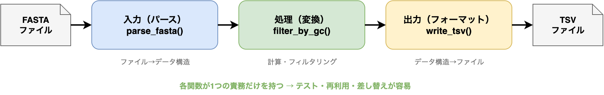

# §1 設計原則 — 良いコードとは何か

[§0 AIエージェントにコードを書かせる](./00_ai_agent.md)では、エージェントとの対話の作法を学んだ。しかし、どれほど優れた道具を手にしても、「何を」「どう」作るかの判断基準がなければ、道具は力を発揮しない。本章では、コードを書く前に知っておくべき設計の原則を学ぶ。

これらの原則は、数十年にわたるソフトウェア開発の経験から蒸留されたものである。バイオインフォマティクスのスクリプトであっても、数ヶ月後の自分が読み返せるか、共同研究者が再利用できるかは、こうした原則に従っているかどうかで大きく変わる。

AIコーディングエージェントに「KISS原則に従って書いて」「この関数はSRPに違反しているからリファクタリングして」と指示するためにも、原則の名前と意味を知っておくことは実用的に重要である。

---

## 1-1. コードの設計原則

ソフトウェア設計には多くの原則があるが、本書では特にバイオインフォマティクスの日常で役立つものに絞って紹介する。いずれも「当たり前のこと」に聞こえるかもしれないが、当たり前のことを一貫して実行するのが良いコードへの最短路である。

### KISS原則（Keep It Simple, Stupid）

> 不必要な複雑さを避けよ。

プログラムは可能な限り単純に書くべきである。ここでいう「単純」とは、機能が少ないという意味ではなく、**目的を達成するために必要最小限の構造しか持たない**という意味である。

バイオインフォマティクスでは、「まず動くスクリプト」が出発点になることが多い。そのスクリプトを「将来のため」に過度に抽象化したり、使う予定のない設定オプションを追加したりするのは、KISS原則に反する。

**良い例** — GC含量を計算する関数:

```python
def gc_content(seq: str) -> float:
    """DNA配列のGC含量を計算する."""
    if not seq:
        return 0.0
    seq_upper = seq.upper()
    gc_count = seq_upper.count("G") + seq_upper.count("C")
    return gc_count / len(seq_upper)
```

この関数は1つのことだけを行い、入力と出力が明確で、特別な知識がなくても読める。

**悪い例** — 同じ目的なのに過剰に設計された関数:

```python
def gc_content(
    seq: str,
    ambiguous: bool = False,
    window_size: int | None = None,
    step: int = 1,
    alphabet: str = "DNA",
    normalize: bool = True,
) -> float | list[float]:
    """GC含量を計算する。多数のオプション付き。"""
    # ... 100行以上の実装 ...
```

まだ必要ない機能（窓関数、RNA対応、あいまい塩基対応）をすべて盛り込んだ結果、関数のシグネチャだけで理解が困難になっている。こうした関数は、引数の組み合わせのテストだけでも膨大になり、バグの温床となる。

### DRY原則（Don't Repeat Yourself）

> Hunt と Thomas は、すべての知識はシステム内で一意かつ明確な表現を持つべきだと述べている [2]。

同じロジックがコードの複数箇所にコピーされていると、修正時にすべてのコピーを漏れなく更新しなければならない。1箇所でも漏れれば、それがバグになる。DRY原則は「同じことを二度書くな」という教えである[3](https://doi.org/10.1371/journal.pbio.1001745)。

バイオインフォマティクスでは、GC含量の計算、配列のフィルタリング、ファイルの読み込みなど、似た処理が複数のスクリプトに散在しがちである。こうした共通処理を関数として切り出すのがDRYの基本的な実践である。

```python
# DRY: gc_content() を再利用してフィルタリング
def filter_sequences_by_gc(
    sequences: dict[str, str],
    min_gc: float = 0.0,
    max_gc: float = 1.0,
) -> dict[str, str]:
    """GC含量の範囲で配列をフィルタリングする."""
    return {
        seq_id: seq
        for seq_id, seq in sequences.items()
        if min_gc <= gc_content(seq) <= max_gc  # gc_content()を再利用
    }
```

`gc_content()` のロジックを `filter_sequences_by_gc()` の中にコピーするのではなく、関数呼び出しで再利用している。GC含量の計算方法を変更する必要が生じても、修正箇所は `gc_content()` の1箇所だけで済む。

> **DRYの過剰適用に注意:** たまたまコードが似ているだけで本質的に異なる処理を無理に共通化すると、かえって複雑さが増す。「同じ知識が重複しているか」を基準に判断すること。

### YAGNI原則（You Aren't Gonna Need It）

> Beck は、「実際に必要になるまで作るな」というXPの実践原則を強調している [4]。

YAGNI原則は、KISSと密接に関連する。「将来必要になるかもしれない」という理由で機能を追加すると、その多くは実際には使われず、コードの複雑さだけが残る。

AIコーディングエージェントは、時として「拡張性のため」と称して過剰な抽象化を提案することがある。たとえば、FASTQファイルを読むだけの処理に対して汎用的なプラグインアーキテクチャを提案してくるかもしれない。そのような提案に対しては「YAGNIで。今必要な最小限の実装にして」と指示するのが適切である。

**判断基準:** 「今この機能がないと、今日のタスクが完了しないか？」——答えがNoなら、作らない。

### 関心の分離（Separation of Concerns）

> 複数の観点を一度に抱え込まず、関心ごとに切り分けて考える[5](https://www.cs.utexas.edu/~EWD/transcriptions/EWD04xx/EWD447.html)。

「関心の分離」とは、入力の処理、データの変換、結果の出力といった異なる責務を、別々のモジュールや関数に分けるという考え方である。

バイオインフォマティクスの典型的なパイプラインは、次の3つの関心に分けられる:

1. **入力**（パース） — ファイルを読み込み、データ構造に変換する
2. **処理**（変換） — データに対して計算やフィルタリングを行う
3. **出力**（フォーマット） — 結果を指定の形式で書き出す

```python
from dataclasses import dataclass


@dataclass(frozen=True)
class SequenceRecord:
    """配列レコード."""
    id: str
    sequence: str

    @property
    def length(self) -> int:
        return len(self.sequence)


# 1. パース（入力の関心）
def parse_fasta_string(fasta_text: str) -> list[SequenceRecord]:
    """FASTA形式のテキストをパースする."""
    ...

# 2. フィルタリング（処理の関心）
def filter_by_length(
    records: list[SequenceRecord],
    min_length: int = 0,
    max_length: int | None = None,
) -> list[SequenceRecord]:
    """配列長でフィルタリングする."""
    ...

# 3. フォーマット（出力の関心）
def format_as_tsv(records: list[SequenceRecord]) -> str:
    """配列レコードをTSV形式の文字列にフォーマットする."""
    ...
```

各関数は独立してテストでき、組み合わせを変えることもできる。たとえば `filter_by_length()` を `filter_by_gc()` に差し替えても、パースと出力のコードには一切影響がない。これが関心の分離の力である。



> 完全な実装は `scripts/ch01/seq_filter.py` にあり、テストは `tests/ch01/test_seq_filter.py` で確認できる。

関心の分離の度合いを測る指標として、**凝集度**（cohesion）と**結合度**（coupling）がある。凝集度は「1つのモジュール内の要素がどれだけ関連しているか」を表し、高いほど良い。結合度は「異なるモジュール間がどれだけ依存し合っているか」を表し、低いほど良い。上記の例では、パース・フィルタリング・フォーマットの各関数は凝集度が高く（それぞれが1つの責務に集中）、結合度が低い（関数間の依存は `SequenceRecord` という共通のデータ構造だけ）。

関心の分離を実践するとき、「この分割で凝集度は高いか？ 結合度は低いか？」と自問すると、適切な分割かどうかの判断材料になる。

### 単一責任原則（Single Responsibility Principle; SRP）

> 関数やクラスは、変更する理由が1つだけであるべきである[6](https://en.wikipedia.org/wiki/Single-responsibility_principle)。

関心の分離をさらに厳密にしたのがSRPである。「この関数を変更する理由は何か？」と問いかけ、答えが複数あるなら分割を検討する。

上記の `parse_fasta_string()` は「FASTA形式のパース方法が変わったとき」だけに変更される。`filter_by_length()` は「フィルタリングの条件が変わったとき」だけに変更される。それぞれの変更理由が1つに絞られているので、SRPを満たしている。

SRPはオブジェクト指向設計の5原則**SOLID**の最初の文字（S）にあたる。残りの4原則（Open/Closed、Liskov Substitution、Interface Segregation、Dependency Inversion）は、よいAPIやインターフェースを設計するための指針であり、[§5 ソフトウェアの構成要素 — importからpipまで](./05_software_components.md#5-4-apiとインターフェース)で概要を学ぶ。初心者はまずSRPと関心の分離を確実に身につけることを優先してほしい。

### 最小驚き原則（Principle of Least Astonishment; POLA）

> ソフトウェアの振る舞いは、ユーザーや開発者が予測できるものであるべきである。

関数名が `gc_content` なら、GC含量を返すべきである。副作用としてファイルに書き込んだり、入力配列を破壊的に変更したりしてはならない。引数の型が `str` なら文字列を受け取るべきであって、内部でファイルパスとして解釈して読み込みを行うのは驚きの元である。

**具体的な実践:**
- 関数名は動詞+名詞で、何をするか明確に示す（`calculate_gc`, `filter_by_length`）
- 破壊的操作（入力を変更する）がある場合は名前で明示する（`sort_inplace`）
- 戻り値の型を型ヒントで明記する
- 副作用がない純粋関数を優先する

#### エージェントへの指示例

設計原則の名前をそのまま指示に使うと、エージェントは意図を正確に理解して的確なコードを生成する。曖昧な指示（「もっとシンプルにして」）よりも、原則名を使った指示のほうが一発で通りやすい:

> 「この関数はSRPに違反している。FASTAのパースとGC含量の計算を別々の関数に分けてリファクタリングしてください」

> 「YAGNIで。RNA対応やあいまい塩基対応は今は不要です。DNA配列のGC含量を計算する最小限の実装にしてください」

既存コードのレビューを依頼する場合は、チェックすべき原則を明示する:

> 「`scripts/ch01/seq_filter.py` をレビューしてください。KISS、DRY、SRP、関心の分離の観点で問題があれば指摘してください」

---

## 1-2. UNIX哲学

UNIX哲学は1978年のBell Labsに遡る設計思想であり[1](https://doi.org/10.1002/j.1538-7305.1978.tb02135.x)、その核心は驚くほどシンプルである:

> 一つのことをうまくやるプログラムを書け。協調して動くプログラムを書け。テキストストリームを扱うプログラムを書け。[7](http://www.catb.org/esr/writings/taoup/html/)

この思想は、バイオインフォマティクスのツール群（SAMtools[8](https://doi.org/10.1093/bioinformatics/btp352)、BEDTools[9](https://doi.org/10.1093/bioinformatics/btq033) 等）の設計に色濃く反映されている。

### テキストストリームとパイプ

UNIXでは、プログラム間のデータのやり取りにテキストストリームを使う。すべてのプログラムは3つのストリームを持つ:

| ストリーム | ファイル記述子 | 用途 |
|-----------|-------------|------|
| 標準入力（stdin） | 0 | データの入力 |
| 標準出力（stdout） | 1 | 処理結果の出力 |
| 標準エラー出力（stderr） | 2 | ログ・エラーメッセージ |

パイプ（`|`）は、あるプログラムの標準出力を次のプログラムの標準入力に接続する仕組みである:

```bash
# BAMファイルからマップされたリードを抽出し、TLENの絶対値が150以上のものを表示
samtools view -F 4 sample.bam | awk '($9 >= 150 || $9 <= -150)' | head -n 10
```

SAM形式の第9列 `$9` はテンプレート長（TLEN）であり、リードの向きによって負値になることがある。そのため、長さで絞り込むときは符号付きの値であることを意識する必要がある。

各コマンドが「一つのことをうまくやる」小さなツールであり、パイプで組み合わせることで複雑な処理を実現している。これがUNIX哲学の真髄である。

### リダイレクション

パイプがプログラム間の接続なら、リダイレクションはプログラムとファイルの接続である:

| 記法 | 意味 |
|------|-----|
| `>` | 標準出力をファイルに書き込む（上書き） |
| `>>` | 標準出力をファイルに追記する |
| `<` | ファイルの内容を標準入力に渡す |
| `2>` | 標準エラー出力をファイルに書き込む |
| `2>&1` | 標準エラー出力を標準出力に合流させる |

```bash
# 結果をファイルに保存し、エラーは別ファイルに記録
samtools view -F 4 sample.bam > mapped_reads.sam 2> errors.log
```

### 終了ステータス（Exit Code）

UNIXのすべてのプログラムは、終了時に整数値を返す。**0が成功、非0が失敗**という規約は、シェルスクリプトやパイプラインの制御の基盤となっている。

```bash
# 前のコマンドが成功したときだけ次を実行する（&&）
samtools sort input.bam -o sorted.bam && samtools index sorted.bam

# 失敗したら代替処理を実行する（||）
samtools view input.bam > /dev/null || echo "BAMファイルが読めません"
```

自分でPythonスクリプトを書く際も、エラー時には `sys.exit(1)` で非0の終了ステータスを返す習慣をつけると、他のツールとの連携がスムーズになる。

### 🧬 バイオインフォマティクスとUNIX哲学

バイオインフォマティクスの代表的なコマンドラインツールは、UNIX哲学に忠実に設計されている:

| ツール | 「一つのこと」 | stdin/stdout対応 |
|--------|-------------|-----------------|
| SAMtools | SAM/BAM操作 | ✓ |
| BEDTools | ゲノム区間操作 | ✓ |
| bedGraphToBigWig | フォーマット変換 | — |
| seqkit | FASTA/FASTQ操作 | ✓ |

これらのツールをパイプで繋ぐことで、複雑な解析パイプラインを構築できる。自分でツールを作る際も、stdin/stdoutに対応させておくと、既存のエコシステムと自然に統合できる。

#### エージェントへの指示例

UNIX哲学に沿ったツール設計をエージェントに依頼する場合:

> 「stdin/stdout対応のフィルタプログラムとして実装してください。パイプで他のコマンドと組み合わせて使えるようにしてください。ログやエラーメッセージはstderrに出力してください」

> 「このスクリプトは1つの関数で入力の読み込み・処理・出力を全部やっている。UNIX哲学に従って、パース・変換・出力を分離してリファクタリングしてください」

---

## 1-3. ソフトウェア開発手法の用語 — AIエージェントと会話するための語彙

AIコーディングエージェントに [§0-2 Plan → Execute → Review ワークフロー](./00_ai_agent.md#0-2-plan--execute--review-ワークフロー)で計画を立てさせると、「スプリントで分割しましょう」「まずMVPを作りましょう」「リファクタリングのイテレーションを回しましょう」といった用語が当然のように出てくる。これらはソフトウェア業界で広く使われている開発手法の用語であり、意味を知らないとAIの提案を正しく評価できない。

本節ではプログラミング初心者が押さえておくべき用語を、バイオインフォマティクスの文脈とAIエージェントとの関連を交えて紹介する。

### 開発プロセスモデル

**ウォーターフォール** — 要件定義→設計→実装→テスト→リリースを順番に進める古典的モデル。前のフェーズに戻りにくいのが特徴で、大規模な受託開発で使われてきた。研究開発のように要件が進行中に変わるプロジェクトには不向きである。

**アジャイル開発**（Agile） — 小さな単位で「動くもの」を繰り返し作りながら改善する考え方[10](https://agilemanifesto.org/)。ウォーターフォールの対極に位置する。研究のプログラミングは本質的にアジャイル的である——実験結果によって解析手法を変えることは日常茶飯事だからだ。

**スクラム**（Scrum） — アジャイルの代表的なフレームワーク[11](https://scrumguides.org/scrum-guide.html)。以下の用語が頻出する:
- **スプリント** — 1〜2週間の固定期間の開発サイクル
- **バックログ** — やるべきタスクの優先順位つきリスト。GitHub Issuesで管理できる
- **レトロスペクティブ** — スプリント終了後の振り返り。何がうまくいき、何を改善すべきか

**カンバン**（Kanban） — タスクを「To Do → In Progress → Done」のボード上で視覚管理する手法。GitHub ProjectsやNotionのボードビューがこれにあたる。

### よく出てくる開発プラクティスの用語

| 用語 | 意味 | AIエージェントとの関連 |
|-----|------|-------------------|
| **MVP**（Minimum Viable Product） | 最小限の動くプロダクト。核心機能だけ先に作り、後から拡張する | エージェントが「まずMVPを」と提案したら、全機能の一度の実装を避ける戦略 |
| **イテレーション** | 「計画→実装→評価」を繰り返すサイクル | [§0-2](./00_ai_agent.md#0-2-plan--execute--review-ワークフロー)のPlan→Execute→Reviewそのもの |
| **リファクタリング** | 動作を変えずにコードの内部構造を改善する | 「テストを通してからリファクタリング」が鉄則[12](https://www.refactoring.com/) |
| **技術的負債**（テクニカルデット） | 急いで書いたコードが将来の開発を遅くする「借金」 | エージェントが「技術的負債になる」と警告したら、設計を見直すサイン |
| **スコープクリープ** | 開発中に要件がどんどん膨らむこと | エージェントに「あれもこれも」と追加依頼し続けると発生する |
| **ブロッカー** | 他の作業を止めてしまう障害 | 依存ライブラリのインストール失敗など |
| **デプロイ** | ソフトウェアを実際に使える環境に配置すること | HPCにツールを入れて使えるようにする＝デプロイ |
| **CI/CD** | 継続的インテグレーション/デリバリー | コミットするたびにテストが自動実行される仕組み（[§8 コードの正しさを守るテスト技法](./08_testing.md)で詳述） |
| **コードレビュー** | 他の人（やAI）にコードを読んでもらい問題を見つける | [§0-4 レビュー](./00_ai_agent.md#0-4-エージェントにレビューさせる)のワークフロー |
| **ペアプログラミング** | 2人で1つのコードを書く手法 | AIエージェントとの対話は一種のペアプログラミング |
| **プルリクエスト**（PR） | 変更を本体に統合する前のレビュー依頼 | エージェントに `gh pr create` でPRを作らせる |
| **マイルストーン** | 大きな目標に向けた中間の達成地点 | 「Phase 1: FASTQの読み込みとQCが動く」 |

### 🤖 AIエージェントとの会話で使うと効果的なフレーズ集

これらの用語を知っていると、エージェントへの指示がより正確になる:

```
「YAGNIで。今必要な最小限にして」
「この関数はSRPに違反している。パースとフィルタリングを分けて」
「まずMVPを作ろう。入力はハードコードでいいからGC含量の計算を動かして」
「リファクタリングする前にテストを書いて」
「DRYに違反してる。この計算ロジックを共通関数に切り出して」
「関心の分離ができていない。入力・処理・出力を分けて」
```

このように設計原則の名前を正確に使うことで、エージェントは意図を一発で理解し、的確なコードを生成してくれる。原則を知らなければ「もっとシンプルにして」「なんか分かりにくい」と曖昧な指示になり、何度もやり取りする羽目になる。

---

## まとめ

本章で紹介した設計原則を一覧にまとめる:

| 原則 | 一言でいうと | 違反のサイン |
|------|-----------|-----------|
| KISS | 単純に保て | 関数のシグネチャが長い、分岐が深い |
| DRY | 繰り返すな | コピー&ペーストしたコードがある |
| YAGNI | 今不要なら作るな | 「将来のため」の未使用コード |
| 関心の分離 | 責務を分けよ | 1つのファイルにパース・処理・出力が混在 |
| SRP | 変更理由は1つだけ | 関数の変更理由が複数ある |
| POLA | 驚かせるな | 関数名から予測できない副作用がある |
| UNIX哲学 | 小さく作り組み合わせよ | 何でもやる巨大スクリプト |

これらの原則は、[§8 コードの正しさを守るテスト技法](./08_testing.md)で学ぶテストや、[§10 ソフトウェア成果物の設計 — スクリプトからパッケージまで](./10_deliverables.md)で学ぶプロジェクト構造と密接に関連する。本章の原則を意識しながら以降の章に進んでほしい。

---

## 演習問題

本章の内容を、エージェントとの協働を通じて実践する課題である。

### 演習 1-1: コードに潜む設計原則違反を見つけよ **[レビュー]**

エージェントが以下のFASTQ品質フィルタリングコードを生成した。少なくとも2つの設計原則違反を指摘し、それぞれどの原則に反しているか説明せよ。

```python
def process_fastq(file_path):
    # R1の処理
    good_r1 = []
    with open("/home/user/data/sample1_R1.fastq") as f:
        for line in f:
            header = line.strip()
            seq = next(f).strip()
            plus = next(f).strip()
            qual = next(f).strip()
            avg_qual = sum(ord(c) - 33 for c in qual) / len(qual)
            if avg_qual >= 20:
                good_r1.append((header, seq, plus, qual))

    # R2の処理
    good_r2 = []
    with open("/home/user/data/sample1_R2.fastq") as f:
        for line in f:
            header = line.strip()
            seq = next(f).strip()
            plus = next(f).strip()
            qual = next(f).strip()
            avg_qual = sum(ord(c) - 33 for c in qual) / len(qual)
            if avg_qual >= 20:
                good_r2.append((header, seq, plus, qual))

    print(f"R1: {len(good_r1)} reads passed")
    print(f"R2: {len(good_r2)} reads passed")
    return good_r1, good_r2
```

（ヒント）R1とR2の処理ブロックを見比べてみよ。また、ファイルパスや品質閾値の指定方法にも注目せよ。

### 演習 1-2: 設計原則の名前を使ってリファクタリングを指示せよ **[指示設計]**

あなたの解析スクリプトが500行の1ファイルに肥大化してしまった。本章で学んだ設計原則の名前を明示的に使って、エージェントにリファクタリングを指示する文章を3つ書け。指示文には「なぜその原則を適用すべきか」の理由も1文で添えよ。

（ヒント）「関心の分離に従って分割して」のように原則名を含めると、エージェントの理解が正確になる。「KISS」「DRY」「関心の分離」「SRP」など、本章で学んだ原則名を活用せよ。

### 演習 1-3: UNIX哲学に合致するのはどちらか **[概念]**

以下の2つのアプローチのうち、UNIX哲学により合致するのはどちらか。理由を述べよ。

- **アプローチA**: FASTQ品質フィルタ、アダプタ除去、リファレンスへのマッピングを1つのスクリプトで行う。引数でモードを切り替える。
- **アプローチB**: 各処理を独立したコマンドにして、パイプラインで連結する（`filter_qual | trim_adapter | map_ref`）。

（ヒント）「一つのことをうまくやる」「テキストストリームを共通インターフェースとする」の2原則を適用せよ。

### 演習 1-4: YAGNIの判断 **[設計判断]**

研究室でRNA-seq解析スクリプトを作っている。共同研究者から「将来ChIP-seqもやるかもしれないから、最初からChIP-seq対応の設計にしておこう」と提案された。この提案をYAGNI原則の観点からどう評価するか。賛成・反対の立場を明確にし、理由を述べよ。

（ヒント）現時点で確定しているユースケースと、将来の仮定を区別せよ。「将来の拡張に備える」ことと「将来の機能を今実装する」ことは異なる。

---

## さらに学びたい読者へ

本章で紹介した設計原則やソフトウェア開発手法の背景をさらに深く学びたい読者に向けて、古典的な教科書を紹介する。

### ソフトウェア設計・クリーンコード

- **Hunt, A., Thomas, D. *The Pragmatic Programmer* (20th Anniversary Edition). Addison-Wesley, 2019.** https://www.amazon.co.jp/dp/0135957052 — 本章の参考文献 [2] で引用した初版（1999）の改訂版。DRY原則に加え、ETC（Easier to Change）原則が大幅に加筆されている。「達人プログラマー」として広く知られる定番書。邦訳: 村上雅章訳『達人プログラマー 熟達に向けたあなたの旅（第2版）』オーム社, 2020.
- **Martin, R. C. *Clean Code: A Handbook of Agile Software Craftsmanship*. Prentice Hall, 2008.** https://www.amazon.co.jp/dp/0132350882 — 本章の参考文献 [6] で引用。KISS・命名規則・関数設計の実践を、豊富なJavaコード例で詳細に展開する。特に第1〜6章が初学者に適している。邦訳: 花井志生訳『Clean Code アジャイルソフトウェア達人の技』KADOKAWA, 2017.
- **McConnell, S. *Code Complete* (2nd ed.). Microsoft Press, 2004.** https://www.amazon.co.jp/dp/0735619670 — ソフトウェアコンストラクション（構築）の百科事典。変数の命名、関数の分割、防御的プログラミングなど、本章で概要を扱ったトピックを網羅的に深掘りする。邦訳: クイープ訳『CODE COMPLETE 第2版（上・下）』日経BP, 2005.

### リファクタリング

- **Fowler, M. *Refactoring: Improving the Design of Existing Code* (2nd ed.). Addison-Wesley, 2018.** https://www.amazon.co.jp/dp/0134757599 — コードの「臭い」（bad smells）を体系化し、改善パターンをカタログ化した名著。AI生成コードをレビューする際に「何を、なぜ改善すべきか」の語彙が身につく。第2版はJavaScript例で書かれている。邦訳: 児玉公信ほか訳『リファクタリング 既存のコードを安全に改善する（第2版）』オーム社, 2019.

### UNIX哲学

- **Raymond, E. S. *The Art of UNIX Programming*. Addison-Wesley, 2003.** — 本章の参考文献 [7] で引用したUNIX哲学の原典。全文がオンラインで公開されている: http://www.catb.org/esr/writings/taoup/html/ 。特に Rule of Modularity、Rule of Composition の章が本章の内容と直結する。

---

## 参考文献

[1] McIlroy, M. D., Pinson, E. N., Tague, B. A. "UNIX Time-Sharing System: Foreword". *The Bell System Technical Journal*, 57(6), 1899–1904, 1978. [https://doi.org/10.1002/j.1538-7305.1978.tb02135.x](https://doi.org/10.1002/j.1538-7305.1978.tb02135.x)

[2] Hunt, A., Thomas, D. *The Pragmatic Programmer: From Journeyman to Master*. Addison-Wesley, 1999. ISBN 978-0201616224

[3] Wilson, G. et al. "Best Practices for Scientific Computing". *PLOS Biology*, 12(1), e1001745, 2014. [https://doi.org/10.1371/journal.pbio.1001745](https://doi.org/10.1371/journal.pbio.1001745)

[4] Beck, K. *Extreme Programming Explained: Embrace Change*. Addison-Wesley, 1999. ISBN 978-0201616415

[5] Dijkstra, E. W. "On the role of scientific thought". EWD447, 1974. [https://www.cs.utexas.edu/~EWD/transcriptions/EWD04xx/EWD447.html](https://www.cs.utexas.edu/~EWD/transcriptions/EWD04xx/EWD447.html)

[6] Martin, R. C. *Clean Code: A Handbook of Agile Software Craftsmanship*. Prentice Hall, 2008. ISBN 978-0132350884

[7] Raymond, E. S. *The Art of UNIX Programming*. Addison-Wesley, 2003. [http://www.catb.org/esr/writings/taoup/html/](http://www.catb.org/esr/writings/taoup/html/)

[8] Li, H. et al. "The Sequence Alignment/Map format and SAMtools". *Bioinformatics*, 25(16), 2078–2079, 2009. [https://doi.org/10.1093/bioinformatics/btp352](https://doi.org/10.1093/bioinformatics/btp352)

[9] Quinlan, A. R., Hall, I. M. "BEDTools: a flexible suite of utilities for comparing genomic datasets". *Bioinformatics*, 26(6), 841–842, 2010. [https://doi.org/10.1093/bioinformatics/btq033](https://doi.org/10.1093/bioinformatics/btq033)

[10] Beck, K. et al. "Manifesto for Agile Software Development". 2001. [https://agilemanifesto.org/](https://agilemanifesto.org/) (参照日: 2026-03-25)

[11] Schwaber, K., Sutherland, J. "The Scrum Guide". 2020. [https://scrumguides.org/scrum-guide.html](https://scrumguides.org/scrum-guide.html) (参照日: 2026-03-17)

[12] Fowler, M. "Refactoring". [https://www.refactoring.com/](https://www.refactoring.com/) (参照日: 2026-03-25)
