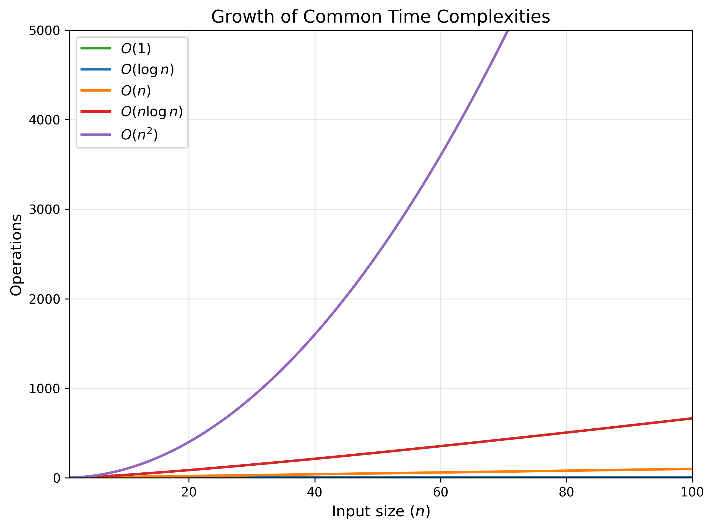
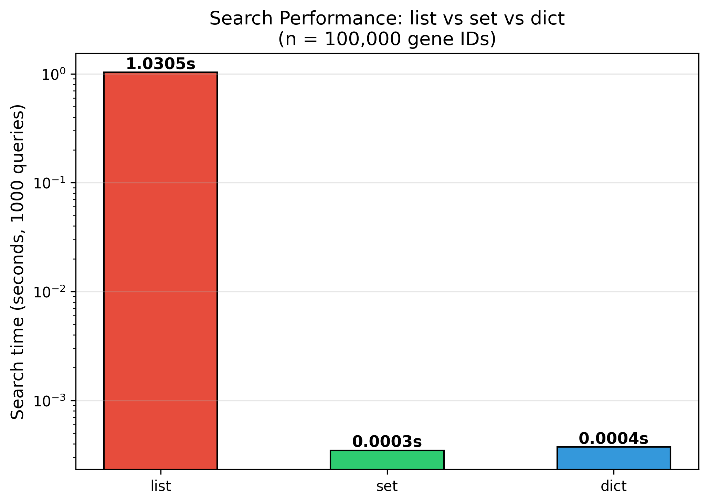

# §3 コーディングに必要な計算機科学

[§2 ターミナルとシェルの基本操作](./02_terminal.md)では、エージェントの動作を理解するためのシェル知識を学んだ。しかし、シェルコマンドを理解できても、その下で動く計算機の仕組みを知らなければ、思わぬ落とし穴にはまる。10万件の遺伝子IDを検索するのに何分もかかる、発現量の比較が一致しない、解析結果が毎回変わる——これらはすべて、計算機科学の基礎知識があれば避けられる問題である。

エージェントが生成したコードに `list` の線形探索が含まれていたとき、「`set` を使うべき」と指示できるか。浮動小数点の `==` 比較を見抜けるか。これらの判断力が、AIが生成するコードの品質を左右する。

本章では、バイオインフォマティクスのプログラミングで特に重要な計算機科学の概念を取り上げる。大学のCS学科で1学期かけて学ぶような内容を、実験系研究者が「踏みがちな罠」に焦点を当てて凝縮した。理論の完全な理解は求めない。「なぜこのデータ構造を選ぶのか」「なぜ浮動小数点の比較に `==` を使ってはいけないのか」——こうした判断ができるようになることがゴールである。

---

## 3-1. データ構造と計算量

### データ構造の選択が性能を決める

プログラムの性能は、アルゴリズムだけでなく**データ構造の選択**によって劇的に変わる。Pythonには複数の組み込みデータ構造があり、それぞれ得意な操作が異なる。

| データ構造 | 特徴 | 検索 | 追加 | 順序 |
|-----------|------|------|------|------|
| `list` | 順序付き配列 | $O(n)$ | $O(1)$（末尾） | あり |
| `tuple` | イミュータブルなlist | $O(n)$ | — | あり |
| `set` | 重複なし集合 | $O(1)$ | $O(1)$ | なし |
| `dict` | キーと値のマッピング | $O(1)$ | $O(1)$ | 挿入順（Python 3.7以降の言語仕様）[1](https://docs.python.org/3/tutorial/datastructures.html) |
| `deque` | 両端キュー | $O(n)$ | $O(1)$（両端） | あり |

ここで登場する $O$ 記法（ビッグオー記法）は、入力サイズnに対して処理時間がどう増えるかを表す[2](https://mitpress.mit.edu/9780262046305/introduction-to-algorithms/)。$O$ は "order of" の頭文字で、「オー」と読む。$O(n)$ なら「オーエヌ」、$O(n^2)$ なら「オーエヌの二乗」と発音する。論文やミーティングで口頭で議論する場面も多いため、覚えておくとよい。

- $O(1)$（定数時間、「オーいち」）: データが何件あっても一瞬で終わる
- $O(\log n)$（対数時間、「オーログエヌ」）: データが倍になっても処理は1ステップ増えるだけ。二分探索が代表例
- $O(n)$（線形時間、「オーエヌ」）: データ件数に比例して遅くなる
- $O(n \log n)$（「オーエヌログエヌ」）: ソートの典型的な計算量
- $O(n^2)$（二次時間、「オーエヌの二乗」）: 二重ループ。1万件で重く、10万件で実用不可能

速い順に並べると $O(1) < O(\log n) < O(n) < O(n \log n) < O(n^2)$ である。次の表は、$n$ = 100,000（10万件、遺伝子数のオーダー）のときの処理回数の違いを示す:

| 計算量 | $n$ = 100,000 での処理回数 | 感覚的な目安 |
|--------|------------------------------|-------------|
| $O(1)$ | $1$ | 一瞬 |
| $O(\log n)$ | $\approx 17$ | 一瞬 |
| $O(n)$ | $10^5$ | 一瞬〜数秒 |
| $O(n \log n)$ | $\approx 1.7 \times 10^6$ | 数秒 |
| $O(n^2)$ | $10^{10}$ | 数時間〜実用不可 |



nが10万件のとき、$O(\log n)$ と $O(n^2)$ では処理回数が約6億倍異なる。バイオインフォマティクスで扱うデータは容易にこの規模に達するため、計算量の違いがスクリプトの実用性を左右する。

### 遺伝子ID検索: list vs set の決定的な違い

バイオインフォマティクスでは、数万〜数十万の遺伝子IDから特定のIDを検索する場面が頻繁にある。このとき、データ構造の選択が処理速度を桁違いに変える。

```python
# 悪い例: listの in 演算子 → O(n)
gene_list = ["GENE_000000", "GENE_000001", ..., "GENE_099999"]
"GENE_099999" in gene_list  # 最悪10万回の比較が必要

# 良い例: setの in 演算子 → O(1)
gene_set = set(gene_list)
"GENE_099999" in gene_set   # ハッシュテーブルで一発
```

listの `in` はリストの先頭から順に要素を比較するため、要素数nに比例して $O(n)$ かかる。一方、setとdictはハッシュテーブルを内部で使っており、要素数に関係なく $O(1)$ で検索できる。

以下のベンチマークで、この差を実感してみよう:

```python
from scripts.ch03.data_structure_bench import benchmark_search

results = benchmark_search(n=100_000, n_queries=1000)
for name, elapsed in results.items():
    print(f"{name:>5}: {elapsed:.4f} 秒")
```

典型的な結果:

```
 list: 1.2345 秒
  set: 0.0001 秒
 dict: 0.0001 秒
```



listが1秒以上かかるのに対し、setとdictは0.1ミリ秒未満で完了する。10万件程度でこの差なので、ヒトゲノムの数万遺伝子、メタゲノムの数百万配列といった規模では、データ構造の選択がスクリプトの実用性そのものを左右する。

### 使い分けの指針

- 「この要素が含まれるか？」の判定 → `set`
- 「IDから情報を引きたい」 → `dict`
- 「順番が重要」 → `list`
- 「変更されたくない」 → `tuple`
- 「先頭と末尾の両方から出し入れしたい」 → `deque`

#### エージェントへの指示例

データ構造の選択はパフォーマンスに直結するため、エージェントにコードの最適化を依頼する際は計算量を明示すると精度が上がる:

> 「この遺伝子IDリストの検索が遅い。listの `in` を使っている箇所をsetに変換して $O(1)$ で検索できるようにリファクタリングしてください」

> 「このスクリプトのボトルネックを分析してください。$O(n^2)$ になっている箇所を特定し、データ構造の変更で計算量を改善してください」

既存コードのレビューを依頼する場合:

> 「`scripts/ch03/` のコードをレビューして、listを使っているが本来set/dictを使うべき箇所を指摘してください」

### collectionsの便利なデータ構造

Pythonの標準ライブラリ `collections` には、list・dict・setをさらに特化させた便利なデータ構造が用意されている。バイオインフォマティクスのコードで頻繁に使う2つを紹介する。

#### Counter — 出現回数を数える

`Counter` は、要素の出現回数を自動的にカウントする辞書のサブクラスである。通常のdictで `if key in d: d[key] += 1` と書くパターンを1行で置き換えられる。

```python
from collections import Counter

# DNA配列のトリヌクレオチド頻度を計算する
def trinucleotide_freq(seq: str) -> Counter:
    """配列中の3塩基の出現頻度を計算する."""
    return Counter(seq[i:i+3] for i in range(len(seq) - 2))

freq = trinucleotide_freq("ATGCGATCGATCG")
# Counter({'ATC': 2, 'GAT': 2, 'TCG': 2, 'ATG': 1, 'TGC': 1, ...})

# 最も頻度の高い上位5トリヌクレオチド
freq.most_common(5)
```

`Counter` は加算・減算もサポートしており、複数サンプルの頻度を合算する場合に `counter1 + counter2` と書ける。k-mer頻度の計算、アミノ酸組成の集計、リードカウントの集約など、「何かを数える」処理では真っ先に検討すべきデータ構造である。

#### defaultdict — グループ化を簡潔に

`defaultdict` は、存在しないキーにアクセスしたときにデフォルト値を自動生成する辞書である。通常のdictでは `if key not in d: d[key] = []` というボイラープレートが必要だが、`defaultdict(list)` で不要になる。

```python
from collections import defaultdict

# GFFファイルの遺伝子を染色体ごとにグループ化する
genes_by_chr: dict[str, list[str]] = defaultdict(list)

for gene_id, chrom in gene_annotations:
    genes_by_chr[chrom].append(gene_id)
    # 通常のdictなら if chrom not in genes_by_chr: ... が必要

# genes_by_chr["chr1"] → ["BRCA1", "TP53", ...]
# genes_by_chr["chrX"] → ["DMD", "F8", ...]
```

`defaultdict(int)` はカウンター（`Counter` と似た用途）、`defaultdict(set)` は重複排除付きグループ化に使える。染色体ごとのバリアント集約、サンプルごとのリード分類など、「カテゴリ別にまとめる」処理で活躍する。

### ソートと二分探索

#### sorted() と heapq — 効率的なソートと上位k件の抽出

Pythonの `sorted()` 関数と `list.sort()` メソッドは、TimSortアルゴリズムにより $O(n \log n)$ でソートを行う。`key` 引数を使えば、任意の基準でソートできる。

```python
# p値でソートし、有意な遺伝子を上位から取得
sorted_genes = sorted(deg_results, key=lambda g: g["pvalue"])
top_10 = sorted_genes[:10]
```

全体をソートせず**上位k件だけ**が必要な場合は、`heapq.nsmallest()` / `heapq.nlargest()` が効率的である。計算量は $O(n \log k)$ であり、$k \ll n$ のとき全体ソートの $O(n \log n)$ より高速になる。

```python
import heapq

# 数万件のDEG結果からp値の小さいトップ100を効率的に取得
top_100 = heapq.nsmallest(100, deg_results, key=lambda g: g["pvalue"])
```

#### bisect — ソート済みデータへの高速アクセス

`bisect` モジュールは、**ソート済みリスト**に対する二分探索を提供する。検索は $O(\log n)$ で行える。`insort()` による挿入は、挿入位置の探索自体は $O(\log n)$ だが、要素のシフトが必要なため全体では $O(n)$ である。

ゲノム解析では、座標がソートされたデータ（BEDファイル、VCFファイル等）を扱うことが多い。ある座標がどの領域に含まれるかを調べる場合、線形探索 ($O(n)$) では遅すぎるが、`bisect` を使えば高速に検索できる。

```python
import bisect

# ソート済みのエクソン開始位置リスト
exon_starts = [100, 500, 1200, 3000, 5000, 8000, 12000]

# あるバリアントの位置がどのエクソンの近くにあるか
variant_pos = 2800
idx = bisect.bisect_right(exon_starts, variant_pos)
# idx = 3 → exon_starts[2] (1200) と exon_starts[3] (3000) の間

# ソート済みリストに新しい座標を挿入（ソート順を維持）
bisect.insort(exon_starts, 2500)
# [100, 500, 1200, 2500, 3000, 5000, 8000, 12000]
```

`bisect` は「ソート済みデータに対する高速な検索や、挿入位置の特定」が必要な場面で使う。ゲノム座標の区間検索、ソート済みスコアリストへの挿入位置の決定、閾値に基づくフィルタリングなどが典型的な用途である。

#### エージェントへの指示例

これらのデータ構造は、エージェントに「適切なデータ構造を選ばせる」指示で活用できる:

> 「このk-mer頻度計算コードでは手動でdictをインクリメントしている。`collections.Counter` を使ってリファクタリングしてください」

> 「DEG解析の結果から上位100件をp値順で取得したい。全体をソートせず `heapq.nsmallest` で効率的に取得するように書き換えてください」

> 「VCFのバリアント位置がソート済みのエクソン座標リストのどの区間に属するかを判定したい。`bisect` を使った $O(\log n)$ の実装にしてください」

> 🧬 **コラム: バイオインフォマティクスで出会うデータ構造の使いどころ**
>
> §3-1で紹介したデータ構造が、バイオインフォマティクスのどのような場面で活躍するかを一覧にまとめる。エージェントが生成したコードのデータ構造選択が適切かどうかを判断する際の参考にしてほしい。
>
> | データ構造 | 典型的な用途 | バイオインフォの具体例 |
> |-----------|-------------|---------------------|
> | `list` | 順序付きデータの保持 | FASTA配列のリスト、ソートされたBEDレコード |
> | `set` | メンバーシップ判定、重複排除 | フィルタリング済み遺伝子IDセット、ユニークなk-merの収集 |
> | `dict` | キーから値への高速参照 | 遺伝子ID→アノテーション、リファレンス配列の辞書 |
> | `deque` | スライディングウィンドウ | GC含量のウィンドウ計算、品質スコアの移動平均 |
> | `Counter` | 出現回数の集計 | k-mer頻度、コドン使用頻度、アミノ酸組成 |
> | `defaultdict` | カテゴリ別のグループ化 | 染色体ごとの遺伝子リスト、サンプルごとのリード分類 |
> | `heapq` | 上位/下位k件の抽出 | p値トップ100遺伝子、発現量上位のトランスクリプト |
> | `bisect` | ソート済みデータの検索・挿入位置の特定 | ゲノム座標の区間検索、ソート済みスコアへの挿入 |
>
> 「何を数えるか」→ `Counter`、「何でグループ化するか」→ `defaultdict`、「上位k件だけ欲しいか」→ `heapq`、「ソート済みデータを検索するか」→ `bisect`——この判断ができれば、エージェントが生成したコードの効率性を評価できる。

> **🧬 コラム: バイオインフォマティクスで出会うアルゴリズムの計算量**
>
> 計算量の知識があると、ツールの実行時間が妥当かどうかを判断できる。「10万リードのマッピングに何時間もかかる」のは正常か、それともどこかがおかしいのか——以下の表を目安にしてほしい。
>
> | カテゴリ | アルゴリズム・操作 | 計算量 | 備考 |
> |---------|------------------|--------|------|
> | 配列検索 | BLAST | ヒューリスティック | 全探索を避けて高速化[14](https://doi.org/10.1016/S0022-2836%2805%2980360-2) |
> | ペアワイズアラインメント | Smith-Waterman / Needleman-Wunsch | $O(mn)$ | m, nは配列長。局所アラインメントと大域アラインメントの動的計画法[15](https://doi.org/10.1016/0022-2836%2870%2990057-4)[16](https://doi.org/10.1016/0022-2836%2881%2990087-5) |
> | リードマッピング | BWA / Bowtie2 | $O(m)$（クエリあたり） | FM-indexで参照ゲノムを事前索引化[17](https://pubmed.ncbi.nlm.nih.gov/19451168/) |
> | 多重配列アライメント | 厳密解（動的計画法） | $O(L^k)$ | Lは配列長、kは配列数。3本以上は近似手法を使う |
> | インデックス検索 | BAM (.bai) / tabix (.tbi) | $O(\log n)$ | 二分探索ベース |
> | インデックス検索 | FASTA faidx (.fai) | $O(1)$ | ファイルオフセットで直接アクセス |
> | ソート | `samtools sort` 等 | $O(n \log n)$ | 比較ソートの理論下限 |
> | 次元削減 | PCA（特異値分解） | $O(np^2)$ | nはサンプル数、pは特徴量数 |
> | 次元削減 | t-SNE | $O(n^2)$ | Barnes-Hut近似で $O(n \log n)$[11](https://jmlr.org/papers/v9/vandermaaten08a.html) |
> | 次元削減 | UMAP | $O(n^{1.14})$ 程度 | 近似最近傍探索で高速化[10](https://doi.org/10.48550/arXiv.1802.03426) |
> | クラスタリング | k-means | $O(nkdi)$ | k: クラスタ数、d: 次元、i: 反復回数 |
> | 系統樹 | Neighbor-Joining | $O(n^3)$ | nは系統数。大規模データでは律速になる[18](https://pubmed.ncbi.nlm.nih.gov/3447015/) |
>
> 表中の計算量は理論上の上界であり、実装の工夫やヒューリスティクスにより実際の速度は大きく異なる。たとえばBLASTはデータベース全体を総当たり比較するのではなく、短いワード一致から候補を絞り込むことで実用的な速度を実現している。ツールの実行時間が想定より極端に長い場合は、入力サイズと計算量の関係を見直す手がかりにしてほしい。

---

## 3-2. 数値表現と浮動小数点

### 整数型のビット幅

多くのプログラミング言語では、整数型にビット幅の制限がある。たとえばC言語やNumPyの `int32` は約±21億（2³¹ − 1）までしか扱えず、それを超えると**オーバーフロー**を起こして予期しない値になる。

```python
import numpy as np

# NumPyのint32はオーバーフローする
a = np.int32(2_147_483_647)  # int32の最大値
print(a + np.int32(1))       # → -2147483648（符号が反転！）

# Pythonの組み込みintは任意精度なのでオーバーフローしない
b = 2_147_483_647
print(b + 1)                 # → 2147483648（正しい）
```

Pythonの組み込み `int` は任意精度（メモリが許す限り大きな数を扱える）だが、NumPyやpandasの整数型にはビット幅の制限がある。大きなゲノム座標や配列カウントを扱うときは `int64` を明示的に指定するのが安全である。

### IEEE 754 浮動小数点 — `0.1 + 0.2 != 0.3` 問題

コンピュータは小数を**IEEE 754 浮動小数点数**として表現する[3](https://doi.org/10.1145/103162.103163)。これは2進数で小数を近似する方式であり、10進数で正確に表せる値でも、2進数では無限小数になることがある。

```python
>>> 0.1 + 0.2
0.30000000000000004

>>> 0.1 + 0.2 == 0.3
False
```

これはPythonのバグではなく、IEEE 754の仕様上避けられない挙動である。0.1は2進数では `0.0001100110011...` と無限に続くため、有限のビットで打ち切った時点で微小な誤差が生じる。

### 丸め誤差の蓄積

微小な誤差は、繰り返し計算や逐次加算では蓄積する。Python 3.12以降の `sum()` は精度が改善されたが、単純な逐次加算では依然として誤差が見える:

```python
import math

values = [0.1] * 10

# 単純な逐次加算: 丸め誤差が蓄積する
total = 0.0
for value in values:
    total += value
print(total)              # → 0.9999999999999999

# Python 3.12以降のsum(): 精度が改善されている
print(sum(values))        # → 1.0

# math.fsum(): 中間結果を高精度で保持する
print(math.fsum(values))  # → 1.0（正確）
```

発現量（TPM, FPKM）の正規化計算や、大量のスコアの合計など、精度が重要な集計では `math.fsum()` を使うとよい[4](https://docs.python.org/3/library/math.html#math.fsum)。古いPythonでは `sum()` でも同様の誤差が見えることがある。

### テキスト化と外部ツールによる丸め誤差

丸め誤差が混入する典型的な経路の一つが、**浮動小数点数を人間向けのテキストへ変換する処理**である。重要なのは、現代の Python 標準ライブラリ既定挙動では、float をそのまま CSV に書いて読み戻すだけなら通常は値が保たれることだ。Python 3.1 以降、`repr(float)` は値を変えずに復元できる最短表現を選ぶようになった[13](https://docs.python.org/ja/3.13/whatsnew/3.1.html)。

問題になるのは、表示用に桁数を丸めて保存する場合や、Excel・R・別のツールが有限桁で保存し直す場合である。次の例では、CSVそのものではなく**保存前の丸め**によって情報が失われる。

```python
import csv
import io
import math

x = math.pi

# 表示用に小数点以下6桁へ丸めて保存
buf = io.StringIO()
csv.writer(buf).writerow([format(x, ".6f")])

# 読み戻す
y = float(next(csv.reader(io.StringIO(buf.getvalue())))[0])

print(x)       # 3.141592653589793
print(y)       # 3.141593
print(y == x)  # False
```

これは「CSVが壊した」のではなく、**有限桁のテキストとして保存した時点で元の情報が落ちた**ためである。`pandas.to_csv(float_format="%.6f")`、Excel での再保存、報告用に小数点以下を丸めた TSV/CSV も、同じ種類の問題を引き起こす。

バイオインフォマティクスの実務では、この問題はたとえば次のような経路で起こる。

1. Python で正規化した発現量行列を計算する
2. 人手確認のために Excel や報告用 CSV へ出力する
3. そのファイルを別スクリプトが再び読み込んで解析を続ける

**対策**: 中間データはバイナリ形式で保存し、表示用の CSV/TSV を解析パイプラインへ戻さない。NumPy配列なら `.npy`、シングルセル解析なら `.h5ad`（AnnData形式）、表形式データなら `.parquet` が適している。CSVは最終的に人間が確認するための出力や、他のツールとの受け渡しにのみ使う。

```python
import numpy as np

# 中間データの保存（推奨: バイナリ形式）
np.save("intermediate_matrix.npy", expression_matrix)  # 精度を完全に保持
matrix = np.load("intermediate_matrix.npy")

# 最終出力のみCSV
np.savetxt("final_results.csv", final_matrix, delimiter=",",
           header="gene1,gene2,gene3", comments="")
```

### 浮動小数点の比較

浮動小数点の等値比較に `==` を使ってはならない。代わりに `math.isclose()` または `numpy.allclose()` を使う[5](https://docs.python.org/3/library/math.html#math.isclose):

```python
import math

# 危険: == による比較
0.1 + 0.2 == 0.3           # → False

# 安全: math.isclose() による比較
math.isclose(0.1 + 0.2, 0.3)  # → True
```

`math.isclose()` はデフォルトで相対許容誤差 `1e-9` を使う。NumPyの配列には `np.allclose()` が対応する。

### 特殊な値: `inf` と `NaN`

IEEE 754は `inf`（無限大）と `NaN`（Not a Number）という特殊な値を定義している:

```python
import math

# inf: オーバーフロー等で生じる
print(float("inf") + 1)     # → inf
print(float("inf") * -1)    # → -inf

# NaN: 不正な演算で生じる
nan = float("nan")
print(nan == nan)            # → False（NaNは自分自身と等しくない！）
print(nan != nan)            # → True
print(math.isnan(nan))       # → True（判定にはisnan()を使う）
```

`NaN` の最大の罠は、**あらゆる比較演算が `False` を返す**ことである。`NaN == NaN` が `False` になるため、通常の `==` で検出できない。pandasのDataFrameでは `NaN` が欠損値として頻出するので、`pd.isna()` や `math.isnan()` での判定を習慣づけること。

#### エージェントへの指示例

浮動小数点の問題は見つけにくいバグの原因になる。エージェントにコードレビューを依頼する際は、浮動小数点の観点を明示する:

> 「このスクリプトをレビューして、浮動小数点の `==` 比較をしている箇所を `math.isclose()` または `np.allclose()` に置き換えてください」

> 「このパイプラインは中間データをCSVで受け渡している。丸め誤差の蓄積を防ぐため、中間ステップをバイナリ形式（`.npy` または `.parquet`）に変更してください」

> **🧬 コラム: バイオインフォで踏む浮動小数点の罠**
>
> - **正規化値の比較**: TPMやFPKMの値を `==` で比較すると、ツール間の実装差による微小な丸め誤差で「同じはずの値」が一致しない。`np.allclose()` を使う。
> - **p値のアンダーフロー**: ゲノムワイド関連解析（GWAS）等で得られる極小のp値（`1e-300`付近）は、乗算や変換の過程でアンダーフローして `0.0` になりうる。対策として**対数p値**（`-log10(p)`）で扱うのが定石である。
> - **GPU計算の精度**: GPU（float32）で発現量行列を処理すると、float64よりも精度が低いため、正規化後の微小な差が消失することがある。精度が重要な場面ではfloat64を明示する。
> - **Phredスコア**: 塩基品質スコアQ30 = 10⁻³ の対数変換など、対数スケールの計算では丸め誤差に特に注意が必要である。

---

## 3-3. 文字エンコーディング

### ASCII と UTF-8

コンピュータはテキストを数値（バイト列）として扱う。その変換規則が**文字エンコーディング**である。

- **ASCII**: 英数字と基本記号のみ（128文字）。FASTA/FASTQファイルの配列部分はASCIIの範囲で完結する。
- **UTF-8**: Unicodeの実装の一つで、ASCIIと後方互換性がある。日本語を含む多言語テキストを扱える。現在のデファクトスタンダードである[6](https://www.unicode.org/versions/Unicode16.0.0/)。

Pythonの `str` 型はUnicodeを内部表現としており、通常のテキスト処理ではエンコーディングを意識する必要はない。しかし、ファイルの読み書きでは `open()` の `encoding` パラメータに注意が必要である:

```python
# 明示的にUTF-8を指定する（推奨）
with open("annotation.txt", encoding="utf-8") as f:
    text = f.read()
```

### 改行コードの罠 — LF vs CR+LF

テキストファイルの改行コードは、OSによって異なる:

| OS | 改行コード | バイト列 |
|----|----------|---------|
| Unix / macOS | LF | `\n` |
| Windows | CR+LF | `\r\n` |

改行コード問題の典型的な発生源を知っておくと、トラブルシュートが速くなる:

- **Excel**: CSVエクスポートがOS依存の改行コードを使用する。Windows版Excelが出力したCSVは、ほぼ確実にCR+LFである。
- **解析装置の制御ソフト**: マイクロアレイスキャナー、プレートリーダー、質量分析計などの制御ソフトウェアはWindows上で動作することが多く、出力ファイルがCR+LFになる。
- **Windows版の解析ソフト**: Windows版のツールからエクスポートされたアノテーションファイルやGOterm一覧なども同様である。

これらのファイルがLinuxサーバに持ち込まれると、CR+LFの `\r` が配列データやIDの末尾に紛れ込み、「配列が一致しない」「パースエラーが出る」といった不可解なバグの原因になる。

```bash
# 改行コードの確認
file annotation.txt    # "ASCII text, with CRLF line terminators" と出たら注意

# バイト列を直接確認（\r\n が見えたらCR+LF）
od -c annotation.txt | head

# 変換
dos2unix annotation.txt  # CR+LF → LF に変換
```

`file` コマンドは改行コードの種類を教えてくれるが、`od -c` を使えばバイト列を直接確認でき、`\r\n` が実際にどこに入っているかを目視で確かめられる。

Pythonでは `open()` がデフォルトで改行コードを自動変換するが、バイナリモード（`"rb"`）で読み込む場合や、外部ツールに渡す場合は注意が必要である。

### バイトオーダー（エンディアン）

複数バイトのデータを格納する順序には、**ビッグエンディアン**（上位バイトが先）と**リトルエンディアン**（下位バイトが先）がある。BAMファイル等のバイナリフォーマットを扱う際に意識が必要になるが、通常はライブラリ（pysam等）が吸収してくれるため、自分でバイナリを直接解析しない限り問題になることは少ない。

---

## 3-4. 乱数と再現性

### 擬似乱数生成器（PRNG）

コンピュータが生成する「乱数」は、実際には決定的なアルゴリズムで計算された**擬似乱数**である。代表的なアルゴリズムにメルセンヌ・ツイスタ[7](https://doi.org/10.1145/272991.272995)やPCGがある。擬似乱数生成器（PRNG: Pseudorandom Number Generator）は、初期値（**シード**）が同じなら常に同じ数列を生成する。

この性質を利用して、ランダムな処理を含む解析でも**結果を完全に再現**できる。

### シード固定の実践

NumPyでは `np.random.default_rng(seed)` でシードを固定する[8](https://numpy.org/doc/stable/reference/random/generator.html):

```python
import numpy as np

# シード固定: 何度実行しても同じ結果
rng = np.random.default_rng(42)
sample = rng.choice(100, size=10, replace=False)
print(sample)  # 常に同じ10個の数値

# 別のシード: 異なる結果
rng2 = np.random.default_rng(123)
sample2 = rng2.choice(100, size=10, replace=False)
print(sample2)  # 上とは異なる10個の数値
```

**重要**: 古いコードでは `np.random.seed(42)` というグローバルなシード固定を見かけるが、これは非推奨である。`default_rng()` を使い、関数ごとに独立した乱数生成器を渡す設計が現在のベストプラクティスである。

```python
# 非推奨: グローバルなシード固定
np.random.seed(42)
result = np.random.choice(100, 10)  # グローバル状態に依存

# 推奨: 関数ごとに独立したRNGを渡す
def subsample(data: np.ndarray, n: int, seed: int) -> np.ndarray:
    rng = np.random.default_rng(seed)
    indices = rng.choice(len(data), size=n, replace=False)
    return data[indices]
```

### 論文にシード値を記録する

再現性は科学の基本である[9](https://doi.org/10.1371/journal.pbio.1001745)。ランダムな処理を含む解析では:

1. 使用したシード値をメソッドセクションに明記する
2. スクリプト内でシード値を変数として定義する（ハードコードされたマジックナンバーにしない）
3. 可能であれば、異なるシードで結果の頑健性を確認する

```python
# 設定として明示する
RANDOM_SEED = 42

rng = np.random.default_rng(RANDOM_SEED)
```

#### エージェントへの指示例

再現性の確保はエージェントに明示的に依頼すべきポイントである。指示がないと `np.random.seed()` のような非推奨パターンを使うことがある:

> 「このスクリプトの乱数処理を `np.random.default_rng(seed)` パターンに統一してください。グローバルな `np.random.seed()` は使わず、関数ごとに独立した乱数生成器を渡す設計にしてください」

> 「t-SNEとUMAPの呼び出しに `random_state` パラメータが設定されていない箇所を見つけて、シード値を固定してください」

> **🧬 コラム: バイオインフォでの乱数再現性**
>
> - **t-SNE / UMAP**: 次元削減の結果が毎回変わるのは、内部で乱数を使っているため。`random_state` パラメータにシードを渡せば固定できる[10](https://doi.org/10.48550/arXiv.1802.03426)[11](https://jmlr.org/papers/v9/vandermaaten08a.html)。
>   ```python
>   from sklearn.manifold import TSNE
>   embedding = TSNE(random_state=42).fit_transform(data)
>   ```
> - **GPU の非決定的演算**: とくに cuDNN を使う処理では演算順序が実行ごとに変わりうるため、シードを固定しても完全な再現性が得られないことがある。PyTorchでは `torch.use_deterministic_algorithms(True)` で強制できるが、性能が低下する場合がある。
> - **ブートストラップ法・クロスバリデーション**: リサンプリングを含む統計手法では、シード記録が必須。記録がなければ、レビュアーも著者自身も結果を再現できない。

> **コラム: なぜ42なのか**
>
> サンプルコードや機械学習のチュートリアルで `random_state=42` という記述を頻繁に見かける。この「42」の出典は、Douglas Adamsの小説『銀河ヒッチハイク・ガイド』（*The Hitchhiker's Guide to the Galaxy*）である[12](https://en.wikipedia.org/wiki/The_Hitchhiker%27s_Guide_to_the_Galaxy)。作中で、超高性能コンピュータが「生命、宇宙、そして万物についての究極の疑問の答え」として750万年の計算の末に出した答えが「42」だった。
>
> scikit-learnの公式ドキュメントやチュートリアルで `random_state=42` が慣例的に使われ、それがコミュニティ全体に広まった。しかし、42自体に数学的・統計的な意味はなく、シード値としてはどの整数を選んでも構わない。重要なのは**シードを固定すること自体**であり、値の選択ではない。

---

## 3-5. 計算機アーキテクチャの基礎

### メモリ階層

コンピュータのメモリには速度とコストのトレードオフがある:

| レベル | 種類 | 容量（典型） | アクセス時間 |
|-------|------|------------|------------|
| L1キャッシュ | CPU内蔵 | 64 KB | ~1 ns |
| L2/L3キャッシュ | CPU内蔵 | 数 MB〜数十 MB | ~10 ns |
| RAM（メインメモリ） | DRAM | 16〜512 GB | ~100 ns |
| SSD | フラッシュストレージ | 1〜4 TB | ~100 µs |
| HDD | 磁気ディスク | 数 TB〜 | ~10 ms |

プログラムが扱うデータがRAMに収まるかどうかは、バイオインフォマティクスで最初に確認すべきポイントである。シングルセルRNA-seqの発現量行列（数万遺伝子 × 数十万細胞）や全ゲノムシーケンスのBAMファイルは、数十GBに達することがある。

### 行優先（C order）vs 列優先（Fortran order）

NumPy配列のメモリレイアウトは、処理速度に直結する:

```python
import numpy as np

# 行優先（C order）: 行方向に連続してメモリに格納
c_array = np.zeros((10000, 10000), order="C")

# 列優先（Fortran order）: 列方向に連続してメモリに格納
f_array = np.zeros((10000, 10000), order="F")
```

NumPyはデフォルトでC order（行優先）である。**行方向の走査**はメモリ上で連続したアクセスとなるため高速だが、列方向の走査はメモリ上で飛び飛びのアクセスとなり遅くなる。発現量行列を遺伝子（行）ごとに処理するか、サンプル（列）ごとに処理するかで、メモリレイアウトの選択が性能に影響する。

### CPU vs GPU

- **CPU**: 汎用的な処理。コア数は少ないが、1コアあたりの性能が高い。
- **GPU**: 並列処理に特化。数千のコアで同じ演算を一斉に実行できるが、VRAM（GPU専用メモリ）の容量が制約になる。

バイオインフォマティクスでは、深層学習（AlphaFold等のタンパク質構造予測）やシングルセル解析（scVIなどのVAEモデル）でGPUが活用される。GPUを使う際は:

- モデルとデータがVRAMに収まるかを事前に確認する
- float32で十分な場面ではfloat32を使い、VRAM使用量を半減させる
- CPU ↔ GPU間のデータ転送がボトルネックにならないよう注意する

### I/Oバウンド vs コンピュートバウンド

プログラムのボトルネックは、大きく2種類に分けられる:

- **I/Oバウンド**: ファイル読み書きやネットワーク通信が律速。FASTQファイルの読み込み、データベースへのクエリなど。
- **コンピュートバウンド**: 計算そのものが律速。配列アラインメント、行列演算など。

ボトルネックの種類によって最適化の方向が異なる。I/Oバウンドなら並列読み込みや圧縮フォーマットの活用が有効で、コンピュートバウンドなら並列計算やGPU活用が有効である。[§17 コードのパフォーマンス改善 — プロファイリングと高速化](./17_performance.md)でプロファイリングの方法を詳しく学ぶ。

### ネットワークファイルシステム

HPCクラスタでは、NFS（Network File System）やLustre等の分散ファイルシステムが使われる。これらはローカルSSDとは性質が大きく異なる:

- 小さなファイルの大量読み書きが極端に遅い（メタデータ操作のオーバーヘッド）
- 大きなファイルの連続読み書きは比較的高速
- 多数のジョブが同時にアクセスすると性能が劇的に低下する

対策として、一時ファイルはノードローカルの `/tmp` や `$TMPDIR` に書き出し、最終結果だけを共有ファイルシステムにコピーする、という運用が一般的である。詳細は[§16 スパコン・クラスタでの大規模計算](./16_hpc.md)で扱う。

> **🧬 コラム: inode枯渇 — ディスク容量はあるのにファイルが作れない**
>
> ファイルシステムは、ファイルごとに**inode**と呼ばれるメタデータ（所有者、パーミッション、タイムスタンプ、データブロックの位置など）を管理している。inodeの総数にはファイルシステムごとに上限があり、ディスク容量に空きがあっても、inodeが枯渇するとファイルを新規作成できなくなる。
>
> バイオインフォマティクスでの典型的な事故パターン:
>
> - 遺伝子ごと・タンパク質ごとに1ファイルを生成する処理で、数万〜数十万のファイルが作られる
> - BLASTの結果を配列ごとに個別ファイルに出力する
> - 一時ファイルを大量に作るパイプラインが後片付けせずに終了する
>
> `df -i` コマンドでinode使用状況を確認できる:
>
> ```bash
> df -i /home    # IUsed, IFree, IUse% を確認
> ```
>
> 対策:
>
> - 大量の小ファイルを生成する代わりに、1ファイルにまとめる（TSV, HDF5等）
> - ディレクトリを分割して管理する（1ディレクトリに数十万ファイルを入れない）
> - 一時ファイルは処理後に確実に削除する
>
> 現代のファイルシステム（ext4, XFS）ではinode数がかなり余裕を持って設定されているため、個人の環境では問題になりにくい。しかし、HPCの共有ファイルシステムでは多数のユーザーがinodeを消費するため、依然として注意が必要である。

---

## 3-6. Pythonの型ヒント — 動的言語に静的解析の恩恵を持ち込む

ここまででデータ構造、浮動小数点、メモリ階層といった実行時の基礎を見てきた。Pythonは動的型付け言語だが、**型ヒント**（type hint）を使うことで、静的解析の恩恵を享受できる。型ヒントとは、変数や関数の引数・戻り値に「期待する型」を注釈として記述する仕組みである。Pythonの実行時には型ヒントは無視されるが、mypyなどの静的解析ツール（[§8-3](./08_testing.md)で扱う）がコードを実行前にチェックし、型の不整合を検出できる。

本書のサンプルコードはすべて型ヒント付きで記述されている。また、AIエージェントが生成するPythonコードにも型ヒントが付いていることが多い。型ヒントを読めるようになることは、生成されたコードをレビューする上で必須のスキルである。

### 基本型と関数シグネチャ

最もよく使う基本型は以下の5つである:

| 型ヒント | 意味 | 例 |
|---------|------|-----|
| `int` | 整数 | `count: int = 0` |
| `float` | 浮動小数点数 | `gc_ratio: float = 0.45` |
| `str` | 文字列 | `gene_name: str = "BRCA1"` |
| `bool` | 真偽値 | `is_valid: bool = True` |
| `None` | 値なし（関数が値を返さない場合） | `-> None` |

関数の**シグネチャ**（signature）とは、関数名・引数の型・戻り値の型をまとめた宣言のことである。バイオインフォマティクスの関数シグネチャの例を見てみよう:

```python
from pathlib import Path
from Bio.SeqRecord import SeqRecord

def parse_fasta(path: Path) -> list[SeqRecord]:
    """FASTAファイルを読み込み、配列レコードのリストを返す."""
    ...

def calculate_gc(sequence: str) -> float:
    """DNA配列のGC含量を計算する."""
    ...

def filter_variants(
    vcf: Path, min_qual: float = 30.0
) -> "pd.DataFrame":
    """VCFファイルからQUAL値でフィルタしたDataFrameを返す."""
    ...
```

`parse_fasta(path: Path) -> list[SeqRecord]` を読み解くと:

- `path: Path` — 引数 `path` は `Path` 型（ファイルパス）を期待する
- `-> list[SeqRecord]` — 戻り値は `SeqRecord` のリストである
- `min_qual: float = 30.0` — デフォルト値付きの引数。`float` 型で、省略時は `30.0`

### コレクション型

リストや辞書のように要素を持つ型は、角括弧 `[]` で要素の型を指定する（Python 3.9以降の記法）:

| 型ヒント | 意味 | 使用例 |
|---------|------|--------|
| `list[str]` | 文字列のリスト | 遺伝子名リスト |
| `dict[str, float]` | キーが文字列、値が浮動小数点の辞書 | 遺伝子→発現量のマッピング |
| `tuple[str, int]` | 文字列と整数のタプル | (染色体名, 位置) |
| `set[str]` | 文字列の集合 | 重複なし遺伝子IDセット |

### `Optional`と`Union` — 値がないかもしれない場合

関数が値を返せない場合がある。たとえば、遺伝子IDの検索で該当がなければ `None` を返す、というケースである。このとき戻り値の型は `str | None` と書く（Python 3.10以降の記法）:

```python
def find_gene(gene_id: str) -> str | None:
    """遺伝子IDからシンボルを返す。見つからなければNoneを返す."""
    ...
```

Python 3.9以前のコードでは `Optional[str]` という記法が使われる。これは `str | None` と同じ意味である:

```python
from typing import Optional

# 以下の2つは同じ意味
def find_gene_old(gene_id: str) -> Optional[str]: ...
def find_gene_new(gene_id: str) -> str | None: ...
```

### よく見るジェネリック型

AIが生成するコードや、ライブラリのドキュメントで見かけるやや高度な型ヒントを紹介する。深く理解する必要はないが、読めるようになっておくと便利である:

| 型ヒント | 意味 | 使いどころ |
|---------|------|-----------|
| `Sequence[str]` | リストやタプルなど順序付きコレクション | 引数にリストでもタプルでも受け取りたい場合 |
| `Iterable[str]` | forループで回せるもの | ジェネレータも受け取りたい場合 |
| `Callable[[int, str], bool]` | `int` と `str` を受け取り `bool` を返す関数 | コールバック関数を引数に取る場合 |

これらは `typing` モジュールからインポートする。日常的な開発では `list` や `dict` で十分なことが多いが、ライブラリのAPIドキュメントを読む際に知っていると助かる。

型ヒントについてさらに詳しくは、mypyによる静的型チェックの実践を [§8-3 コード品質ツール](./08_testing.md)で扱う。

#### エージェントへの指示例

型ヒントを活用することで、エージェントへの指示がより明確になり、期待どおりのコードが得られやすくなる:

> 「`dict[str, list[float]]` 型（遺伝子名→発現量リスト）の辞書を受け取り、各遺伝子の平均発現量を `dict[str, float]` で返す関数を書いて」

> 「エージェントが生成した関数のシグネチャが `def process(data: Any) -> Any` になっている。入力は `pd.DataFrame`（カラム: gene, log2FC, padj）、出力は `list[str]`（遺伝子名リスト）なので、型ヒントを具体的に修正して」

> 「このモジュールに型ヒントを追加して。mypy --strict で警告が出ないようにして」

---

## まとめ

本章で学んだ計算機科学の基礎知識を一覧にまとめる:

| トピック | 要点 | 典型的な罠 |
|---------|------|----------|
| データ構造 | 検索には set/dict($O(1)$)を使う | listの `in` で10万件検索 → 遅い |
| 浮動小数点 | `==` ではなく `math.isclose()` で比較 | TPM値が「一致しない」 |
| 丸め誤差 | `math.fsum()` で高精度に合計 | sum()で0.1を10回足すと1.0にならない |
| CSV/テキスト出力 | 中間データはバイナリ形式で保存 | Excelや有限桁出力を介すと丸め誤差 |
| NaN | `math.isnan()` で判定する | `NaN == NaN` は `False` |
| 文字エンコーディング | UTF-8を明示、改行コードに注意 | Windows由来ファイルの `\r` 混入 |
| 乱数 | `default_rng(seed)` でシード固定 | UMAPの結果が毎回変わる |
| メモリレイアウト | C order（行優先）がNumPyのデフォルト | 列方向の走査が遅い |
| I/O vs 計算 | ボトルネックの種類で最適化を変える | I/Oバウンドなのに計算を最適化 |

これらの知識は、[§4 データフォーマットの選び方](./04_data_formats.md)以降のすべての章で前提となる。とくに浮動小数点の扱いと乱数の再現性は、解析結果の正しさに直結するので、ぜひ手を動かして本章のコードサンプルを実行してほしい。

---

## 演習問題

本章の内容を、エージェントとの協働を通じて実践する課題である。

### 演習 3-1: データ構造の選択ミス **[レビュー]**

エージェントが遺伝子名の重複チェックのために以下のコードを生成した。10万件の遺伝子リストに対する計算量の問題を指摘し、より適切なデータ構造を提案せよ。

```python
seen_genes = []
duplicates = []
for gene in gene_list:  # 100,000件
    if gene in seen_genes:  # listのin演算はO(n)
        duplicates.append(gene)
    else:
        seen_genes.append(gene)
```

（ヒント）`list` の `in` 演算の計算量は $O(n)$ である。全体の計算量を考えよ。

### 演習 3-2: 浮動小数点の罠 **[概念]**

RNA-seqのTPM値を正規化した後、合計が1.0になるはずだが、以下のコードが `False` を返した。

```python
tpm_values = normalize(raw_counts)  # 合計が1.0になるよう正規化
print(sum(tpm_values) == 1.0)       # False
```

なぜこうなるか説明し、どう対処すべきか述べよ。

（ヒント）`math.isclose()` または `math.fsum()` の使用を検討する。

### 演習 3-3: 乱数シードの管理 **[設計判断]**

あなたはUMAP次元削減のスクリプトを書いて、論文のfigureとして使いたいと考えている。乱数シードについてどのような方針を取るべきか、理由とともに述べよ。

（ヒント）再現性の観点から、シードの固定だけでなく、シード値のドキュメント化も重要である。

### 演習 3-4: 計算量を意識した指示 **[指示設計]**

100万配列のFASTAファイルから、特定の遺伝子名リスト（500件）に一致する配列だけを抽出したい。計算量を意識したエージェントへの指示文を書け。

（ヒント）「遺伝子名リストを `set` に変換してから照合する」という制約を指示に含める。

---

## さらに学びたい読者へ

本章で扱ったデータ構造・計算量・浮動小数点・乱数の背景にある理論をさらに深く学びたい読者に向けて、古典的な教科書を紹介する。

### アルゴリズムとデータ構造

- **Cormen, T. H., Leiserson, C. E., Rivest, R. L., Stein, C. *Introduction to Algorithms* (4th ed.). MIT Press, 2022.** https://mitpress.mit.edu/9780262046305/introduction-to-algorithms/ — 本章の参考文献 [2] で引用。アルゴリズムの教科書の定番（通称 CLRS）。全体を読む必要はなく、Part I（Foundations）と Part III（Data Structures）が本章の内容と直結する。邦訳: 浅野哲夫ほか訳『アルゴリズムイントロダクション 第4版（総合版）』近代科学社, 2024.
- **Sedgewick, R., Wayne, K. *Algorithms* (4th ed.). Addison-Wesley, 2011.** https://www.amazon.co.jp/dp/032157351X — CLRSより実装寄りの教科書。Javaで書かれているが、アルゴリズムの可視化サイト https://algs4.cs.princeton.edu/ が秀逸で、データ構造の動作を視覚的に理解できる。
- **Skiena, S. S. *The Algorithm Design Manual* (3rd ed.). Springer, 2020.** https://www.amazon.co.jp/dp/3030542556 — 前半は教科書、後半は「困ったときの辞典」として使える実践的なアルゴリズム設計ガイド。「この問題にはどのアルゴリズムを使うべきか」を判断する力が身につく。邦訳: 平田富夫訳『アルゴリズム設計マニュアル（上・下）』丸善出版, 2012（第2版の訳）.

### バイオインフォマティクスのアルゴリズム

- **Compeau, P., Pevzner, P. *Bioinformatics Algorithms: An Active Learning Approach* (3rd ed.). Active Learning Publishers, 2015.** https://www.bioinformaticsalgorithms.org/ — バイオインフォマティクスの問題を題材にアルゴリズムを学ぶ教科書。本章で紹介したBLASTの計算量、動的計画法によるアラインメントの背景理論を詳しく扱う。Rosalind.info: https://rosalind.info/ と連動した演習問題で手を動かしながら学べる。
- **Durbin, R., Eddy, S. R., Krogh, A., Mitchison, G. *Biological Sequence Analysis: Probabilistic Models of Proteins and Nucleic Acids*. Cambridge University Press, 1998.** https://www.amazon.co.jp/dp/0521629713 — 配列解析の数理的基礎（隠れマルコフモデル、確率モデル、アラインメントスコアリング）の古典。本章で触れたSmith-WatermanやBLASTの理論的背景を深く扱う。

### 浮動小数点演算

- **Goldberg, D. "What Every Computer Scientist Should Know About Floating-Point Arithmetic". *ACM Computing Surveys*, 23(1), 5–48, 1991.** https://doi.org/10.1145/103162.103163 — 本章の参考文献 [3] で引用。浮動小数点の問題を理解するための古典論文。`math.isclose()` が必要な理由を数学的に解説している。

---

## 参考文献

[1] Python Software Foundation. "Data Structures". *Python 3 Documentation*. [https://docs.python.org/3/tutorial/datastructures.html](https://docs.python.org/3/tutorial/datastructures.html) (参照日: 2026-03-18)

[2] Cormen, T. H., Leiserson, C. E., Rivest, R. L., Stein, C. *Introduction to Algorithms* (4th ed.). MIT Press, 2022. [https://mitpress.mit.edu/9780262046305/introduction-to-algorithms/](https://mitpress.mit.edu/9780262046305/introduction-to-algorithms/)

[3] Goldberg, D. "What Every Computer Scientist Should Know About Floating-Point Arithmetic". *ACM Computing Surveys*, 23(1), 5–48, 1991. [https://doi.org/10.1145/103162.103163](https://doi.org/10.1145/103162.103163)

[4] Python Software Foundation. "math.fsum". *Python 3 Documentation*. [https://docs.python.org/3/library/math.html#math.fsum](https://docs.python.org/3/library/math.html#math.fsum) (参照日: 2026-03-18)

[5] Python Software Foundation. "math.isclose". *Python 3 Documentation*. [https://docs.python.org/3/library/math.html#math.isclose](https://docs.python.org/3/library/math.html#math.isclose) (参照日: 2026-03-18)

[6] The Unicode Consortium. *The Unicode Standard, Version 16.0*. 2024. [https://www.unicode.org/versions/Unicode16.0.0/](https://www.unicode.org/versions/Unicode16.0.0/) (参照日: 2026-03-18)

[7] Matsumoto, M., Nishimura, T. "Mersenne Twister: A 623-Dimensionally Equidistributed Uniform Pseudo-Random Number Generator". *ACM Transactions on Modeling and Computer Simulation*, 8(1), 3–30, 1998. [https://doi.org/10.1145/272991.272995](https://doi.org/10.1145/272991.272995)

[8] NumPy Developers. "Random Generator". *NumPy Documentation*. [https://numpy.org/doc/stable/reference/random/generator.html](https://numpy.org/doc/stable/reference/random/generator.html) (参照日: 2026-03-18)

[9] Wilson, G. et al. "Best Practices for Scientific Computing". *PLOS Biology*, 12(1), e1001745, 2014. [https://doi.org/10.1371/journal.pbio.1001745](https://doi.org/10.1371/journal.pbio.1001745)

[10] McInnes, L., Healy, J., Melville, J. "UMAP: Uniform Manifold Approximation and Projection for Dimension Reduction". 2018. [https://doi.org/10.48550/arXiv.1802.03426](https://doi.org/10.48550/arXiv.1802.03426)

[11] van der Maaten, L., Hinton, G. "Visualizing Data using t-SNE". *Journal of Machine Learning Research*, 9, 2579–2605, 2008. [https://jmlr.org/papers/v9/vandermaaten08a.html](https://jmlr.org/papers/v9/vandermaaten08a.html)

[12] Adams, D. *The Hitchhiker's Guide to the Galaxy*. Pan Books, 1979. [https://en.wikipedia.org/wiki/The_Hitchhiker%27s_Guide_to_the_Galaxy](https://en.wikipedia.org/wiki/The_Hitchhiker%27s_Guide_to_the_Galaxy)

[13] Python Software Foundation. "What’s New In Python 3.1". *Python 3 Documentation*. [https://docs.python.org/ja/3.13/whatsnew/3.1.html](https://docs.python.org/ja/3.13/whatsnew/3.1.html) (参照日: 2026-03-25)

[14] Altschul, S. F. et al. "Basic local alignment search tool". *J. Mol. Biol.*, 215(3), 403–410, 1990. [https://doi.org/10.1016/S0022-2836%2805%2980360-2](https://doi.org/10.1016/S0022-2836%2805%2980360-2)

[15] Needleman, S. B., Wunsch, C. D. "A general method applicable to the search for similarities in the amino acid sequence of two proteins". *J. Mol. Biol.*, 48(3), 443–453, 1970. [https://doi.org/10.1016/0022-2836%2870%2990057-4](https://doi.org/10.1016/0022-2836%2870%2990057-4)

[16] Smith, T. F., Waterman, M. S. "Identification of common molecular subsequences". *J. Mol. Biol.*, 147(1), 195–197, 1981. [https://doi.org/10.1016/0022-2836%2881%2990087-5](https://doi.org/10.1016/0022-2836%2881%2990087-5)

[17] Li, H., Durbin, R. "Fast and accurate short read alignment with Burrows-Wheeler transform". *Bioinformatics*, 25(14), 1754–1760, 2009. [https://pubmed.ncbi.nlm.nih.gov/19451168/](https://pubmed.ncbi.nlm.nih.gov/19451168/)

[18] Saitou, N., Nei, M. "The neighbor-joining method: a new method for reconstructing phylogenetic trees". *Mol. Biol. Evol.*, 4(4), 406–425, 1987. [https://pubmed.ncbi.nlm.nih.gov/3447015/](https://pubmed.ncbi.nlm.nih.gov/3447015/)
