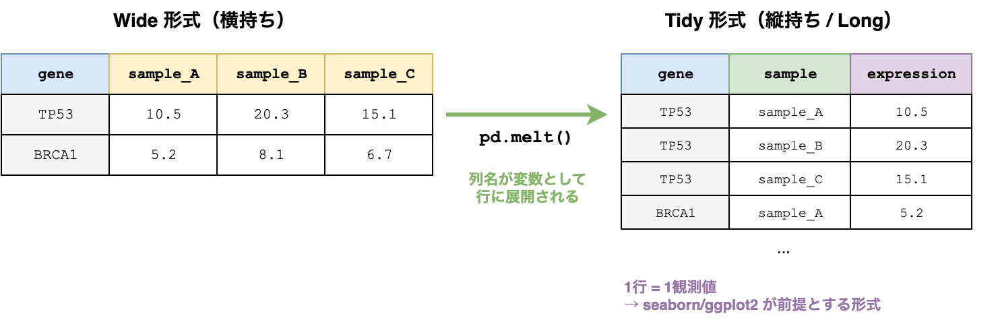

# §4 データフォーマットの選び方

> "Data dominates. If you've chosen the right data structures and organized things well, the algorithms will almost always be self-evident."
> （データがすべてを決める。正しいデータ構造を選び、うまく整理すれば、アルゴリズムはほぼ自明になる。）
> — Rob Pike, "Notes on Programming in C", Rule 5 (1989)

[§3 コーディングに必要な計算機科学](./03_cs_basics.md)では、データ構造・浮動小数点・乱数といった、プログラムの正しさと性能を左右する基礎概念を学んだ。本章では視点を「プログラムの内部」から「プログラムの外部」に移す。解析の入力と出力——つまり**ファイル**の扱いである。エージェントにデータ変換を依頼するとき、入出力フォーマットを正しく指定できるかどうかで結果の品質が決まる。

データ分析の80%はデータの整備と前処理に費やされる——Wickham (2014) が引用したこの経験則 [[8]](https://doi.org/10.18637/jss.v059.i10) [[15]](https://doi.org/10.1002/0471448354) は、CrowdFlower の2016年調査を紹介した Forbes 記事でも同様の傾向として報告されている [[16]](https://www.forbes.com/sites/gilpress/2016/03/23/data-preparation-most-time-consuming-least-enjoyable-data-science-task-survey-says/)。同記事によれば、調査対象のデータサイエンティストの60%がデータクリーニングと整理に最も時間を使い、57%がそれを最も楽しくない作業と回答した。本章で学ぶフォーマット選択と機械可読データへの変換は、この「80%」を削減するための基盤技術である。

バイオインフォマティクスのパイプラインは、ファイルの受け渡しで成り立っている。FASTQ → BAM → VCF → TSV という変換連鎖の中で、「なぜこのフォーマットなのか」「なぜCSVではなくTSVなのか」「なぜバイナリなのか」を判断できることは、正しいパイプラインを設計する第一歩である。本章では、FAIR原則とDOI・データライセンス（Creative Commons）の基礎から、汎用フォーマットの基本、フォーマット選択の判断基準、そしてデータを「機械が読める形」に整える技術までを扱う。

---

## 4-0. データとメタデータ

### データとメタデータの定義

データフォーマットを議論する前に、「データ」と「メタデータ」の区別を明確にしておこう。

- **データ**（data）: 解析対象そのもの。塩基配列、発現量行列、変異コールの結果など。
- **メタデータ**（metadata）: データについてのデータ。サンプル名、実験条件、シーケンサーの機種、ライブラリ調製日など。

メタデータは「データの説明書」のようなものである。同じ発現量行列でも、どの組織から・どの条件で・いつ取得したのかがわからなければ、解析結果の解釈は不可能である。

重要なのは、**データとメタデータの境界は文脈によって変わる**ことである。たとえば、サンプルの年齢情報は「発現量解析」の文脈ではメタデータだが、「年齢と遺伝子発現の関係を調べる」解析ではデータそのものになる。

### バイオインフォマティクスでの具体例

以下の表に、主要なデータ形式とそれに付随するメタデータの例を示す:

| データ | メタデータの所在 | メタデータの例 |
|--------|----------------|--------------|
| FASTQファイル（配列リード） | サンプルシート（CSV/TSV） | サンプル名、バーコード、レーン番号 |
| BAMファイル（アラインメント） | RGヘッダ（`@RG`行） | サンプルID、ライブラリ名、プラットフォーム |
| AnnData（.h5ad） | `.obs`（細胞メタデータ） | 細胞タイプ、バッチ、クラスター |
| VCFファイル（変異） | `##`ヘッダ行 | リファレンスゲノム、フィルター条件、ツールバージョン |

データ本体とメタデータが**同一ファイルに格納される**場合（BAMのRGヘッダ、VCFの`##`行）と、**別ファイルで管理する**場合（FASTQとサンプルシート）がある。どちらの設計にも一長一短があるが、共通して重要なのは「データとメタデータを常にペアで管理する」ことである。メタデータを失ったデータは、解釈不能になる。

### FAIR原則 — データ管理の指導原理

メタデータがなぜこれほど重要なのか。その理論的根拠を与えるのが**FAIR原則**である。2016年にWilkinson らが提唱したFAIR原則[17](https://doi.org/10.1038/sdata.2016.18)は、科学データの管理と公開に関する4つの指導原理を定めている:

| 原則 | 意味 | メタデータとの関係 |
|------|------|-------------------|
| **Findable**（発見可能） | データに永続的な識別子（DOI等）が付与され、検索可能なリポジトリに登録されている | メタデータがなければ検索にヒットしない |
| **Accessible**（アクセス可能） | 標準的なプロトコル（HTTP等）でデータを取得でき、アクセス条件が明示されている | アクセス手順や利用条件もメタデータの一部である |
| **Interoperable**（相互運用可能） | データが広く認知された標準フォーマットと語彙を使っている | フォーマットの選択がそのまま相互運用性を決定する |
| **Reusable**（再利用可能） | データに十分なメタデータ（実験条件、処理手順等）が付随し、明確なライセンスがある | メタデータの質が再利用の可否を決める |

上の表でFindableの条件として挙げた**DOI**（Digital Object Identifier; デジタルオブジェクト識別子）は、科学データや論文を一意に識別するための永続的な識別子である[19](https://www.doi.org/)。DOIは`10.`で始まる文字列で、プレフィクス（登録機関を示す）とサフィクス（対象を示す）をスラッシュで区切った構造を持つ。例えば`10.1038/sdata.2016.18`は、Nature系列（10.1038）のFAIR原則論文を指す。

DOIが必要な理由は、**URLはリンク切れを起こす**からである。Webページは移転・削除されるが、DOIは永続的である。`https://doi.org/10.1038/sdata.2016.18`にアクセスすると、doi.orgが登録された最新のURLにリダイレクトしてくれる。たとえ論文の掲載先のURLが変わっても、DOIは変わらない。この仕組みはInternational DOI Foundation（IDF）が2000年から運用しており、学術出版のインフラとして広く定着している。

DOIは論文だけでなく、データセット、ソフトウェア、プレプリントにも付与できる。[§7 Git入門](./07_git.md)ではZenodoとGitHubを連携してソフトウェアにDOIを発行する方法を、[§19 公共データベースとAPI](./19_database_api.md)ではデータセットへのDOI付与を扱う。ただしDOIは識別子であり、対象の品質を保証するものではないこと、一度発行したDOIは変更・削除ができないこと（だからこそ永続的なのだが）には注意が必要である。

FAIR原則は「データをオープンにせよ」という主張ではない。アクセス制限があるデータでも、メタデータが公開され、アクセス条件が明示されていればFAIRである。重要なのは、**データの存在と取得方法が機械的に発見・判定できる**ことである。

バイオインフォマティクスでは、FAIR原則は日常的な実践に直結する:

- **GEO/SRA登録**: 論文投稿時にシーケンスデータの公開リポジトリ登録を求められる。サンプル属性・実験プロトコル・プラットフォーム情報などのメタデータを最初から整備しておけば、登録作業の負担は大幅に軽減される
- **リファレンスゲノムのバージョン明記**: hg38なのかhg19なのか、GENCODEのどのバージョンを使ったのか——これらを明示しなければ、第三者が解析を再現することは不可能である
- **標準フォーマットの採用**: 独自形式ではなくBAM・VCF・AnnDataなどの標準フォーマットを使うことが、Interoperabilityの基盤となる

本章で学ぶフォーマット選択は、FAIR原則のInteroperable（相互運用可能）とReusable（再利用可能）に直結している。「どのフォーマットを選ぶか」は技術的な問題であると同時に、データの再利用性を決定づける科学的な判断でもある。GEO/SRA登録の実践については[§19 公共データベースとAPI](./19_database_api.md)で、投稿前のチェックリストについては付録Cで詳しく扱う。

### データライセンスの基礎 — コードとデータでは使うライセンスが違う

FAIR原則のReusable（再利用可能）は「明確なライセンスがある」ことを求めている。ここで注意すべきなのは、コードのライセンスとデータのライセンスは別の体系であるという点だ。

コードに対しては[§7 Git入門](./07_git.md)で学ぶMIT、Apache 2.0、GPLといったソフトウェアライセンスを使う。一方、データに対しては**クリエイティブ・コモンズ**（Creative Commons; CC）ライセンスを使うのが国際的な標準である[18](https://creativecommons.org/licenses/)。「コードにはMIT、データにはCC-BY」のように使い分けるのが基本と覚えておこう。

主要なCCライセンスを以下に整理する:

| ライセンス | 条件 | 用途 |
|-----------|------|------|
| **CC0** | 制限なし（パブリックドメイン） | 科学データに推奨。NCBI/EBIの多くのデータベースが採用 |
| **CC-BY** | 帰属表示（引用）のみ | 論文の補足データに最も一般的。UniProt、Human Cell Atlasなどが採用 |
| **CC-BY-SA** | 帰属表示＋同一条件で再配布 | Wikipedia、OpenStreetMapが採用。派生データにも同じライセンスが適用される |
| **CC-BY-NC** | 帰属表示＋非商用 | 商用利用を制限したいデータ。企業との共同研究で問題になりうる |
| **CC-BY-ND** | 帰属表示＋改変禁止 | 原データの改変を防ぎたい場合。解析パイプラインで加工できない制約がつく |

自分のデータを公開するとき、迷ったら**CC-BY 4.0**を選ぶのが無難である。帰属表示（引用）を求めるだけで、再利用の障壁が低い。完全にオープンにしたいならCC0を選ぶ。NC（非商用）やND（改変禁止）は再利用性を制限するため、FAIR原則の観点からは避けるべきとされることが多い。

バイオインフォマティクスの主要データベースのライセンス:

| データベース | ライセンス | 備考 |
|------------|----------|------|
| NCBI（GenBank, SRA, GEO） | パブリックドメイン相当 | 米国政府機関のため著作権が発生しない |
| EBI（ENA, ArrayExpress） | CC0 / 利用規約による | データベースにより異なる |
| UniProt | CC-BY 4.0 | 引用義務あり |
| Ensembl | フリー（引用義務） | 個別のデータソースにライセンスが異なる場合あり |
| Human Cell Atlas | CC-BY 4.0 | |
| DDBJ | INSDC policy | NCBI/EBIと同一のデータ共有ポリシー |

注意すべきは、同じパイプライン内で**異なるライセンスのデータを組み合わせる**場合である。CC-BY-SAのデータを使って派生データセットを作ると、その派生データもCC-BY-SAで公開する必要がある。CC-BY-NCのデータを含むと、パイプライン全体の出力が商用利用不可になる可能性がある。[§21 共同開発の実践](./21_collaboration.md)で学ぶコードのライセンス互換性と同様に、データのライセンス互換性も意識する必要がある。

なお、日本では2023年度から科研費の申請時にデータマネジメントプラン（DMP）の記載が求められるようになった。DMPにはデータの公開方法やライセンスの明記が含まれる。詳細は[§20 コードとデータのセキュリティ・倫理](./20_security_ethics.md)で扱う。

#### エージェントへの指示例

データのライセンスは、エージェントに確認・管理を依頼できる典型的なタスクである。

> 「このパイプラインで使うデータソースのライセンスを一覧にして。CC-BY-NCやCC-BY-SAが含まれている場合、出力データのライセンスにどう影響するか教えて」

> 「このデータセットのREADMEとメタデータからライセンスを確認して。CC-BYなら引用条件を教えて」

> 「データ公開用のLICENSE.mdを作成して。ライセンスはCC-BY 4.0、著者名とDOIを帰属表示に含めて」

---

## 4-1. 汎用フォーマット

バイオインフォマティクス専用のフォーマット（FASTQ, BAM, VCF等）を学ぶ前に、まず汎用的なデータフォーマットを押さえよう。これらはバイオインフォに限らず、あらゆるデータ処理の基盤となる。

### TSV / CSV — 表形式データの基本

**TSV**（Tab-Separated Values）と **CSV**（Comma-Separated Values）は、表形式データの最も基本的なフォーマットである[1](https://www.rfc-editor.org/rfc/rfc4180)。

| 特徴 | TSV | CSV |
|------|-----|-----|
| 区切り文字 | タブ（`\t`） | カンマ（`,`） |
| エスケープ | 基本不要 | フィールド内のカンマは `"` で囲む |
| バイオでの普及度 | 高い（BED, VCF, BLAST出力等） | Excel互換が必要な場面 |

バイオインフォマティクスでは**TSVが圧倒的に多い**。理由は単純で、遺伝子名やアノテーション文字列にカンマが含まれることがあるからである。タブ文字はデータ内にまず現れないため、エスケープの問題が起きにくい。

Pythonでの読み書きには標準ライブラリの `csv` モジュールを使う[2](https://docs.python.org/3/library/csv.html):

```python
import csv
from io import StringIO

tsv_text = "gene\tsample_A\tsample_B\nTP53\t10.5\t20.3\nBRCA1\t5.2\t8.1\n"

# TSVの読み込み
reader = csv.DictReader(StringIO(tsv_text), delimiter="\t")
records = list(reader)

# CSVへの書き出し
out = StringIO()
writer = csv.DictWriter(out, fieldnames=records[0].keys())
writer.writeheader()
writer.writerows(records)
print(out.getvalue())
```

この処理を関数にまとめた再利用版は `scripts/ch04/tsv_csv_handling.py` に置いてあるが、ここでは標準ライブラリだけで動く最小形を示した。

**ヘッダ行**は必ず1行目に置く。ヘッダがないTSV/CSVは機械処理を困難にするだけでなく、人間にとっても列の意味が不明になる。

[§3 コーディングに必要な計算機科学](./03_cs_basics.md)の§3-2で学んだように、現代の Python 標準ライブラリ既定挙動では、float をそのまま CSV に書いて読み戻すだけで通常は精度劣化しない。一方、Excel や報告用の有限桁フォーマットを挟むと、丸めによって情報が落ちる:

```python
import csv
import io
import math

x = math.pi
buf = io.StringIO()

# 表示用に小数点以下6桁へ丸めてCSV保存
csv.writer(buf).writerow([format(x, ".6f")])
y = float(next(csv.reader(io.StringIO(buf.getvalue())))[0])

print(x)  # 3.141592653589793
print(y)  # 3.141593
```

この差はCSVそのものではなく、**丸めたテキスト表現を保存したこと**によって生じている。`pandas.to_csv(float_format=...)` や Excel での再保存も同種のリスクである。

中間データの保存にはバイナリ形式（`.npy`, `.h5ad`, `.parquet`）を使い、CSVは最終出力や他ツールとの受け渡しにのみ使うのが鉄則である。

### JSON — 構造化データ

**JSON**（JavaScript Object Notation）は、キーと値のペアやネスト構造を表現できるフォーマットである[3](https://docs.python.org/3/library/json.html)。Webの世界で広く使われており、バイオインフォマティクスでは主にAPIレスポンスの形式として登場する。

```python
import json

# NCBI E-utilities のレスポンス（例）
response_text = '{"result": {"uids": ["12345", "67890"]}}'
data = json.loads(response_text)
gene_ids = data["result"]["uids"]
# → ["12345", "67890"]
```

NCBI E-utilities、Ensembl REST API、UniProt APIなど、主要なバイオデータベースのAPIはJSONでデータを返す。[§19 公共データベースとAPI — データ取得の実践](./19_database_api.md)で詳しく扱う。

JSONの特徴:
- **ネスト構造**: 表形式では表現しにくい階層的なデータを自然に表現できる
- **型**: 文字列、数値、真偽値、null、配列、オブジェクトの6型
- **改行・空白**: データ的には無意味だが、`json.dumps(data, indent=2)` で人間にも読みやすくできる

### YAML / TOML — 設定ファイル

解析パイプラインの設定ファイルには、**YAML**や**TOML**が使われる。

**YAML**はインデントベースの記法で、Snakemake/Nextflowのワークフロー定義やConda環境ファイル（`environment.yml`）に広く使われる:

```yaml
# config.yaml（Snakemakeの設定例）
samples:
  - sample_A
  - sample_B
reference:
  genome: /data/ref/hg38.fa
  annotation: /data/ref/gencode.v44.gtf
threads: 8
```

**TOML**はPython 3.11以降で標準ライブラリの `tomllib` で読み込める[4](https://docs.python.org/3/library/tomllib.html)。`pyproject.toml` がその代表例である:

```toml
# pyproject.toml
[project]
name = "my-bioinfo-tool"
version = "0.1.0"
requires-python = ">=3.10"

[project.dependencies]
biopython = ">=1.83"
numpy = ">=1.26"
```

YAMLとTOMLの使い分け:
- **YAML**: ネスト構造が深い設定、リストを多用する場面。ただしインデントミスがバグの原因になりやすい
- **TOML**: 型が明確（文字列、整数、浮動小数点、日付等を区別）。Pythonプロジェクトの設定標準

### Markdown — ドキュメント記述

**Markdown**は、プレーンテキストで書けるドキュメント記述言語である。GitHubのREADME、AIコーディングエージェントの設定ファイル（CLAUDE.md, AGENTS.md等）、そして本書自体がMarkdownで書かれている。

Markdownが優れている点:
- **テキストとして読める**: レンダリングなしでも内容が把握できる
- **バージョン管理と相性が良い**: テキストファイルなのでGitのdiffが効く
- **AIエージェントが読み書きできる**: プロジェクトの設定やドキュメントをAIと共有する最も自然な手段

> **🧬 コラム: Excelと遺伝子名 — Oct4問題**
>
> Excelは、遺伝子名を日付やその他のデータ型に**自動変換**してしまうという、バイオインフォマティクス界で悪名高い問題を抱えている。
>
> 2016年、Ziemann らは主要なゲノム研究ジャーナルの論文を調査し、約20%の補足ファイルに遺伝子名の変換エラーが含まれていることを報告した[5](https://doi.org/10.1186/s13059-016-1044-7)。たとえば:
>
> - `MARCH1`（Membrane Associated Ring-CH-Type Finger 1）→ Excelが `3月1日` に変換
> - `SEPT1`（Septin 1）→ `9月1日` に変換
> - `DEC1`（Deleted In Esophageal Cancer 1）→ `12月1日` に変換
> - `OCT4`（POU5F1の別名）→ `10月4日` に変換
>
> 2021年のフォローアップ調査では、問題はまったく改善していないことが示された[6](https://doi.org/10.1371/journal.pcbi.1008984)。
>
> この問題を受けて、HUGO Gene Nomenclature Committee（HGNC）は2020年に27の遺伝子を正式にリネームした[7](https://www.genenames.org/about/guidelines/):
>
> | 旧名 | 新名 | 理由 |
> |------|------|------|
> | MARCH1 | MARCHF1 | 3月に変換される |
> | SEPT1 | SEPTIN1 | 9月に変換される |
> | DEC1 | DELEC1 | 12月に変換される |
>
> 遺伝子名が変わるほど深刻な問題であり、教訓は明確である:
>
> - **CSVファイルをExcelで開かない**。プログラム（Python, R）で処理する
> - やむを得ずExcelを使う場合は、列を「文字列」として読み込む設定にする
> - データの受け渡しにExcelファイル（`.xlsx`）を使わず、TSV/CSVをプログラムで処理する

> #### 🧬 コラム: 日本語環境の罠 — Shift_JIS, BOM, NFD, マルチバイト文字
>
> [§3-3 文字エンコーディング](./03_cs_basics.md#3-3-文字エンコーディング)では、ASCII/UTF-8の基礎と `encoding="utf-8"` を明示する原則を学んだ。ここでは、日本の研究室で特に遭遇しやすい4つの実践的な罠を取り上げる。
>
> ---
>
> **1. Shift_JIS/CP932 レガシーデータ**
>
> Windows版Excelで「CSVとして保存」すると、デフォルトのエンコーディングはShift_JIS(CP932)になる。`open()` で `encoding` を省略すると、macOS/LinuxではUTF-8として読もうとして `UnicodeDecodeError` が発生する。
>
> ```python
> # Shift_JIS(CP932)のCSVを読み込む
> with open("excel_output.csv", encoding="cp932", newline="") as f:
>     reader = csv.DictReader(f)
>     records = list(reader)
> ```
>
> `encoding="utf-8"` で `UnicodeDecodeError` が出たら、まずShift_JIS(CP932)を疑うとよい。
>
> ---
>
> **2. UTF-8 BOM**（バイトオーダーマーク）
>
> Windows版Excelで「UTF-8でCSV保存」を選択すると、ファイル先頭にBOM(`\xef\xbb\xbf`)が付与される。このBOMをPythonの `csv.DictReader` が処理すると、先頭列名に見えない文字 `\ufeff` が紛れ込む。
>
> ```python
> # BOMの罠: 列名が "\ufeffgene" になってしまう
> with open("excel_utf8.csv", encoding="utf-8") as f:
>     reader = csv.DictReader(f)
>     row = next(reader)
>     print(list(row.keys()))  # ['\ufeffgene', 'value'] — 先頭に不可視文字
> ```
>
> 対処は `encoding="utf-8-sig"` を使うことである。BOMがあれば自動除去し、なければ通常のUTF-8として読み込む:
>
> ```python
> # BOM対応: encoding="utf-8-sig" でBOMを自動除去
> with open("excel_utf8.csv", encoding="utf-8-sig", newline="") as f:
>     reader = csv.DictReader(f)
>     row = next(reader)
>     print(list(row.keys()))  # ['gene', 'value'] — 正常
> ```
>
> ---
>
> **3. macOSのファイル名NFD正規化**
>
> macOS(APFS)は日本語ファイル名をNFD（分解形）で格納する。NFDでは濁点・半濁点が独立したコードポイントに分離されるため、「が」は「か」+「゛」の2文字として保存される。Linux/WindowsはNFC（合成形）を使うため、同じファイル名に見えても `==` で比較すると一致しない。
>
> ```python
> import unicodedata
>
> # macOSから受け取ったファイル名（NFD）
> macos_name = "\u304b\u3099"  # か + 濁点（NFD）
> linux_name = "が"            # が（NFC）
>
> print(macos_name == linux_name)  # False — 見た目は同じなのに不一致
>
> # NFC正規化で一致させる
> normalized = unicodedata.normalize("NFC", macos_name)
> print(normalized == linux_name)  # True
> ```
>
> ---
>
> **4. マルチバイト文字の混入**（全角スペース・全角数字等）
>
> Excelや日本語ドキュメントからのコピー＆ペーストで、全角スペース(U+3000)・全角数字(０〜９)・全角英字(Ａ〜Ｚ)がデータファイルに紛れ込むことがある。これらの文字は見た目では気づきにくいが、プログラムの動作を静かに壊す。
>
> - `split()` や `awk` は全角スペースを区切り文字と認識しない → カラムがずれる
> - `int()` は全角数字をパースできない → サンプルIDの名寄せが失敗する
> - FASTAヘッダーに全角文字が入ると、BLASTなどのツールが予期しない挙動を示す
>
> 最大の問題は、**エラーにならずサイレントに失敗する**ケースが多いことである。カラムが1つずれたまま下流の解析が進み、結果がおかしいと気づくまで原因がわからない。
>
> ```python
> # 全角スペースが混入したTSV行
> line = "gene1\t\u3000100\t200"  # 見た目は正常だが…
> fields = line.split("\t")
> print(fields)  # ['gene1', '\u3000100', '200'] — 全角スペースが値に含まれる
> # int(fields[1]) → ValueError: invalid literal for int()
> ```
>
> 検出には `grep` が使える。以下のコマンドはファイル内の全角スペース・全角英数字を検出する:
>
> ```bash
> # 全角スペース(U+3000)と全角英数記号(U+FF01-FF5E)を検出
> grep -P '[\x{3000}\x{FF01}-\x{FF5E}]' data.tsv
> ```
>
> Pythonで対処するには、`unicodedata.normalize("NFKC", text)` が有効である。NFKC正規化は互換分解と合成を行い、全角英数字を対応する半角文字に変換する:
>
> ```python
> import unicodedata
>
> text = "\u3000\uff33\uff41\uff4d\uff50\uff4c\uff45\uff10\uff11"  # 全角スペース＋全角英数字
> normalized = unicodedata.normalize("NFKC", text)
> print(normalized)  # " Sample01" — 半角に正規化される
> print(repr(normalized))  # ' Sample01' — 全角スペースも半角に
> ```
>
> 罠3のNFC正規化（濁点の合成）とは目的が異なる点に注意する。NFKCは「互換性のある文字を統一する」正規化であり、全角→半角の変換を含む。
>
> ---
>
> **まとめ**
>
> | 罠 | 発生源 | 対処法 |
> |---|---|---|
> | Shift_JIS/CP932 | Windows Excelの「CSV保存」 | `encoding="cp932"` で読み込み |
> | UTF-8 BOM | Windows Excelの「UTF-8 CSV保存」 | `encoding="utf-8-sig"` で自動除去 |
> | ファイル名NFD | macOSのファイルシステム | `unicodedata.normalize("NFC", name)` |
> | マルチバイト文字混入 | Excelや日本語文書からのコピペ | `unicodedata.normalize("NFKC", text)` で正規化 |
>
> gzip圧縮ファイルでもエンコーディングの問題は同様に発生する。`gzip.open()` でテキストモードを使う場合は `encoding` を明示する:
>
> ```python
> import gzip
>
> # gzip + エンコーディング明示
> with gzip.open("data.csv.gz", "rt", encoding="utf-8") as f:
>     reader = csv.DictReader(f)
>     records = list(reader)
> ```
>
> **防衛策**:
>
> - ファイル名はASCIIのみにする。日本語のサンプル名はメタデータTSVの列で管理する
> - `open()` には必ず `encoding="utf-8"` を明示する（[§3-3](./03_cs_basics.md#3-3-文字エンコーディング)の原則）
> - Windows由来のCSVは `encoding="utf-8-sig"` で開くことを最初に試みる
> - データファイル（TSV/CSV/FASTA）は非ASCII文字の混入を `grep -P '[\x{3000}\x{FF01}-\x{FF5E}]'` で定期的にチェックする

#### エージェントへの指示例

フォーマット変換やデータ処理をエージェントに依頼する際は、入力と出力の形式を明示する:

> 「`expression.tsv` を読み込んで、遺伝子名の列を基準にlong form（tidy data）に変換するスクリプトを書いてください。出力形式はTSVで、列は `gene`, `sample`, `value` としてください」

> 「この `config.yaml` をPythonで読み込んで型チェックするバリデーション関数を書いてください。必須キー（`samples`, `reference`）の存在確認と型チェックを行い、エラーがあれば具体的なメッセージを返してください」

JSONレスポンスの処理を依頼する場合:

> 「NCBI E-utilities APIからJSON形式でレスポンスを取得し、遺伝子IDのリストを抽出するスクリプトを書いてください。エラーハンドリング（HTTPエラー、JSON解析エラー）も含めてください」

---

## 4-2. フォーマット選択の判断基準

### テキスト vs バイナリ

データフォーマットは大きく**テキスト形式**と**バイナリ形式**に分かれる。どちらを選ぶかは、以下の基準で判断する:

| 基準 | テキスト（TSV, CSV, JSON等） | バイナリ（BAM, .npy, .h5ad等） |
|------|---------------------------|------------------------------|
| 人間の可読性 | そのまま読める | 専用ツールが必要 |
| diff / grep | 直接使える | 不可（専用コマンドが必要） |
| 数値精度 | 変換時に劣化しうる | ビット単位で完全保持 |
| ファイルサイズ | 大きい（数値の桁数分の文字） | 小さい |
| デバッグしやすさ | `head`, `less` で確認可能 | `samtools view` 等が必要 |

原則として:
- **中間データ**（パイプラインのステップ間）→ **バイナリ**（精度保持、サイズ削減）
- **最終出力**（人間が確認、他ツールに渡す）→ **テキスト**（可読性、互換性）
- **設定ファイル**→ **テキスト**（Gitで差分管理、手動編集）

[§3 コーディングに必要な計算機科学](./03_cs_basics.md)の§3-2で学んだように、現代の Python 標準ライブラリ既定挙動では float をそのまま文字列化して読み戻すだけなら通常は値を保てる。一方、有限桁のテキスト化や外部ツールでの再保存を挟むと精度が落ちうるため、中間データはバイナリで保存すべきなのである。

### 圧縮の選択

バイオインフォマティクスのデータは巨大である。ヒトゲノムの全ゲノムシーケンス（WGS, 30x）のFASTQファイルは非圧縮で100 GBを超える。圧縮は必須だが、どの圧縮アルゴリズムを選ぶかが重要である。

| 圧縮形式 | 拡張子 | 特徴 | 主な用途 |
|---------|--------|------|---------|
| gzip | `.gz` | 最も普及、ほぼすべてのツールが対応 | `.fastq.gz`, `.vcf.gz` |
| bgzf | `.gz` | gzip互換だがブロック分割、インデックス可能 | BAM, tabix対応VCF |
| zstd | `.zst` | gzipより高速で高圧縮率 | 新しいパイプライン |

`gzip` はバイオインフォマティクスのデファクトスタンダードである。迷ったら `gzip` を選べば間違いない。`bgzf`（Blocked GNU Zip Format）はgzipと互換性がありつつ、ブロック単位でランダムアクセスできるようにしたもので、BAMファイルやtabixでインデックスされたVCFファイルの内部で使われている。

### インデックス付きフォーマットの利点

ゲノムの特定領域だけを取り出したい場合、ファイル全体を読む必要があるだろうか？　**インデックス**があれば、目的の箇所に直接ジャンプできる。

| データ | インデックス | 作成コマンド |
|--------|------------|------------|
| FASTA | `.fai` | `samtools faidx ref.fa` |
| BAM | `.bai` | `samtools index aln.bam` |
| bgzf圧縮TSV | `.tbi` | `tabix -p bed data.bed.gz` |

インデックスなしで特定のゲノム領域を検索するには、ファイルの先頭から最後まで全走査($O(n)$)が必要である。インデックスがあれば、目的の位置に直接アクセスできる($O(\log n)$)。ファイルが大きいほど、この差は圧倒的になる。

```bash
# インデックスなし: chr1:1000000-1000100 を探すために全BAMを走査
# → 数十GBのBAMファイルで数分〜数十分

# インデックスあり: 目的の領域に直接ジャンプ
samtools view aln.bam chr1:1000000-1000100  # → 一瞬
```

**原則**: BAMファイルを生成したら、必ず `.bai` インデックスも生成する。FASTAファイルを使うなら `.fai` を作る。これはパイプラインの一部として自動化すべきである。

### 下流ツールから逆算する

フォーマット選択で最も実践的な判断基準は、**下流のツールが何を受け付けるか**から逆算することである。

| 下流の目的 | 受け付ける形式 | 出力すべき形式 |
|-----------|--------------|--------------|
| DESeq2で差異発現解析 | カウント行列（TSV） | TSV（遺伝子×サンプル） |
| IGVでアラインメント可視化 | BAM + BAI | ソート済みBAM + インデックス |
| MAFFTで多重配列アラインメント | FASTA | FASTA |
| pandasで統計解析 | CSV / TSV / Parquet | 用途に応じて選択 |

「データの変換は最小限にする」が原則である。A形式 → B形式 → C形式という変換連鎖は、各ステップで情報損失やバグ混入のリスクがある。下流ツールの入力形式を確認し、**最短経路**でその形式に到達するパイプラインを設計する。

### 機械可読なデータ形式の条件

人間が見やすいデータと、プログラムが処理しやすいデータは異なる。**機械可読**（machine-readable）なデータ形式には、以下の4つの条件がある:

1. **1行1レコード**: 1つの観測・サンプルが1行に対応する
2. **ヘッダが1行目**: 列名は最初の1行のみ。タイトル行や空行が上にない
3. **セル結合なし**: 結合されたセルはプログラムで正しく読めない
4. **型の一貫性**: 1つの列は同じデータ型（数値の列に文字列が混在しない）

以下の表で、人間向けレイアウトと機械可読形式を比較する:

| 特徴 | 人間向けレイアウト | 機械可読形式 |
|------|------------------|------------|
| タイトル行 | ファイル先頭に「実験日: 2026-01-15」等 | なし（メタデータは別管理） |
| セル結合 | グループ名を結合して見やすく | 全セルに値が入る |
| 空行 | セクション区切りに空行 | 空行なし |
| 集計行 | 末尾に「合計」「平均」行 | なし（集計はコードで行う） |
| 列名 | 「発現量 (TPM) (Sample A)」 | `expression_tpm_sample_a` |

### AIコーディングエージェントで機械可読形式に変換する

実験系研究者がExcelで作成したサンプルシートは、しばしば人間向けレイアウトになっている。これを機械可読形式に変換する作業は、AIコーディングエージェントが得意とするタスクである。

典型的な「人間向けExcel」の問題:
- 1行目にタイトル（「RNA-seq実験 サンプル情報」）、2行目が空、3行目からヘッダ
- グループ名が結合セル（Control が3行分結合されている）
- 列名に改行やスペースが含まれる（「Sample ID」が改行で分割されている等）

AIエージェントへの変換依頼プロンプト例:

```
このサンプルシート（messy_samples.csv）を機械可読な形式に変換してください。

要件:
- ヘッダは3行目（0-indexed で2）にある
- グループ列の結合セルを前方充填する
- 列名の空白をアンダースコアに正規化する
- 空行を除去する
- 変換後のデータを validate_tidy_table() で検証する
```

以下は、本書付属の再利用版 helper（`scripts/ch04/messy_to_tidy.py`）を使って流れだけを見る簡潔版である。単独でコピペ実行する最小例ではなく、完全実装の利用例として読んでほしい。

コード例:

```python
from scripts.ch04.messy_to_tidy import normalize_sample_sheet, validate_tidy_table

# 人間向けレイアウトのデータ（Excelから読んだ想定）
messy_rows = [
    ["RNA-seq実験", "", ""],           # タイトル行
    ["", "", ""],                       # 空行
    ["Group", "Sample ID", "Value"],    # ヘッダ（3行目）
    ["Control", "S001", "10.5"],
    ["", "S002", "12.3"],               # 結合セル（Group が空）
    ["Treatment", "S003", "20.1"],
    ["", "S004", "22.8"],               # 結合セル
]

# 正規化（ヘッダは index=2）
records = normalize_sample_sheet(messy_rows, header_row_index=2)
# → [{"Group": "Control", "Sample_ID": "S001", "Value": "10.5"},
#    {"Group": "Control", "Sample_ID": "S002", "Value": "12.3"},  ← 前方充填
#    {"Group": "Treatment", "Sample_ID": "S003", "Value": "20.1"},
#    {"Group": "Treatment", "Sample_ID": "S004", "Value": "22.8"}]

# バリデーション
errors = validate_tidy_table(records, ["Group", "Sample_ID", "Value"])
assert errors == [], f"バリデーションエラー: {errors}"
```

「AIの出力を信用するな。検証せよ」——これは[§0 AIエージェントにコードを書かせる](./00_ai_agent.md)で学んだPlan → Code → Reviewワークフローの核心である。AIエージェントが生成した変換コードは、必ずバリデーション関数で検証する。

### tidy data

**tidy data**（整然データ）は、Wickham (2014) が提唱したデータの整理原則である[8](https://doi.org/10.18637/jss.v059.i10):

1. **各変数**（variable）が1つの列に対応する
2. **各観測**（observation）が1つの行に対応する
3. **各種類の観測単位**（type of observational unit）が1つの表に対応する

**long form** は tidy data になりやすい代表的な形だが、両者は厳密な同義語ではない。重要なのは、列が変数、行が観測、表が観測単位の原則を満たしていることである。対照的に、人間が見やすい横長の表は**wide form**と呼ばれる。

**wide form**（人間が読みやすい）:

| gene | sample_A | sample_B | sample_C |
|------|----------|----------|----------|
| TP53 | 10.5 | 20.3 | 15.1 |
| BRCA1 | 5.2 | 8.1 | 6.7 |

**long form**（tidy data）:

| gene | variable | value |
|------|----------|-------|
| TP53 | sample_A | 10.5 |
| TP53 | sample_B | 20.3 |
| TP53 | sample_C | 15.1 |
| BRCA1 | sample_A | 5.2 |
| BRCA1 | sample_B | 8.1 |
| BRCA1 | sample_C | 6.7 |



pandasの `melt()` と `pivot_table()` で相互変換できる:

```python
import pandas as pd

# wide → long
wide_df = pd.DataFrame([
    {"gene": "TP53", "sample_A": "10.5", "sample_B": "20.3"},
    {"gene": "BRCA1", "sample_A": "5.2", "sample_B": "8.1"},
])
long_df = wide_df.melt(
    id_vars=["gene"],
    value_vars=["sample_A", "sample_B"],
    var_name="variable",
    value_name="value",
)

# long → wide
restored = long_df.pivot_table(
    index="gene",
    columns="variable",
    values="value",
    aggfunc="first",
).reset_index()
```

この操作を関数にまとめた版は `scripts/ch04/tidy_data_demo.py` にある。

wide form と long form のどちらが適切かは、下流の処理によって決まる。seabornやggplot2でのプロットにはlong formが必要で、DESeq2のカウント行列はwide formが入力形式である。重要なのは、**両者を自由に行き来できるスキル**を持つことである。

> **🧬 コラム: バイオインフォの主要フォーマット**
>
> 自分でパーサを書く前に、各フォーマットの標準を知ること。以下はバイオインフォマティクスで日常的に扱う形式の一覧である。
>
> | カテゴリ | 形式 | 注意点 |
> |---------|------|--------|
> | 配列 | FASTA, FASTQ | FASTAインデックス（`.fai`）でランダムアクセス可能 |
> | マッピング | SAM/BAM/CRAM[9](https://pubmed.ncbi.nlm.nih.gov/19505943/) | BAM+BAIが日常使い。FLAGフィールドはビットフラグ |
> | アノテーション | BED[10](https://genome.ucsc.edu/FAQ/FAQformat.html#format1), GFF3/GTF[11](https://github.com/The-Sequence-Ontology/Specifications/blob/master/gff3.md) | **BED=0-based half-open**, **GFF=1-based closed** — 混同は致命的バグの元 |
> | 変異 | VCF/BCF[12](https://pubmed.ncbi.nlm.nih.gov/21653522/) | ヘッダ行（`##`）の構造を理解する |
> | MSA | FASTA, Clustal, Stockholm, PHYLIP | ツール間の変換は `Biopython AlignIO` or EMBOSS `seqret` |
> | BLAST出力 | outfmt 6/7（タブ区切り） | カラムはカスタマイズ可能。XML (outfmt 5) はプログラムパース向け |
> | シグナル | BigWig, BedGraph | ゲノムカバレッジ・ChIPシグナル等 |
> | シングルセル | AnnData (.h5ad) | `.X`（行列）, `.obs`（細胞）, `.var`（遺伝子） |
> | 系統樹 | Newick, Nexus | 括弧表記 `((A,B),C);` |
>
> **座標系の違い**は、バイオインフォマティクスで最も多いバグ源の一つである:
>
> | 座標系 | 開始位置 | 終了位置 | 例: 10番目の塩基 | 使用フォーマット |
> |--------|---------|---------|----------------|----------------|
> | 0-based half-open | 0から数える | 含まない | [9, 10) | BED, BAM, Python |
> | 1-based closed | 1から数える | 含む | [10, 10] | GFF, VCF, SAM, R |
>
> BEDファイルの `chr1 9 10` とGFFファイルの `chr1 10 10` は同じ塩基を指している。フォーマット間で座標を変換するときは、この違いを常に意識すること。

> **🧬 コラム: 座標系の罠 — 0-based vs 1-based**
>
> なぜ同じゲノム位置を指すのに2つの座標系が存在するのか。
> 歴史的に、UCSCゲノムブラウザが採用したBED形式はC言語や
> Pythonと同じ0-based indexingを使い、区間を半開区間
> [start, end) で表す。一方、GFFやVCFは生物学者にとって直感的な
> 1-based closed区間 [start, end] を採用した。
>
> 0-based half-openの利点:
> - 区間の長さ = `end - start`（引き算だけで計算可能）
> - 隣接する区間を隙間なく並べられる: [0,5) + [5,10) = [0,10)
> - Pythonのスライス `seq[start:end]` とそのまま対応する
>
> 1-based closedの利点:
> - 「10番目の塩基」を `10` と書ける（人間の直感に合う）
> - 論文やラボノートの記述と一致する
>
> 問題は、パイプライン内で**複数のフォーマットが混在する**ときに起きる。
> pysamでBAMから取得した座標は0-basedだが、それをVCFの
> POSフィールドに書くなら+1する必要がある。
> 以下は典型的なoff-by-oneバグの例である:
>
> ```python
> # ❌ 誤り: BAM（0-based）の座標をそのままGFFに書いている
> for read in pysam.AlignmentFile("input.bam"):
>     print(f"chr1\t.\tgene\t{read.reference_start}\t{read.reference_end}")
>
> # ✅ 正しい: GFF（1-based closed）に変換
> for read in pysam.AlignmentFile("input.bam"):
>     print(f"chr1\t.\tgene\t{read.reference_start + 1}\t{read.reference_end}")
> ```
>
> | ライブラリ/ツール | 内部座標系 | 注意点 |
> |-----------------|-----------|--------|
> | pysam | 0-based | `reference_start` は0-based、SAM出力時に自動で+1 |
> | pyranges | 0-based half-open | BEDと同じ。GFF読み込み時に自動変換 |
> | pybedtools | 0-based half-open | BEDToolsのラッパー |
> | Biopython SeqFeature | 0-based half-open | Pythonスライスと一致 |
>
> **実践ルール**: プロジェクト内で座標系を1つに統一し、
> CLAUDE.mdやREADMEに明記する。迷ったらBED形式（0-based half-open）を
> 選ぶ。Pythonのスライスと一致するため、変換ミスが減る。
>
> BED↔GFF座標変換の具体的な実装は [`scripts/ch04/coordinate_convert.py`](../scripts/ch04/coordinate_convert.py) を参照。

> 🧬 **コラム: 遺伝子構造の基礎知識 — フォーマットの理解に必要な生物学**
>
> GFF3/GTFファイルに登場するフィーチャー型（gene, mRNA, exon, CDS等）を正しく理解するには、遺伝子の構造に関する基礎知識が必要である。
>
> 遺伝子の情報は階層的に組織されている。**遺伝子**（gene）はゲノム上の領域で、そこから**転写産物**（transcript / mRNA）が転写される。転写産物は**エクソン**（exon）と**イントロン**（intron）から構成され、スプライシングによってイントロンが除去される。成熟mRNAのうち、タンパク質に翻訳される領域が**CDS**（Coding Sequence）であり、翻訳されない領域が**UTR**（Untranslated Region; 5'UTRと3'UTR）である。
>
> 重要なのは、**選択的スプライシング**（alternative splicing）により1つの遺伝子が複数の転写産物を生み出すことである。ヒトの遺伝子の約95%が選択的スプライシングを受ける。そのため、RNA-seqのカウント時には**gene-level**（遺伝子単位）と**transcript-level**（転写産物単位）のどちらで定量するかを選択する必要がある。gene-levelカウントは解釈がシンプルだが、アイソフォームの違いを捉えられない。
>
> **アノテーションソースの選択**: ヒトの場合、**GENCODE**が最も包括的なアノテーションである。RefSeqは保守的なキュレーションで信頼性が高いが、GENCODEに比べて転写産物の収録数が少ない。他の生物種ではRefSeqやEnsemblが主なソースとなる。
>
> **ID変換**: 異なるデータベース間で遺伝子IDを変換する必要は頻繁に生じる（例: Ensembl gene IDからUniProtアクセッション番号への変換）。gprofiler2、BioMart、MyGene.info等のサービスが利用できる。エージェントに変換スクリプトを書かせる際は、変換元・変換先のID形式を明示する。

> 🧬 **コラム: リファレンスゲノムの選び方**
>
> バイオインフォマティクス解析の出発点はリファレンスゲノムの選択である。選択を誤ると、全下流解析の結果が影響を受ける。
>
> **ゲノムアセンブリバージョン**: ヒトでは主に以下のバージョンが使われる:
>
> | アセンブリ | UCSC名 | GRC名 | 状況 |
> |-----------|--------|--------|------|
> | GRCh37 | hg19 | GRCh37 | レガシー。既存データとの互換用 |
> | GRCh38 | hg38 | GRCh38 | 現在の標準 |
> | T2T-CHM13 | — | T2T-CHM13 | テロメアからテロメアまで完全。新規用途で増加中 |
>
> マウスでは mm10(GRCm38) から mm39(GRCm39) への移行が進んでいる。**新規解析ではhg38を使う**（またはmm39）。既存データとの比較が必要な場合のみhg19（またはmm10）を選択する。
>
> **UCSC名 vs GRC名**: hg38とGRCh38は同じアセンブリの異なる命名である。染色体名も異なり、UCSCでは `chr1`、Ensemblでは `1` と表記する。この不一致はパイプライン内で頻繁にバグの原因となる（[§9-3](./09_debug.md)の座標系バグも参照）。
>
> **座標のリフトオーバー**: 異なるアセンブリ間で座標を変換するには、**liftOver**（UCSC）や**CrossMap**を使う。ただし、アセンブリ間でゲノム構造が変わった領域では変換に失敗する座標がある点に注意する。
>
> **アノテーションソースの選択**: リファレンスゲノムとアノテーション（GTF/GFF）は同じソースから取得するのが鉄則である。hg38にGENCODE v44のGTFを組み合わせるのが典型的な選択肢である。
>
> エージェントにパイプラインを構築させる際は、リファレンスとアノテーションを明示的に指定する:
>
> > 「GRCh38 + GENCODE v44のGTFを使ってSTARインデックスを構築して。染色体名はchr付き（UCSC形式）で統一して」

#### エージェントへの指示例

フォーマット選択やデータ変換はエージェントが得意とする領域だが、バイオインフォ特有の罠（座標系、エンコーディング、Oct4問題）を知らないと誤った変換をすることがある。以下のように前提条件を明示する:

> 「BED形式（0-based half-open）のファイルをGFF3形式（1-based closed）に変換するスクリプトを書いてください。座標系の変換を正しく行ってください」

> 「この人間向けレイアウトのExcelサンプルシートを機械可読なTSVに変換してください。ヘッダは3行目にあり、グループ列の結合セルは前方充填してください。変換後にバリデーション関数で検証してください」

下流ツールの入力形式から逆算した設計を依頼する場合:

> 「DESeq2の入力となるカウント行列（遺伝子×サンプルのwide form TSV）を、featureCountsの出力ファイルから生成するスクリプトを書いてください」

> **🤖 コラム: 機械学習・数値計算のデータフォーマット**
>
> バイオインフォマティクスと機械学習を組み合わせる場面では、配列解析系（FASTQ, BAM, VCF）とは異なるフォーマット群が登場する。以下は、主要なフォーマットの一覧と用途である。
>
> | カテゴリ | 形式 | 用途 | 注意点 |
> |---------|------|------|--------|
> | 配列/テンソル | .npy / .npz | NumPy配列（単一/複数） | 中間データ保存の基本。有限桁のテキスト化や外部ツール由来の丸めを避けられる |
> | 配列/テンソル | Zarr (.zarr) | チャンク化大規模配列 | 並列アクセス対応、クラウドストレージ親和性 |
> | 配列/テンソル | HDF5 (.h5) | 階層型大規模データ | AnnData(.h5ad)の基盤フォーマット |
> | 表形式 | Parquet (.parquet) | 列指向バイナリ | pandas/polars対応、圧縮効率が高い |
> | 表形式 | SQLite (.db) | 組み込みRDB | メタデータ管理に便利、SQLでクエリ可能 |
> | モデル保存 | Pickle (.pkl) | Pythonオブジェクト汎用 | **信頼できないソースのPickleは実行しない**（任意コード実行のセキュリティリスク） |
> | モデル保存 | .pt / .pth | PyTorchチェックポイント | モデル重み＋オプティマイザ状態。学習再開に必須 |
> | モデル保存 | SafeTensors (.safetensors) | 安全なテンソル保存 | Pickleの脆弱性を排除。Hugging Face推奨 |
> | モデル交換 | ONNX (.onnx) | フレームワーク非依存 | PyTorch→TensorRT等の変換に使用 |
> | TF固有 | TFRecord | TensorFlow学習データ | Protocol Bufferベース。大規模データセットの効率的読み込み |
> | R連携 | .RData / .rds | Rオブジェクト保存 | PythonからはCSV/Parquet経由が安全 |
>
> **判断の指針:**
>
> - **中間の数値データ** → .npy / .npz / Zarr（有限桁のテキスト化や外部ツール由来の丸めを避ける）
> - **大規模表形式** → Parquet（CSVの10倍以上高速に読み込め、ファイルサイズも数分の一）
> - **モデルの保存・共有** → SafeTensors or ONNX（Pickleは自分専用に限定する）
> - **Rとの連携** → Parquet が最も安全な橋渡し
>
> #### エージェントへの指示例
>
> > 「RNA-seqのカウント行列（遺伝子×サンプル、約60,000行×200列）をParquet形式で保存し、読み込み速度をCSVと比較するスクリプトを書いてください」
>
> > 「PyTorchで学習したモデルをSafeTensors形式で保存し、再読み込みして推論する関数を書いてください。Pickle形式は使わないでください」

---

## まとめ

本章で学んだデータフォーマットの判断基準を一覧にまとめる:

| 判断場面 | 推奨 | 理由 |
|---------|------|------|
| 表形式の区切り文字 | TSV | データ内にカンマが含まれうる |
| 中間データの保存 | バイナリ（.npy, .h5ad） | 精度保持、サイズ削減 |
| 最終出力 | テキスト（TSV, CSV） | 可読性、他ツールとの互換性 |
| 設定ファイル | YAML or TOML | Gitで差分管理、人間が編集 |
| 圧縮 | gzip（迷ったら） | 最も広く対応されている |
| 大規模ファイルの部分取得 | インデックス付き形式 | $O(\log n)$で目的箇所にアクセス |
| フォーマット選択の起点 | 下流ツールの入力形式 | 変換連鎖の最小化 |
| データの整理 | tidy data（long form） | 統計処理・可視化に直結 |
| データの前処理 | 機械可読形式に変換 | 4条件: 1行1レコード、ヘッダ1行目、結合なし、型統一 |

データフォーマットの「正解」はコンテキストによって変わる。重要なのは、各フォーマットの特性を理解し、**目的に応じて合理的に選択できる判断力**を身につけることである。

次章の[§5 ソフトウェアの構成要素 — importからpipまで](./05_software_components.md)では、「ライブラリ」「パッケージ」「モジュール」「API」といった用語の正確な意味と、`import` 文の裏で何が起きているかを学ぶ。

---

## 演習問題

本章の内容を、エージェントとの協働を通じて実践する課題である。

### 演習 4-1: 中間データの保存形式 **[設計判断]**

RNA-seqの発現量行列（20,000遺伝子 × 200サンプル、値は浮動小数点数）を中間ファイルとして保存したい。CSV、TSV、Parquet、HDF5の4つの候補から最適な形式を選び、その理由を述べよ。また、選ばなかった形式のデメリットも1つずつ挙げよ。

（ヒント）精度保持（浮動小数点の丸め）、ファイルサイズ、下流ツール（DESeq2、pandas、scanpy等）の入力形式を考慮する。「中間データ」であることの意味も判断材料になる。

### 演習 4-2: tidy dataへの変換判断 **[レビュー]**

以下のようなサンプル × 遺伝子のワイド形式マトリクスがある。

```
sample_id,GeneA,GeneB,GeneC
S001,12.3,0.0,45.6
S002,7.8,23.4,0.1
```

エージェントが「tidy data（long form）に変換しましょう」と提案してきた。この提案を受け入れるべきか。tidy dataに変換するメリットとデメリットをそれぞれ述べたうえで、どのような場合に変換すべきか判断基準を示せ。

（ヒント）seabornやggplot2による可視化にはtidy dataが適するが、行列演算（相関計算、PCA等）にはワイド形式が適する。行数の爆発（20,000遺伝子 × 200サンプル = 400万行）も考慮せよ。

### 演習 4-3: エンコーディングの罠 **[レビュー]**

エージェントが生成した以下のコードをレビューしている。

```python
df = pd.read_csv('data.csv')
```

エンコーディングの指定がない。この1行が引き起こしうる問題を3つ挙げ、それぞれの対処法を述べよ。

（ヒント）Shift_JISで保存されたExcel由来のCSV、BOM付きUTF-8、全角スペースの混入を想像せよ。pandasのデフォルトエンコーディングは何か。

### 演習 4-4: BAMの部分取得 **[実践]**

エージェントに「chr22の領域だけをBAMファイルから抽出するPythonスクリプトを書いて」と指示し、生成されたコードをレビューせよ。以下の観点でチェックし、不足があれば改善を指示せよ。

1. `.bai` インデックスファイルの存在チェックが含まれているか
2. インデックスがない場合のエラーメッセージは適切か
3. 出力ファイルもソート済みBAMになっているか

（ヒント）インデックスなしでランダムアクセスを試みると、全レコードを走査する$O(n)$の処理になり、数十GBのBAMでは実用的な時間で終わらない。pysam の `fetch()` はインデックスがないと例外を投げる。

---

## さらに学びたい読者へ

本章で扱ったデータフォーマットの選択基準やバイオインフォマティクス固有のファイル形式をさらに深く学びたい読者に向けて、原論文と公式仕様を紹介する。

### データ管理の原則

- **Wickham, H. "Tidy Data". *Journal of Statistical Software*, 59(10), 1–23, 2014.** https://doi.org/10.18637/jss.v059.i10 — 本章で紹介したtidy data（整然データ）の概念を提唱した原論文。データ整形の原則がなぜ重要かの理論的背景が詳しく解説されている。
- **Wilkinson, M. D. et al. "The FAIR Guiding Principles for scientific data management and stewardship". *Scientific Data*, 3, 160018, 2016.** https://doi.org/10.1038/sdata.2016.18 — FAIR原則の原論文。データフォーマットの選択がFindable、Accessible、Interoperable、Reusableにどう影響するかを理解するための必読文献。

### バイオインフォマティクスのファイル形式

- **Samtools/Hts-specs.** https://samtools.github.io/hts-specs/ — SAM/BAM/VCF/CRAM等の公式仕様書。フォーマットの細部（オプショナルフィールド、FLAGビットの意味等）を確認する際の正式な参照先である。
- **Li, H. "A survey of sequence alignment algorithms for next-generation sequencing". *Briefings in Bioinformatics*, 11(5), 473–483, 2010.** https://pubmed.ncbi.nlm.nih.gov/20460430/ — 次世代シーケンサ時代のアラインメント手法を概観したレビュー。SAM/BAMを含む周辺技術がどのような問題意識のもとで整備されたかを理解する助けになる。

### データ処理の実践書

- **McKinney, W. *Python for Data Analysis* (3rd ed.). O'Reilly, 2022.** https://www.amazon.co.jp/dp/109810403X — CSV/JSON/Excelなど汎用フォーマットのpandasによる読み書きを網羅する。データフォーマットの変換やクリーニングの実践的な手法が豊富。邦訳: 瀬戸山雅人ほか訳『Pythonによるデータ分析入門 第3版』オライリー・ジャパン, 2023.

---

## 参考文献

[1] Shafranovich, Y. "Common Format and MIME Type for Comma-Separated Values (CSV) Files". RFC 4180. [https://www.rfc-editor.org/rfc/rfc4180](https://www.rfc-editor.org/rfc/rfc4180) (参照日: 2026-03-18)

[2] Python Software Foundation. "csv --- CSV File Reading and Writing". *Python 3 Documentation*. [https://docs.python.org/3/library/csv.html](https://docs.python.org/3/library/csv.html) (参照日: 2026-03-18)

[3] Python Software Foundation. "json --- JSON encoder and decoder". *Python 3 Documentation*. [https://docs.python.org/3/library/json.html](https://docs.python.org/3/library/json.html) (参照日: 2026-03-18)

[4] Python Software Foundation. "tomllib --- Parse TOML files". *Python 3 Documentation*. [https://docs.python.org/3/library/tomllib.html](https://docs.python.org/3/library/tomllib.html) (参照日: 2026-03-18)

[5] Ziemann, M., Eren, Y., El-Osta, A. "Gene name errors are widespread in the scientific literature". *Genome Biology*, 17(1), 177, 2016. [https://doi.org/10.1186/s13059-016-1044-7](https://doi.org/10.1186/s13059-016-1044-7)

[6] Abeysooriya, M., Soria, M., Kasu, M. S., Ziemann, M. "Gene name errors: Lessons not learned". *PLOS Computational Biology*, 17(7), e1008984, 2021. [https://doi.org/10.1371/journal.pcbi.1008984](https://doi.org/10.1371/journal.pcbi.1008984)

[7] HUGO Gene Nomenclature Committee. "Guidelines for Human Gene Nomenclature". [https://www.genenames.org/about/guidelines/](https://www.genenames.org/about/guidelines/) (参照日: 2026-03-18)

[8] Wickham, H. "Tidy Data". *Journal of Statistical Software*, 59(10), 1–23, 2014. [https://doi.org/10.18637/jss.v059.i10](https://doi.org/10.18637/jss.v059.i10)

[9] Li, H. et al. "The Sequence Alignment/Map format and SAMtools". *Bioinformatics*, 25(16), 2078–2079, 2009. [https://pubmed.ncbi.nlm.nih.gov/19505943/](https://pubmed.ncbi.nlm.nih.gov/19505943/)

[10] UCSC Genome Browser. "BED format". [https://genome.ucsc.edu/FAQ/FAQformat.html#format1](https://genome.ucsc.edu/FAQ/FAQformat.html#format1) (参照日: 2026-03-18)

[11] The Sequence Ontology Project. "GFF3 Specification". [https://github.com/The-Sequence-Ontology/Specifications/blob/master/gff3.md](https://github.com/The-Sequence-Ontology/Specifications/blob/master/gff3.md) (参照日: 2026-03-18)

[12] Danecek, P. et al. "The variant call format and VCFtools". *Bioinformatics*, 27(15), 2156–2158, 2011. [https://pubmed.ncbi.nlm.nih.gov/21653522/](https://pubmed.ncbi.nlm.nih.gov/21653522/)

[13] SAM/BAM Format Specification Working Group. "Sequence Alignment/Map Format Specification". [https://samtools.github.io/hts-specs/SAMv1.pdf](https://samtools.github.io/hts-specs/SAMv1.pdf) (参照日: 2026-03-18)

[14] Kent, W. J. et al. "The Human Genome Browser at UCSC". *Genome Research*, 12(6), 996–1006, 2002. [https://doi.org/10.1101/gr.229102](https://doi.org/10.1101/gr.229102)

[15] Dasu, T., Johnson, T. *Exploratory Data Mining and Data Cleaning*. Wiley, 2003. [https://doi.org/10.1002/0471448354](https://doi.org/10.1002/0471448354)

[16] Press, G. "Cleaning Big Data: Most Time-Consuming, Least Enjoyable Data Science Task, Survey Says". *Forbes*, 2016. [https://www.forbes.com/sites/gilpress/2016/03/23/data-preparation-most-time-consuming-least-enjoyable-data-science-task-survey-says/](https://www.forbes.com/sites/gilpress/2016/03/23/data-preparation-most-time-consuming-least-enjoyable-data-science-task-survey-says/) (参照日: 2026-03-25)

[17] Wilkinson, M. D. et al. "The FAIR Guiding Principles for scientific data management and stewardship". *Scientific Data*, 3, 160018, 2016. [https://doi.org/10.1038/sdata.2016.18](https://doi.org/10.1038/sdata.2016.18)

[18] Creative Commons. "About The Licenses". [https://creativecommons.org/licenses/](https://creativecommons.org/licenses/) (参照日: 2026-03-31)

[19] International DOI Foundation. "DOI Handbook". [https://www.doi.org/](https://www.doi.org/) (参照日: 2026-03-31)
