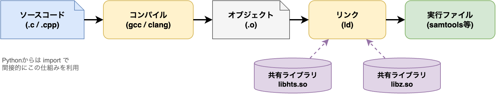
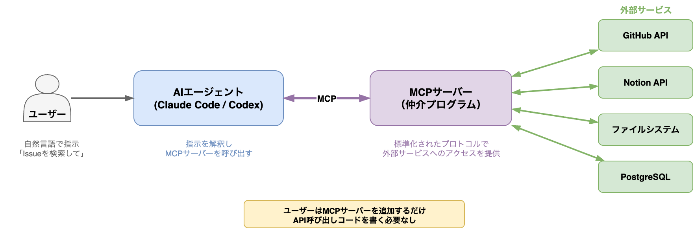

# §5 ソフトウェアの構成要素 — importからpipまで

[§4 データフォーマットの選び方](./04_data_formats.md)では、データの入出力に関わるフォーマットの選択基準を学んだ。次章の[§6 Python環境の構築 — pyenv・venv・conda・uv](./06_dev_environment.md)では `pip install` でパッケージをインストールし、`import numpy` でライブラリを読み込む。しかし、その前に「ライブラリ」「パッケージ」「モジュール」「API」といった用語が正確に何を指しているのか、`import` 文の裏で何が起きているのかを理解しておく必要がある。この理解がなければ、`ModuleNotFoundError` や `ImportError` に遭遇したとき、原因がインストール漏れなのか、パスの問題なのか、環境の不一致なのかを切り分けられない。

エージェントが生成するコードには大量の `import` 文が含まれる。エラーが出たとき、エージェントに「直して」と丸投げする前に、問題の所在を自分で判断できることが重要である。それがインストール漏れなら `pip install` で済む。パスの問題なら `sys.path` を確認する。環境の不一致なら仮想環境を見直す。この切り分けができるかどうかが、デバッグの速度を大きく左右する。

本章では、プログラムの実行の仕組み（コンパイルとリンク）、Pythonのモジュールシステム、依存関係の問題、そしてAPIの概念を順に学ぶ。これらは[§6 Python環境の構築 — pyenv・venv・conda・uv](./06_dev_environment.md)で `pip install` や `conda install` を使いこなすための前提知識となる。

---

## 5-1. プログラムはどう動くか

### インタプリタ言語とコンパイル言語

プログラミング言語は、実行方式の違いから大きく2つに分類される。

**インタプリタ言語**は、ソースコードを1行ずつ読み取りながら実行する。Pythonがその代表である。コードを書いたらすぐに実行でき、対話的な試行錯誤に向いている。ただし、1行ずつ解釈するぶん実行速度はコンパイル言語に劣る。バイオインフォマティクスでは、探索的なデータ分析、パイプラインの制御、可視化にPythonが広く使われる。

**コンパイル言語**は、ソースコード全体を事前に機械語に変換（コンパイル）してから実行する。C/C++が代表的である。コンパイルに時間がかかるが、生成される実行ファイルは高速に動作する。バイオインフォマティクスの基盤ツール——samtools、STAR、BWA、BLAST——の多くはC/C++で書かれている。数百GBのBAMファイルを処理する、数十億リードをアラインメントするといった計算量の多い処理には、コンパイル言語の速度が不可欠だからである。

このため、バイオインフォマティクスでは「Pythonでパイプラインを制御し、重い処理はC/C++製のツールを呼び出す」という構成が一般的である。この構成を理解するには、コンパイル言語の実行ファイルがどのように作られるかを知っておく必要がある。

### コンパイル・リンク・実行の流れ

C/C++プログラムがソースコードから実行ファイルになるまでには、**コンパイル**と**リンク**の2段階がある:



1. **コンパイル**: ソースコードを機械語に変換し、オブジェクトファイル（`.o`）を生成する
2. **リンク**: オブジェクトファイルと外部ライブラリを結合し、1つの実行ファイルを生成する

ここで重要なのがリンクの段階である。ほとんどのプログラムは、すべての機能を自前で実装しているわけではない。圧縮処理にはzlib、数値計算にはBLASといった外部ライブラリの機能を「借りて」いる。リンクとは、この「借りる」関係を解決する処理である。

### 静的リンクと動的リンク

ライブラリのリンク方式には2種類ある:

| | **静的リンク**（static linking） | **動的リンク**（dynamic linking） |
|--|--------------------------------|--------------------------------|
| 仕組み | ライブラリのコードを実行ファイルに埋め込む | 実行時にライブラリを読み込む |
| ファイルサイズ | 大きい（ライブラリが内蔵される） | 小さい（ライブラリは別ファイル） |
| 可搬性 | 高い（単体で動作する） | 低い（ライブラリが環境に必要） |
| 更新 | ライブラリ更新時に再コンパイルが必要 | ライブラリだけ差し替え可能 |
| ライブラリ拡張子 | `.a`（Linux/macOS） | `.so`（Linux）/ `.dylib`（macOS） |

バイオインフォマティクスのツールは、ほとんどが**動的リンク**を採用している。これはファイルサイズの削減やライブラリの共有に有利だが、「実行環境に正しいバージョンの共有ライブラリが存在すること」が前提となる。「自分の環境では動くのに、別のサーバーでは `shared library not found` エラーが出る」——この問題の根本原因が動的リンクの仕組みにある。

### 共有ライブラリとその管理

**共有ライブラリ**（shared library）は、複数のプログラムから共有して利用できるライブラリファイルである。Linuxでは `.so`（shared object）、macOSでは `.dylib`（dynamic library）という拡張子を持つ。

[§2 ターミナルとシェルの基本操作](./02_terminal.md#2-3-環境変数とパス)で学んだPATH環境変数は「実行ファイルの検索パス」だった。共有ライブラリにも同様の仕組みがある:

| 対象 | 代表的な仕組み | 用途 |
|------|----------------|------|
| 実行ファイル | `PATH` | コマンドの検索 |
| 共有ライブラリ | `LD_LIBRARY_PATH`（Linux）, `DYLD_LIBRARY_PATH` や `rpath`（macOS） | ライブラリの検索・解決 |

実行ファイルがどの共有ライブラリに依存しているかは、以下のコマンドで確認できる:

```bash
# Linux: ldd で共有ライブラリの依存を表示
ldd $(which samtools)
#   libhts.so.3 => /usr/lib/libhts.so.3
#   libz.so.1 => /usr/lib/libz.so.1
#   libm.so.6 => /usr/lib/libm.so.6
#   ...

# macOS: otool -L で依存を表示
otool -L $(which samtools)
#   /usr/local/lib/libhts.3.dylib
#   /usr/lib/libz.1.dylib
#   ...
```

Linux の `ldd` 出力では `=>` の右側が OS が見つけたライブラリの実体パスを示す。ライブラリが見つからない場合は `not found` と表示される。macOS の `otool -L` はライブラリのパスと互換バージョン情報を表示する。なお、macOS では System Integrity Protection (SIP) の影響で `DYLD_LIBRARY_PATH` が常に期待どおり働くとは限らないため、日常運用では package manager やコンテナで依存を揃えるほうが堅実である。

この出力を見ると、samtools は libhts（HTSlibライブラリ）に依存し、libhts はさらに libz（圧縮ライブラリ）に依存していることがわかる。この連鎖のどこか1つが欠けても、samtools は起動できない。

本書のサンプルコード `scripts/ch05/module_demo.py` の `check_shared_libs()` 関数でも、この依存確認を体験できる。`shutil.which()` は[§2](./02_terminal.md)で学んだ `which` コマンドのPython版で、`PATH` 環境変数を検索して指定した実行ファイルの絶対パスを返す。見つからなければ `None` を返す:

```python
from scripts.ch05.module_demo import check_shared_libs
import shutil

# samtools のパスを取得して依存を確認
samtools_path = shutil.which("samtools")
if samtools_path:
    libs = check_shared_libs(samtools_path)
    if libs:
        for lib in libs:
            print(lib)
```

🧬 **condaと共有ライブラリ**: condaは、Pythonパッケージだけでなく、C/C++製ツールとその依存共有ライブラリもconda環境内にインストールする。biocondaチャネルからsamtoolsをインストールすると、libhtsやlibzもconda環境の `lib/` ディレクトリに配置される。これにより、システムのライブラリバージョンに依存しない。ただし、conda環境外のツールとの相互作用や、OSレベルのライブラリ（CUDA等）までは管理できない。完全な環境の隔離が必要な場合は、[§15 コンテナによるソフトウェア環境の再現 — Docker・Apptainer](./15_container.md)で学ぶコンテナを使う。

#### エージェントへの指示例

共有ライブラリのエラーは初心者にとって最も困惑するエラーの一つである。エラーメッセージをそのままエージェントに渡すだけでなく、環境情報も一緒に伝えると解決が早い:

> 「`samtools view` を実行したら `error while loading shared libraries: libhts.so.3: cannot open shared object file` というエラーが出た。conda環境を使っている。原因と対処法を教えてほしい」

> 「このプロジェクトで使っているC/C++製ツール（samtools, bcftools, STAR）の共有ライブラリ依存を `ldd` で確認して、不足しているライブラリがないかチェックしてほしい」

> 「macOSで `otool -L` を使ってHomebrewでインストールしたsamtoolsの依存ライブラリを確認して。conda環境のsamtoolsと依存が異なるか比較してほしい」

---

## 5-2. Pythonのモジュールシステム

### モジュール・パッケージ・ライブラリ

Pythonでは、コードの再利用の単位として以下の3つの用語が使われる [2](https://docs.python.org/3/tutorial/modules.html):

| 用語 | 定義 | 例 |
|------|------|-----|
| **モジュール**（module） | 1つの `.py` ファイル | `math.py`, `os.py` |
| **パッケージ**（package） | モジュールをまとめたディレクトリ。通常は `__init__.py` を含む regular package を指すが、`__init__.py` を持たない namespace package もある | `numpy/`, `Bio/` |
| **ライブラリ**（library） | 口語的な総称（パッケージとほぼ同義で使われる） | 「numpyライブラリ」 |

「ライブラリ」は正式なPython用語ではなく、日常会話やドキュメントで「パッケージ」と同じ意味で使われる慣用表現である。本書でもこの慣用に従っている。

本書のサンプルコード `scripts/ch05/mylib/` がパッケージの実例である。ディレクトリ構造を見てみよう:

```
scripts/ch05/mylib/
├── __init__.py      # regular package であることを示すファイル
├── core.py          # モジュール: GC含量計算、逆相補鎖など
└── utils.py         # モジュール: 配列の検証など
```

この例は **regular package** の構成であり、`mylib/` に `__init__.py` があることで Python はこのディレクトリを通常のパッケージとして扱う。`core.py` と `utils.py` はそれぞれ独立した「モジュール」である。

### `__init__.py` の役割

regular package における `__init__.py` は、ディレクトリがPythonパッケージであることをPythonに伝える特別なファイルである。中身は空でもよいが、パッケージの「公開API」を定義する場所としても使われる:

```python
# scripts/ch05/mylib/__init__.py
from scripts.ch05.mylib.core import gc_content, reverse_complement
from scripts.ch05.mylib.utils import validate_sequence

__all__ = ["gc_content", "reverse_complement", "validate_sequence"]
```

この `__init__.py` により、利用者は内部構造を意識せずにインポートできる:

```python
# __init__.py がなければ:
from scripts.ch05.mylib.core import gc_content

# __init__.py のおかげで:
from scripts.ch05.mylib import gc_content
```

`__all__` は `from mylib import *` としたときにインポートされる名前を制限するリストである。明示的なインポートを推奨するPythonの文化では `import *` はあまり使われないが、`__all__` はパッケージの「公開インターフェース」を示す文書的な役割も果たす。

Python 3.3以降には **namespace package**（PEP 420）もあり、この場合は `__init__.py` がなくてもパッケージとして扱える。ただし、単一リポジトリ内の通常のパッケージでは `__init__.py` を置くほうが明示的で、公開APIも整理しやすい。

### importの仕組み

`import numpy` と書いたとき、Pythonは何をしているのか。答えは「`sys.path` に登録されたディレクトリを順番に検索する」である [1](https://docs.python.org/3/reference/import.html):

```python
import sys
print(sys.path)
# ['/path/to/project',                    # スクリプト実行時の先頭エントリ
#  # 対話実行・`python -c`・`python -m` では ''（現在作業ディレクトリ）
#  '/usr/lib/python3.12',                 # 標準ライブラリ
#  '/usr/lib/python3.12/lib-dynload',     # C拡張モジュール
#  '/home/user/.venv/lib/python3.12/site-packages']  # サードパーティ
```

検索順序は以下のとおり:

1. **`sys.path[0]`**（エントリポイントのディレクトリ。対話実行や `python -c`、`python -m` では現在作業ディレクトリ）
2. **PYTHONPATH環境変数**で指定されたディレクトリ
3. **標準ライブラリ**のディレクトリ
4. **site-packages**（`pip install` でインストールされたパッケージの格納先）

この検索順序は「より具体的（プロジェクト固有）なものが優先される」という設計である。先頭エントリが最優先なのは、開発中のコードやエントリスクリプトの隣接モジュールをすぐに import できるようにするためであり、site-packages が後段なのはインストール済みパッケージよりローカルのコードを優先するためである。

`import numpy` が失敗するとき、この検索パスのどこにも `numpy` が見つからないということである。本書のサンプルコード `scripts/ch05/module_demo.py` で `sys.path` を確認できる:

```python
from scripts.ch05.module_demo import show_sys_path, find_site_packages

# sys.path の内容を表示
for p in show_sys_path():
    print(p)

# site-packages の場所を特定
site_pkg = find_site_packages()
print(f"site-packages: {site_pkg}")
```

### site-packages — サードパーティパッケージの格納先

`pip install numpy` を実行すると、numpyのファイル群は **site-packages** ディレクトリにインストールされる。この場所は環境の種類によって異なる:

| 環境 | site-packages の場所 |
|------|---------------------|
| venv | `.venv/lib/python3.x/site-packages/` |
| conda | `envs/<名前>/lib/python3.x/site-packages/` |
| システム | 配布形態により異なる（例: `/usr/lib/python3.x/site-packages/`, `/usr/lib/python3/dist-packages/`） |

仮想環境をアクティベートすると、まず `PATH` の先頭が切り替わり、その結果として仮想環境内の `python` が起動する。起動された `python` が自分の `site-packages` を `sys.path` に設定するため、プロジェクトごとに異なるバージョンのパッケージを使い分けられる。詳しくは[§6 Python環境の構築 — pyenv・venv・conda・uv](./06_dev_environment.md#6-1-pythonの環境管理)を参照。

### PYTHONPATH環境変数

[§2 ターミナルとシェルの基本操作](./02_terminal.md#2-3-環境変数とパス)で学んだPATH環境変数の考え方は、Pythonの `PYTHONPATH` にもそのまま当てはまる。PATHが「実行ファイルの検索パス」であるのに対し、PYTHONPATHは「Pythonモジュールの検索パス」である:

```bash
# 自作モジュールのディレクトリを PYTHONPATH に追加
export PYTHONPATH="/home/user/my_project/src:$PYTHONPATH"
```

これにより、`/home/user/my_project/src/` 配下のモジュールをどこからでもインポートできるようになる。ただし、PYTHONPATHの手動設定はプロジェクトの可搬性を下げる。他の人がコードを使うとき、同じPYTHONPATHを設定する必要があるからである。

推奨されるのは、[§10 ソフトウェア成果物の設計 — スクリプトからパッケージまで](./10_deliverables.md)で学ぶ `pip install -e .`（開発モードインストール）である。`pyproject.toml` にパッケージ情報を記述し、`pip install -e .` で site-packages 側に参照を追加すれば、PYTHONPATHを操作せずに自作モジュールをインポートできる。

### 絶対インポートと相対インポート

パッケージ内のモジュール間でインポートする方法には2種類ある:

```python
# 絶対インポート: パッケージのルートからの完全なパス
from scripts.ch05.mylib.core import gc_content

# 相対インポート: 現在のモジュールからの相対パス
from .core import gc_content       # 同じパッケージ内
from ..utils import some_function  # 親パッケージ内
```

`.`（ドット1つ）は現在のパッケージ内を意味し、`..`（ドット2つ）は1つ上の階層のパッケージを意味する。たとえば `scripts/ch05/mylib/core.py` から `from ..module_demo import show_sys_path` と書くと、1つ上の `scripts/ch05/` にある `module_demo.py` を参照する。

絶対インポートはパスが明確で読みやすい。相対インポートはパッケージの内部構造が変わっても影響を受けにくい。Pythonのスタイルガイド（PEP 8）は、一般的に絶対インポートを推奨している。

### よくあるエラーと対処法

Pythonのインポートで遭遇するエラーは、主に2種類に集約される:

**`ModuleNotFoundError`** — モジュールが見つからない:

```python
>>> import numpy
ModuleNotFoundError: No module named 'numpy'
```

原因と対処:
- **インストール漏れ**: `pip install numpy` を実行する
- **仮想環境の未アクティベート**: `source .venv/bin/activate` でアクティベートする
- **別の環境にインストール済み**: `which python` でどのPythonを使っているか確認する
- **パスの問題**: `sys.path` を確認し、モジュールの場所が含まれているか調べる

**`ImportError: cannot import name`** — モジュールは見つかったが、指定した名前がない:

```python
>>> from Bio.SeqIO import parse_fasta
ImportError: cannot import name 'parse_fasta' from 'Bio.SeqIO'
```

原因と対処:
- **名前の間違い**: 正しい関数名・クラス名を公式ドキュメントで確認する
- **バージョン違い**: ライブラリのバージョンによってAPIが変わっている可能性がある
- **循環インポート**: モジュールAがBをインポートし、BがAをインポートしている場合に起こる。依存関係を整理して循環を解消する

#### エージェントへの指示例

インポートエラーのデバッグでは、エラーメッセージだけでなく環境の情報を含めて指示すると、エージェントが的確に対処できる:

> 「`import scanpy` で `ModuleNotFoundError` が出る。`which python` の結果と `pip list` の出力を確認して、原因を特定してほしい」

> 「自作モジュール `src/mypackage/analysis.py` を別のスクリプトからインポートしたい。PYTHONPATHを使わずに `pip install -e .` で解決する `pyproject.toml` を作成してほしい」

> 「`sys.path` の内容を確認して、現在の仮想環境の site-packages が含まれているか調べてほしい。`conda activate` と `source .venv/bin/activate` のどちらを使うべきか判断してほしい」

---

## 5-3. 依存関係の問題

### 依存関係の連鎖

ソフトウェアは単独では成立しない。あるパッケージが別のパッケージに依存し、そのパッケージがさらに別のパッケージに依存する——この連鎖が**依存関係**（dependency）である。

依存関係はPythonレベルとOSレベルの2層に存在する:

```
Python レベル:
  scanpy → anndata → pandas → numpy → libopenblas.so

OS レベル:
  samtools → libhts.so → libz.so → libc.so
```

依存関係はツールで確認できる:

```bash
# pip show: パッケージの直接依存を表示
pip show numpy
# Name: numpy
# Requires:
# Required-by: pandas, scipy, scikit-learn, ...

# pipdeptree: 依存関係をツリー表示（pip install pipdeptree で導入）
pipdeptree -p scanpy
# scanpy==1.10.0
# ├── anndata [required: >=0.8, installed: 0.10.3]
# │   ├── pandas [required: >=1.4, installed: 2.2.0]
# │   │   └── numpy [required: >=1.23.2, installed: 1.26.3]
# │   ...

# conda info: condaパッケージの依存を表示
conda info samtools
```

### 依存関係地獄

パッケージAがnumpy 1.24以上を要求し、パッケージBがnumpy 1.24未満を要求する——両方を同じ環境にインストールすることはできない。これが**依存関係地獄**（dependency hell）である [6](https://packaging.python.org/):

```
パッケージA: requires numpy>=1.24
パッケージB: requires numpy<1.24
→ 両方を同時にインストールできない！
```

pipやcondaの依存関係リゾルバはこの衝突を自動的に検出し、解決策を探索する。しかし、解決不可能な場合もある。そのときの対処法は:

1. **バージョンの柔軟な指定**: パッケージAの古いバージョンを試す
2. **環境の分離**: プロジェクトごとに仮想環境を分ける（[§6 Python環境の構築 — pyenv・venv・conda・uv](./06_dev_environment.md)）
3. **コンテナの利用**: OSレベルの依存まで含めて隔離する（[§15 コンテナによるソフトウェア環境の再現 — Docker・Apptainer](./15_container.md)）

### 環境隔離で解決できること・できないこと

[§6 Python環境の構築 — pyenv・venv・conda・uv](./06_dev_environment.md)で学ぶvenvやcondaと、[§15 コンテナによるソフトウェア環境の再現 — Docker・Apptainer](./15_container.md)で学ぶコンテナでは、隔離できる範囲が異なる:

| 管理レベル | venv | conda | コンテナ |
|-----------|------|-------|---------|
| Pythonパッケージ | 隔離 | 隔離 | 隔離 |
| Pythonバージョン | 不可 | 隔離 | 隔離 |
| C/C++ライブラリ | 不可 | 部分的に隔離 | 隔離 |
| システムライブラリ | 不可 | 不可 | 隔離 |
| OS | 不可 | 不可 | 隔離 |

「`pip install` したパッケージのバージョンが違う」レベルの問題なら、venvで十分に解決できる。「samtools が依存する libhts.so のバージョンが異なる」レベルの問題には、condaまたはコンテナが必要になる。

この使い分けの判断ができることが重要である。すべてのプロジェクトにDockerを持ち出す必要はないが、共同研究者への引き継ぎや論文投稿時の再現性保証には、コンテナが力を発揮する。

### 依存関係の可視化

依存関係の全体像を把握するためのツールを紹介する:

```bash
# pip show: 特定パッケージの依存元・依存先を確認
pip show pandas
# Requires: numpy, python-dateutil, pytz, tzdata
# Required-by: scanpy, seaborn, anndata

# pipdeptree: ツリー形式で全体像を把握
pipdeptree --warn silence

# conda list: conda環境内の全パッケージ一覧
conda list

# conda info: 特定パッケージの詳細情報
conda info numpy
```

#### エージェントへの指示例

依存関係の問題は、エラーメッセージだけでは原因がわかりにくい。環境全体の状態を調べるようエージェントに指示する:

> 「`pip install scanpy` でバージョンの衝突エラーが出た。`pipdeptree` で依存関係を可視化して、どのパッケージ間で衝突が起きているか特定してほしい」

> 「このプロジェクトの `requirements.txt` と `environment.yml` を比較して、バージョン指定が矛盾していないかチェックしてほしい」

> 「venvとcondaのどちらを使うべきか判断したい。このプロジェクトの依存関係を調べて、C/C++ライブラリへの依存があるかどうか確認してほしい」

---

## 5-4. APIとインターフェース

### APIとは何か

**API**（Application Programming Interface; アプリケーション・プログラミング・インターフェース）とは、ソフトウェアの「使い方の窓口」である [3](https://www.oreilly.com/library/view/python-cookbook-3rd/9781449357337/)。

自動販売機を例に考えるとわかりやすい。利用者が知る必要があるのは「ボタンを押すと飲み物が出てくる」ことだけである。内部で硬貨をどう検証しているか、冷却装置がどう動いているかは知る必要がない。ボタンと取り出し口——これが自動販売機のAPIである。ソフトウェアでも同様に、内部の実装を隠蔽し、利用者に必要最小限の操作方法だけを公開する仕組みがAPIである。

### 3つのレベルのAPI

バイオインフォマティクスで遭遇するAPIは、主に3つのレベルに分類できる:

**CLI API** — コマンドラインインターフェース:

```bash
# samtools のCLI API: サブコマンドとオプションが「API」
samtools view -b -q 30 input.bam > filtered.bam
```

コマンド名、サブコマンド、オプション、引数の組み合わせが、CLIツールの「API」である。詳しくは[§11 コマンドラインツールの設計と実装](./11_cli.md)を参照。

**Python API** — ライブラリのインターフェース:

```python
from Bio import SeqIO

# Bio.SeqIO のPython API: 関数のシグネチャが「API」
records = SeqIO.parse("sequences.fasta", "fasta")
for record in records:
    print(record.id, len(record.seq))
```

関数名、引数の型と順序、戻り値の型が、Pythonライブラリの「API」である。

**Web API** — HTTPを介したインターフェース:

```python
import requests

# NCBI E-utilities のWeb API: URLとパラメータが「API」
response = requests.get(
    "https://eutils.ncbi.nlm.nih.gov/entrez/eutils/esearch.fcgi",
    params={"db": "nucleotide", "term": "BRCA1", "retmode": "json"},
)
```

URLの構造、HTTPメソッド、パラメータ、レスポンス形式が、Web APIの「API」である。詳しくは[§19 公共データベースとAPI — データ取得の実践](./19_database_api.md)で扱う。

### APIの変更がコードを壊す

エージェントが生成するコードは、ライブラリのAPIを使っている。ライブラリのバージョンが上がってAPIが変わると、以前は動いていたコードが壊れる。これが[§7 Git入門 — コードのバージョン管理](./07_git.md#7-4-セマンティックバージョニング)で学ぶセマンティックバージョニングが重要な理由の一つである:

- **PATCH** (1.0.0 → 1.0.1): バグ修正。APIは変わらない
- **MINOR** (1.0.0 → 1.1.0): 機能追加。既存APIは変わらない
- **MAJOR** (1.0.0 → 2.0.0): 後方互換性のない変更。APIが変わる可能性がある

`requirements.txt` でバージョンを固定する（`numpy==1.26.3`）のは、APIの互換性を保つためでもある。

### よいAPI設計の原則 — SOLID

[§1 設計原則 — 良いコードとは何か](./01_design.md#単一責任原則single-responsibility-principle-srp)ではSOLIDの最初の文字であるSRP（単一責任原則）を学んだ。SOLIDとは、Robert C. Martinが提唱した5つの設計原則の頭文字であり [5](https://web.archive.org/web/20150906155800/http://www.objectmentor.com/resources/articles/Principles_and_Patterns.pdf)、よいAPIやソフトウェア構造を設計するための指針である。ここでは残りの4原則の概要を紹介する。

**S — 単一責任原則**（Single Responsibility Principle; SRP）: [§1 設計原則 — 良いコードとは何か](./01_design.md#単一責任原則single-responsibility-principle-srp)で学んだとおり、関数やクラスの変更理由は1つだけであるべきである。

**O — 開放閉鎖原則**（Open/Closed Principle）: 「拡張に対して開いており、修正に対して閉じている」べきである。新しい機能を追加するとき、既存のコードを書き換えるのではなく、新しいコードを追加するだけで対応できる設計が理想的である。たとえば、配列フォーマットのパーサーを追加したいとき:

```python
# 悪い例: 新フォーマットの追加で既存コードを修正する必要がある
def parse(filepath: str, fmt: str) -> list[str]:
    if fmt == "fasta":
        ...
    elif fmt == "genbank":
        ...
    # 新フォーマットを追加するたびに elif を追加 → 修正が必要

# 良い例: 辞書で戦略を管理し、追加だけで拡張できる
PARSERS: dict[str, Callable] = {
    "fasta": parse_fasta,
    "genbank": parse_genbank,
}
# 新フォーマットの追加: PARSERS["fastq"] = parse_fastq  → 既存コード不変
```

**L — リスコフの置換原則**（Liskov Substitution Principle）: 親クラスのインスタンスが使われている場所で、子クラスのインスタンスに置き換えてもプログラムが正しく動作するべきである。オブジェクト指向の継承設計に関わる原則であり、初心者が直面する場面は少ないため、概念だけ覚えておけば十分である。

**I — インターフェース分離原則**（Interface Segregation Principle）: 利用者が使わない機能に依存させてはいけない。巨大な「何でもできるクラス」よりも、目的ごとに小さなクラスに分割するほうがよい:

```python
# 悪い例: すべての機能が1つのクラスに集約されている
class SequenceAnalyzer:
    def parse(self, filepath: str) -> list[str]: ...
    def align(self, seqs: list[str]) -> str: ...
    def visualize(self, alignment: str) -> None: ...
    def export_to_database(self, data: dict) -> None: ...
    # パースだけしたい利用者も、可視化やDB連携の依存を引き受ける

# 良い例: 目的ごとに分離
class SequenceParser:
    def parse(self, filepath: str) -> list[str]: ...

class SequenceAligner:
    def align(self, seqs: list[str]) -> str: ...
```

**D — 依存性逆転原則**（Dependency Inversion Principle）: 具体的な実装ではなく、抽象に依存するべきである。たとえば、入力ファイルのパスをハードコーディングする代わりに、引数として外部から受け取る設計がこの原則に沿っている:

```python
# 悪い例: 具体的なパスに依存
def analyze() -> float:
    with open("/data/sequences.fasta") as f:  # パスがハードコーディング
        ...

# 良い例: 抽象（引数）に依存
def analyze(filepath: Path) -> float:
    with open(filepath) as f:  # パスは外部から注入
        ...
```

これら5原則のすべてを一度に実践する必要はない。初心者はまず**SRP**と**開放閉鎖原則**を意識することから始めるとよい。コードが複雑になってきたら、残りの原則を思い出してリファクタリングの指針にする。

#### エージェントへの指示例

API設計の原則は、エージェントへの指示に直接使える。原則名を明示することで、エージェントは意図を正確に理解する:

> 「この `SequenceAnalyzer` クラスはインターフェース分離原則に違反している。パース・アラインメント・可視化を別々のクラスに分割してリファクタリングしてほしい」

> 「新しいファイルフォーマットを追加したい。既存の `parse()` 関数を修正せずに拡張できるように、開放閉鎖原則に従った設計に変更してほしい」

> 「この関数はファイルパスがハードコーディングされている。依存性逆転原則に従って、パスを引数として外部から受け取るように修正してほしい」

---

## 5-5. MCP（Model Context Protocol）— エージェントの能力を拡張する

[§0-3](./00_ai_agent.md#エージェントの拡張機能--mcpフックカスタムコマンド)で予告した拡張機能の一つ、**MCP**（Model Context Protocol）を詳しく見ていく。

### pip install のアナロジーで理解する

§5-2で、`pip install` によってPythonに新しいライブラリの機能を追加できることを学んだ。MCPはこれと同じ発想で、**AIコーディングエージェントに新しい能力を追加する仕組み**である。

| | Pythonライブラリ | MCP |
|--|----------------|-----|
| 何に追加するか | Pythonインタプリタ | AIコーディングエージェント |
| 追加方法 | `pip install requests` | `claude mcp add` / `codex mcp add` |
| 追加されるもの | Pythonから呼べる関数・クラス | エージェントが使えるツール（検索、読み書き等） |
| 例 | `requests.get()` でHTTPリクエスト | GitHub MCPでIssue検索・PR作成 |

### MCPの仕組み

MCPは、エージェントと外部サービスの間に**標準化されたインターフェース**を提供するプロトコルである。§5-4で学んだAPIの概念を思い出してほしい。APIは「ソフトウェア同士がやり取りする窓口」であった。MCPは「エージェントが外部ツールとやり取りする窓口」を標準化したものである。



MCPサーバーは、特定の外部サービスへのアクセスを提供する小さなプログラムである。エージェントはMCPサーバーを通じて、ファイルの読み書き、データベースの検索、Webサービスへのアクセスなど、さまざまな操作を行える。

### 汎用MCPサーバーの例

以下は、プログラミングや計算機操作で広く使える代表的なMCPサーバーである。

| MCPサーバー | エージェントに追加される能力 | 活用場面 |
|-----------|------------------------|---------|
| **GitHub MCP** | Issue検索、PR作成・レビュー、コード検索 | [§7](./07_git.md)で学ぶGitHub連携の自動化 |
| **Filesystem MCP** | 指定ディレクトリ外のファイル読み書き | サンドボックス外のデータへのアクセス |
| **Notion MCP** | Notionページの検索・作成・更新 | プロジェクト管理、ラボノートとの連携 |
| **PostgreSQL MCP** | SQLクエリの実行、スキーマの参照 | [§19](./19_database_api.md)で学ぶデータベース連携 |
| **Fetch MCP** | 任意のURLからWebページやAPIレスポンスを取得 | Web上の情報収集、REST APIの呼び出し |

### MCPサーバーの追加方法

MCPサーバーの追加は、いずれのツールでも1コマンドで完了する。

| | Claude Code CLI | Codex CLI |
|--|-------------|-----------|
| 追加 | `claude mcp add <名前> <コマンド>` | `codex mcp add <名前> <コマンド>` |
| 一覧 | `claude mcp list` | `codex mcp list` |
| 削除 | `claude mcp remove <名前>` | `codex mcp remove <名前>` |
| スコープ | `-s project` / `-s user` / `-s global` | プロジェクト / ユーザー |

たとえば、GitHub MCPを追加するには以下のように実行する:

```bash
# Claude Code CLIの場合
claude mcp add github -s user -- npx -y @modelcontextprotocol/server-github

# Codex CLIの場合
codex mcp add github -- npx -y @modelcontextprotocol/server-github
```

追加後、エージェントは自動的にGitHub MCPの機能を認識し、必要に応じてIssueの検索やPRの操作を行えるようになる。

### MCPとAPIの違い

§5-4で学んだAPIとMCPは、どちらも「外部サービスとのインターフェース」であるが、誰がそのインターフェースを使うかが異なる。

- **API**: **人間が書いたコード**が外部サービスを呼び出す（`requests.get()` 等）
- **MCP**: **エージェント自身**が外部サービスを呼び出す（人間はMCPサーバーを追加するだけ）

たとえばGitHub APIを使うには、人間がPythonで `requests.get("https://api.github.com/...")` と書く必要がある。GitHub MCPを追加すれば、「このリポジトリのIssueを検索して」と指示するだけで、エージェントが適切なAPI呼び出しを行ってくれる。

#### エージェントへの指示例

MCPの追加や管理は、エージェント自身に依頼することもできる:

> 「このプロジェクトでGitHub MCPを使えるように設定して。プロジェクトスコープで追加して」

> 「現在追加されているMCPサーバーの一覧を表示して。それぞれ何ができるか説明して」

> 「Notion MCPを追加して、プロジェクトの進捗管理ページと連携できるようにして」

---

## まとめ

本章で学んだ概念を一覧にまとめる:

| 概念 | 意味 | 本書での関連箇所 |
|------|------|-----------------|
| コンパイル・リンク | ソースコードを実行ファイルに変換する過程 | [§15 コンテナによるソフトウェア環境の再現 — Docker・Apptainer](./15_container.md)（共有ライブラリの問題） |
| 共有ライブラリ | 複数プログラムで共用される動的ライブラリ | [§6 Python環境の構築 — pyenv・venv・conda・uv](./06_dev_environment.md)（conda管理） |
| モジュール | 1つの `.py` ファイル | [§10 ソフトウェア成果物の設計 — スクリプトからパッケージまで](./10_deliverables.md)（プロジェクト構造） |
| パッケージ | モジュールをまとめたディレクトリ（regular package では `__init__.py` を含む） | [§10 ソフトウェア成果物の設計 — スクリプトからパッケージまで](./10_deliverables.md)（pip パッケージ） |
| `sys.path` | Pythonのモジュール検索パス | [§6 Python環境の構築 — pyenv・venv・conda・uv](./06_dev_environment.md)（仮想環境） |
| 依存関係地獄 | バージョン要求の衝突 | [§6 Python環境の構築 — pyenv・venv・conda・uv](./06_dev_environment.md)（環境隔離） |
| API | ソフトウェアの利用窓口 | [§11 コマンドラインツールの設計と実装](./11_cli.md)、[§19 公共データベースとAPI — データ取得の実践](./19_database_api.md) |
| SOLID原則 | よい設計の5原則 | [§1 設計原則 — 良いコードとは何か](./01_design.md)（SRP） |

ソフトウェアの構成要素を理解することは、エラーの原因を自力で切り分ける力につながる。`ModuleNotFoundError` に遭遇したとき、「インストール漏れか、パスの問題か、環境の不一致か」を判断できれば、エージェントへの指示も的確になり、デバッグのサイクルが短くなる。

次に進む章として、環境管理の実践は[§6 Python環境の構築 — pyenv・venv・conda・uv](./06_dev_environment.md)、プロジェクト構造の設計は[§10 ソフトウェア成果物の設計 — スクリプトからパッケージまで](./10_deliverables.md)、コンテナによる完全な隔離は[§15 コンテナによるソフトウェア環境の再現 — Docker・Apptainer](./15_container.md)を参照してほしい。

---

## 演習問題

本章の内容を、エージェントとの協働を通じて実践する課題である。

### 演習 5-1: エラーメッセージの切り分け **[概念]**

以下の3つのエラーについて、それぞれ (1) 原因の分類（インストール、バージョン、システムライブラリのいずれか）、(2) 具体的な原因、(3) 対処法を述べよ。

(a) `ModuleNotFoundError: No module named 'Bio'`

(b) `ImportError: cannot import name 'SeqIO' from 'Bio'`

(c) `OSError: libhdf5.so: cannot open shared object file: No such file or directory`

（ヒント）(a)はパッケージのインストール漏れ、(b)はバージョン不一致によるAPIの変更、(c)は共有ライブラリのパス解決の問題である。それぞれ本章のどの節で扱った内容に対応するかも考えよ。

### 演習 5-2: API設計の評価 **[設計判断]**

エージェントが以下の関数シグネチャを生成した。

```python
def process(data, mode, output_format, verbose, log_file, overwrite):
    ...
```

この関数を[§1 設計原則 — 良いコードとは何か](./01_design.md)で学んだ設計原則の観点から評価し、具体的な改善案を提示せよ。

（ヒント）引数の多さはKISS違反のサインである。`mode` による処理の分岐は単一責任の原則（SRP）に反する可能性がある。`verbose` と `log_file` はロギングの関心事であり、データ処理の関心事と混在している。

### 演習 5-3: 依存関係の指示 **[指示設計]**

単細胞RNA-seq解析のためにscanpyを新たにプロジェクトに追加したい。エージェントに依存関係の追加を指示する文を書け。以下の情報を含めること。

- パッケージ名とバージョン制約
- インストールチャネル（pip / conda-forge / bioconda）
- 既存の依存関係（numpy, pandas, matplotlib）との互換性確認
- 環境定義ファイルへの反映

（ヒント）パッケージ名だけの指示（「scanpyを入れて」）では、エージェントがバージョンを自動選択し、既存の依存関係と衝突する可能性がある。バージョン制約、チャネルの優先順位、ロックファイルの更新まで含めて指示する。

---

## さらに学びたい読者へ

本章で扱ったモジュールシステム、リンカ、パッケージ管理の仕組みをさらに深く理解したい読者に向けて、教科書と公式リソースを紹介する。

### コンパイル・リンクの仕組み

- **Levine, J. R. *Linkers and Loaders*. Morgan Kaufmann, 1999.** — コンパイル・リンクの仕組みの教科書。本章で概要を扱った共有ライブラリ・動的リンクの内部動作を深く理解できる。全文がオンラインで公開されている。
- **Bryant, R. E., O'Hallaron, D. R. *Computer Systems: A Programmer's Perspective* (3rd ed.). Pearson, 2015.** https://www.amazon.co.jp/dp/013409266X — CMU（カーネギーメロン大学）の教科書（通称 CSAPP）。プログラムのコンパイル・リンク・ロード・実行の仕組みをプログラマの視点から解説する。特に第7章 "Linking" が本章と直結する。邦訳: 鹿野桂一郎訳『コンピュータシステム 基礎から応用まで プログラマの視点で学ぶ（第3版）』東京化学同人, 2025.

### Pythonのモジュールとパッケージ

- **Beazley, D., Jones, B. K. *Python Cookbook* (3rd ed.). O'Reilly, 2013.** https://www.amazon.co.jp/dp/1449340377 — Pythonのモジュール・パッケージ・importシステムに関する実践的レシピ集。特に Chapter 10（Modules and Packages）が本章と直結する。邦訳: 黒川利明訳『Python Cookbook 第3版』オライリー・ジャパン, 2014.
- **Python Packaging Authority. "Python Packaging User Guide".** https://packaging.python.org/ — pip・setuptools・pyproject.tomlの公式ガイド。本章で扱った依存関係管理の最新のベストプラクティスが常に更新されている。

---

## 参考文献

[1] Python Software Foundation. "The import system". *Python 3 Documentation*. [https://docs.python.org/3/reference/import.html](https://docs.python.org/3/reference/import.html) (参照日: 2026-03-20)

[2] Python Software Foundation. "Modules". *Python 3 Documentation*. [https://docs.python.org/3/tutorial/modules.html](https://docs.python.org/3/tutorial/modules.html) (参照日: 2026-03-20)

[3] Beazley, D. & Jones, B. K. *Python Cookbook* (3rd ed.). O'Reilly Media, 2013. [https://www.oreilly.com/library/view/python-cookbook-3rd/9781449357337/](https://www.oreilly.com/library/view/python-cookbook-3rd/9781449357337/)

[4] Levine, J. R. *Linkers and Loaders*. Morgan Kaufmann, 1999. [https://shop.elsevier.com/books/linkers-and-loaders/levine/978-0-08-051031-6](https://shop.elsevier.com/books/linkers-and-loaders/levine/978-0-08-051031-6)

[5] Martin, R. C. "Design Principles and Design Patterns". 2000. [https://web.archive.org/web/20150906155800/http://www.objectmentor.com/resources/articles/Principles_and_Patterns.pdf](https://web.archive.org/web/20150906155800/http://www.objectmentor.com/resources/articles/Principles_and_Patterns.pdf)

[6] Python Packaging Authority. "Python Packaging User Guide". [https://packaging.python.org/](https://packaging.python.org/) (参照日: 2026-03-20)
