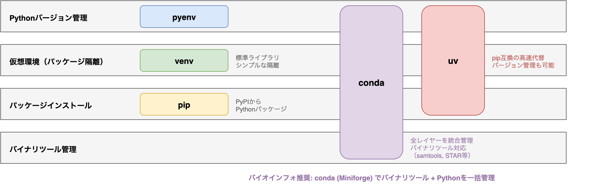

# §6 Python環境の構築 — pyenv・venv・conda・uv

> 「おきのどくですが ぼうけんのしょ1は きえてしまいました。」
> — 『ドラゴンクエストIII そして伝説へ...』(エニックス, 1988)

[§5 ソフトウェアの構成要素 — importからpipまで](./05_software_components.md)では、ライブラリ・パッケージ・モジュールの仕組みと `import` の裏側を学んだ。しかし、これらの知識があっても、コードを書いて動かす「場」が整っていなければ解析は始まらない。本章では、Pythonの環境管理とパッケージマネージャの概念を学び、再現性のある開発環境を構築するための基盤を固める。

AIエージェントと協働する上で、環境管理の知識は不可欠である。エージェントは `pip install` や `conda install` を自動的に実行するが、環境が隔離されていなければ別プロジェクトの依存関係を壊す。`requirements.txt` や `environment.yml` をエージェントに生成させても、その内容をレビューできなければ意味がない。

「自分のPCでは動いたのに、共同研究者のPCでは動かない」——この問題の大半は、環境構築の不備に起因する。Pythonのバージョン、インストールされたパッケージのバージョン、OSレベルの依存ライブラリ。これらを明示的に管理することが、再現可能な研究の第一歩である。

---

## 6-1. Pythonの環境管理

### なぜ環境管理が必要か

バイオインフォマティクスの解析では、プロジェクトごとに異なるパッケージやバージョンを使うことが日常的に起こる。たとえば、RNA-seqパイプラインではPython 3.10とscanpy 1.9が必要だが、新しいシングルセル解析プロジェクトではPython 3.11とscanpy 1.10を使いたい、といった状況である。

これらを1つのPython環境に同居させると、バージョンの衝突が起きる。あるパッケージの更新が別のパッケージを壊す——いわゆる**依存関係地獄**（dependency hell）である。環境管理ツールは、プロジェクトごとに隔離された環境を作ることで、この問題を解決する。

### pyenv — Pythonバージョンの管理

**pyenv**は、複数のPythonバージョンをシステムに共存させ、プロジェクトごとに切り替えるためのツールである[1](https://github.com/pyenv/pyenv)。

```bash
# Pythonバージョンのインストール
pyenv install 3.11.9
pyenv install 3.12.4

# プロジェクトディレクトリでバージョンを固定
cd my-project/
pyenv local 3.11.9    # .python-version ファイルが生成される

# 現在のバージョン確認
python --version       # Python 3.11.9
```

`pyenv local` を実行すると、そのディレクトリに `.python-version` というファイルが作られる。以後、このディレクトリ内では指定したバージョンのPythonが自動的に使われる。このファイルをGitリポジトリに含めておけば、共同研究者も同じバージョンを使える（Gitについては[§7 Git入門](./07_git.md)で学ぶ）。

pyenv が実際に行っているのは、Python本体を置き換えることではない。`PATH` の先頭に **shims** ディレクトリを置き、`python` や `pip` の呼び出しを shim が受けて、`.python-version`、`PYENV_VERSION`、グローバル設定の順に参照して実体のPythonを選ぶ。この仕組みにより、同じ `python` コマンドでもディレクトリごとに別のバージョンへ切り替えられる。

### venv — 標準ライブラリの仮想環境

**venv**はPython標準ライブラリに含まれる仮想環境ツールである[2](https://docs.python.org/3/library/venv.html)。追加のインストールなしに使えるため、最もシンプルな選択肢である。

```bash
# 仮想環境の作成
python -m venv .venv

# 有効化（macOS / Linux）
source .venv/bin/activate

# パッケージのインストール（仮想環境内に閉じる）
pip install biopython numpy pandas

# 無効化
deactivate
```

仮想環境を有効化すると、シェルのプロンプトに `(.venv)` が表示される。この状態で `pip install` したパッケージは `.venv/` ディレクトリ内にのみインストールされ、システムのPython環境を汚さない。

#### 仮想環境の仕組み

`activate` スクリプトが行っていることは、実はシンプルである:

1. 環境変数 `PATH` の先頭に `.venv/bin/` を追加する
2. その結果として `python` と `pip` が `.venv/bin/python` と `.venv/bin/pip` を指すようになる
3. 以後に起動される Python は `.venv/lib/` 以下の site-packages を使う

なお、`activate` は必須ではない。`.venv/bin/python` や `.venv/bin/pip` を直接呼んでも同じ環境を使える。CIやスクリプトではこの方法のほうが明示的である。

Pythonスクリプト内からは `sys.prefix` で現在の仮想環境のパスを確認できる:

```python
import sys

# 仮想環境が有効な場合
print(sys.prefix)      # /path/to/project/.venv
print(sys.base_prefix)  # /path/to/python3.11（システム側）

# 仮想環境内かどうかの判定
in_venv: bool = sys.prefix != sys.base_prefix
```

### Miniforge3 / Micromamba — conda環境

バイオインフォマティクスでは**conda**が事実上の標準（de facto standard）として広く使われている。condaはPythonパッケージだけでなく、C/C++で書かれたバイナリツール（Samtools, BWA等）もまとめて管理できる点が最大の強みである[3](https://docs.conda.io/projects/conda/en/latest/)。

condaを使い始めるには、**Miniforge3**または**Micromamba**をインストールする[4](https://github.com/conda-forge/miniforge)。Miniforgeの公式FAQでも、Mambaforge は 2024 年半ばに非推奨となり、Miniforge3 への移行が推奨されている。かつてはAnacondaやMinicondaが広く使われていたが、Anacondaのライセンス変更（商用利用の有償化）により、オープンソースのMiniforge系が実務上の第一候補になっている。

```bash
# Miniforgeのインストール後の基本操作

# 新しい環境の作成
conda create -n rnaseq-env python=3.11 numpy pandas biopython

# 環境の有効化
conda activate rnaseq-env

# パッケージの追加インストール
conda install -c conda-forge scikit-learn

# 環境の一覧
conda env list

# 環境の無効化
conda deactivate
```

**Micromamba**はcondaの高速な代替実装であり、同じ操作体系で動作する[5](https://mamba.readthedocs.io/en/latest/user_guide/micromamba.html)。大量のパッケージを扱うバイオインフォ環境では、依存解決の速度差が顕著になるため、Micromambaの採用も検討に値する。

### uv — 高速な新世代パッケージマネージャ

**uv**はRust製の高速Pythonパッケージマネージャであり、pip, venv, pyenv相当の機能を統合的に提供する[6](https://docs.astral.sh/uv/)。2024年にリリースされて以降、その速度と利便性から急速に普及している。

```bash
# uvのインストール
curl -LsSf https://astral.sh/uv/install.sh | sh

# Pythonバージョンの管理 (pyenvの代わり)
uv python install 3.12

# プロジェクトの初期化
uv init my-project
cd my-project

# パッケージの追加 (自動的に仮想環境が作成され、pyproject.tomlが更新される)
uv add biopython numpy

# スクリプトの実行 (環境を意識せずに実行可能)
uv run main.py

# ロックファイルからの同期
uv sync
```

uvの特徴は、パッケージ解決の速さだけでなく、Pythonのダウンロード、仮想環境の構築、パッケージのインストールまでを一つのツールで完結できる点にある。特に `uv add` を使うと、`pyproject.toml` への追記と仮想環境へのインストール、`uv.lock` の更新を一度に行えるため、手動での管理ミスが激減する。ただし、condaのようにC/C++バイナリや外部コマンド群をまとめて管理する機能は持たないため、バイオインフォマティクスではCondaとの併用、あるいはコンテナとの組み合わせが現実的な選択肢となる。

### 依存関係定義ファイルの比較

プロジェクトの依存関係を記述するファイルには複数の形式がある。それぞれの特徴と使い分けを以下にまとめる:

| ファイル | ツール | 特徴 | 推奨場面 |
|---------|--------|------|---------|
| `requirements.txt` | pip | シンプルなパッケージ名＋バージョン指定 | 小規模スクリプト、既存プロジェクトとの互換 |
| `pyproject.toml` | pip / uv | プロジェクトメタデータと依存関係を一元管理 | ライブラリ開発、新規プロジェクト |
| `environment.yml` | conda | Pythonバージョン＋チャネル＋パッケージを記述 | バイオインフォ解析、バイナリ依存があるとき |

```
# requirements.txt の例
biopython>=1.83
numpy>=1.26,<2.0
pandas>=2.0
```

```toml
# pyproject.toml の例（[§4 データフォーマットの選び方](./04_data_formats.md)でも登場）
[project]
name = "my-bioinfo-tool"
version = "0.1.0"
requires-python = ">=3.10"
dependencies = [
    "biopython>=1.83",
    "numpy>=1.26",
]
```

```yaml
# environment.yml の例
name: rnaseq-env
channels:
  - conda-forge
  - bioconda
  - defaults
dependencies:
  - python=3.11
  - numpy>=1.26
  - biopython>=1.83
  - samtools=1.19
  - pip:
    - scanpy>=1.10
```

`pyproject.toml` はPythonプロジェクトの標準的な設定ファイルとして定着しつつあり[7](https://packaging.python.org/en/latest/specifications/pyproject-toml/)、新規プロジェクトではこれを使うのが望ましい。一方、samtools等のバイナリツールも含めた環境定義が必要な場合は `environment.yml` が適している。

### 依存関係の競合と解決

依存関係の競合（dependency conflict）は、2つ以上のパッケージが同じパッケージの異なるバージョンを要求するときに起こる。たとえば:

```
パッケージA が numpy>=1.26,<2.0 を要求
パッケージB が numpy>=2.0 を要求
→ 両方を同時にインストールできない
```

競合が起きた場合の対処法:

1. **エラーメッセージを読む** — pip/condaは競合の原因を表示する
2. **バージョン制約を緩和する** — 可能であれば、片方のパッケージを更新する
3. **環境を分ける** — 互換性のないツールは別の仮想環境に分離する
4. **`pip check`** で整合性を確認する — インストール済みパッケージ間の矛盾を検出する

```bash
# インストール済みパッケージの整合性チェック
pip check

# condaの場合
conda list --revisions  # 変更履歴の確認
```

環境を分けることは、競合を避ける最も確実な方法である。バイオインフォマティクスでは用途別に環境を作る（`mapping-env`, `rnaseq-env`, `ml-env` 等）のが一般的な実践である。

#### エージェントへの指示例

環境構築はAIコーディングエージェントに一括で依頼できるタスクである。プロジェクトの要件を伝えれば、適切な環境定義ファイルを生成してくれる:

> 「Python 3.11でRNA-seq解析用のconda環境を作成してください。`environment.yml` にnumpy, pandas, scanpy, biopythonを含めてください。チャネルはconda-forgeとbiocondaを使ってください」

> 「このプロジェクトに `pyproject.toml` を作成してください。Python 3.10以上を要求し、依存パッケージはbiopython, numpy, pandasです。開発用の依存には pytest, ruff, mypy を含めてください」

依存関係の競合を解決する場合:

> 「`pip install` で依存関係の競合が発生しています。エラーメッセージを読んで原因を特定し、バージョン制約の緩和または環境の分離で解決してください」

---

## 6-2. パッケージマネージャの概念

### パッケージマネージャが解決する問題

パッケージマネージャが存在しなかった時代、ソフトウェアのインストールは以下の手順を踏む必要があった:

1. ソースコードをダウンロード
2. 依存ライブラリを手動でインストール（さらにその依存も……）
3. `./configure && make && make install`
4. パスを通す

この手順を1つのツールにつき繰り返すのは非現実的である。パッケージマネージャは、依存関係の自動解決、バージョン管理、インストール・アンインストールの一元化を提供する。

### パッケージマネージャの使い分け

バイオインフォマティクスで出会う主要なパッケージマネージャを比較する:

| パッケージマネージャ | 対象 | 管理単位 | バイオでの主な用途 |
|-------------------|------|---------|-------------------|
| **pip** | Pythonパッケージ | PyPIレジストリ | Pythonライブラリのインストール |
| **Conda** | 言語非依存 | conda-forge, Bioconda等 | バイナリツール＋Pythonの統合管理 |
| **uv** | Pythonパッケージ | PyPIレジストリ | pipの高速代替 |
| **brew** | macOS/Linuxアプリ | Homebrew | 開発ツール（Git, Node等） |
| **apt** | Debian/Ubuntu | OSリポジトリ | システムライブラリ |



基本原則は「**Python関連はCondaまたはpip/uvで、OS関連はbrew/aptで**」という使い分けである。Conda環境内でpipを使うことも可能だが、Condaとpipを混在させるとパッケージの追跡が困難になるため、可能な限りどちらかに統一するのが望ましい。やむを得ず混在させる場合は、Condaで入れられるものを先に固定し、pipは最後に追加する。

### ロックファイル — 再現性の鍵

`requirements.txt` や `environment.yml` だけでは、完全な再現性は保証できない。たとえば `numpy>=1.26` という指定は、インストール時期によって 1.26.0 にも 1.26.4 にもなりうる。

**ロックファイル**（lock file）は、依存関係ツリーの全パッケージについて、実際にインストールされた正確なバージョンを記録するファイルである[8](https://github.com/conda/conda-lock):

| ツール | ロックの方法 | 生成されるファイル |
|--------|------------|-------------------|
| pip | `pip freeze > requirements-lock.txt` | 現在環境のスナップショット |
| conda-lock | `conda-lock -f environment.yml` | `conda-lock.yml` |
| uv | `uv lock` | `uv.lock` |

```bash
# pip freeze によるバージョン固定
pip freeze > requirements-lock.txt
# 出力例:
# biopython==1.83
# numpy==1.26.4
# pandas==2.2.1

# conda-lock による厳密なロック
# -p はロックファイルを生成する対象プラットフォームを指定する
# HPCがLinuxであれば linux-64、macOSであれば osx-64（Intel）または osx-arm64（Apple Silicon）
conda-lock -f environment.yml -p linux-64
# 出力: conda-lock.yml（プラットフォーム固有のハッシュ付き）

# uv lock
uv lock
# 出力: uv.lock（依存ツリー全体のバージョン固定）
```

`pip freeze` は「今この環境に入っているもの」の記録としては有用だが、依存解決の過程やプラットフォーム差までは表現しない。そのため、再現性をより強く求めるなら `uv.lock` や `conda-lock.yml` のような solver-native なロックファイルを優先する。

ロックファイルを[§7 Git入門](./07_git.md)で学ぶGitリポジトリにコミットしておけば、共同研究者が `pip install -r requirements-lock.txt` や `conda-lock install -n rnaseq conda-lock.yml` で同一の環境を再現しやすくなる。

### チャネルとレジストリ

パッケージマネージャは、**レジストリ**（registry）または**チャネル**（channel）と呼ばれるサーバからパッケージをダウンロードする:

| レジストリ/チャネル | 対象ツール | 特徴 |
|-------------------|-----------|------|
| **PyPI** | pip, uv | Pythonパッケージの公式レジストリ。誰でも公開可能 |
| **conda-forge** | Conda | コミュニティ運営の最大のCondaチャネル |
| **Bioconda** | Conda | バイオインフォマティクスに特化したチャネル[9](https://doi.org/10.1038/s41592-018-0046-7) |
| **defaults** | Conda | Anaconda社が管理するチャネル（ライセンスに注意） |

Condaでは、チャネルの優先順位を `.condarc` ファイルで設定する:

```yaml
# ~/.condarc
channels:
  - conda-forge
  - bioconda
  - defaults
channel_priority: strict
```

`channel_priority: strict` を設定すると、上位のチャネルが優先される。バイオインフォマティクスでは conda-forge と bioconda を上位に置くのが一般的である。

#### エージェントへの指示例

パッケージの探索やインストール手順の調査はエージェントの得意分野である:

> 「samtools, BWA, fastpをbiocondaからインストールする手順を教えてください。用途別に環境を分ける構成で `environment.yml` を作成してください」

> 「`pip freeze` の出力からロックファイル（`requirements-lock.txt`）を生成してください。また、`uv lock` でより厳密なロックファイルを作る方法も示してください」

> **🧬 コラム: Biocondaでのツールセットアップ**
>
> **Bioconda**は、8,000以上のバイオインフォマティクスツールを提供するCondaチャネルである[9](https://doi.org/10.1038/s41592-018-0046-7)。BLAST, Samtools, BWA, STAR, fastp など、日常的に使うツールの大半がBiocondaからインストールできる:
>
> `-c` はチャネル（パッケージの配布元）を指定するオプションである。Biocondaはバイオインフォマティクスツール専用、conda-forgeは汎用パッケージのチャネルであり、記述順がパッケージ検索の優先順位になる。
>
> ```bash
> # Biocondaからのツールインストール
> conda install -c bioconda -c conda-forge samtools minimap2 fastp
> ```
>
> **用途別に環境を分ける**のがベストプラクティスである。これにより、ツール間の依存関係の衝突を防げる:
>
> ```bash
> # マッピング用環境
> conda create -n mapping-env -c bioconda -c conda-forge \
>     bwa-mem2 samtools picard
>
> # バリアントコール用環境
> conda create -n variant-env -c bioconda -c conda-forge \
>     gatk4 bcftools tabix
>
> # RNA-seq用環境
> conda create -n rnaseq-env -c bioconda -c conda-forge \
>     star salmon fastp multiqc
> ```
>
> biocondaに収録されていないツールもある。その場合は、ソースコードからのビルド、pip install、あるいはコンテナ（[§15 コンテナによるソフトウェア環境の再現](./15_container.md)で扱う）を検討する。biocondaへの貢献（レシピの追加）も歓迎されている。
>
> **アラインメントツールの使い分け**: 同じ「配列をマッピングする」タスクでも、データの種類によって適切なツールは異なる。エージェントにパイプラインを構築させる際、ツール名を指定できるとより正確な結果が得られる:
>
> | データ種別 | 推奨ツール | 理由 |
> |---|---|---|
> | DNA-seq ショートリード | BWA-MEM2 | 連続マッピング前提。BWAの後継で高速 |
> | RNA-seq ショートリード | STAR / HISAT2 | スプライスジャンクション対応 |
> | ロングリード（ONT / PacBio） | minimap2 | 高エラー率・長いリードに対応 |
> | タンパク質相同性検索 | DIAMOND（高速） / BLAST+（標準） | 大規模データにはDIAMONDが桁違いに速い |
> | マルチプルアラインメント | MAFFT | `--auto` で自動パラメータ選択。デフォルトで十分な精度 |

> **🤖 コラム: 機械学習環境の構築**
>
> バイオインフォマティクスと機械学習の融合領域——シングルセル基盤モデル（scFoundation model）、変異の病原性予測、タンパク質構造予測（AlphaFold等）——では、GPU環境の構築が必要になる。
>
> **CUDA/PyTorchのインストール**（conda推奨）:
>
> `pytorch-cuda=12.1` はGPU対応版PyTorchに必要なCUDAランタイムである。`-c pytorch -c nvidia` はPyTorch公式とNVIDIA公式のチャネルで、これらからGPU対応バイナリが提供される。
>
> ```bash
> # ML用環境の作成
> conda create -n ml-env python=3.11
> conda activate ml-env
> conda install pytorch pytorch-cuda=12.1 -c pytorch -c nvidia
> # または pip で:
> # pip install torch --index-url https://download.pytorch.org/whl/cu121
> ```
>
> **よくあるハマりポイント:**
>
> - **CUDAドライバとCUDA Toolkitのバージョン不一致** — CUDAドライバ（OS/GPU側）とCUDA Toolkit（PyTorch側）には互換性の制約がある。`nvidia-smi` でドライバのバージョンを確認し、`torch.cuda.is_available()` でPyTorchからGPUが認識されているかを確認する
> - **HPC環境でのモジュールシステム** — 大学や研究所のHPCでは `module load cuda/12.1` のようなモジュールシステムでCUDAを管理することが多い。conda環境内のcudatoolkitとシステムのCUDAが競合しないよう注意する
> - **conda環境のcudatoolkit vs システムCUDA** — conda環境に `cudatoolkit` を入れる方法と、システムにインストールされたCUDAを使う方法の2つがある。HPCではシステムCUDAを使うのが一般的だが、ローカルマシンではconda管理が楽である
>
> **バイオインフォML系でよく使うライブラリ:**
>
> | ライブラリ | 用途 |
> |-----------|------|
> | **PyTorch** / **JAX** | 深層学習フレームワーク |
> | **scikit-learn** | 古典的機械学習（分類、クラスタリング、前処理） |
> | **Hugging Face Transformers** | 事前学習済みモデルの利用 |
> | **wandb** / **MLflow** | 実験追跡（[§15 コンテナによるソフトウェア環境の再現](./15_container.md)で詳述） |
> | **optuna** | ハイパーパラメータ最適化 |

---

## まとめ

本章で学んだ開発環境構築の判断基準を一覧にまとめる:

| 判断場面 | 推奨 | 理由 |
|---------|------|------|
| Pythonバージョン管理 | pyenv | プロジェクトごとに `.python-version` で固定 |
| Python仮想環境（シンプル） | venv | 標準ライブラリ、追加インストール不要 |
| バイナリツールを含む環境 | conda（Miniforge3） | samtools等のC/C++ツールも管理可能 |
| 高速なパッケージ管理 | uv | pip互換で10〜100倍高速 |
| 依存関係ファイル（新規） | pyproject.toml | Pythonプロジェクトの標準 |
| 依存関係ファイル（バイオ） | environment.yml | バイナリ＋Python＋チャネル指定 |
| バージョンの厳密な固定 | ロックファイル | 再現性の保証 |
| バイオツールのインストール | bioconda | 8,000+のツールが利用可能 |
| ツール間の依存衝突 | 環境を分ける | 用途別に隔離が最も確実 |

環境構築は地味な作業に見えるが、ここでの判断が解析の再現性を左右する。[§1 設計原則 — 良いコードとは何か](./01_design.md)で学んだ「明示は暗黙に勝る」（Explicit is better than implicit）の精神で、使用するPythonバージョン・パッケージのバージョン・インストール手順を常に明文化しておこう。

次章の[§7 Git入門](./07_git.md)では、コードと環境定義ファイルをGitで管理し、変更履歴を追跡する方法を学ぶ。

---

## 演習問題

本章の内容を、エージェントとの協働を通じて実践する課題である。

### 演習 6-1: 環境管理ツールの選択 **[設計判断]**

以下の3つのプロジェクトに対して、venv、conda（Miniforge3）、uvのいずれを使うべきか。それぞれ選択理由を述べよ。

(a) PythonのみでCSVを処理する小規模なデータ整形スクリプト（依存: pandas, numpy）

(b) samtools・BWA・fastp等のC/C++製バイナリツールを含むNGS解析パイプライン

(c) PyTorch + CUDA を使ったディープラーニングによるタンパク質構造予測

（ヒント）バイナリツール（C/C++コンパイル済み）を含むかどうかが最大の判断基準である。condaはバイナリパッケージの配布に強く、uvやvenvはPythonパッケージに特化している。GPUライブラリの扱いも考慮せよ。

### 演習 6-2: requirements.txtの問題 **[レビュー]**

エージェントが生成した以下の `requirements.txt` をレビューせよ。

```
numpy
pandas
scikit-learn
matplotlib
biopython
```

バージョンピニングがない。この `requirements.txt` を3ヶ月後に別の環境で `pip install -r requirements.txt` した場合に起こりうる問題を3つ挙げ、改善案を示せ。

（ヒント）新バージョンでの破壊的変更（APIの削除・変更）、依存ライブラリ間のバージョン不整合、実行結果の数値的な不一致（scikit-learnのアルゴリズム変更等）を想像する。

### 演習 6-3: 環境の隔離テスト **[実践]**

エージェントに以下の指示を出し、仮想環境の隔離が正しく機能していることを確認せよ。

1. `env_old` と `env_new` の2つの仮想環境を作成する
2. `env_old` に pandas 1.5.3 を、`env_new` に pandas 2.2.0 をインストールする
3. 各環境で `python -c "import pandas; print(pandas.__version__)"` を実行し、バージョンが異なることを確認する
4. 一方の環境でのインストールが他方に影響していないことを確認する

（ヒント）`source .venv/bin/activate` で環境を切り替えてからバージョンを確認する。`which python` で実行されるPythonのパスが環境ごとに異なることも確認せよ。

---

## さらに学びたい読者へ

本章で扱ったPython環境管理ツールの最新情報や、バイオインフォマティクスにおけるパッケージ管理の背景を知りたい読者に向けて、公式ドキュメントと関連論文を紹介する。

- **Astral. "uv Documentation".** https://docs.astral.sh/uv/ — 本章で紹介したuvの公式ドキュメント。ツールの進化が速いため、最新の機能やベストプラクティスはここを参照するのが最善である。
- **Conda Documentation.** https://docs.conda.io/ — conda/miniforge/micromambaの包括的リファレンス。environment.ymlの詳細な仕様や、チャネル優先度の制御など高度な環境管理テクニックが記載されている。
- **Grüning, B. et al. "Bioconda: sustainable and comprehensive software distribution for the life sciences". *Nature Methods*, 15, 475–476, 2018.** — バイオインフォツールのcondaパッケージ基盤であるBiocondaの原論文。なぜcondaがバイオインフォマティクスの標準的なパッケージマネージャになったかの歴史的背景を理解できる。

---

## 参考文献

[1] pyenv contributors. "pyenv — Simple Python version management". [https://github.com/pyenv/pyenv](https://github.com/pyenv/pyenv) (参照日: 2026-03-18)

[2] Python Software Foundation. "venv --- Creation of virtual environments". *Python 3 Documentation*. [https://docs.python.org/3/library/venv.html](https://docs.python.org/3/library/venv.html) (参照日: 2026-03-18)

[3] Conda contributors. "Conda Documentation". [https://docs.conda.io/projects/conda/en/latest/](https://docs.conda.io/projects/conda/en/latest/) (参照日: 2026-03-18)

[4] conda-forge contributors. "Miniforge". [https://github.com/conda-forge/miniforge](https://github.com/conda-forge/miniforge) (参照日: 2026-03-18)

[5] Mamba contributors. "Micromamba User Guide". [https://mamba.readthedocs.io/en/latest/user_guide/micromamba.html](https://mamba.readthedocs.io/en/latest/user_guide/micromamba.html) (参照日: 2026-03-18)

[6] Astral. "uv: An extremely fast Python package and project manager". [https://docs.astral.sh/uv/](https://docs.astral.sh/uv/) (参照日: 2026-03-18)

[7] Python Packaging Authority. "pyproject.toml specification". [https://packaging.python.org/en/latest/specifications/pyproject-toml/](https://packaging.python.org/en/latest/specifications/pyproject-toml/) (参照日: 2026-03-18)

[8] conda-lock contributors. "conda-lock: Lightweight lockfile for conda environments". [https://github.com/conda/conda-lock](https://github.com/conda/conda-lock) (参照日: 2026-03-18)

[9] Grüning, B. et al. "Bioconda: sustainable and comprehensive software distribution for the life sciences". *Nature Methods*, 15(7), 475–476, 2018. [https://doi.org/10.1038/s41592-018-0046-7](https://doi.org/10.1038/s41592-018-0046-7)
