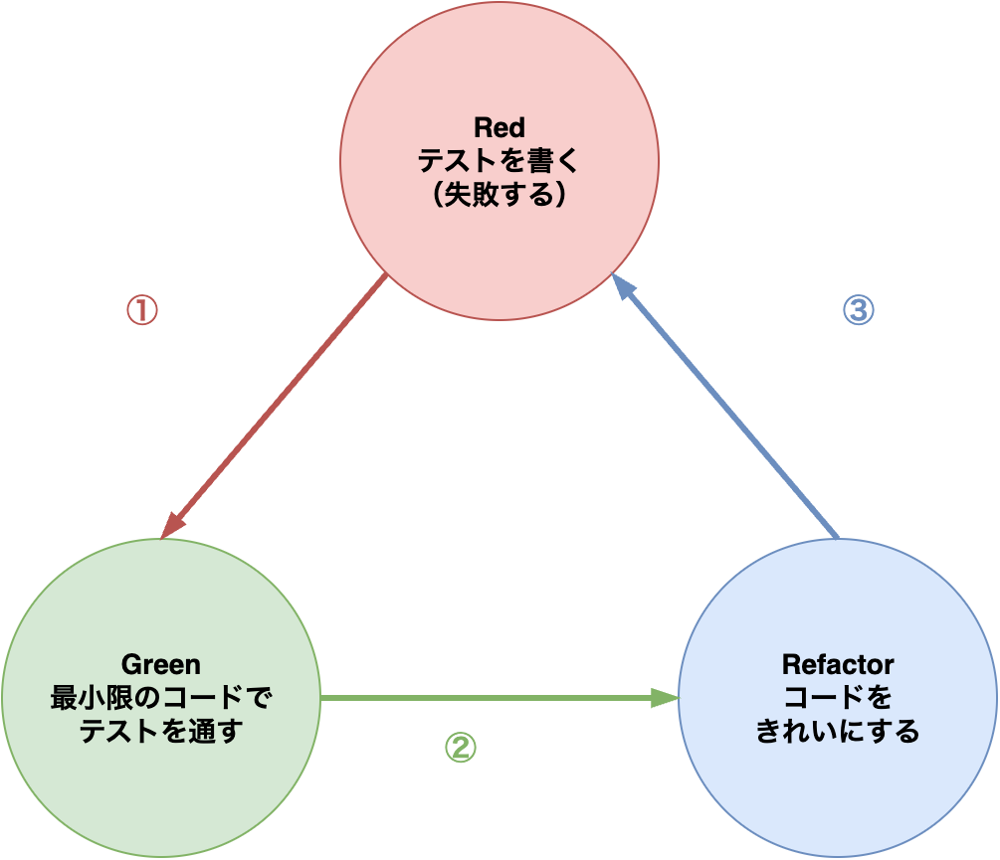
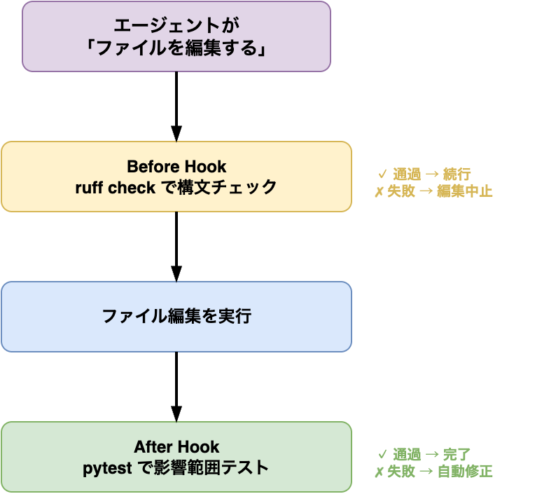
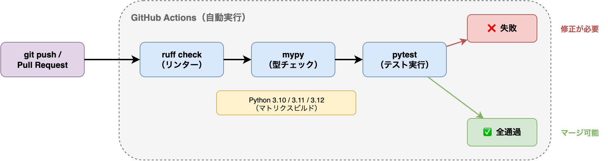

# §8 コードの正しさを守るテスト技法

> 「疑うがゆえに知り、知るがゆえに疑う」
> — 寺田寅彦, 随筆「知と疑い」

[§7 Git入門 — コードのバージョン管理](./07_git.md)では、コードの変更履歴を記録し、共有・公開する仕組みを学んだ。しかし、バージョン管理されたコードが正しく動作する保証はどこにもない。「昨日まで動いていたスクリプトが、新しい関数を追加したら壊れた」——こうした事態を防ぐには、コードが期待どおりに動くことを**自動的に検証する仕組み**が必要である。

実験科学者にとって、これはポジティブコントロールとネガティブコントロールの概念に近い。既知の結果が得られるサンプルを実験に含めることで、実験系全体が正しく機能していることを確認する。ソフトウェアにおけるテストも同じ発想である——既知の入力に対して期待どおりの出力が得られるかを自動で検証する。

本章では、**テスト駆動開発**（Test-Driven Development; TDD）の考え方、**pytest**によるテストの書き方、そして**Ruff**・**mypy**・**pre-commit**によるコード品質の自動管理を学ぶ。さらに、[§7](./07_git.md)で触れたGitHub Actionsを活用して、テストとリンターをプッシュのたびに自動実行するCI/CDパイプラインを構築する。


---

## 8-1. テスト駆動開発（TDD）

### なぜテストを書くのか

「テストを書く時間がもったいない」——プログラミング初心者がしばしば抱く感想である。しかし、テストのないコードは、やがてそれ以上の時間を奪う。

テストがない場合に起こる典型的な問題:

1. **修正の副作用が検出できない** — ある関数を修正したとき、別の関数が壊れたことに気づけない
2. **リファクタリングが怖い** — コードを改善したくても「壊すかもしれない」と手が出せない
3. **バグの再発** — 一度直したはずのバグが、数ヶ月後に再び現れる

テストはこれらの問題をすべて解決する。[§1 設計原則 — 良いコードとは何か](./01_design.md)で学んだKISS原則やDRY原則と同様に、テストを書く習慣はコードの品質を長期にわたって維持するための基盤である。

### Red → Green → Refactor サイクル

テスト駆動開発（TDD）は、コードを書く前にテストを書く開発手法である[1](https://www.informit.com/store/test-driven-development-by-example-9780321146533)。TDDは3つのステップを繰り返すサイクルで進む。



この3ステップを小さな単位で繰り返す。一度に大きな機能を実装するのではなく、「テスト1つ → 実装 → 整理」の小さなサイクルを回し続ける。

#### 具体例: 配列の逆相補鎖を求める関数

バイオインフォマティクスでよく使う「逆相補鎖」（reverse complement）の関数をTDDで実装してみよう。

**Step 1: Red — 失敗するテストを書く**

```python
# tests/ch08/test_reverse_complement.py
from scripts.ch08.reverse_complement import reverse_complement

def test_simple_sequence() -> None:
    """ATGCの逆相補鎖はGCATである."""
    assert reverse_complement("ATGC") == "GCAT"
```

この時点では `reverse_complement` 関数はまだ存在しないため、テストは失敗する（Red）。

**Step 2: Green — テストが通る最小限のコードを書く**

```python
# scripts/ch08/reverse_complement.py
COMPLEMENT: dict[str, str] = {
    "A": "T", "T": "A", "G": "C", "C": "G",
}

def reverse_complement(seq: str) -> str:
    """DNA配列の逆相補鎖を返す."""
    return "".join(COMPLEMENT[base] for base in reversed(seq.upper()))
```

テストを実行すると、今度は成功する（Green）。

**Step 3: Refactor — 必要に応じて整理する**

この段階ではコードが十分にシンプルなので、大きなリファクタリングは不要である。ただし、テストケースを追加して堅牢性を高めることはできる:

```python
def test_empty_sequence() -> None:
    """空文字列には空文字列を返す."""
    assert reverse_complement("") == ""

def test_case_insensitive() -> None:
    """小文字の入力も受け付ける."""
    assert reverse_complement("atgc") == "GCAT"
```

新しいテストケースを追加したら、再びテストを実行して全てが通ることを確認する。このサイクルを繰り返しながら、エッジケース（空入力、小文字入力など）にも対応していく。

### 「テストが通る最小限のコード」を書く規律

TDDで最も重要な規律は、**テストが通る最小限のコード**だけを書くことである。テストに書いていない機能を先回りして実装しない。これは[§1](./01_design.md)で学んだYAGNI原則（You Ain't Gonna Need It）そのものである。

たとえば、最初のテストが `reverse_complement("ATGC")` だけなら、実装は文字列 `"GCAT"` をハードコードで返すところから始めてもよい。次のテストケース `reverse_complement("AAAA")` を追加したとき、初めて汎用的なロジックが必要になる。

この「小さなステップ」の積み重ねが、過剰設計を防ぎ、実際に必要な機能だけを持つクリーンなコードへと導く。

#### エージェントへの指示例

TDDはAIコーディングエージェントとの相性が非常によい。エージェントは「テストを書く → 実装する → リファクタリングする」のサイクルを忠実に実行できる。ただし、明示的に指示しないと、テストと実装を一度に書いてしまうことが多い。以下のように段階を区切って指示する:

> 「テストを先に書いて、テストが通る最小限の実装をしてください。一度に1つのテストケースずつ進めてください」

既存コードにテストがない場合、まずテストを追加してからリファクタリングする流れも指示できる:

> 「`scripts/ch08/seq_stats.py` の現在の動作を保証するテストをまず書いてください。テストが通ることを確認してから、リファクタリングに進んでください」

バグ修正にTDDサイクルを適用する場合:

> 「このバグを再現する失敗テストをまず書いてください。テストが赤（失敗）であることを確認してから修正に取りかかってください」

---

## 8-2. テストの実践

### pytestによるユニットテスト

Pythonのテストフレームワークで最も広く使われているのが**pytest**である[2](https://docs.pytest.org/en/stable/)。標準ライブラリの `unittest` よりもシンプルな記法で、強力な機能を提供する。

#### インストールと基本的な使い方

```bash
# pytestのインストール
pip install pytest

# テストの実行（testsディレクトリ以下のtest_*.pyを自動検出）
pytest tests/

# 詳細な出力
pytest tests/ -v

# 特定のファイルだけ実行
pytest tests/ch08/test_reverse_complement.py

# 特定のテスト関数だけ実行
pytest tests/ch08/test_reverse_complement.py::test_simple_sequence
```

pytestは `test_` で始まるファイルと関数を自動的にテストとして認識する。テスト関数内で `assert` 文を使い、期待する条件を記述する。

#### テストの書き方の基本

テストは**Arrange-Act-Assert**（準備-実行-確認）のパターンで書く:

```python
def test_gc_content_typical() -> None:
    # Arrange: テストデータを準備する
    seq = "ATGCATGC"
    expected = 0.5

    # Act: テスト対象の関数を呼び出す
    result = gc_content(seq)

    # Assert: 結果を検証する
    assert result == pytest.approx(expected)
```

浮動小数点数の比較には `pytest.approx()` を使う。浮動小数点数の直接比較（`==`）は丸め誤差により失敗する場合がある（[§3 コーディングに必要な計算機科学](./03_cs_basics.md)で学んだとおりである）。

#### テストクラスによるグループ化

関連するテストをクラスでまとめると、テストの構造が明確になる:

```python
class TestReverseComplement:
    """reverse_complement() のテスト."""

    def test_simple(self) -> None:
        assert reverse_complement("ATGC") == "GCAT"

    def test_palindrome(self) -> None:
        # 回文配列: 逆相補鎖が元の配列と同じ
        assert reverse_complement("ATAT") == "ATAT"

    def test_empty(self) -> None:
        assert reverse_complement("") == ""
```

### テストデータの準備（fixture）

テストデータの準備が複数のテストで共通する場合、pytestの**フィクスチャ**（fixture）機能を使って準備コードを共有できる[2](https://docs.pytest.org/en/stable/):

```python
import pytest

@pytest.fixture()
def sample_sequences() -> dict[str, str]:
    """テスト用のサンプル配列."""
    return {
        "high_gc": "GCGCGCGC",   # GC=100%
        "low_gc": "AAAATTTT",    # GC=0%
        "mixed": "ATGCATGC",     # GC=50%
    }

def test_filter_high_gc(sample_sequences: dict[str, str]) -> None:
    result = filter_sequences_by_gc(sample_sequences, min_gc=0.8)
    assert set(result.keys()) == {"high_gc"}

def test_filter_all(sample_sequences: dict[str, str]) -> None:
    result = filter_sequences_by_gc(sample_sequences)
    assert len(result) == 3
```

フィクスチャはテスト関数の引数に同名のパラメータを書くだけで、pytestが自動的に注入してくれる。テストごとにフィクスチャが新しく生成されるため、テスト間でデータが干渉しない。

#### conftest.py — フィクスチャの共有

複数のテストファイルで同じフィクスチャを使いたい場合は、`conftest.py` に定義する:

```python
# tests/ch08/conftest.py
import pytest
from pathlib import Path

@pytest.fixture()
def test_data_dir() -> Path:
    """テストデータディレクトリのパスを返す."""
    return Path(__file__).parent / "data"

@pytest.fixture()
def sample_fasta(test_data_dir: Path) -> Path:
    """テスト用FASTAファイルのパスを返す."""
    return test_data_dir / "sample.fasta"
```

`conftest.py` は特別なファイル名であり、pytestが自動的に読み込む。同じディレクトリおよびサブディレクトリのすべてのテストから利用できる。

### エッジケースを意識する

堅牢なテストを書くには、正常系だけでなくエッジケースを意識する必要がある。バイオインフォマティクスでよくあるエッジケースは:

| エッジケース | 例 | テストすべき理由 |
|---|---|---|
| 空入力 | 空文字列、空のリスト | ゼロ除算やIndexErrorの防止 |
| 境界値 | 長さ1の配列、GC=0%/100% | off-by-oneエラーの検出 |
| 不正入力 | DNA配列に `N` や `X` が混入 | 実データに含まれやすい |
| 大規模入力 | 10万配列、1Mbp以上の配列 | パフォーマンスの劣化やメモリ不足 |
| 特殊文字 | 改行・空白を含むヘッダ | FASTAパーサの堅牢性 |

```python
def test_sequence_with_n() -> None:
    """N（不明塩基）を含む配列でもエラーにならない."""
    # NはGCにもATにもカウントしない想定
    result = gc_content("ATNGC")
    assert 0.0 <= result <= 1.0

def test_single_base() -> None:
    """1塩基の配列."""
    assert gc_content("G") == pytest.approx(1.0)
    assert gc_content("A") == pytest.approx(0.0)
```

### テストカバレッジの計測

テストがコードのどの程度をカバーしているかを数値で把握するには、**pytest-cov**を使う[3](https://pytest-cov.readthedocs.io/en/latest/):

`--cov=scripts`はカバレッジ計測の対象ディレクトリを指定する（ここでは`scripts/`以下のコード）。`--cov-report=term-missing`はカバレッジ結果をターミナルに表示し、テストされていない行番号も併せて出力する。

```bash
# pytest-covのインストール
pip install pytest-cov

# カバレッジ付きでテストを実行
pytest tests/ --cov=scripts --cov-report=term-missing
```

出力例:

```
---------- coverage: ... ----------
Name                                Stmts   Miss  Cover   Missing
-----------------------------------------------------------------
scripts/ch08/reverse_complement.py      6      0   100%
scripts/ch08/seq_stats.py             15      3    80%   22-24
-----------------------------------------------------------------
TOTAL                                  21      3    86%
```

`Missing` 列に表示される行番号が、テストで実行されていないコード行を示す。カバレッジ100%が理想だが、現実的には**80%以上**を目標にするのがよいバランスである。重要なのは、カバレッジの数値そのものよりも、**カバーされていない箇所が何か**を把握し、リスクの高い部分を優先的にテストすることである。

### 統合テスト・回帰テスト

ユニットテストが個々の関数を検証するのに対し、**統合テスト**（integration test）は複数のコンポーネントが連携して正しく動作するかを検証する。たとえば、FASTAファイルを読み込み、GC含量で配列をフィルタリングし、結果をファイルに書き出すという一連の処理を通しでテストする。

```python
def test_fasta_filter_pipeline(tmp_path: Path) -> None:
    """FASTAファイルの読み込みからフィルタリング結果の書き出しまで."""
    # テスト用FASTAファイルを作成
    input_fasta = tmp_path / "input.fasta"
    input_fasta.write_text(">seq1\nGCGCGCGC\n>seq2\nAAAATTTT\n>seq3\nATGCATGC\n")

    # パイプラインの実行
    output_fasta = tmp_path / "output.fasta"
    filter_fasta_by_gc(input_fasta, output_fasta, min_gc=0.4)

    # 結果の検証
    output_text = output_fasta.read_text()
    assert ">seq1" in output_text   # GC=100% → 含まれる
    assert ">seq3" in output_text   # GC=50%  → 含まれる
    assert ">seq2" not in output_text  # GC=0% → 除外される
```

`tmp_path` はpytestが提供する組み込みフィクスチャで、テストごとに一時ディレクトリを自動作成・自動削除してくれる。ファイルI/Oを伴うテストでは重宝する。

**回帰テスト**（regression test）は、過去に発見したバグが再発しないことを確認するテストである。バグを修正する際に、そのバグを再現するテストケースを先に書き（Red）、修正して通す（Green）というTDDのサイクルを適用する。このテストがコードベースに残り続けることで、同じバグの再発を永続的に防ぐ。

#### エージェントへの指示例

テスト作成はAIコーディングエージェントが特に力を発揮する領域である。関数のシグネチャとdocstringから、網羅的なテストケースを高速に生成できる。ただし「テストを書いて」だけでは正常系のみになりやすいため、具体的に要求する:

> 「`scripts/ch08/seq_stats.py` の全関数に対するpytestのテストを書いてください。正常系に加えて、空入力・境界値・不正入力のエッジケースも網羅してください。Arrange-Act-Assertパターンに従い、各テストにdocstringを付けてください」

テストカバレッジの改善を依頼する場合:

> 「`pytest --cov=scripts/ch08 --cov-report=term-missing` を実行して、カバレッジが低いモジュールを特定してください。Missing行に対するテストケースを追加して、カバレッジ80%以上を目指してください」

統合テストの作成を依頼する場合は、入出力の全体像を伝えると精度が上がる:

> 「FASTAファイルを読み込み → GC含量でフィルタリング → 結果をファイルに書き出す、という一連の処理を通しで検証する統合テストを書いてください。`tmp_path` フィクスチャを使ってファイルI/Oをテストしてください」

---

## 8-3. コード品質ツール

テストはコードの「正しさ」を検証するが、コードの「読みやすさ」や「一貫性」は別の仕組みで管理する。本節では、コードのスタイルと品質を自動でチェックするツールを紹介する。

### ruff — リント＋フォーマット

**ruff**はPythonのリンター（コード品質チェック）とフォーマッター（コード整形）を1つのツールに統合した高速なツールである[4](https://docs.astral.sh/ruff/)。従来は `flake8`（リント）と `black`（フォーマット）を別々にインストールしていたが、ruffはこれらの機能を1つのコマンドで提供する。

```bash
# ruffのインストール
pip install ruff

# リント（コード品質チェック）
ruff check scripts/

# フォーマット（コード整形）
ruff format scripts/

# リントの問題を自動修正（安全な修正のみ）
ruff check scripts/ --fix
```

#### pyproject.toml での設定

ruffの設定はプロジェクトルートの `pyproject.toml` に記述する。`target-version`は対象とするPythonの最低バージョンを指定する。`line-length = 88`はBlack（Pythonフォーマッタ）のデフォルト値に合わせた設定であり、PEP 8の79文字より長いが、現代のワイドスクリーン環境では実用的な長さである。

```toml
[tool.ruff]
target-version = "py310"
line-length = 88

[tool.ruff.lint]
select = [
    "E",    # pycodestyle エラー
    "W",    # pycodestyle 警告
    "F",    # pyflakes
    "I",    # isort（import順序）
    "N",    # pep8-naming
    "D",    # pydocstyle（docstring）
    "UP",   # pyupgrade
]

[tool.ruff.lint.pydocstyle]
convention = "numpy"
```

各ルールプレフィクスの意味は次のとおりである。Eはpycodestyleのスタイルエラー、Wはpycodestyleの警告、FはPyflakesによる論理エラー検出、Iはisortによるimport順序の整理、Nはpep8-namingによる命名規則チェック、Dはpydocstyleによるdocstringの書式検証、UPはpyupgradeによる古い記法の自動更新である。

`select` で有効にするルールセットを指定する。すべてを一度に有効にすると大量の警告が出て圧倒されるため、まずは基本的なルール（`E`, `W`, `F`, `I`）から始め、慣れたらルールを追加するのがよい。

#### ruffが検出する問題の例

```python
# ruffが指摘する問題の例

import os          # F401: 未使用のimport
import sys
import json        # I001: importの順序が不正

def Calculate_GC(seq):   # N802: 関数名はsnake_caseにすべき
    x = seq.upper()      # E501: 行が長すぎる（設定次第）
    gc = x.count("G")+x.count("C")   # E225: 演算子の前後にスペースがない
    return gc/len(x)
```

ruffのフォーマッターは、インデント、空白、改行、引用符のスタイルなどを自動的に統一する。チームでフォーマットの好みを議論する必要がなくなり、コードレビューでスタイルの指摘に時間を費やすこともなくなる。

### mypy — 型チェック

[§1 設計原則 — 良いコードとは何か](./01_design.md)では触れなかったが、Pythonには**型ヒント**（type hint）の仕組みがある[5](https://docs.python.org/3/library/typing.html)。型ヒントはコードに型情報を付加する記法であり、**mypy**はこの型情報をもとに静的な型チェックを行うツールである[6](https://mypy.readthedocs.io/en/stable/):

```python
# 型ヒントなし — 引数や戻り値の型が不明
def gc_content(seq):
    ...

# 型ヒントあり — seq はstr、戻り値はfloat
def gc_content(seq: str) -> float:
    ...
```

型ヒントを書いておくと、mypyが実行前に型の不整合を検出してくれる:

```bash
# mypyのインストール
pip install mypy

# 型チェックの実行
mypy scripts/
```

mypyが検出するエラーの例:

```python
def gc_content(seq: str) -> float:
    if not seq:
        return 0.0
    seq_upper = seq.upper()
    gc_count = seq_upper.count("G") + seq_upper.count("C")
    return gc_count / len(seq_upper)

# mypyが検出するエラー
result: int = gc_content("ATGC")  # error: Incompatible types in assignment
#                                  #        (expression has type "float", variable has type "int")
```

型ヒントの最大の利点は、コードの意図を明示することで読みやすさが向上し、AIコーディングエージェントにとっても文脈の理解が容易になることである。

#### pyproject.toml でのmypy設定

```toml
[tool.mypy]
python_version = "3.10"
warn_return_any = true
warn_unused_configs = true
disallow_untyped_defs = true
```

`disallow_untyped_defs = true` を設定すると、型ヒントのない関数定義を警告してくれる。最初から厳格にする必要はないが、新しく書くコードには型ヒントを付ける習慣をつけることを推奨する。

### pre-commit — コミット前の自動チェック

**pre-commit**は、`git commit` のたびにリンターやフォーマッターを自動実行するフレームワークである[7](https://pre-commit.com/)。[§7 Git入門](./07_git.md)で学んだGitのフック機能を活用している。

```bash
# pre-commitのインストール
pip install pre-commit

# Gitフックのセットアップ（リポジトリごとに1回）
pre-commit install
```

設定ファイル `.pre-commit-config.yaml` をプロジェクトルートに置く。`rev`はフックのバージョンを固定するフィールドで、実行のたびに異なるバージョンが使われることを防ぐ。`additional_dependencies`はフックの実行に追加で必要なパッケージを指定する（mypyの場合、型スタブが必要になることがある）。

```yaml
# .pre-commit-config.yaml
repos:
  - repo: https://github.com/astral-sh/ruff-pre-commit
    rev: v0.8.6
    hooks:
      - id: ruff
        args: [--fix]
      - id: ruff-format
  - repo: https://github.com/pre-commit/mirrors-mypy
    rev: v1.14.1
    hooks:
      - id: mypy
        additional_dependencies: [types-requests]
```

この設定により、`git commit` を実行すると自動的にruffとmypyが走る。チェックに失敗するとコミットが中断され、問題を修正するまでコミットできない。これにより、品質の低いコードがリポジトリに入り込むのを防げる。

```
$ git commit -m "新機能を追加"
ruff.....................................................Passed
ruff-format..............................................Passed
mypy.....................................................Failed
- hook id: mypy
- exit code: 1

scripts/ch08/seq_stats.py:15: error: Missing return statement
```

### docstringの書き方

docstringはコード内のドキュメントであり、関数やクラスの使い方を記述する。本書では**NumPy style**を採用する[8](https://numpydoc.readthedocs.io/en/latest/format.html):

```python
def filter_fasta_by_gc(
    input_path: Path,
    output_path: Path,
    min_gc: float = 0.0,
    max_gc: float = 1.0,
) -> int:
    """GC含量の範囲でFASTA配列をフィルタリングする.

    Parameters
    ----------
    input_path : Path
        入力FASTAファイルのパス
    output_path : Path
        出力FASTAファイルのパス
    min_gc : float
        GC含量の下限（含む）。デフォルトは0.0
    max_gc : float
        GC含量の上限（含む）。デフォルトは1.0

    Returns
    -------
    int
        書き出した配列の数

    Raises
    ------
    FileNotFoundError
        入力ファイルが存在しない場合
    """
    ...
```

#### エージェントへの指示例

コード品質ツールの導入・設定は、AIコーディングエージェントに一括で依頼できる典型的なタスクである。プロジェクトの初期設定として依頼するとよい:

> 「このプロジェクトにruff・mypy・pre-commitを導入してください。`pyproject.toml` にruffとmypyの設定を追加し、`.pre-commit-config.yaml` を作成してください。ruffはE, W, F, Iルールを有効にし、mypyは `disallow_untyped_defs = true` にしてください」

既存コードにリンターを適用すると大量の警告が出ることがある。段階的に修正を依頼する:

> 「`ruff check scripts/` を実行して、検出された問題を種類ごとに分類してください。安全に自動修正できるもの（`--fix`）はまず修正し、手動判断が必要なものはリストアップしてください」

型ヒントのないコードに型を追加する場合:

> 「`scripts/ch08/` の全関数に型ヒントを追加してください。引数と戻り値の型を推測して付けてください。追加後に `mypy scripts/ch08/` を実行して型エラーがないことを確認してください」

### エージェントフック — ツール実行前後の自動チェック

pre-commitは「`git commit` の前に自動でチェックを走らせる」仕組みであった。AIコーディングエージェントでも、ツール実行の前後に自動チェックを差し込めるものがある。[§0-3](./00_ai_agent.md#エージェントの拡張機能--mcpフックカスタムコマンド)で予告した**フック**（Hooks）である。本節では、2026年3月時点で一般ユーザー向けに利用できる **Claude Code の hooks** を例に説明する。

Claude Code の hooks は、エージェントがツールを実行する**前後**にシェルコマンドを自動実行する仕組みである。pre-commit hookが「コミット前」のみをフックするのに対し、Claude Code の hooks はファイル編集、コマンド実行、セッション開始など、より多くのイベントを対象にできる。Codex CLI の hooks は 2026年3月時点で `under development` と表示されるため、本書では前提にしない。



#### pre-commit hook との使い分け

| 観点 | pre-commit hook | Claude Code の hooks |
|------|----------------|-----------------|
| トリガー | `git commit` 時 | エージェントのツール実行時（編集、コマンド等） |
| 実行タイミング | コミット前のみ | ツール実行の前後どちらも設定可能 |
| 対象 | 人間のコミット操作 | エージェントの操作 |
| 設定場所 | `.pre-commit-config.yaml` | エージェントの設定ファイル |
| 併用 | **併用を推奨** — 人間とエージェントの両方の品質を守る |

#### 設定例

| | Claude Code CLI |
|--|-------------|
| 設定ファイル | `.claude/settings.json` |

Claude Code CLIの場合、`.claude/settings.json` にフックを定義する:

```json
{
  "hooks": {
    "PostToolUse": [
      {
        "matcher": "Edit|Write",
        "command": "ruff check --fix $FILEPATH"
      }
    ]
  }
}
```

この設定は「エージェントがファイルを編集・作成した直後に `ruff check --fix` を自動実行する」という意味である。エージェントが生成したコードにリントエラーがあれば、自動的に修正される。

#### バイオインフォマティクスでの活用例

- **ファイル編集後に自動lint**: エージェントがPythonファイルを編集するたびに `ruff check` を自動実行
- **テストファイル編集後に自動テスト**: `tests/` 配下のファイルが変更されるたびに `pytest` を自動実行
- **型チェック**: ファイル編集後に `mypy` を自動実行し、型の不整合を即座に検出

#### エージェントへの指示例

Claude Code では、フックの設定自体をエージェントに依頼するのが最も簡単である:

> 「エージェントフックを設定して。Pythonファイルを編集した後に自動で `ruff check --fix` が走るようにして」

> 「テストファイルを変更したら自動で `pytest` が走るフックを追加して」

pre-commit hookと Claude Code の hooks を組み合わせることで、エージェントの操作中もコミット時も品質チェックが自動的に行われる二重の安全網が構築できる。CI/CDパイプライン（次の[§8-4](#8-4-cicd)）と合わせれば、「ローカルのエージェント操作時」「コミット時」「プッシュ時」の3段階で品質を守る体制が整う。

---

## 8-4. CI/CD

### GitHub Actionsの基礎

[§7 Git入門](./07_git.md)でGitHub Actionsの概要に触れた。ここでは、テストとリンターを自動実行する具体的なワークフローを構築する。

**CI**（Continuous Integration; 継続的インテグレーション）とは、コードの変更を頻繁にメインブランチに統合し、そのたびに自動テストを実行する開発プラクティスである[9](https://docs.github.com/en/actions/about-github-actions/understanding-github-actions)。CIにより、壊れたコードがメインブランチに入り込むのを防ぐ。



### ワークフローYAMLの書き方

GitHub Actionsのワークフローは `.github/workflows/` ディレクトリにYAML形式で定義する:

```yaml
# .github/workflows/ci.yml
name: CI

on:
  push:
    branches: [main]
  pull_request:
    branches: [main]

jobs:
  test:
    runs-on: ubuntu-latest
    steps:
      - uses: actions/checkout@v4

      - name: Python のセットアップ
        uses: actions/setup-python@v5
        with:
          python-version: "3.11"

      - name: 依存パッケージのインストール
        run: |
          python -m pip install --upgrade pip
          pip install -r requirements.txt
          pip install pytest pytest-cov ruff mypy

      - name: ruff によるリント
        run: ruff check .

      - name: ruff によるフォーマットチェック
        run: ruff format --check .

      - name: mypy による型チェック
        run: mypy scripts/

      - name: pytest によるテスト
        run: pytest tests/ --cov=scripts --cov-report=term-missing
```

GitHub Actionsでは、`--cov-report=term-missing`の出力はジョブのログに記録され、Actions画面の「Run tests」ステップで確認できる。

このワークフローは以下のタイミングで実行される:

- `main` ブランチへのプッシュ時
- `main` ブランチへのプルリクエスト作成・更新時

各ステップは順番に実行され、1つでも失敗するとワークフロー全体が失敗となる。プルリクエストのページにチェック結果が表示されるため、レビュアーはコードを読む前にCIが通っているかどうかを確認できる。

### ワークフローの拡張

複数のPythonバージョンでテストを実行するには、**マトリクス戦略**を使う:

```yaml
jobs:
  test:
    runs-on: ubuntu-latest
    strategy:
      matrix:
        python-version: ["3.10", "3.11", "3.12"]
    steps:
      - uses: actions/checkout@v4
      - uses: actions/setup-python@v5
        with:
          python-version: ${{ matrix.python-version }}
      # 以降のステップは同じ
```

この設定により、Python 3.10、3.11、3.12の3環境で並列にテストが実行される。バイオインフォマティクスのツールでは、利用者の環境が多様であるため、複数バージョンでの動作確認は実用上重要である。

#### エージェントへの指示例

CI/CDワークフローの作成は、プロジェクトの要件を伝えればエージェントがYAMLを一から生成できるタスクである:

> 「GitHub ActionsのCIワークフローを `.github/workflows/ci.yml` に作成してください。mainブランチへのpushとPRで発火し、ruff check・ruff format --check・mypy・pytestを順に実行してください。Python 3.10, 3.11, 3.12のマトリクスでテストしてください」

CIが失敗したときの調査を依頼する場合:

> 「GitHub ActionsのCIが失敗しています。エラーログを確認して原因を特定し、修正してください」

既存のワークフローにステップを追加する場合は、変更点を明確に指示する:

> 「`.github/workflows/ci.yml` に `pytest-cov` によるカバレッジ計測を追加してください。カバレッジレポートをPRのコメントとして自動投稿する設定も含めてください」

---

> **🧬 コラム: バイオインフォマティクスのテストデータ**
>
> バイオインフォマティクスでは、テスト対象のデータが巨大になりがちである。全ゲノムシーケンスデータは数十GB、RNA-seqの生データも数GBに達する。こうしたデータをそのままテストに使うと、テストの実行に数時間かかったり、リポジトリが肥大化したりする。
>
> テストデータは**小さく、自己完結的**に作る:
>
> ```bash
> # FASTQからランダムに1000リードをサンプリング
> seqtk sample reads.fq 1000 > tests/data/test_reads.fq
>
> # BAMファイルを1%に間引き
> samtools view -s 0.01 input.bam -o tests/data/test.bam
>
> # VCFファイルから特定の領域だけを抽出
> bcftools view -r chr1:1000-2000 input.vcf > tests/data/test.vcf
> ```
>
> テストデータの管理原則:
>
> - テストデータは `tests/data/` に置き、リポジトリにコミットする
> - ファイルサイズは数KB〜数MB程度に抑える
> - 本番データ（患者データ等）は絶対にリポジトリに含めない（[§20 コードとデータのセキュリティ・倫理](./20_security_ethics.md)も参照）
> - テストデータの出所と作成方法をREADMEに記録する
> - 大規模なテストデータが必要な場合は、[§7](./07_git.md)で学んだGit LFSの利用を検討する

---

## まとめ

本章では、テスト駆動開発の考え方から、pytest、ruff、mypy、pre-commit、GitHub ActionsによるCI/CDまで、コードの品質を維持するための仕組みを一通り学んだ。

| 概念 | ツール | 目的 |
|---|---|---|
| ユニットテスト | pytest | コードの正しさを自動検証する |
| テストカバレッジ | pytest-cov | テストの網羅度を計測する |
| リント・フォーマット | ruff | コードスタイルの一貫性を保つ |
| 型チェック | mypy | 型の不整合を実行前に検出する |
| コミットフック | pre-commit | コミット前に品質チェックを自動実行する |
| CI/CD | GitHub Actions | プッシュ・PRのたびにテストとリンターを実行する |

これらのツールは、導入の手間に比べて得られる安心感が大きい。「テストが通っているから大丈夫」という確信は、コードを自信を持って変更するための土台である。

次章の[§9 デバッグの技術 — tracebackから最小再現例まで](./09_debug.md)では、テストが失敗したとき——あるいはテスト以前にコードがエラーで動かないとき——に「なぜ壊れているか」を体系的に特定する技術を学ぶ。

---

## 演習問題

本章の内容を、エージェントとの協働を通じて実践する課題である。

### 演習 8-1: テストの品質評価 **[レビュー]**

以下のテスト関数を評価し、不十分な点を指摘せよ。また、追加すべきテストケースを3つ以上提案せよ。

```python
def test_gc_content():
    assert gc_content("ATGC") == 0.5
```

（ヒント）空文字列、大文字小文字混在（`"atgc"`）、N 含有配列（`"ATGNC"`）のケースがテストされていない。境界値（全て G/C の配列、全て A/T の配列）や、浮動小数点の比較方法（`pytest.approx`）も検討する。

### 演習 8-2: TDD での指示 **[指示設計]**

VCF ファイルから QUAL 値が閾値以上の行を抽出する関数 `filter_vcf_by_qual(records, min_qual)` を TDD で開発したい。エージェントに「テストを先に書かせる」ための指示文を作成せよ。指示文には以下の要素を含めること。

- 関数のシグネチャと戻り値の型
- テストすべき境界条件（閾値ちょうど、QUAL が `.` の行、ヘッダ行の扱い）
- 「テストが失敗することを確認してから実装に進む」という手順の明示

（ヒント）「まずテストを書いて、失敗することを確認してから実装に進んで」という一文を指示に入れるだけで、エージェントの挙動が大きく変わる。VCF の QUAL 列が `.`（欠損値）の場合の扱いを指示に含めることが重要である。

### 演習 8-3: テストデータの選択 **[設計判断]**

ゲノム解析パイプラインのテストに使うデータとして、以下の3つの選択肢がある。

- (a) 本物の患者データ 100 GB
- (b) chr22 のみの BAM ファイル 500 MB
- (c) 人工的に作成した 10 配列の FASTA ファイル 1 KB

テストの目的（ユニットテスト、統合テスト、エンドツーエンドテスト）ごとに、どのデータが適切かを述べよ。それぞれの選択理由も説明すること。

（ヒント）ユニットテストは高速に何度も実行するため小さなデータが適している。統合テストでは実際のファイル形式を扱う必要がある。患者データには倫理・プライバシーの問題がある点も忘れずに。

### 演習 8-4: CI/CD の構築 **[実践]**

エージェントに GitHub Actions のワークフローファイル（`.github/workflows/test.yml`）を生成させ、以下の観点でレビューせよ。

- `actions/setup-python` のバージョンが固定されているか
- pytest と ruff が両方実行されるか
- 依存関係のキャッシュ（`actions/cache` または `pip cache`）が設定されているか
- Python バージョンのマトリクステストが含まれているか

（ヒント）`actions/setup-python@v5` のようにメジャーバージョンで固定する。`pip install -e ".[dev]"` で開発依存を含めてインストールするパターンが一般的である。

---

## さらに学びたい読者へ

本章で扱ったテスト駆動開発やコード品質管理をさらに深く学びたい読者に向けて、定番の教科書と公式ドキュメントを紹介する。

### テスト駆動開発

- **Beck, K. *Test Driven Development: By Example*. Addison-Wesley, 2002.** https://www.amazon.co.jp/dp/0321146530 — 本章の参考文献 [1] で引用したTDDの原典。Red-Green-Refactorサイクルの思想と実践を2つの長い例題で示す。薄い本なので通読を推奨する。邦訳: 和田卓人訳『テスト駆動開発』オーム社, 2017.
- **Percival, H., Gregory, B. *Architecture Patterns with Python*. O'Reilly, 2020.** — テストを軸にしたPythonアプリケーションの設計パターン。TDDを超えて「テスト可能な設計とは何か」を学べる。全文がオンラインで無料公開されている: https://www.cosmicpython.com/ 。

### pytestの実践

- **Okken, B. *Python Testing with pytest* (2nd ed.). Pragmatic Bookshelf, 2022.** https://www.amazon.co.jp/dp/1680508601 — pytestの包括的ガイド。フィクスチャ、パラメタライズ、プラグインシステム等、本章で概要を扱った機能の詳細な使い方が解説されている。

### 静的解析

- **mypy Documentation.** https://mypy.readthedocs.io/ — 静的型チェックの公式ドキュメント。本章で扱ったmypyの設定方法や型エラーの解消手順の完全なリファレンス。

---

## 参考文献

[1] Beck, K. *Test Driven Development: By Example*. Addison-Wesley, 2002. ISBN 978-0-321-14653-3. [https://www.informit.com/store/test-driven-development-by-example-9780321146533](https://www.informit.com/store/test-driven-development-by-example-9780321146533)

[2] pytest. "pytest: helps you write better programs". [https://docs.pytest.org/en/stable/](https://docs.pytest.org/en/stable/) (参照日: 2026-03-18)

[3] pytest-cov. "pytest-cov documentation". [https://pytest-cov.readthedocs.io/en/latest/](https://pytest-cov.readthedocs.io/en/latest/) (参照日: 2026-03-18)

[4] Astral. "Ruff — An extremely fast Python linter and code formatter". [https://docs.astral.sh/ruff/](https://docs.astral.sh/ruff/) (参照日: 2026-03-18)

[5] Python Software Foundation. "typing — Support for type hints". [https://docs.python.org/3/library/typing.html](https://docs.python.org/3/library/typing.html) (参照日: 2026-03-18)

[6] mypy. "mypy — Optional Static Typing for Python". [https://mypy.readthedocs.io/en/stable/](https://mypy.readthedocs.io/en/stable/) (参照日: 2026-03-18)

[7] pre-commit. "A framework for managing and maintaining multi-language pre-commit hooks". [https://pre-commit.com/](https://pre-commit.com/) (参照日: 2026-03-18)

[8] numpydoc. "numpydoc — Numpy's Sphinx extensions". [https://numpydoc.readthedocs.io/en/latest/format.html](https://numpydoc.readthedocs.io/en/latest/format.html) (参照日: 2026-03-18)

[9] GitHub Docs. "Understanding GitHub Actions". [https://docs.github.com/en/actions/about-github-actions/understanding-github-actions](https://docs.github.com/en/actions/about-github-actions/understanding-github-actions) (参照日: 2026-03-18)
