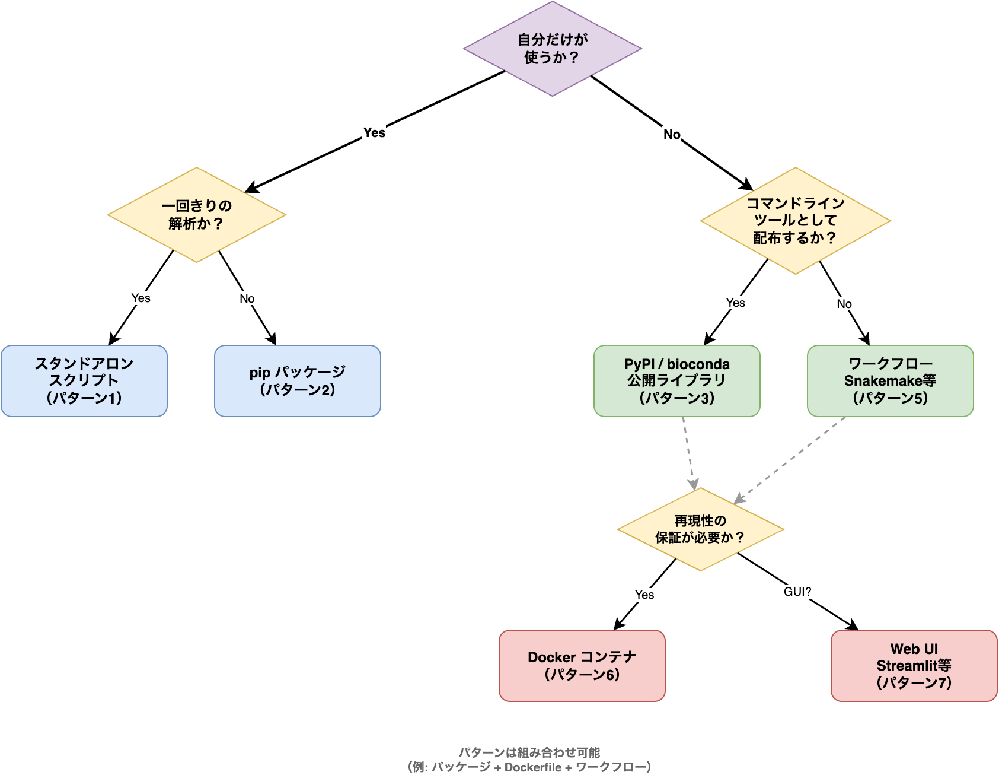
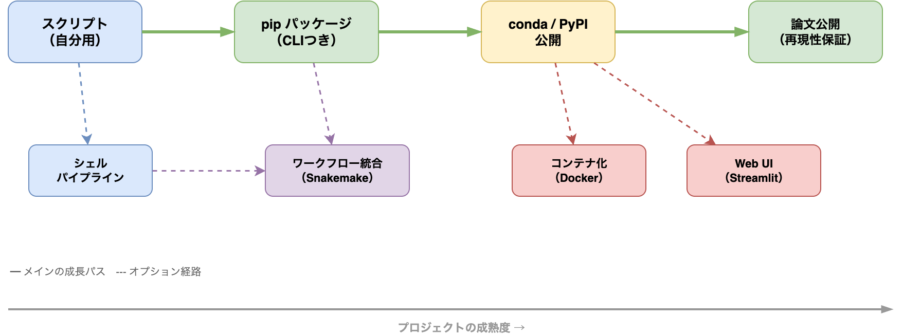

# §10 ソフトウェア成果物の設計 — スクリプトからパッケージまで

[§9 デバッグの技術 — tracebackから最小再現例まで](./09_debug.md)までで、コードを正しく保ち、問題を特定するための仕組みを学んだ。テストがあり、リンターが走り、デバッグの技術がある——しかし、そもそも「何を作るのか」が定まっていなければ、これらの仕組みも十分に機能しない。

開発を始める前に決めるべき最も重要なことの一つが、**成果物の形式**である。「単発のスクリプトなのか、pip installできるパッケージなのか、Snakemakeのワークフローなのか」——これを決めないままAIエージェントに「作って」と指示すると、的外れなプロジェクト構成が生成される。逆に、プロジェクト設定ファイル（CLAUDE.md / AGENTS.md）に「このプロジェクトはpipインストール可能なライブラリとして公開する」と一行書くだけで、エージェントが生成するコードの構造は大きく変わる。

本章では、バイオインフォマティクスでよく使われる9つの成果物パターンを整理し、それぞれの特徴と選び方を示す。続いて、pipパッケージの標準的なディレクトリ構成、設定管理、エラーハンドリングの作法を学ぶ。最後に、小さなスクリプトから始めて段階的にプロジェクトを成長させる方法を紹介する。

---

## 10-1. 成果物の形式の選択

以下の9つのパターンから、自分の目的に合ったものを選ぶ。複数を組み合わせることもある（例: ライブラリ＋CLIエントリポイント）。

### パターン1: スタンドアロンスクリプト

1つの `.py` ファイルで完結する、最も手軽な形式である。

**向いている場面:**

- 一回きりの解析や使い捨てスクリプト
- 自分しか使わない前処理・変換スクリプト
- 数百行以内の小さな処理

**構成例:**

```
filter_vcf.py          # スクリプト本体
README.md              # 使い方
```

**実行方法:** `python filter_vcf.py --input variants.vcf --min-qual 30`

**プロジェクト設定ファイルへの記述例:**

```
このプロジェクトは単一のPythonスクリプト（filter_vcf.py）。
パッケージ化はしない。argparseでCLIを提供する。
```

スクリプトが大きくなったらパッケージ化を検討する。目安として、500行を超えたら分割を考えるべきである。

---

### パターン2: pipインストール可能なPythonパッケージ

`pip install` でインストールでき、`import mypackage` でライブラリとして使える形式である。CLIエントリポイントも同時に提供できる。本書で扱うパターンの中で最も汎用的であり、多くのプロジェクトの基盤となる。

**向いている場面:**

- 他の人にも使ってほしいツール
- 複数のモジュールに分かれる中〜大規模なプロジェクト
- PyPIで公開したい場合

**構成例:**

```
my_tool/
├── src/my_tool/
│   ├── __init__.py
│   ├── io.py
│   ├── analysis.py
│   ├── cli.py           # CLIエントリポイント
│   └── viz.py
├── tests/
├── pyproject.toml        # ★ これが核心
├── README.md
├── LICENSE
└── .gitignore
```

核心となるのは `pyproject.toml` である[1](https://packaging.python.org/)。プロジェクトのメタデータ、依存関係、ビルド設定をこの1ファイルで一元管理する:

```toml
[project]
name = "my-tool"
version = "0.1.0"
requires-python = ">=3.10"
dependencies = [
    "biopython>=1.80",
    "pysam>=0.22",
    "click>=8.0",
]

[project.scripts]
my-tool = "my_tool.cli:main"    # CLIコマンドの登録
```

インストールと実行:

`python -m pip install .` はパッケージを通常インストールする（site-packagesにコピーされる）。`python -m pip install -e .` は**開発モード**（editable install）で、ソースコードへのリンクが作られるため、コードを編集するとすぐに反映される。開発中は `-e` を使い、配布時は通常インストールを使う。

```bash
python -m pip install .           # ローカルインストール
python -m pip install -e .        # 開発モード（コード変更が即反映）
my-tool align --input reads.fq   # CLIとして実行
```

```python
from my_tool.analysis import run_analysis   # ライブラリとして利用
```

PyPIへの公開:

`build` はソースコード配布物（sdist）とコンパイル済み配布物（wheel）を `dist/` ディレクトリに生成するツールである。`twine` は生成したパッケージをPyPIにアップロードするツールで、実行時にPyPIのAPIトークンによる認証が必要である。

```bash
python -m pip install build twine
python -m build                   # sdist + wheel を生成
twine upload dist/*               # PyPIにアップロード
```

**プロジェクト設定ファイルへの記述例:**

```
このプロジェクトはpipインストール可能なPythonパッケージ。
src layoutを使う。CLIエントリポイントはclickで実装。
pyproject.tomlで依存関係を管理する。
```

---

### パターン3: Condaパッケージ（Bioconda）

`conda install` でインストールできる形式である。バイオインフォマティクスでは Bioconda チャネルで公開するのがデファクトスタンダードである[2](https://doi.org/10.1038/s41592-018-0046-7)。

**向いている場面:**

- C/C++の依存（htslib等）があり pip だけでは解決しにくいとき
- Bioconda エコシステムの一部として公開したいとき
- Conda 環境での再現性を重視するとき

**追加で必要なもの:**

- `meta.yaml`（Conda ビルドレシピ）
- bioconda-recipes リポジトリへのPR

**実装ステップ:**

1. まずパターン2（pipパッケージ）を完成させる
2. PyPIに公開する
3. `meta.yaml` を書いて bioconda-recipes にPRを出す

Conda パッケージ化はパターン2の上に成り立つ。いきなり Conda だけを目指さず、まず pip パッケージとして動く状態を作ることが重要である。

> **🧬 コラム: Biocondaへのパッケージ公開**
>
> Bioconda はバイオインフォマティクスソフトウェアの最大のパッケージリポジトリであり、1万以上のパッケージが登録されている[2](https://doi.org/10.1038/s41592-018-0046-7)。公開の手順は以下のとおりである:
>
> 1. PyPIに自作ツールを公開する（パターン2）
> 2. [bioconda-recipes](https://github.com/bioconda/bioconda-recipes) リポジトリをフォークする
> 3. `recipes/my-tool/meta.yaml` を作成する
> 4. PRを出し、Bioconda のボットとレビュアーの指摘に対応する
> 5. マージされると `conda install -c bioconda my-tool` で世界中から利用可能になる
>
> `meta.yaml` のテンプレートは Bioconda のドキュメントに用意されている。AIエージェントに「Bioconda用のmeta.yamlを書いて」と指示すれば、`pyproject.toml` の情報をもとに雛形を生成してくれる。ただし、ライセンス情報やテストコマンドの記述は自分で確認すること。

---

### パターン4: シェルスクリプトパイプライン

複数のコマンド（既存ツール＋自作スクリプト）をシェルスクリプトでつなぐ形式である。

**向いている場面:**

- 既存ツール（samtools, STAR, featureCounts等）を順番に実行する定型パイプライン
- 手動で毎回コマンドを打つのが面倒になったとき
- ワークフロー言語を導入するほど複雑でない場合

**構成例:**

```
pipeline/
├── run_rnaseq.sh         # メインのパイプラインスクリプト
├── scripts/
│   ├── filter_lowqual.py # 自作の前処理スクリプト
│   └── summarize.py      # 結果集計
├── config.sh             # パラメータ設定
└── README.md
```

**実装のコツ:**

- `set -euo pipefail` を必ず先頭に書く（エラー時に即停止）
- パラメータは `config.sh` で外部化する
- ログをファイルに保存する（`2>&1 | tee log.txt`）
- 各ステップの成功・失敗をチェックする

**プロジェクト設定ファイルへの記述例:**

```
このプロジェクトはBashパイプライン。scripts/にPython補助スクリプトを置く。
config.shでパラメータを管理する。set -euo pipefail必須。
```

サンプル数が多い場合や条件分岐が複雑な場合は、次のパターン5（ワークフロー言語）への移行を検討する。

---

### パターン5: ワークフロー言語（Snakemake / Nextflow）

依存関係の自動解決、並列実行、途中からの再開機能を持つ本格的なパイプラインである[3](https://doi.org/10.12688/f1000research.29032.2)[4](https://doi.org/10.1038/nbt.3820)。

**向いている場面:**

- 多サンプル処理(10サンプル以上)
- ステップ間の依存関係が複雑
- HPC上での並列実行が必要
- 中間結果からの再開が必要
- 他の研究者が再現実行する想定

**構成例**（Snakemake）**:**

```
workflow/
├── Snakefile              # ワークフロー定義
├── config/
│   └── config.yaml        # パラメータ
├── rules/
│   ├── mapping.smk        # マッピングルール
│   ├── quantification.smk # 定量ルール
│   └── qc.smk            # QCルール
├── scripts/
│   ├── deseq2.py         # カスタム解析スクリプト
│   └── plot_volcano.py
├── envs/
│   └── mapping.yaml       # conda環境定義
└── README.md
```

**プロジェクト設定ファイルへの記述例:**

```
このプロジェクトはSnakemakeワークフロー。
ルールはrules/に分割する。各ルールにconda環境を指定する。
configはconfig/config.yamlで管理する。
```

**パターン4からの移行サイン:**

- サンプルごとにコマンドをコピペしている → ワイルドカードで解決
- 途中で失敗したら最初からやり直し → `--rerun-incomplete` で途中再開
- HPCのジョブ管理が手動 → profile / executor / cluster 実行機能で自動化

ワークフロー言語の詳細は[§14 解析パイプラインの自動化](./14_workflow.md)で扱う。

---

### パターン6: Dockerコンテナ / Apptainerイメージ

実行環境ごとパッケージングして配布する形式である。詳細は[§15 コンテナによるソフトウェア環境の再現](./15_container.md)で扱う。

**向いている場面:**

- 依存関係が複雑で、インストール手順が再現しにくい
- 異なる環境（ローカル、HPC、クラウド）で同一の実行環境を保証したい
- 論文の再現性を完全に保証したい

**他のパターンとの組み合わせ:**

- パターン2（pipパッケージ）をDockerでラップ
- パターン5（Snakemake）の各ルールにコンテナを指定（`container:` ディレクティブ）

**プロジェクト設定ファイルへの記述例:**

```
このプロジェクトはDockerコンテナとして配布する。
ベースイメージはMiniforge3系。Dockerfileをルートに置く。
```

コンテナは単独の成果物というよりも、他のパターンの「届け方」を補強するレイヤーとして機能する。

---

### パターン7: Jupyter Notebook（解析レポート）

コード、実行結果、解説文をまとめた対話的ドキュメントである。

**向いている場面:**

- 探索的データ解析（Exploratory Data Analysis; EDA）
- 解析結果のレポート・共有
- チュートリアルやデモ

**重要な原則:**

- Notebookは**解析の最終レポート**としては使える
- しかし**再利用可能なツール**としてはNotebookを公開しない
  - ロジックが固まったら `.py` に抽出してライブラリ化する
  - Notebookは「呼ぶ側」にとどめる

**プロジェクト設定ファイルへの記述例:**

```
このプロジェクトはJupyter Notebookによる解析レポート。
共通ロジックはsrc/に抽出し、NotebookからはimportしてGlueコードのみ書く。
```

Notebookの中に複雑な関数定義やデータ処理ロジックを書き始めたら、それはライブラリ化のサインである。

> このロジック分離原則の思想的背景——文芸的プログラミング（Literate Programming）——については[§18-1 Markdownの習得](./18_documentation.md#18-1-markdownの習得)で詳しく解説する。

---

### パターン8: Webアプリ（Streamlit / Gradio）

非プログラマーでもブラウザから使えるGUIを提供する形式である。

**向いている場面:**

- 共同研究者（実験系）に解析ツールを使ってもらいたいとき
- パラメータを変えながらインタラクティブに結果を確認したいとき
- デモやプレゼンテーション

**構成例:**

```
my_app/
├── app.py                # Streamlitアプリ本体
├── src/my_tool/          # ロジック（パターン2と同じ）
│   ├── analysis.py
│   └── viz.py
├── pyproject.toml
├── requirements.txt
└── README.md
```

**実装のコツ:**

- **ロジックとUIを分離する** — `app.py` はGlueコードのみ。解析ロジックは `src/` に置く
- Streamlitは `pip install streamlit` → `streamlit run app.py` で起動
- Gradioは機械学習モデルのデモに特に適している

**プロジェクト設定ファイルへの記述例:**

```
このプロジェクトはStreamlitアプリ。app.pyにUIコードを書き、
解析ロジックはsrc/my_tool/に分離する。UIとロジックを混ぜない。
```

Webアプリは「届け方」であり「作り方」ではない。まずパターン2でロジックを作り、それをStreamlitで包む、という順序で進める。

---

### パターン9: コンパイル済みバイナリ

Pythonがインストールされていない環境でも動く実行ファイルとして配布する形式である。

**向いている場面:**

- 配布先にPython環境がない（稀だがある）
- ユーザーにpipやcondaの操作を求めたくないとき
- GitHub Releasesでワンバイナリを配布したいとき

**主なツール:**

- **PyInstaller** — 最も広く使われる。`pyinstaller --onefile my_tool.py` で単一バイナリ生成
- **Nuitka** — PythonコードをCにコンパイル。PyInstallerより高速な実行ファイルを生成
- **Shiv / PEX** — Python zipappとしてパッケージ（Pythonは必要だがpip不要）

**注意点:**

- バイナリサイズが大きくなりがち（数十〜数百MB）
- OS/アーキテクチャごとにビルドが必要（Linux, macOS, Windows）
- GitHub Actionsでクロスプラットフォームビルドを自動化するのがベストプラクティス
- バイオインフォマティクスでは稀なパターンである。多くの場合condaやコンテナのほうが適切

**プロジェクト設定ファイルへの記述例:**

```
このプロジェクトはPyInstallerで単一バイナリとして配布する。
GitHub Actionsでlinux/macOSのバイナリを自動ビルドしてReleasesに添付する。
```

#### エージェントへの指示例

成果物の形式をプロジェクト設定ファイルに明記するだけで、AIエージェントが生成するコードの構造は劇的に変わる。プロジェクトの最初にこの情報を伝えることが重要である:

> 「このプロジェクトはpipインストール可能なPythonパッケージとして設計してください。src layoutを使い、pyproject.tomlで依存関係を管理してください。CLIエントリポイントをclickで実装してください」

既存のスクリプトの形式を変換する場合:

> 「この単一スクリプト（filter_vcf.py, 400行）をpipインストール可能なパッケージにリファクタリングしてください。src layoutでディレクトリを構成し、入出力・フィルタリングロジック・CLIをモジュールに分割してください」

プロジェクト構成の相談から始める場合:

> 「RNA-seqの発現定量パイプラインを作りたい。STAR → featureCounts → DESeq2の流れで、10サンプル程度を処理する。最適な成果物の形式とプロジェクト構成を提案してください」

---

## 10-2. どのパターンを選ぶか — 判断フローチャート

9つのパターンを前に迷ったときは、以下のフローチャートで絞り込む:



### よくある組み合わせパターン

単一のパターンだけでは要件を満たせないことも多い。以下は実際のプロジェクトでよく見られる組み合わせである:

| 組み合わせ | パターン | 適した場面 |
|---|---|---|
| ライブラリ＋CLI＋コンテナ | 2 + 6 | 最も汎用的。配布と再現性を両立 |
| ワークフロー＋コンテナ | 5 + 6 | 論文再現性に最適 |
| ライブラリ＋Streamlit | 2 + 8 | 共同研究者向けのGUIツール |
| ライブラリ＋Bioconda | 2 + 3 | Biocondaエコシステム統合 |

### エージェントへの最初の指示に含めるべきこと

プロジェクトを始めるとき、最初の指示に「成果物の形式」を含めると、エージェントは適切なプロジェクト構成、`pyproject.toml`、エントリポイント設計を最初から考慮した計画を立てる:

```
> /plan
> FASTQファイルのクオリティフィルタリングツールを作りたい。
> 成果物の形式: pipインストール可能なPythonパッケージ（CLIつき）
> 対象ユーザー: ラボのメンバー
> インタビューして仕様を固めて。
```

「成果物の形式」を最初に伝えることで、エージェントは `pyproject.toml`、エントリポイント設計、ディレクトリ構成を最初から考慮した計画を立てる。

#### エージェントへの指示例

形式の選択そのものをエージェントに相談することもできる。プロジェクトの要件を伝えれば、適切なパターンを提案してくれる:

> 「ChIP-seqのピークコール結果を可視化するツールを作りたい。実験系の共同研究者がパラメータを変えながら結果を確認できるようにしたい。最適な成果物の形式を提案してください」

複数パターンの組み合わせを設計する場合:

> 「バリアントフィルタリングのライブラリを作った。これを(1)コマンドラインから使えて、(2) biocondaで公開でき、(3) Dockerコンテナとしても配布できるようにしたい。プロジェクト構成を設計してください」

---

## 10-3. ディレクトリ構成 — pipパッケージの標準レイアウト

パターンごとの構成例は§10-1で示した。ここでは、最も基本となるパターン2（pipパッケージ）の標準的なディレクトリ構成を詳しく見る。

### src layout

Pythonパッケージのディレクトリ構成には、**flat layout**と**src layout**の2つの流派がある[1](https://packaging.python.org/)。本書では**src layout**を推奨する:

```
my_project/
├── src/my_package/     # メインコード（src/ の中にパッケージを置く）
│   ├── __init__.py     # パッケージの初期化
│   ├── io.py           # 入出力モジュール
│   ├── analysis.py     # 解析ロジック
│   ├── cli.py          # CLIエントリポイント
│   └── viz.py          # 可視化
├── tests/              # テストコード
│   ├── conftest.py     # 共通フィクスチャ
│   ├── test_io.py
│   └── test_analysis.py
├── data/               # テスト用の小さなデータのみ
├── results/            # 出力ディレクトリ（.gitignoreで除外）
├── pyproject.toml      # プロジェクト設定の核心
├── README.md           # 使い方の説明
├── CHANGELOG.md        # 変更履歴
├── LICENSE             # ライセンス
├── Dockerfile          # コンテナ定義（必要に応じて）
└── .gitignore          # Git除外設定
```

src layoutの利点は、**未インストールのパッケージが誤ってインポートされない**ことである。flat layout（プロジェクトルートに直接 `my_package/` を置く方法）では、テスト時にインストールされたバージョンではなくローカルのソースが優先されてしまい、「テストは通るがインストール後に動かない」という問題が起きうる。src layoutではこの問題が構造的に排除される[5](https://hynek.me/articles/testing-packaging/)。

### 各ファイル・ディレクトリの役割

| パス | 役割 |
|---|---|
| `src/my_package/` | パッケージ本体。全てのPythonコードはここに置く |
| `src/my_package/__init__.py` | パッケージの公開APIを定義。バージョン番号の記載にも使う |
| `tests/` | テストコード。パッケージとは独立したディレクトリに配置する |
| `tests/conftest.py` | pytestの共通フィクスチャ（[§8](./08_testing.md)参照） |
| `data/` | テストデータのみ。本番データは絶対に含めない |
| `results/` | 出力ディレクトリ。`.gitignore` に追加してGitの追跡対象から除外する |
| `pyproject.toml` | プロジェクトのメタデータ、依存関係、ビルド設定の一元管理（[§6](./06_dev_environment.md)参照） |
| `LICENSE` | ライセンスファイル。オープンソースで公開するなら必須（[§7](./07_git.md)参照） |

> **🤖 コラム: 機械学習プロジェクトのディレクトリ構成**
>
> 機械学習プロジェクトでは、上記の標準構成に加えて以下のディレクトリが追加されることが多い:
>
> ```
> ml_project/
> ├── src/my_package/      # 標準構成と同じ
> ├── notebooks/           # 探索的解析用のNotebook
> ├── models/              # 学習済みモデルの保存先（.gitignoreで除外）
> ├── configs/             # ハイパーパラメータ設定（YAML）
> ├── experiments/         # 実験ログ（wandb等が自動生成）
> └── data/
>     ├── raw/             # 生データ（変更しない）
>     ├── processed/       # 前処理済みデータ
>     └── external/        # 外部データソース
> ```
>
> `data/` をさらに `raw/`、`processed/`、`external/` に分けるのが定番である。`raw/` のデータは一切変更せず、前処理の結果は `processed/` に保存する。これにより、前処理を何度でもやり直せる。大規模なデータやモデルはGit LFS（[§7](./07_git.md)参照）やクラウドストレージで管理する。

#### エージェントへの指示例

プロジェクトの初期構成をエージェントに生成させるとき、ディレクトリ構成を明示すると無駄な手戻りを防げる:

> 「src layoutでPythonパッケージの初期構成を作ってください。パッケージ名はbiofilter。pyproject.toml、\_\_init\_\_.py、空のモジュール（io.py, analysis.py, cli.py）、testsディレクトリ、.gitignoreを含めてください」

既存のプロジェクトの構成を整理する場合:

> 「このプロジェクトのディレクトリ構成を確認して、src layoutの標準構成に合っているか評価してください。改善点があれば指摘してください」

### 設定ファイルの階層構造 — ディレクトリ単位のルール設定

[§0-3](./00_ai_agent.md#0-3-プロジェクト設定ファイルclaudemd--agentsmd)で、プロジェクトのルートに設定ファイル（CLAUDE.md / AGENTS.md）を置く方法を学んだ。ここではその**発展的な使い方**として、設定ファイルの階層構造とメモリ機能を紹介する。

#### ディレクトリごとの設定ファイル

プロジェクトが成長すると、ディレクトリによって異なるルールを適用したい場面が出てくる。たとえば、`src/` のコードにはtype hintを必須にしたいが、`scripts/` の使い捨てスクリプトでは省略を許容したい——といった使い分けである。

設定ファイルをサブディレクトリにも配置すると、エージェントはそのディレクトリで作業するときにルートの設定に加えてサブディレクトリの設定も読み込む。

```
my_project/
├── CLAUDE.md              # プロジェクト全体のルール
├── src/
│   └── CLAUDE.md          # src/ 固有のルール（型ヒント必須、docstring必須等）
├── tests/
│   └── CLAUDE.md          # tests/ 固有のルール（fixtureの使い方、テスト命名規則等）
└── scripts/
    └── CLAUDE.md          # scripts/ 固有のルール（型ヒント省略可、簡易な構成可等）
```

ルールの適用順は「一般→具体」の順である。`src/parser.py` を編集する際は、ルートの `CLAUDE.md` が先に読まれ、次に `src/CLAUDE.md` が読まれる。より具体的な（深い）設定がより一般的な（浅い）設定を補完する。

| | Claude Code CLI | Codex CLI |
|--|-------------|-----------|
| ルートの設定 | `CLAUDE.md` | `AGENTS.md` |
| サブディレクトリの設定 | 各ディレクトリに `CLAUDE.md` | 各ディレクトリに `AGENTS.md` |
| 個人設定（Git管理外） | `.claude/settings.json` | `.codex/config.toml` |
| グローバル設定 | `~/.claude/CLAUDE.md` | `~/.codex/AGENTS.md` |

#### 設定のスコープ

設定ファイルには3つのスコープがある:

1. **グローバル設定**（`~/.claude/CLAUDE.md` / `~/.codex/AGENTS.md`）— すべてのプロジェクトに適用される個人設定。「常に日本語で会話する」「コミットメッセージは英語で書く」等
2. **プロジェクト設定**（リポジトリルートの `CLAUDE.md` / `AGENTS.md`）— §0-3で学んだ基本の設定。リポジトリにコミットし、チーム全体で共有する
3. **ディレクトリ設定**（サブディレクトリの `CLAUDE.md` / `AGENTS.md`）— 特定ディレクトリだけに適用されるルール

#### メモリ機能

Claude Code CLIには**メモリ機能**がある。セッション間で記憶を持続させ、ユーザーの好みやプロジェクトの文脈を蓄積する仕組みである。「このプロジェクトではBED形式の座標系を使う」「テストは必ずfixtureを使う」等の情報を明示的に記憶させると、セッションをまたいでも一貫した振る舞いが得られる。

#### エージェントへの指示例

> 「このプロジェクトの `src/` と `tests/` それぞれに CLAUDE.md を作成して。`src/` では型ヒントとdocstring必須、`tests/` ではpytestのfixtureを使うルールを書いて」

> 「グローバル設定を確認して。私の個人設定として『常にruffでフォーマットしてからコミットする』を追加して」

---

## 10-4. 設定管理

バイオインフォマティクスのツールには、しばしば多くのパラメータがある。リード品質の閾値、マッピングのミスマッチ許容数、フィルタリング条件——これらをコード内にハードコーディングするのは、[§1 設計原則 — 良いコードとは何か](./01_design.md)で学んだ保守性の観点から避けるべきである。

### ハードコーディングの問題

以下は典型的なアンチパターンである:

```python
# ❌ ハードコーディング: パラメータの変更にコード修正が必要
def filter_variants(vcf_path: str) -> list[dict]:
    min_qual = 30          # 品質スコアの閾値
    min_depth = 10         # リード深度の閾値
    output_dir = "/home/user/results"  # 出力先
    ...
```

この問題点:

- パラメータを変えるたびにコードを編集する必要がある
- 異なるデータセットに異なるパラメータを使い分けにくい
- どのパラメータで実行したかの記録が残らない

### 設定ファイルによる外部化

パラメータは設定ファイル（YAMLまたはTOML）で外部化する[6](https://12factor.net/):

```yaml
# config.yaml
filtering:
  min_qual: 30
  min_depth: 10
  max_missing_rate: 0.1

output:
  directory: results
  format: vcf
```

これを読み込むコード:

```python
# scripts/ch10/config_example.py
from pathlib import Path
from typing import Any

import yaml


def load_config(config_path: Path) -> dict[str, Any]:
    """YAML設定ファイルを読み込み、デフォルト値とマージする."""
    defaults: dict[str, Any] = {
        "filtering": {
            "min_qual": 20,
            "min_depth": 5,
            "max_missing_rate": 0.2,
        },
        "output": {
            "directory": "results",
            "format": "vcf",
        },
    }

    if config_path.exists():
        with open(config_path) as f:
            user_config = yaml.safe_load(f) or {}
        # ユーザー設定でデフォルトを上書き
        for section, values in user_config.items():
            if section in defaults and isinstance(values, dict):
                defaults[section].update(values)
            else:
                defaults[section] = values

    return defaults
```

ポイントはデフォルト値を関数内に定義し、設定ファイルの値で上書きする2層構造である。設定ファイルが存在しなくてもデフォルト値で動作するため、ユーザーは設定を変更したい項目だけを記述すればよい。

### コマンドライン引数による上書き

設定ファイルのパラメータをコマンドライン引数で上書きできるようにする。これにより、設定ファイルをベースにしつつ、一時的にパラメータを変更できる。優先順位は:

```
コマンドライン引数 > 設定ファイル > デフォルト値
```

この3層構造は、[§11 コマンドラインツールの設計と実装](./11_cli.md)で詳しく扱う。

### 環境変数による秘密情報の管理

APIキーやデータベースのパスワードなどの秘密情報は、設定ファイルではなく環境変数で管理する[6](https://12factor.net/):

```python
import os

# ✅ 環境変数から秘密情報を取得
api_key = os.environ.get("NCBI_API_KEY")
if api_key is None:
    raise ValueError(
        "環境変数 NCBI_API_KEY が設定されていません。"
        "NCBIのAPIキーを取得して設定してください: "
        "export NCBI_API_KEY='your-key-here'"
    )
```

秘密情報を設定ファイルやコードに書いてGitにコミットすると、公開リポジトリを通じて漏洩するリスクがある。[§7 Git入門](./07_git.md)で学んだ `.gitignore` に `.env` ファイルを追加し、秘密情報がリポジトリに混入しないようにする。

### デフォルト値の設計

良いデフォルト値は、ユーザーが設定を変更しなくても「まず動く」状態を作る。以下の原則に従う:

1. **安全側に倒す** — フィルタリングの閾値は厳しめにする（偽陽性より偽陰性のほうが安全）
2. **一般的なユースケースに合わせる** — 最もよく使われるパラメータをデフォルトにする
3. **ドキュメントに明記する** — デフォルト値とその根拠を `--help` やREADMEに記載する

#### エージェントへの指示例

設定管理の実装をエージェントに依頼するとき、優先順位と秘密情報の扱いを明示する:

> 「このツールの設定管理を実装してください。config.yamlで基本パラメータを管理し、コマンドライン引数で上書きできるようにしてください。優先順位はCLI引数 > 設定ファイル > デフォルト値です。APIキーは環境変数から読む設計にしてください」

既存コードからハードコーディングを除去する場合:

> 「このスクリプト内のハードコーディングされた閾値やファイルパスを洗い出して、config.yamlとコマンドライン引数で設定できるようにリファクタリングしてください。デフォルト値は現在の値をそのまま使ってください」

バイオインフォマティクス特有の注意として、ゲノム解析ツールはパラメータが多くなりがちである。すべてのパラメータをCLI引数に展開すると `--help` が読めなくなるため、頻繁に変えるパラメータだけをCLI引数に、残りは設定ファイルに集約するのが実用的である。

---

## 10-5. エラーハンドリング

バイオインフォマティクスの解析パイプラインでは、入力ファイルの不備、フォーマットの不整合、計算の異常値など、エラーが発生する場面が多い。適切なエラーハンドリングは、問題を早期に発見し、ユーザーに分かりやすく伝えるために不可欠である。

### 例外の使い分け

Pythonの標準例外を適切に使い分ける[7](https://docs.python.org/3/tutorial/errors.html):

| 例外 | 用途 | バイオインフォでの例 |
|---|---|---|
| `ValueError` | 値が不正 | 品質スコアが負の値、不正な塩基文字 |
| `FileNotFoundError` | ファイルが見つからない | 入力FASTAファイルが存在しない |
| `TypeError` | 型が不正 | 文字列を期待する引数に数値が渡された |
| `RuntimeError` | 実行時の一般的なエラー | 外部ツールの実行失敗 |

プロジェクト固有のエラーには**カスタム例外**を定義する:

```python
# scripts/ch10/error_handling.py


class BiofilterError(Exception):
    """biofilterパッケージの基底例外."""


class InvalidSequenceError(BiofilterError):
    """不正な塩基配列が検出された場合の例外."""

    def __init__(self, sequence: str, position: int, char: str) -> None:
        self.sequence = sequence
        self.position = position
        self.char = char
        super().__init__(
            f"不正な塩基文字 '{char}' が位置 {position} で検出されました。"
            f"許容される文字: A, T, G, C, N"
        )


class QualityThresholdError(BiofilterError):
    """品質スコアが閾値を下回った場合の例外."""

    def __init__(self, score: float, threshold: float) -> None:
        self.score = score
        self.threshold = threshold
        super().__init__(
            f"品質スコア {score:.1f} が閾値 {threshold:.1f} を下回っています"
        )
```

カスタム例外の基底クラス（`BiofilterError`）を定義しておくと、呼び出し側で `except BiofilterError` とするだけでパッケージ固有のエラーをまとめて捕捉できる。

### 早期リターン（ガード節）パターン

関数の先頭で不正な入力を弾く「ガード節」パターンは、コードの読みやすさを大幅に向上させる:

```python
from pathlib import Path

from Bio import SeqIO


def validate_fasta(fasta_path: Path) -> list[str]:
    """FASTAファイルを検証し、配列IDのリストを返す.

    Parameters
    ----------
    fasta_path : Path
        検証対象のFASTAファイルのパス

    Returns
    -------
    list[str]
        配列IDのリスト

    Raises
    ------
    FileNotFoundError
        ファイルが存在しない場合
    ValueError
        ファイルが空、または不正なフォーマットの場合
    """
    # ガード節: ファイルの存在確認
    if not fasta_path.exists():
        raise FileNotFoundError(
            f"FASTAファイルが見つかりません: {fasta_path}"
        )

    # ガード節: ファイルサイズの確認
    if fasta_path.stat().st_size == 0:
        raise ValueError(f"FASTAファイルが空です: {fasta_path}")

    # 本処理
    sequence_ids: list[str] = []
    for record in SeqIO.parse(fasta_path, "fasta"):
        sequence_ids.append(record.id)

    # ガード節: 配列の存在確認
    if len(sequence_ids) == 0:
        raise ValueError(
            f"FASTAファイルに配列が含まれていません: {fasta_path}"
        )

    return sequence_ids
```

ガード節のポイント:

1. 関数の先頭に集約する
2. 条件を満たさない場合は即座に例外を投げる
3. ネストを深くしない（`if-else` の連鎖を避ける）

### ユーザーに分かりやすいエラーメッセージ

エラーメッセージは「何が起きたか」だけでなく「どうすればよいか」まで伝える:

```python
# ❌ 不親切なエラーメッセージ
raise ValueError("Invalid input")

# ✅ 親切なエラーメッセージ
raise ValueError(
    f"入力ファイル '{input_path}' のフォーマットが不正です。"
    f"FASTA形式（.fa, .fasta）のファイルを指定してください。"
    f"ファイルの先頭が '>' で始まっているか確認してください。"
)
```

良いエラーメッセージの3要素:

1. **何が起きたか**（事実）
2. **どこで起きたか**（ファイルパス、行番号、パラメータ名）
3. **どうすればよいか**（修正のヒント）

### fail-fastの原則

**fail-fast**（早期失敗）とは、問題を検出した時点で即座にエラーを報告する設計原則である。バイオインフォマティクスの長時間パイプラインでは特に重要になる:

```python
from pathlib import Path


def run_pipeline(config: dict) -> None:
    """パイプラインの実行. 入力の検証を全て先に行う."""
    # ★ 先に全ての入力を検証する（fail-fast）
    input_path = Path(config["input"])
    reference_path = Path(config["reference"])
    output_dir = Path(config["output_dir"])

    if not input_path.exists():
        raise FileNotFoundError(
            f"入力ファイルが見つかりません: {input_path}"
        )
    if not reference_path.exists():
        raise FileNotFoundError(
            f"リファレンスが見つかりません: {reference_path}"
        )
    output_dir.mkdir(parents=True, exist_ok=True)

    # ★ 検証を通過してから処理を開始する
    # （ここで初めて時間のかかる処理が始まる）
    ...
```

12時間かかるパイプラインが11時間目に「リファレンスファイルが見つかりません」と落ちる事態は避けなければならない。入力の検証は処理の最初にまとめて行う。

#### エージェントへの指示例

エラーハンドリングの実装をエージェントに依頼するとき、具体的なパターンを指定する:

> 「この関数にガード節を追加してください。入力ファイルの存在確認、ファイルサイズのチェック、フォーマットの検証を関数の先頭で行い、不正な場合は具体的なエラーメッセージとともに例外を投げてください」

カスタム例外の設計を依頼する場合:

> 「このパッケージ用のカスタム例外階層を設計してください。基底例外クラスを作り、入力エラー、フォーマットエラー、外部ツール実行エラーをそれぞれ派生クラスとして定義してください。エラーメッセージには何が起きたか・どこで起きたか・どうすればよいかの3点を含めてください」

パイプラインのfail-fast設計を依頼する場合:

> 「このパイプラインの先頭に入力バリデーション関数を追加してください。全ての入力ファイル、リファレンスファイル、必要な外部ツールの存在を処理開始前にチェックし、問題があれば全てのエラーをまとめて報告してください」

---

## 10-6. 段階的な成長パス — スクリプトから育てる

最初から完璧な形式を目指す必要はない。多くの研究ツールは以下のような段階を経て成熟する:



### 成長のタイミングの目安

| サイン | 次のステップ |
|---|---|
| スクリプトが500行を超えた | パッケージ化を検討 |
| `python script.py` を何度もコピペ | CLIエントリポイントを作る |
| 「あのスクリプトどこだっけ」が頻発 | `pip install -e .` で開発モード |
| 共同研究者から「使い方がわからない」 | README + Streamlit GUI |
| 論文投稿時 | Dockerfile + ワークフロー + バージョン固定 |
| 他のラボから「使いたい」 | PyPI/bioconda公開 |

重要なのは、これらの移行を**一度に全部やろうとしない**ことである。[§1 設計原則 — 良いコードとは何か](./01_design.md)で学んだ**YAGNI**（You Ain't Gonna Need It）の原則に従い、必要になった時点で次の段階に進めばよい。

### AIエージェントとの連携によるリファクタリング

パターンの移行は、AIエージェントが特に力を発揮する場面である。エージェントはテストを書きながら段階的にリファクタリングする計画を立てることができる。一気に書き換えるより、[§8 コードの正しさを守るテスト技法](./08_testing.md)で学んだテストで保護しながら少しずつ移行するのが安全である。

#### エージェントへの指示例

スクリプトからパッケージへの移行をエージェントに依頼する:

> 「このスクリプト（filter_vcf.py, 600行）をpipインストール可能なパッケージにリファクタリングしたい。現在の機能を壊さずに段階的に移行する計画を立ててください。まずテストを書いてから移行を始めてください」

成長のタイミングを判断してもらう場合:

> 「このプロジェクトの現状を分析して、次に取るべきステップを提案してください。パッケージ化、CLI化、ドキュメント化、テスト追加のうち、今最も効果が高いものはどれですか？」

論文投稿に向けた再現性パッケージングを依頼する場合:

> 「この解析パイプラインを論文投稿用に整備したい。Dockerfile、requirements.txtのバージョン固定、実行手順のREADME、テストデータでの再現テストを追加してください」

---

## まとめ

本章では、成果物の形式の選択からプロジェクト設計の基本まで、「何を作るか」を決めるための知識を学んだ。

| 概念 | ツール・形式 | 目的 |
|---|---|---|
| 成果物の形式選択 | 9パターンの分類 | プロジェクトの方向性を最初に定める |
| パッケージ管理 | pyproject.toml / pip | 再利用可能な形でコードを配布する |
| ワークフロー管理 | Snakemake / Nextflow | 多段階の解析パイプラインを自動化する |
| コンテナ化 | Docker / Apptainer | 実行環境ごと再現可能にする |
| ディレクトリ構成 | src layout | コードの構造を標準化し保守性を高める |
| 設定管理 | YAML / TOML + CLI引数 | ハードコーディングを排除し再現性を確保する |
| エラーハンドリング | カスタム例外 + ガード節 | 問題を早期に発見しユーザーに伝える |
| 段階的成長 | スクリプト → パッケージ → 公開 | 必要に応じてプロジェクトを育てる |

成果物の形式を最初に決めてプロジェクト設定ファイルに明記することで、AIエージェントは適切な構成のコードを最初から生成できる。「まず形を決め、それからコードを書く」——この順序が、手戻りのない開発の出発点である。

次章の[§11 コマンドラインツールの設計と実装](./11_cli.md)では、パッケージのユーザーインターフェースであるコマンドラインツールの設計作法を学ぶ。argparse、click、typerの使い分け、プログレス表示、ロギングなど、使いやすいCLIを作るための実践的なテクニックを扱う。

---

## 演習問題

本章の内容を、エージェントとの協働を通じて実践する課題である。

### 演習 10-1: 成果物パターンの選択 **[設計判断]**

以下の3つのシナリオについて、それぞれ最適な成果物パターン（スクリプト / CLIパッケージ / コンテナ化パイプライン）を選び、その理由を述べよ。

- (a) 自分だけが使うワンタイムの発現量解析。結果を確認したらもう使わない
- (b) 共同研究者に渡すVCFフィルタリングツール。相手のマシンで動かす必要がある
- (c) 論文公開に伴い、査読者や読者が再現できるようにするRNA-seqパイプライン

（ヒント）ユーザーの数と再利用頻度に応じて、スクリプト→CLIパッケージ→コンテナ化パイプラインの順に検討する。(a)は再利用しないなら過剰な構造化は不要、(b)は相手の環境で`pip install`できる形が望ましい、(c)は実行環境ごと再現可能にする必要がある。

### 演習 10-2: プロジェクト構造の評価 **[レビュー]**

以下のプロジェクト構造の問題点を指摘し、改善案を提案せよ。

```
my_project/
├── filter_vcf.py
├── parse_gff.py
├── plot_results.py
├── utils.py
├── test_filter.py
├── data.csv
└── README.md
```

具体的に、以下の観点でレビューせよ。

1. ソースコードとテストコードの分離
2. パッケージ管理ファイルの有無
3. データファイルの配置
4. ディレクトリ構造の標準性

（ヒント）src/レイアウト、tests/の分離、pyproject.tomlの有無を確認する。データファイルがソースコードと同階層に置かれている点、テストファイルがソースコードと混在している点も問題である。

### 演習 10-3: スクリプトからパッケージへの移行指示 **[指示設計]**

500行の`filter_vcf.py`（VCFファイルのフィルタリングスクリプト）をpipインストール可能なパッケージに移行するための、エージェントへの指示文を書け。指示文には以下の要素を含めること。

- 移行前にテストを書くステップ
- src/レイアウトへのリファクタリング
- pyproject.tomlの作成
- CLIエントリポイントの設定

（ヒント）「まず現在の機能のテストを書いてから移行を始めて」という安全策を含めることで、移行中の機能破壊を検出できる。一度にすべてを変えず、段階的に進める指示が効果的である。

### 演習 10-4: pyproject.tomlの読解 **[概念]**

以下のpyproject.tomlの各セクションが何を定義しているかを説明せよ。

```toml
[project]
name = "vcf-filter"
version = "0.1.0"
dependencies = ["pysam>=0.22", "click>=8.0"]

[project.scripts]
vcf-filter = "vcf_filter.cli:main"

[build-system]
requires = ["hatchling"]
build-backend = "hatchling.build"

[tool.pytest.ini_options]
testpaths = ["tests"]
```

具体的に、以下の4点を答えよ。

1. `[project]`セクションの役割
2. `[project.scripts]`が定義するもの。`pip install -e .`の後、ターミナルで何が使えるようになるか
3. `[build-system]`の意味
4. `[tool.pytest.ini_options]`の効果

（ヒント）`[project.scripts]`はCLIエントリポイントを定義する。`vcf-filter = "vcf_filter.cli:main"`は、`vcf-filter`コマンドを実行すると`vcf_filter`パッケージの`cli`モジュールの`main`関数が呼ばれることを意味する。

---

## さらに学びたい読者へ

本章で扱ったソフトウェア成果物の設計やプロジェクト構造をさらに深く学びたい読者に向けて、設計思想の原典と実践的なリソースを紹介する。

### 設計原則

- **Wiggins, A. "The Twelve-Factor App".** https://12factor.net/ — ソフトウェア成果物の設計原則として広く参照されるマニフェスト。設定の外部化、ログのストリーム化、依存関係の明示的宣言など、本章で扱った設計方針の理論的背景を理解できる。日本語訳あり: https://12factor.net/ja/ 。

### パッケージングの実践

- **Python Packaging Authority. "Python Packaging User Guide".** https://packaging.python.org/ — pyproject.toml、src-layout、エントリポイントの公式ガイド。本章で扱ったパッケージ構造の最新のベストプラクティスが常に更新されている。
- **Schlawack, H. "Testing & Packaging".** https://hynek.me/articles/testing-packaging/ — Pythonパッケージングの実践的なベストプラクティスを解説した記事。src-layoutの推奨理由やCI/CDとの統合を具体的に説明している。

### リファクタリング

- **Fowler, M. *Refactoring: Improving the Design of Existing Code* (2nd ed.). Addison-Wesley, 2018.** https://www.amazon.co.jp/dp/0134757599 — スクリプトからパッケージへの「成長」の過程で必要になるリファクタリングの技法書。コードの「臭い」を体系化し、改善パターンをカタログ化している。邦訳: 児玉公信ほか訳『リファクタリング 既存のコードを安全に改善する（第2版）』オーム社, 2019.

---

## 参考文献

[1] Python Packaging Authority. "Python Packaging User Guide". [https://packaging.python.org/](https://packaging.python.org/) (参照日: 2026-03-19)

[2] Grüning, B. et al. "Bioconda: sustainable and comprehensive software distribution for the life sciences." *Nature Methods*, 15, 475–476, 2018. [https://doi.org/10.1038/s41592-018-0046-7](https://doi.org/10.1038/s41592-018-0046-7)

[3] Mölder, F. et al. "Sustainable data analysis with Snakemake." *F1000Research*, 10, 33, 2021. [https://doi.org/10.12688/f1000research.29032.2](https://doi.org/10.12688/f1000research.29032.2)

[4] Di Tommaso, P. et al. "Nextflow enables reproducible computational workflows." *Nature Biotechnology*, 35, 316–319, 2017. [https://doi.org/10.1038/nbt.3820](https://doi.org/10.1038/nbt.3820)

[5] Schlawack, H. "Testing & Packaging". [https://hynek.me/articles/testing-packaging/](https://hynek.me/articles/testing-packaging/) (参照日: 2026-03-19)

[6] Wiggins, A. "The Twelve-Factor App". [https://12factor.net/](https://12factor.net/) (参照日: 2026-03-19)

[7] Python Software Foundation. "Errors and Exceptions". [https://docs.python.org/3/tutorial/errors.html](https://docs.python.org/3/tutorial/errors.html) (参照日: 2026-03-19)
