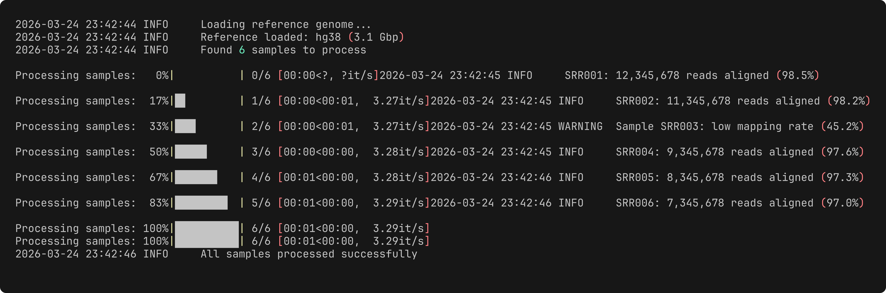

# §11 コマンドラインツールの設計と実装

[§10 ソフトウェア成果物の設計 — スクリプトからパッケージまで](./10_deliverables.md)では、pipパッケージの構成で `cli.py` を配置し、`pyproject.toml` でCLIエントリポイントを登録した。しかし、その `cli.py` の中身——引数をどう設計し、エラーをどう伝え、進捗をどう見せるか——はまだ扱っていない。

エージェントにCLIツールを生成させることは容易だが、生成されたツールがパイプで他のツールと連結できるか、適切な終了コードを返すか、`--help` だけで使い方がわかるかを判断するのは人間の役目である。[§1 設計原則 — 良いコードとは何か](./01_design.md#1-2-unix哲学)で学んだUNIX哲学——テキストストリーム、パイプ、終了コード——はCLIツール設計の理論的基盤である。本章では、その概念をPythonで実装する具体的な技法を学ぶ。ライブラリ選定から始めて、サブコマンド設計、プログレス表示、ロギングまで、使いやすいCLIを作るための実践的なテクニックを一通り扱う。

---

## 11-1. コマンドラインインターフェースの作法

### 良いCLIとは何か

「良いCLI」を一言で表すなら、**`--help` を見ただけで使い方がわかる**ツールである。具体的には以下の性質を持つ:

- **発見可能性**: `--help` に十分な説明があり、ドキュメントを探す必要がない
- **予測可能性**: `-o` は出力、`-v` はverbose——広く使われる慣例に従う
- **パイプ対応**: stdin/stdoutを介して他のツールと組み合わせられる
- **親切なエラーメッセージ**: 何が間違っているか、どう直せばよいかを伝える
- **適切な終了コード**: 成功は0、失敗は非0——[§1-2](./01_design.md#1-2-unix哲学)で学んだUNIXの規約に従う

バイオインフォマティクスのツールは引数が多くなりがちだが、上記の原則を守れば、初めて使うユーザーでも迷わない。

### 3ライブラリのコード対比

PythonでCLIを構築するライブラリは主に3つある。それぞれの位置づけを整理する:

| ライブラリ | 特徴 | 本書での位置づけ |
|---|---|---|
| **Argparse** | 標準ライブラリ。追加インストール不要 | 既存コードで遭遇するため「読むために知っておく」 |
| **Click** | デコレータベース。[§10](./10_deliverables.md)で使用済み | 本書の標準推奨 |
| **Typer** | Click上に構築。型ヒントで引数を定義 | 小規模ツール向けの簡潔な選択肢 |

同じ「GC含量でFASTA配列をフィルタリングする」CLIを3パターンで実装し、比較する。

#### Argparse版

```python
import argparse
import sys

from Bio import SeqIO
from mypackage.stats import gc_content


def parse_args(argv=None):
    parser = argparse.ArgumentParser(
        description="FASTA配列をGC含量でフィルタリングする",
    )
    parser.add_argument(
        "input", nargs="?",
        type=argparse.FileType("r"), default=sys.stdin,
        help="入力FASTAファイル（省略時はstdin）",
    )
    parser.add_argument(
        "-o", "--output",
        type=argparse.FileType("w"), default=sys.stdout,
    )
    parser.add_argument("--min-gc", type=float, default=0.0)
    parser.add_argument("--max-gc", type=float, default=1.0)
    parser.add_argument("-v", "--verbose", action="store_true")
    parser.add_argument(
        "--version", action="version", version="%(prog)s 0.1.0"
    )
    return parser.parse_args(argv)
```

Argparse は標準ライブラリに含まれており追加インストール不要というのが最大の利点である。古くからあるため、既存のバイオインフォツールでも広く使われている[3](https://docs.python.org/3/library/argparse.html)。ただし、コードが冗長になりがちで、サブコマンド定義やバリデーションの記述が煩雑になる。

#### Click版（推奨）

```python
import click
from Bio import SeqIO
from mypackage.stats import gc_content


@click.command()
@click.argument("input_file", type=click.File("r"), default="-")
@click.option("-o", "--output", type=click.File("w"), default="-",
              help="出力ファイル（省略時はstdout）")
@click.option("--min-gc", type=click.FloatRange(0.0, 1.0),
              default=0.0, show_default=True, help="GC含量の下限")
@click.option("--max-gc", type=click.FloatRange(0.0, 1.0),
              default=1.0, show_default=True, help="GC含量の上限")
@click.option("-v", "--verbose", is_flag=True,
              help="デバッグログを表示する")
@click.version_option("0.1.0", prog_name="gc-filter")
def gc_filter(input_file, output, min_gc, max_gc, verbose):
    """FASTA配列をGC含量でフィルタリングする."""
    ...
```

Click はデコレータで引数とオプションを宣言するため、関数シグネチャがそのままインターフェース定義になる[1](https://click.palletsprojects.com/)。`click.FloatRange` による範囲バリデーション、`show_default=True` によるヘルプへのデフォルト値表示など、Argparse では追加実装が必要な機能が組み込みで提供される。[§10](./10_deliverables.md)で `pyproject.toml` に `click>=8.0` を追加済みであるため、本書では Click を一貫して使用する。

#### Typer版

```python
from pathlib import Path
from typing import Annotated, Optional

import typer
from Bio import SeqIO
from mypackage.stats import gc_content

app = typer.Typer(help="FASTA配列をGC含量でフィルタリングする")


@app.command()
def gc_filter(
    input_file: Annotated[Path, typer.Argument(help="入力FASTAファイル")],
    output: Annotated[Optional[Path],
                      typer.Option("-o", "--output")] = None,
    min_gc: Annotated[float,
                      typer.Option(help="GC含量の下限",
                                   min=0.0, max=1.0)] = 0.0,
    max_gc: Annotated[float,
                      typer.Option(help="GC含量の上限",
                                   min=0.0, max=1.0)] = 1.0,
    verbose: Annotated[bool,
                       typer.Option("-v", "--verbose")] = False,
):
    """FASTA配列をGC含量でフィルタリングする."""
    ...
```

Typer は Click の上に構築されたライブラリで、Python の型ヒントから引数定義を自動推論する[2](https://typer.tiangolo.com/)。`Annotated` を使うことで型ヒントとCLI定義を一体化でき、コードが最も簡潔になる。内部では Click が動いているため、Click の知識がそのまま活きる。小規模なツールや、型ヒントを徹底しているプロジェクトに適している。

### ClickによるCLI設計の実践

本節では、本書の標準推奨ライブラリである Click の主要機能を掘り下げる。


#### `@click.argument` vs `@click.option`

Click では位置引数とオプション引数を明確に区別する:

```python
# 位置引数: 必須、名前で指定しない
@click.argument("input_file", type=click.File("r"))

# オプション引数: 省略可能、--名前で指定
@click.option("--min-gc", type=float, default=0.0)
```

**使い分けの指針**: 「何を処理するか」は位置引数、「どう処理するか」はオプション引数にする。バイオインフォCLIでは、入力ファイルが位置引数、フィルタ条件やフォーマット指定がオプション引数になるのが一般的である。

#### 型変換とバリデーション

Click は型変換とバリデーションを宣言的に記述できる:

```python
# ファイルの存在を自動チェック
@click.option("--config", type=click.Path(exists=True))

# 選択肢を制限
@click.option("--format", type=click.Choice(["fasta", "fastq", "tab"]))

# 数値の範囲を制限
@click.option("--min-gc", type=click.FloatRange(0.0, 1.0))
```

不正な値が渡された場合、Click が自動的にエラーメッセージを生成する。`gc-filter --min-gc 1.5` のように範囲外の値を指定すると、`Error: Invalid value for '--min-gc': 1.5 is not in the range 0.0<=x<=1.0.` と表示される。

#### `--help` と `--version`

Click は関数の docstring から `--help` テキストを自動生成する。`@click.version_option` でバージョン表示も追加できる:

```python
@click.command()
@click.version_option("0.1.0", prog_name="gc-filter")
def gc_filter():
    """FASTA配列をGC含量でフィルタリングする.

    INPUT_FILE を読み込み、GC含量が指定範囲内の配列のみを出力する。
    """
```

`--help` の出力が読みやすいツールは、ユーザーの信頼を得る第一歩である。

### サブコマンド設計

ツールが成長して複数の機能を持つようになると、サブコマンド構成が有効である。`git commit`, `git push` のようなパターンだ。Click では `@click.group()` と `@group.command()` で実現する:

```python
@click.group()
@click.option("-v", "--verbose", is_flag=True)
@click.option("--log-level",
              type=click.Choice(["DEBUG", "INFO", "WARNING"]))
@click.pass_context
def cli(ctx, verbose, log_level):
    """配列解析ツール."""
    ctx.ensure_object(dict)
    # グループレベルの共通設定
    setup_logging(level=log_level or ("DEBUG" if verbose else "WARNING"))


@cli.command()
@click.argument("input_file", type=click.File("r"), default="-")
def stats(input_file):
    """配列の統計情報を表示する."""
    ...


@cli.command()
@click.argument("input_file", type=click.File("r"), default="-")
@click.option("--min-gc", type=float, default=0.0)
def filter(input_file, min_gc):
    """GC含量で配列をフィルタリングする."""
    ...
```

これで `seqtool stats input.fasta` や `seqtool filter --min-gc 0.4 input.fasta` のように使える。共通オプション(`--verbose`, `--log-level`)をグループレベルに置くことで、すべてのサブコマンドで一貫したログ設定が使える。

### stdin/stdout対応の実装

[§1-2](./01_design.md#1-2-unix哲学)でテキストストリームとパイプの概念を学んだ。ここでは Click でその実装方法を示す。

鍵は `click.File` 型と `-`（ハイフン）の慣例である:

```python
@click.argument("input_file", type=click.File("r"), default="-")
@click.option("-o", "--output", type=click.File("w"), default="-")
```

`default="-"` とすると、引数省略時にstdin/stdoutが使われる。これにより以下の使い方がすべて動作する:

```bash
# ファイルからファイルへ
gc-filter input.fasta -o output.fasta

# stdinからstdoutへ（パイプ）
cat input.fasta | gc-filter --min-gc 0.4 > output.fasta

# ファイルからstdoutへ
gc-filter input.fasta --min-gc 0.4

# stdinからファイルへ
cat input.fasta | gc-filter -o output.fasta
```

ここで重要なのは、**ログやプログレス情報をstdoutに出してはならない**という原則である。stdoutには結果データのみを流し、それ以外はすべてstderrに出力する。clickでは `click.echo("メッセージ", err=True)` でstderrに書き込める。この棲み分けがパイプラインを正しく機能させる。

### 設定の3層構造の実装

[§10-4 設定管理](./10_deliverables.md#10-4-設定管理)で紹介した3層構造を、clickで実装する方法を示す:

```
コマンドライン引数 > 設定ファイル > デフォルト値
```

この優先順位は、Click の `default` パラメータと設定ファイル読み込みを組み合わせて実現する:

```python
import yaml

def load_config(config_path):
    """設定ファイルを読み込む."""
    defaults = {"min_gc": 0.0, "max_gc": 1.0, "format": "fasta"}
    if config_path and Path(config_path).exists():
        with open(config_path) as f:
            user_config = yaml.safe_load(f) or {}
        defaults.update(user_config)
    return defaults


@click.command()
@click.option("--config", type=click.Path(), default=None,
              help="設定ファイル（YAML）")
@click.option("--min-gc", type=float, default=None,
              help="GC含量の下限（設定ファイルの値を上書き）")
@click.pass_context
def gc_filter(ctx, config, min_gc):
    """3層構造: CLI引数 > 設定ファイル > デフォルト値."""
    cfg = load_config(config)

    # CLI引数がNoneでなければ（明示的に指定されていれば）上書き
    if min_gc is not None:
        cfg["min_gc"] = min_gc
    ...
```

ポイントは、CLIオプションの `default=None` である。`None` が「ユーザーが指定しなかった」ことを意味し、設定ファイルやデフォルト値へのフォールバックを可能にする。この仕組みは、パラメータが増えても一貫したパターンで拡張できる。

#### エージェントへの指示例

CLI設計をエージェントに依頼する際は、入出力の形式、対応したいオプション、パイプ対応の要否を具体的に伝えることが重要である。

> 「clickを使って、FASTAファイルを入力として受け取りGC含量で配列をフィルタリングするCLIツールを実装してください。`--min-gc` と `--max-gc` オプション、`--output` でファイルまたはstdout出力、`--verbose` でデバッグログを出すようにしてください。stdinからのパイプ入力にも対応してください」

> 「このargparseベースのスクリプトをclickに移行してください。引数の構成は変えず、`--help` の出力が改善されるようにしてください」

> 「サブコマンド構成で `seqtool stats` / `seqtool filter` / `seqtool convert` の3つのコマンドを持つCLIを設計してください。共通オプション(`--verbose`, `--log-level`)はグループレベルに置いてください」

CLIツールの設計でエージェントが `print()` をstdoutに出すコードを生成した場合は、「ログやステータス情報はstderrに出力して、stdoutには結果データのみを流してください」と指示するとよい。

---

> **🧬 コラム: バイオインフォCLIツールの設計に学ぶ**
>
> バイオインフォマティクスの代表的なCLIツールには、優れた設計の教科書がつまっている。
>
> **samtools**[8](https://doi.org/10.1093/bioinformatics/btp352)はサブコマンド型の設計で、`samtools view`, `samtools sort`, `samtools index` など20以上のサブコマンドを持つ。すべてのサブコマンドがstdin/stdout対応で、パイプで連結できる:
>
> ```bash
> samtools view -b input.sam | samtools sort | samtools index -
> ```
>
> **bedtools**[9](https://doi.org/10.1093/bioinformatics/btq033)も同様にサブコマンド型で、`bedtools intersect`, `bedtools merge`, `bedtools sort` をパイプで組み合わせる。
>
> **seqkit** は高速な配列操作ツールで、`seqkit stats`, `seqkit grep`, `seqkit seq` などのサブコマンドを提供する。とくに `seqkit stats` の出力はTSVで、他のツールとの連携が容易である。
>
> これらに共通する設計原則は:
>
> - サブコマンド型: 関連する機能を1つのコマンドにまとめる
> - stdin/stdout対応: `-` または引数省略でstdinを受け付ける
> - ログ/プログレスはstderr: 結果データのstdoutを汚さない
> - TSV/カラム出力: 他のツール(`awk`, `cut`, `sort`)との連携を容易にする
>
> 自分のツールを設計する際も、これらの原則に従うとユーザーの学習コストを下げられる。

---

> **🧬 コラム: パラメータ爆発問題**
>
> ゲノム解析ツールは、パラメータが爆発的に多くなりがちである。GATKのHaplotypeCallerは50以上のオプションを持ち、マニュアルを読むだけで一苦労である。すべてをCLI引数にすると `--help` は読みきれない長さになり、ユーザーを圧倒する。
>
> 対処のパターンは2つある:
>
> 1. **頻度で分ける**: 頻繁に変えるパラメータだけCLI引数にし、残りは設定ファイル(YAML/TOML)に入れる。§11-1の3層構造はこのためにある
> 2. **`--preset` パターン**: よく使うパラメータの組み合わせに名前をつけて一括指定する。`bwa mem -x ont2d`（Oxford Nanoporeリード用）や `minimap2 -x map-hifi`（PacBio HiFi用）はこのパターンである
>
> ```python
> @click.option("--preset",
>               type=click.Choice(["wgs", "wes", "amplicon"]),
>               help="解析タイプに応じたデフォルト設定")
> ```
>
> パラメータ数が20を超えたら、設定ファイルか `--preset` の導入を検討すべきタイミングである。

### カスタムコマンド（Agent Skills） — エージェント向けのテンプレート

§11-1では人間が使うCLIツールの設計を学んだ。ここでは視点を変えて、**エージェントに使わせる定型的な指示**をテンプレート化する仕組みを紹介する。[§0-3](./00_ai_agent.md#エージェントの拡張機能--mcpフックカスタムコマンド)で予告した**カスタムコマンド**（Agent Skills）である。

#### 問題: 同じ指示を何度も繰り返す

エージェントとの協働では、同じような指示を何度も繰り返す場面が頻繁にある。

- 「テストを書いて、実行して、カバレッジも確認して」
- 「git diffを確認して、変更内容を要約するコミットメッセージを書いて」
- 「このコードをレビューして、バグの可能性・設計の問題点・テスト不足を指摘して」

CLIツール設計で学んだ「設定の3層構造」を思い出してほしい——頻繁に使う操作はデフォルト値にしてワンコマンドで呼び出せるようにする、という考え方である。カスタムコマンドは、これをエージェントへの指示に適用したものだ。

#### カスタムコマンドの作り方

| | Claude Code CLI | Codex CLI |
|--|-------------|-----------|
| 保存場所 | `.claude/commands/` | プロジェクトルートに `SKILL.md` |
| ファイル形式 | Markdownファイル（1コマンド = 1ファイル） | Markdownファイル |
| 呼び出し方 | `/コマンド名`（スラッシュコマンド） | `$skill-name` |

Claude Code CLIの場合、`.claude/commands/` ディレクトリにMarkdownファイルを置くだけでカスタムコマンドが使えるようになる。

```markdown
<!-- .claude/commands/review.md -->
以下の観点でコードレビューを行ってください:

1. バグの可能性（エッジケース、off-by-oneエラー等）
2. 設計上の問題（SRP違反、不要な複雑さ等）
3. テスト不足（カバーされていないパス）
4. バイオインフォ固有の問題（座標系の混同、ファイル形式の不正等）

問題を発見したら、修正方針も提案してください。
```

このファイルを保存すると、エージェントのセッション中に `/review` と入力するだけで上記の指示が実行される。

#### 実用的なカスタムコマンドの例

バイオインフォマティクスのプロジェクトで役立つカスタムコマンドをいくつか示す。

**テスト実行**（`.claude/commands/test.md`）:

```markdown
以下の手順でテストを実行してください:
1. `pytest tests/ -v --tb=short` でテスト実行
2. 失敗したテストがあれば原因を分析
3. `pytest --cov=src/ tests/` でカバレッジ確認
4. カバレッジが80%未満の場合、不足しているテストを提案
```

**コミット準備**（`.claude/commands/commit.md`）:

```markdown
コミットの準備をしてください:
1. `git diff` で変更内容を確認
2. 変更内容を要約する日本語のコミットメッセージを提案
3. ステージングされていない変更があれば報告
```

#### CLIコマンドとカスタムコマンドの対比

§11-1で設計した人間向けCLIコマンドと、カスタムコマンドを対比すると、同じ設計原則が適用できることがわかる。

| 設計原則 | 人間向けCLI | エージェント向けカスタムコマンド |
|---------|-----------|---------------------------|
| 明確な名前 | `biofilter count --min-qual 30` | `/review`、`/test`、`/commit` |
| 単一責任 | 1コマンド = 1機能 | 1テンプレート = 1タスク |
| デフォルト値 | `--min-qual` のデフォルトは20 | テンプレートに標準的な手順を記載 |
| ヘルプ | `--help` で使い方を表示 | テンプレート冒頭に目的を記載 |

#### エージェントへの指示例

カスタムコマンドの作成自体をエージェントに依頼できる:

> 「`.claude/commands/` にレビュー用のカスタムコマンド `review.md` を作成して。バグ、設計、テスト、バイオインフォ固有の観点でチェックする内容にして」

> 「このプロジェクトで繰り返し使う操作を分析して、カスタムコマンド化すべきものを提案して」

> 「Codex CLI用に、テスト実行とカバレッジ確認を一括で行うSKILL.mdを作成して」

---

## 11-2. プログレス表示とUI

### なぜプログレス表示が必要か

バイオインフォマティクスの処理は時間がかかる。100万リードのFASTQを処理するのに10分、全ゲノムのVCFフィルタリングに30分——こうした待ち時間で「動いているのかフリーズしたのか」がわからないと、ユーザーはCtrl+Cを押してしまう。プログレスバーは、処理が進んでいることを視覚的に伝える最もシンプルな手段である。

### tqdm — 最も手軽なプログレスバー

tqdmは「進捗」を意味するアラビア語に由来するライブラリで[6](https://github.com/tqdm/tqdm)、`for` ループを `tqdm()` で囲むだけでプログレスバーが表示される:

```python
from tqdm import tqdm
from Bio import SeqIO

# 1行追加するだけでプログレスバー付きに
for record in tqdm(SeqIO.parse("large.fasta", "fasta")):
    process(record)
```

FASTAファイルの処理ではレコード数が事前にわからない場合がある。その場合、`total` を明示的に渡すことで残り時間の推定が正確になる:

```python
import subprocess

# wcコマンドで">"の行数を数えてレコード数を推定
result = subprocess.run(
    ["grep", "-c", "^>", "large.fasta"],
    capture_output=True, text=True,
)
total_records = int(result.stdout.strip())

for record in tqdm(SeqIO.parse("large.fasta", "fasta"),
                   total=total_records, desc="処理中"):
    process(record)
```



**重要**: tqdmのプログレスバーはデフォルトでstderrに出力される。これはUNIX哲学に合致しており、stdoutの結果データを汚さない。明示的にするなら `tqdm(..., file=sys.stderr)` とする。

### Rich — リッチなターミナルUI

Rich は、プログレスバーに加えてテーブル表示、カラー出力、ログのフォーマットなど幅広いUI機能を提供する[7](https://rich.readthedocs.io/):

```python
from rich.console import Console
from rich.table import Table

console = Console(stderr=True)  # stderrに出力

# テーブル表示
table = Table(title="配列統計")
table.add_column("項目", style="cyan")
table.add_column("値", style="green", justify="right")
table.add_row("配列数", "1,234")
table.add_row("平均長", "450.2")
table.add_row("平均GC含量", "0.421")
console.print(table)
```

Rich のプログレスバーは tqdm より多機能で、
複数のプログレスバーの同時表示や、タスクごとのステータス表示が可能である:

```python
from rich.progress import Progress

with Progress(console=Console(stderr=True)) as progress:
    task = progress.add_task("フィルタリング", total=total_records)
    for record in SeqIO.parse("large.fasta", "fasta"):
        process(record)
        progress.update(task, advance=1)
```

### ステータスメッセージ

長時間処理の各段階を伝えるには `rich.status` のスピナーが便利である:

```python
from rich.console import Console

console = Console(stderr=True)

with console.status("インデックスを構築中..."):
    build_index(fasta_path)

with console.status("フィルタリング中..."):
    filter_sequences(fasta_path, output_path)
```

### stdoutとプログレスの棲み分け

繰り返しになるが、**結果はstdout、プログレスはstderr**——これが鉄則である。以下に seqtool の filter コマンドでの実装パターンを示す:

```python
@cli.command()
@click.argument("input_file", type=click.File("r"), default="-")
@click.option("-o", "--output", type=click.File("w"), default="-")
@click.option("--progress/--no-progress", default=True)
def filter_sequences(input_file, output, progress):
    """GC含量で配列をフィルタリングする."""
    records = list(SeqIO.parse(input_file, "fasta"))
    iterator = records
    if progress and sys.stderr.isatty():
        from tqdm import tqdm
        iterator = tqdm(records, desc="フィルタリング", file=sys.stderr)

    filtered = [r for r in iterator if min_gc <= gc_content(str(r.seq))]
    SeqIO.write(filtered, output, "fasta")
    # ステータスメッセージもstderrに
    click.echo(f"{len(filtered)}/{len(records)} 配列を出力", err=True)
```

`sys.stderr.isatty()` のチェックに注目してほしい。パイプやリダイレクトで使われている場合（端末に接続されていない場合）はプログレスバーを自動的に非表示にする。これにより、ログファイルにプログレスバーの制御文字が混入するのを防げる。

#### エージェントへの指示例

プログレス表示の実装をエージェントに依頼する際は、どこに表示するか（stderr）と、パイプ使用時の動作を明示することが重要である。

> 「このFASTAファイル処理スクリプトにtqdmでプログレスバーを追加してください。プログレスバーはstderrに表示し、結果のstdout出力を汚さないようにしてください。パイプで使う場合はプログレスバーを非表示にしてください」

> 「`seqtool stats` の出力をrichの `Table` で整形してください。テーブルはstderrに表示し、`--format plain` オプションでTSV出力に切り替えられるようにしてください。TSV出力はstdoutに流してパイプで使えるようにしてください」

---

## 11-3. ロギング

### `print()` vs `logging`

スクリプトの開発中、状態確認のために `print()` を使いたくなる。しかし `print()` には4つの問題がある:

1. **stdoutに混ざる**: 結果データと区別がつかなくなり、パイプラインが壊れる
2. **レベル分けがない**: 重要なエラーも些細なデバッグ情報も同じ扱いになる
3. **出力先が固定**: stdoutにしか書けない（`file=sys.stderr` は可能だが忘れがち）
4. **消し忘れ**: 開発中の `print("debug:", value)` が本番に残り、結果を汚染する

`logging` モジュールはこれらすべてを解決する[4](https://docs.python.org/3/library/logging.html):

```python
import logging

logger = logging.getLogger(__name__)

# ❌ print() — stdoutに混ざる、消し忘れる
print(f"処理中: {record.id}")
print(f"WARNING: 配列長が短い: {len(record.seq)}")

# ✅ logging — レベル分け、出力先制御、一括OFF
logger.debug("処理中: %s", record.id)
logger.warning("配列長が短い: %d", len(record.seq))
```

### ログレベルの使い分け

Pythonのloggingモジュールは5つのレベルを提供する[5](https://docs.python.org/3/howto/logging.html)。以下にバイオインフォでの具体的な使い分けを示す:

| レベル | 数値 | 用途 | バイオインフォでの例 |
|--------|------|------|---------------------|
| `DEBUG` | 10 | 開発時の詳細情報 | 各配列のGC含量、フィルタ通過/除外の判定 |
| `INFO` | 20 | 処理の進行状況 | 「1,000配列を読み込み」「フィルタ完了: 800/1,000通過」 |
| `WARNING` | 30 | 問題の予兆 | 「配列長が10bp未満: seq_042」「不明な塩基文字: R」 |
| `ERROR` | 40 | 処理の失敗 | 「入力ファイルが見つからない」「FASTAパースエラー」 |
| `CRITICAL` | 50 | プログラムの続行不能 | 「メモリ不足」「データベース接続失敗」 |

通常の実行では `WARNING` 以上を表示し、問題調査時に `--verbose` で `DEBUG` まで表示する——この切り替えが§11-1で設計した `--verbose` オプションの実体である。

### ログの出力先

ログの出力先は原則として**stderr**である。これはUNIX哲学の実践であり、stdoutの結果データを汚さない:

```python
import logging
import sys

# stderrにログを出力
handler = logging.StreamHandler(sys.stderr)
```

長時間実行するパイプラインでは、ファイルにもログを残したい場合がある。`FileHandler` を追加することで、stderrとファイルへの同時出力が可能になる:

```python
# stderrハンドラ
stderr_handler = logging.StreamHandler(sys.stderr)

# ファイルハンドラ
file_handler = logging.FileHandler("pipeline.log")

# 両方を登録
logger = logging.getLogger()
logger.addHandler(stderr_handler)
logger.addHandler(file_handler)
```

### タイムスタンプとフォーマット

ログにはタイムスタンプを含めるべきである。バイオインフォの長時間処理では、「この警告が出たのは処理開始何分後か」がデバッグの重要な手がかりになる。推奨するフォーマットはISO 8601形式:

```python
formatter = logging.Formatter(
    fmt="%(asctime)s [%(levelname)s] %(name)s: %(message)s",
    datefmt="%Y-%m-%dT%H:%M:%S",
)
handler.setFormatter(formatter)
```

出力例:

```
2026-03-19T14:30:22 [INFO] seqtool.filter: フィルタ条件: GC含量 0.40–0.60
2026-03-19T14:30:23 [WARNING] seqtool.filter: 配列長が10bp未満: seq_042
2026-03-19T14:35:10 [INFO] seqtool.filter: フィルタ完了: 800/1000 配列を出力
```

### `--log-level` の実装

§11-1のclickと統合し、[§10-4](./10_deliverables.md#10-4-設定管理)の3層構造でログレベルを制御する:

```python
@click.group()
@click.option("-v", "--verbose", is_flag=True)
@click.option("--log-level",
              type=click.Choice(
                  ["DEBUG", "INFO", "WARNING", "ERROR", "CRITICAL"],
                  case_sensitive=False),
              default=None)
@click.option("--log-file", type=click.Path(), default=None)
def cli(verbose, log_level, log_file):
    """配列解析ツール."""
    # 3層構造: CLI引数 > --verbose > デフォルト値
    if log_level is not None:
        effective_level = log_level.upper()
    elif verbose:
        effective_level = "DEBUG"
    else:
        effective_level = "WARNING"

    setup_logging(level=effective_level, log_file=log_file)
```

`--log-level` が `--verbose` より優先されるのは、3層構造の原則に従っている。具体的なレベル指定（`--log-level INFO`）はフラグ指定（`--verbose`）よりも明示的であり、より高い優先順位を持つ。

### `setup_logging()` パターン

ログ設定をユーティリティ関数にまとめることで、プロジェクト全体で一貫した設定が使える:

```python
import logging
import sys


def setup_logging(level="INFO", log_file=None, use_rich=False):
    """アプリケーション全体のロギングを設定する."""
    numeric_level = getattr(logging, level.upper(), None)
    if not isinstance(numeric_level, int):
        raise ValueError(f"不正なログレベル: {level}")

    root = logging.getLogger()
    root.setLevel(numeric_level)
    root.handlers.clear()  # 重複防止

    formatter = logging.Formatter(
        fmt="%(asctime)s [%(levelname)s] %(name)s: %(message)s",
        datefmt="%Y-%m-%dT%H:%M:%S",
    )

    # stderrハンドラ（richが利用可能ならRichHandler）
    if use_rich:
        from rich.logging import RichHandler
        stderr_handler = RichHandler(show_time=True, show_path=False)
    else:
        stderr_handler = logging.StreamHandler(sys.stderr)
        stderr_handler.setFormatter(formatter)

    root.addHandler(stderr_handler)

    if log_file is not None:
        file_handler = logging.FileHandler(log_file)
        file_handler.setFormatter(formatter)
        root.addHandler(file_handler)
```

各モジュールでは `logging.getLogger(__name__)` でモジュール固有のロガーを取得する。ロガーの名前にモジュールパスが入るため、どのモジュールからのログかが一目でわかる:

```python
# scripts/ch11/seqtool.py
logger = logging.getLogger(__name__)
# → ログ出力: "2026-03-19T14:30:22 [INFO] scripts.ch11.seqtool: ..."
```

richの `RichHandler` を使うと、ログレベルに応じた色分け、読みやすいフォーマット、トレースバックのシンタックスハイライトが自動的に適用される。開発時は `use_rich=True` で見やすく、本番パイプラインでは `use_rich=False` でプレーンテキストに——という使い分けが有効である。

#### エージェントへの指示例

ロギングの実装をエージェントに依頼する際は、「`print()` を使わない」という制約と、出力先の要件を明示する。

> 「このスクリプトの `print()` によるログ出力をすべて `logging` モジュールに置き換えてください。`--verbose` で `DEBUG`、`--quiet` で `WARNING` に切り替えられるようにしてください。ログはstderrに出力してください」

> 「このCLIツールにログ設定を追加してください。ログはstderrとファイル(`--log-file`)の両方に出力し、タイムスタンプをISO 8601形式で含めてください。richが利用可能な場合は `RichHandler` を使ってください」

> 「このプロジェクトの `setup_logging()` 関数を作ってください。ログレベル、ログファイル、RichHandler使用の3つのパラメータを受け取り、ルートロガーを設定する設計にしてください」

---

> **🤖 コラム: 機械学習CLIの設計パターン**
>
> 機械学習プロジェクトでは、ハイパーパラメータの数がさらに爆発する。学習率、バッチサイズ、エポック数、モデルアーキテクチャ……これらをすべてCLI引数にすると `--help` は使いものにならない。
>
> **Hydra**[11](https://hydra.cc/)はMeta Researchが開発した設定管理フレームワークで、YAML設定ファイルをベースに、CLIからの上書きを可能にする:
>
> ```bash
> python train.py model=bert lr=0.001 epochs=10
> ```
>
> YAMLファイルで構造化されたデフォルト設定を持ち、コマンドラインでキー=値の形式で個別に上書きできる。§11-1の3層構造と発想は同じだが、機械学習の大量パラメータに最適化されている。
>
> **Weights & Biases**（wandb）などの実験追跡ツールとの統合も重要で、実行時のパラメータを自動記録し、後から「どのパラメータの組み合わせが最良だったか」を比較できる。
>
> 本書の範囲ではclickで十分だが、機械学習プロジェクトに取り組む際にはHydraの存在を知っておくとよい。

---

## まとめ

本章で学んだCLIツール設計の要素を整理する:

| 概念 | ツール/手法 | 目的 |
|------|-----------|------|
| CLI引数パーサ | Click（推奨）/ Typer / Argparse | コマンドライン引数を安全にパースする |
| サブコマンド | `@click.group()` | 複数機能を1つのツールにまとめる |
| stdin/stdout対応 | `click.File` + `-` 慣例 | パイプラインでの連携を可能にする |
| 3層設定 | CLI引数 > 設定ファイル > デフォルト値 | 柔軟かつ予測可能な設定管理 |
| プログレス表示 | tqdm / Rich.progress | 長時間処理の進捗を視覚化する |
| テーブル出力 | Rich.table | 統計情報を見やすく表示する |
| ロギング | logging + setup_logging() | レベル分けされた診断情報の出力 |

すべてに共通する原則は「**結果はstdout、それ以外はstderr**」である。この一点を守るだけで、ツールはパイプラインの中で正しく機能する。

次章の[§12 データ処理の実践](./12_data_processing.md)では、CLIツールの内部で使うデータ処理の実践——NumPy、pandas、polarsによる大規模データの効率的な操作を学ぶ。

---

## 演習問題

本章の内容を、エージェントとの協働を通じて実践する課題である。

### 演習 11-1: stdout/stderrの使い分け **[設計判断]**

VCFファイルのフィルタリングCLIツールを設計している。このツールは以下の2種類の出力を生成する。

- フィルタを通過したレコード（VCF形式）
- フィルタリングの統計情報（処理レコード数、通過レコード数、除外レコード数）

パイプラインでの使用（`vcf_filter input.vcf | bcftools stats`）を想定した場合、それぞれをstdout/stderrのどちらに出力すべきか判断し、理由を述べよ。

（ヒント）`tool | next_tool`のパイプにおいて、stdoutが次のツールの入力になる。パイプラインの本流となるデータ（次のツールが処理するもの）をstdoutに、人間向けの補助情報をstderrに出力する。

### 演習 11-2: CLIインターフェースの評価 **[レビュー]**

以下のCLIツールの使い方を見て、問題点を指摘し改善案を提案せよ。

```bash
python tool.py file1.fastq file2.fastq 30 0.5 true output.tsv
```

このコマンドの引数は順に、入力ファイル1、入力ファイル2、品質スコア閾値、カバレッジ閾値、ペアエンドフラグ、出力ファイルである。以下の観点でレビューせよ。

1. ユーザーが引数の意味を推測できるか
2. POLA（最小驚き原則）に適合しているか
3. 一部のパラメータだけ変更したい場合の使い勝手

（ヒント）位置引数だけのCLIはPOLAに反する。引数の意味がヘルプなしで分からず、順序を間違えやすい。名前付き引数（`--quality-threshold 30`）やデフォルト値の活用を検討する。

### 演習 11-3: ロギングの設計指示 **[指示設計]**

`print()`でデバッグ情報や進捗を出力しているバイオインフォマティクスツールを、`logging`モジュールに移行するための指示文を書け。指示文には以下の要素を含めること。

- ログレベルの使い分け（DEBUG / INFO / WARNING / ERROR）
- `--verbose`フラグとの連動（通常はINFO以上、`--verbose`でDEBUG以上を表示）
- stdoutとstderrの分離（ログはstderrへ出力）

（ヒント）ログレベルの使い分けの目安: DEBUG=アラインメントの個別スコアなどのデバッグ詳細、INFO=「1000リード処理完了」などの進捗、WARNING=「入力ファイルにN塩基が10%以上含まれる」など異常だが続行可能な状況、ERROR=「入力ファイルが見つからない」など処理失敗。

### 演習 11-4: stdin対応CLIツールの検証 **[実践]**

エージェントに以下の仕様のCLIツールを作らせ、パイプラインでの動作を検証せよ。

- **機能**: FASTAファイルの各配列のGC含量を計算する
- **入力**: FASTAファイル（引数またはstdinから読み込み）
- **出力**: TSV形式（配列ID、配列長、GC含量）をstdoutに出力
- **パイプライン検証**: `cat input.fasta | gc_tool | sort -k3 -n` でGC含量の昇順ソートが正しく動作すること

検証のチェックリスト:

1. `gc_tool input.fasta` でファイル指定の動作を確認
2. `cat input.fasta | gc_tool` でstdin入力の動作を確認
3. `cat input.fasta | gc_tool | sort -k3 -n` でパイプライン連携を確認

（ヒント）stdin対応には`click.File`の`-`慣例またはsys.stdinの判定が必要である。出力はヘッダなしのTSV形式にすることで、`sort`や`awk`との連携が容易になる。

---

## さらに学びたい読者へ

本章で扱ったCLIツールの設計思想をさらに深く学びたい読者に向けて、設計ガイドラインと教科書を紹介する。

### CLI設計の原則

- **Raymond, E. S. *The Art of UNIX Programming*. Addison-Wesley, 2003.** — UNIX哲学に基づくCLIツール設計の原典。特に Chapter 10（Configuration）と Chapter 11（Interfaces）が本章と直結する。全文がオンラインで公開されている: http://www.catb.org/esr/writings/taoup/html/ 。
- **"Command Line Interface Guidelines".** https://clig.dev/ — モダンなCLIツール設計のガイドライン。ヘルプメッセージ、出力のフォーマット、エラー処理の作法を体系的にまとめている。本章で学んだ原則を実際のツール設計に適用する際の実践的な参考になる。

### コマンドラインでのデータ処理

- **Janssens, J. *Data Science at the Command Line* (2nd ed.). O'Reilly, 2021.** — UNIXパイプラインとCLIツールを組み合わせたデータ分析手法を紹介する。自作CLIツールをUNIXエコシステムに統合する設計思想を学べる。全文がオンラインで無料公開されている: https://jeroenjanssens.com/dsatcl/ 。

### CLIフレームワークの公式ドキュメント

- **Typer Documentation.** https://typer.tiangolo.com/ — 本章で紹介したTyperの公式ドキュメント。型ヒントベースのCLI設計の詳細な解説と豊富なサンプルコードが掲載されている。

---

## 参考文献

[1] Ronacher, A. "Click Documentation". [https://click.palletsprojects.com/](https://click.palletsprojects.com/) (参照日: 2026-03-19)

[2] Ramírez, S. "Typer Documentation". [https://typer.tiangolo.com/](https://typer.tiangolo.com/) (参照日: 2026-03-19)

[3] Python Software Foundation. "argparse --- Parser for command-line options, arguments and sub-commands". [https://docs.python.org/3/library/argparse.html](https://docs.python.org/3/library/argparse.html) (参照日: 2026-03-19)

[4] Python Software Foundation. "logging --- Logging facility for Python". [https://docs.python.org/3/library/logging.html](https://docs.python.org/3/library/logging.html) (参照日: 2026-03-19)

[5] Python Software Foundation. "Logging HOWTO". [https://docs.python.org/3/howto/logging.html](https://docs.python.org/3/howto/logging.html) (参照日: 2026-03-19)

[6] da Costa-Luis, C. O. "tqdm: A Fast, Extensible Progress Bar for Python and CLI". [https://github.com/tqdm/tqdm](https://github.com/tqdm/tqdm) (参照日: 2026-03-19)

[7] McGugan, W. "Rich: Python library for rich text and beautiful formatting in the terminal". [https://rich.readthedocs.io/](https://rich.readthedocs.io/) (参照日: 2026-03-19)

[8] Li, H. et al. "The Sequence Alignment/Map format and SAMtools." *Bioinformatics*, 25(16), 2078–2079, 2009. [https://doi.org/10.1093/bioinformatics/btp352](https://doi.org/10.1093/bioinformatics/btp352)

[9] Quinlan, A. R., Hall, I. M. "BEDTools: a flexible suite of utilities for comparing genomic features." *Bioinformatics*, 26(6), 841–842, 2010. [https://doi.org/10.1093/bioinformatics/btq033](https://doi.org/10.1093/bioinformatics/btq033)

[10] Raymond, E. S. *The Art of UNIX Programming*. Addison-Wesley, 2003. [http://www.catb.org/esr/writings/taoup/html/](http://www.catb.org/esr/writings/taoup/html/)

[11] Meta Research. "Hydra: A framework for elegantly configuring complex applications". [https://hydra.cc/](https://hydra.cc/) (参照日: 2026-03-19)
