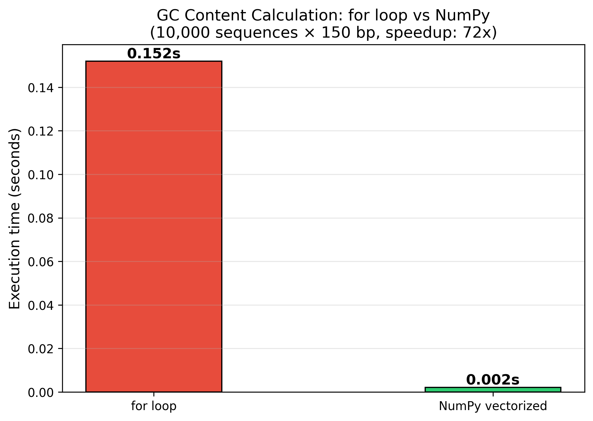
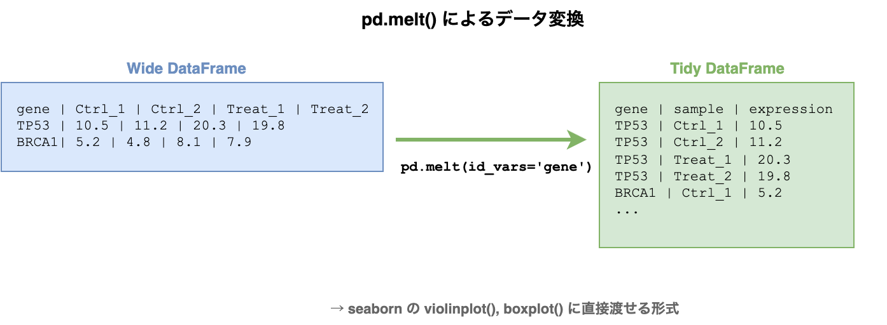

# §12 データ処理の実践 — NumPy・pandas・Polars

[§11 コマンドラインツールの設計と実装](./11_cli.md)では、コマンドラインの引数設計、stdin/stdout対応、プログレス表示、ロギングを学んだ。CLIはツールの「外側」のインターフェースである。本章では「内側」——ツールの中で実際にデータを処理するライブラリの実践的な使い方を学ぶ。

[§3 コーディングに必要な計算機科学](./03_cs_basics.md)ではNumPyの数値型の罠（int32オーバーフロー、浮動小数点精度）を、[§4 データフォーマットの選び方](./04_data_formats.md)ではpandasによるtidy data変換（`melt()` / `pivot_table()`）を学んだ。本章ではそれらの知識を前提に、バイオインフォマティクスのデータを**効率的に処理するパターン**を扱う。具体的には、NumPyのベクトル化演算による高速化、pandasとPolarsによるテーブルデータの集計・フィルタリング、そしてSciPyをはじめとするライブラリ関数の活用——AIが再発明しがちな処理をライブラリに任せる判断力である。

---

## 12-1. NumPyによるベクトル化演算

### forループの限界

Pythonのforループは柔軟だが、大量のデータを処理するには遅い。たとえば、数千のDNA配列のGC含量を1つずつ計算するコードを考える:

```python
# forループ版 — 遅い
def gc_contents_loop(sequences: list[str]) -> list[float]:
    results = []
    for seq in sequences:
        gc = (seq.count("G") + seq.count("C")) / len(seq)
        results.append(gc)
    return results
```

これは正しく動くが、配列数が数万〜数十万になると実行時間が問題になる。

### ベクトル化とは何か

**ベクトル化**（vectorization）とは、forループを使わず、配列全体に対する一括演算として処理を記述するテクニックである。NumPyのベクトル化演算が高速な理由は2つある:

1. **C言語レベルのループ**: NumPyの内部はCで実装されており、Pythonのインタプリタオーバーヘッドがない
2. **連続メモリアクセス**: NumPy配列はメモリ上に連続して配置される（[§3-5](./03_cs_basics.md#3-5-計算機アーキテクチャの基礎)で学んだC orderのメモリレイアウト）ため、CPUキャッシュを効率的に利用できる



### バイオインフォでの実践: GC含量の一括計算

[§8 テスト技法](./08_testing.md)で作成した `gc_content()` 関数は1配列ずつ処理する設計だった。NumPyを使えば、複数配列をまとめて処理できる:

```python
import numpy as np

def gc_content_vectorized(sequences: list[str]) -> np.ndarray:
    """複数のDNA配列のGC含量をNumPyで一括計算する."""
    results = np.empty(len(sequences), dtype=np.float64)
    for i, seq in enumerate(sequences):
        if not seq:
            results[i] = 0.0
            continue
        # np.frombuffer()でDNA配列を1文字ずつのバイト配列（各文字のASCIIコード値）に変換する。
        # ord("G")はG文字のASCIIコード値（71）を返し、配列全体との一致判定を
        # ベクトル化演算で行うことで、forループより大幅に高速化される。
        arr = np.frombuffer(seq.upper().encode("ascii"), dtype=np.uint8)
        gc_mask = (arr == ord("G")) | (arr == ord("C"))
        results[i] = gc_mask.sum() / len(arr)
    return results
```

ポイントは `np.frombuffer()` で文字列をバイト配列に変換し、`==` 演算子でベクトル比較している点である。各文字をforループで比較する代わりに、配列全体に対する一括比較を行っている。

### ブロードキャスティング

**ブロードキャスティング**（broadcasting）は、異なる形状の配列間で演算を自動的に拡張するNumPyの仕組みである。スカラーと配列、1次元配列と2次元配列の演算を、明示的なループなしに記述できる。

発現量カウントのCPM（Counts Per Million）正規化は、ブロードキャスティングの典型的な応用である:

```python
def normalize_cpm(counts: np.ndarray) -> np.ndarray:
    """発現量カウント行列をCPM正規化する.

    行: 遺伝子、列: サンプル
    """
    col_sums = counts.sum(axis=0)          # 各サンプルの総カウント
    # np.where(col_sums == 0, 1, col_sums) は、列の合計値が0のサンプル
    # （リードが1本もないサンプル）でゼロ除算が発生するのを防ぐため、
    # 合計値0を1に置換する処理である。
    col_sums = np.where(col_sums == 0, 1, col_sums)
    # CPM（Counts Per Million）は各遺伝子のリード数をサンプル全体の
    # リード数で割って100万倍した値で、サンプル間のライブラリサイズの
    # 違いを補正する正規化手法である。
    return (counts / col_sums) * 1_000_000  # ブロードキャスティング
```

`counts` が `(20000, 6)` の行列（2万遺伝子 × 6サンプル）のとき、`col_sums` は `(6,)` の1次元配列である。`counts / col_sums` と書くだけで、NumPyが自動的に `col_sums` を各行に適用する。forループで行ごとに割り算を書く必要はない。

正規化手法の計算方法を知るだけでなく、どの場面でどの手法を選ぶかが重要である。以下に主要な正規化手法の使い分けをまとめる:

| 手法 | 補正対象 | 使うべき場面 | 避けるべき場面 |
|------|---------|-------------|---------------|
| **CPM** | ライブラリサイズ | サンプル間の発現量比較（同一遺伝子） | 遺伝子間の比較（遺伝子長を考慮しない） |
| **TPM** | ライブラリサイズ + 遺伝子長 | 遺伝子間・サンプル間の比較、可視化 | DEG検定（専用の正規化を使うべき） |
| **FPKM/RPKM** | ライブラリサイズ + 遺伝子長 | レガシーデータとの互換 | 新規解析（TPMを使う） |
| **DESeq2正規化** | ライブラリサイズ + 組成バイアス | DEG検定 | 遺伝子間の比較（遺伝子長を考慮しない） |

新規解析ではFPKM/RPKMよりTPMを使う。FPKM/RPKMはサンプル間で値の合計が異なるため、サンプル間の直接比較に適さない。DEG検定にはDESeq2やedgeRの内部正規化を使い、可視化やヒートマップにはTPMを使うのが一般的な使い分けである。

### ファンシーインデックスとマスク

NumPyでは、整数の配列やリストを添字にして任意の位置をまとめて選ぶ方法を**ファンシーインデックス**（fancy indexing）と呼ぶ。これに対して、`True` / `False` の配列で条件に合う要素だけを選ぶ方法が**マスク**（boolean mask）である。Quality scoreのフィルタリングは、マスクの典型例である:

```python
def filter_by_quality(scores: np.ndarray, threshold: int = 20) -> np.ndarray:
    """Quality scoreが閾値以上の要素だけを抽出する."""
    mask = scores >= threshold  # ブーリアンマスク
    return scores[mask]         # マスクによる抽出
```

`scores >= threshold` でブーリアン配列（`True` / `False`）が生成される。1つの真偽値を保持する変数を**ブーリアン変数**と呼び、NumPyではその配列版をそのままマスクとして使える。`scores[mask]` で `True` の位置の要素だけが抽出され、これは `[s for s in scores if s >= threshold]` のリスト内包表記と同じ結果を返すが、大規模データではNumPy版のほうがはるかに高速である。なお、`scores[[0, 3, 5]]` のように整数位置の配列を渡すのがファンシーインデックスで、`scores[mask]` のように真偽値配列を渡すのがマスクによる抽出である。

この手法はSNPデータの抽出（`variants[variants["AF"] > 0.01]`）、発現量のフィルタリング（`genes[genes["baseMean"] > 100]`）など、バイオインフォマティクスのあらゆる場面で使える。

#### エージェントへの指示例

ベクトル化やブロードキャスティングは、エージェントが得意とする最適化パターンである。以下のように具体的に指示すると、適切な実装を得やすい:

> 「この関数はforループで1要素ずつ処理している。NumPyのベクトル化演算に書き換えて高速化してほしい」

> 「発現量カウント行列（行: 遺伝子、列: サンプル）をCPM正規化する関数を書いて。ブロードキャスティングを使い、forループは避けること」

> 「Quality scoreの配列から、閾値20以上の要素だけを抽出する関数を書いて。NumPyのブーリアンマスクを使うこと」

注意点として、エージェントにベクトル化を依頼するときは「入力と出力の形状」を明示するとよい。`(n_genes, n_samples)` のように次元の意味を伝えれば、axis引数の誤りを防げる。

---

## 12-2. pandasとPolarsによるテーブルデータ処理

### pandasの基本操作パターン

pandasはテーブルデータ操作のデファクトスタンダードである。[§4](./04_data_formats.md)では `melt()` と `pivot_table()` によるtidy data変換を学んだが、実際のデータ処理ではさらに多くの操作が必要になる。



DEG（差次的発現遺伝子; Differentially Expressed Gene）解析の結果テーブルを例に、実践的なパターンを見ていく。DESeq2やedgeRが出力する典型的なテーブルは以下のようなカラムを持つ:

| カラム | 意味 |
|--------|------|
| gene | 遺伝子名 |
| baseMean | 全サンプルの平均発現量 |
| log2FoldChange | 発現変化量（対数） |
| pvalue | p値（未補正） |
| padj | 調整済みp値（BH法等で補正済み） |

#### 読み込み: 型とNA値の指定

`pd.read_csv()` はデフォルトで型を推論するが、明示的に指定するほうが安全である:

```python
def load_deg_results(path: Path) -> pd.DataFrame:
    """DEG解析結果を読み込む."""
    sep = "\t" if path.suffix in (".tsv", ".txt") else ","
    return pd.read_csv(
        path,
        sep=sep,
        na_values=["NA", "na", ""],  # R由来のNAを明示的にNaNへ
        dtype={"gene": str},          # 遺伝子名は文字列として保持
    )
```

R由来のデータでは `NA` という文字列が欠損値を表すことが多い。`na_values` で明示しないと、文字列 `"NA"` がそのまま残ってしまう。

#### フィルタリング: `.query()` メソッド

有意遺伝子の抽出には `.query()` が読みやすい:

```python
def filter_significant_genes(
    df: pd.DataFrame,
    padj_threshold: float = 0.05,
    log2fc_threshold: float = 1.0,
) -> pd.DataFrame:
    """有意な差次的発現遺伝子をフィルタリングする."""
    return df.query(
        "padj < @padj_threshold and abs(log2FoldChange) >= @log2fc_threshold"
    ).copy()
```

`.query()` は文字列式でフィルタ条件を記述する。`@` プレフィックスでPython変数を参照でき、`abs()` などの関数も使える。ブーリアンインデックス `df[(df["padj"] < 0.05) & (df["log2FoldChange"].abs() >= 1)]` よりも可読性が高い。

#### 結合: `pd.merge()`

DEG結果に遺伝子アノテーション（GO term、パスウェイ情報など）を結合する操作は頻出する:

```python
def merge_with_metadata(
    deg_df: pd.DataFrame,
    metadata_df: pd.DataFrame,
    on: str = "gene",
) -> pd.DataFrame:
    """DEG結果にメタデータを結合する（左結合）."""
    return pd.merge(deg_df, metadata_df, on=on, how="left")
```

`how="left"` を指定すると、DEG結果のすべての行が保持され、メタデータにマッチしない遺伝子は `NaN` になる。`how="inner"`（デフォルト）にすると、マッチしない行が消えてしまうため注意が必要である。

#### 集計: `.groupby().agg()`

カテゴリ別の集計は `.groupby()` と `.agg()` の組み合わせで行う:

```python
def summarize_by_category(
    df: pd.DataFrame,
    category_col: str,
    value_col: str,
) -> pd.DataFrame:
    """カテゴリ別に件数・平均・中央値を集計する."""
    return (
        df.groupby(category_col)[value_col]
        .agg(["count", "mean", "median"])
        .reset_index()
    )
```

たとえば、遺伝子カテゴリ（がん抑制遺伝子、がん遺伝子、ハウスキーピング遺伝子）ごとにlog2FoldChangeの分布を要約できる。

### メソッドチェーン

**メソッドチェーン**とは、あるメソッドの戻り値に続けて次のメソッドを呼び出し、処理の流れを上から下へ連続して記述する書き方である。pandasでは `.pipe()` と `.assign()` を使うことで、中間変数を減らしつつ処理の流れを明確にできる:

```python
result = (
    pd.read_csv("deg_results.csv")
    .pipe(lambda df: df[df["padj"] < 0.05])
    .assign(direction=lambda df: np.where(df["log2FoldChange"] > 0, "up", "down"))
    .groupby("direction")["log2FoldChange"]
    .agg(["count", "mean"])
)
```

この書き方は「読み込み → フィルタ → 列追加 → 集計」という処理の流れがそのまま読める。ただし、チェーンが長くなりすぎると逆にデバッグが難しくなるため、適度な長さに留めるのがよい。

### Polars: 大規模データの高速処理

**Polars**[5](https://docs.pola.rs/)はRust製のDataFrameライブラリで、pandasと同様のテーブル操作を高速に実行できる。特に数百万行を超える大規模データで威力を発揮する。

Polarsの最大の特徴は**lazy evaluation**（遅延評価）である。これは、操作をその場で実行せず「何をするか」という計画だけを先に組み立て、最後にまとめて最適化・実行する方式を指す:

```python
import polars as pl

# lazy evaluation: scan_csv()で読み込みを遅延
lf = pl.scan_csv("deg_results.csv")

# フィルタと集計を「計画」として記述
result = (
    lf.filter(
        (pl.col("padj") < 0.05)
        & (pl.col("log2FoldChange").abs() >= 1.0)
    )
    .group_by("direction")
    .agg(pl.col("log2FoldChange").mean())
    .collect()  # ここで初めて実行
)
```

`scan_csv()` はファイルをすぐには読み込まず、`.collect()` が呼ばれた時点で必要な列だけを読み込む。これにより、不要な列の読み込みやフィルタ前の全行読み込みを回避できる。

ただし、Polars が常に pandas より優れているわけではない。小〜中規模データ、周辺ライブラリとの連携、行ラベル中心の操作では pandas のほうが自然なことも多い。また、lazy API を使っていても `.collect()` は最終結果をメモリに実体化するため、出力自体が巨大なら RAM 使用量は依然として問題になる。

#### pandas→Polars 対応表

| 操作 | pandas | Polars |
|------|--------|--------|
| CSV読み込み（即時） | `pd.read_csv()` | `pl.read_csv()` |
| CSV読み込み（遅延） | — | `pl.scan_csv()` |
| フィルタ | `df.query("col > 0")` | `lf.filter(pl.col("col") > 0)` |
| 列選択 | `df[["a", "b"]]` | `lf.select("a", "b")` |
| 集計 | `df.groupby("a").agg(...)` | `lf.group_by("a").agg(...)` |
| 列追加 | `df.assign(new=...)` | `lf.with_columns(...)` |
| 実行 | 即時 | `.collect()` |

#### 使い分けの指針

pandasとPolarsのどちらを使うかは、データ規模と要件で判断する:

ここでいう**エコシステム**とは、周辺ライブラリ、チュートリアル、既存コード、入出力フォーマットとの互換性、コミュニティで共有されている実装パターンまで含めた利用環境全体のことである。

- **数十万行以下**: pandasで十分。エコシステムが成熟しており、情報量も多い
- **数百万行超**: Polarsを検討する。特にメモリ効率とスキャン速度に優れる
- **既存コードベース**: pandasで書かれた既存コードがある場合、無理にPolarsに移行する必要はない

#### エージェントへの指示例

pandasやPolarsの操作をエージェントに依頼するときは、入力テーブルのカラム構造と期待する出力形式を明示するのがコツである:

> 「DEG結果テーブル（カラム: gene, baseMean, log2FoldChange, pvalue, padj）を読み込み、padj < 0.05 かつ |log2FoldChange| > 1 の遺伝子だけをフィルタする関数を書いて。pandasの.query()を使うこと」

> 「DEG結果にGOアノテーション（カラム: gene, GO_term, category）を左結合し、カテゴリ別にlog2FoldChangeの平均を集計する処理を書いて。メソッドチェーンで記述すること」

> 「このpandasのコードをPolarsのlazy APIに書き換えて。scan_csv() → filter() → collect() のパターンで」

---

> ### 🧬 コラム: バイオインフォマティクスのPythonライブラリ
>
> バイオインフォマティクスには、特定のデータ形式や解析タスクに特化したPythonライブラリが数多く存在する。以下はその代表例である:
>
> | ライブラリ | 用途 | 代表的な使い方 |
> |-----------|------|---------------|
> | **Biopython**[8](https://doi.org/10.1093/bioinformatics/btp163) | 配列操作の万能ナイフ | `SeqIO`（FASTA/FASTQ）, `AlignIO`（MSA）, `Blast`（結果パース）, `Entrez`（NCBI API） |
> | **pysam** | SAM/BAM/VCF操作 | htslibのPythonラッパー。大規模NGSデータの高速処理 |
> | **pyBigWig** | BigWigの読み書き | ゲノムシグナルデータの操作 |
> | **scanpy**[9](https://doi.org/10.1186/s13059-017-1382-0) | シングルセル解析 | 前処理→クラスタリング→可視化の一気通貫 |
> | **anndata** | シングルセルデータ構造 | `.X`（発現量行列）, `.obs`（細胞メタデータ）, `.var`（遺伝子メタデータ） |
> | **pyranges** | ゲノム区間演算 | BED的操作をpandas風APIで。区間の交差・結合・差分 |
> | **ETE Toolkit** | 系統樹操作・可視化 | Newick/NHX形式の読み込み、系統樹の装飾・描画・解析 |
>
> 以下に各ライブラリの基本的な使い方を示す。詳細はそれぞれの公式ドキュメントを参照してほしい。
>
> ```python
> # Biopython: FASTAの読み込み
> from Bio import SeqIO
> records = list(SeqIO.parse("sequences.fasta", "fasta"))
>
> # pysam: BAMの読み込みとリージョン抽出
> import pysam
> bam = pysam.AlignmentFile("sample.bam", "rb")
> reads = list(bam.fetch("chr1", 1000, 2000))
>
> # scanpy: シングルセルデータの前処理
> import scanpy as sc
> adata = sc.read_h5ad("pbmc3k.h5ad")
> sc.pp.normalize_total(adata, target_sum=1e4)
>
> # pyranges: ゲノム区間の交差
> import pyranges as pr
> peaks = pr.read_bed("peaks.bed")
> genes = pr.read_bed("genes.bed")
> overlap = peaks.join(genes)
> ```
>
> エージェントに実装を頼む前に、目的のタスクに特化したライブラリが存在しないかを確認しよう。車輪の再発明を避けることは、[§0-9](./00_ai_agent.md#0-9-車輪の再発明を防ぐ)で学んだ重要な原則である。

> 🧬 **コラム: 実験デザインの語彙 — AIへの指示に必要な5つの概念**
>
> データ処理ライブラリの使い方を知っていても、データの構造——リプリケート、バッチ、交絡因子——を理解していなければ、正しい解析をエージェントに指示できない。以下の5つの概念は、DEG（差次的発現遺伝子）解析をはじめとする統計解析の前提知識である。
>
> **バイオロジカルリプリケート vs テクニカルリプリケート**: バイオロジカルリプリケート（biological replicate）は独立した生物学的サンプル（例: 異なる個体のマウス）からの測定であり、テクニカルリプリケート（technical replicate）は同一サンプルを繰り返し測定したものである。統計的な推論にはバイオロジカルリプリケートが必要であり、テクニカルリプリケートでは生物学的なばらつきを評価できない。
>
> **バッチ効果**（batch effect）: 実験バッチ（異なる日、異なるフローセル、異なるオペレータ）間で生じる系統的な技術的差異である。PCA（主成分分析）で可視化したときにサンプルがバッチごとにクラスタリングされる場合、バッチ効果の存在を疑う。統計モデルにバッチを共変量として含めることで補正できる。
>
> **交絡因子**（confounding factor）: 処理群とバッチが完全に一致してしまう致命的な実験設計ミスである。たとえば、コントロール群をすべてバッチ1で、処理群をすべてバッチ2で処理した場合、処理の効果とバッチ効果を統計的に区別できない。実験設計の段階で処理群をバッチ間にランダムに配分する必要がある。
>
> **擬似リプリケート**（pseudoreplication）: テクニカルリプリケートをバイオロジカルリプリケートと誤認するエラーである。たとえば、1匹のマウスから採取した組織を3回シーケンスした場合、見かけ上は $n$ = 3 だが、独立なサンプルは1つしかない。自由度を過大評価するため、偽陽性が大幅に増加する。
>
> **サンプルサイズ**: 群あたり3バイオロジカルリプリケートは「最低限」として広く使われるが、検出したい効果量（fold change）が小さいほど多くのリプリケートが必要になる。統計的検出力（power）を事前に見積もる**検出力分析**（power analysis）を行うのが理想である。
>
> これらの語彙を知っていれば、エージェントへの指示に正確な文脈を含められる:
>
> > 「3バイオロジカルリプリケート×2バッチのRNA-seq DEG解析で、バッチを共変量に含めたDESeq2のデザイン行列を書いて」
>
> > 「テクニカルリプリケート（同一サンプルの3回シーケンス）は平均してからバイオロジカルリプリケート間で検定して。擬似リプリケートにならないようにして」

---

## 12-3. ライブラリ関数の活用 — AIが再発明しがちなパターン

§12-1・§12-2で学んだ「forループではなくライブラリAPIで書く」原則は、科学計算にもそのまま適用される。統計検定、距離計算、最適化——これらの処理にはSciPy[6](https://doi.org/10.1038/s41592-019-0686-2)をはじめとするライブラリに十分にテストされた実装が用意されている。

ここでいう**ライブラリ関数**とは、標準ライブラリや外部ライブラリが提供する既製の関数である。統計検定や距離計算のような定番処理では、まずライブラリ関数が存在しないかを確認し、自前実装は最後の手段にする。

ところが、AIエージェントに「〜を実装して」と指示すると、ライブラリ関数を呼ぶ代わりにアルゴリズムをゼロから実装してしまうことがある。[§0-9 車輪の再発明を防ぐ](./00_ai_agent.md#0-9-車輪の再発明を防ぐ)で学んだとおり、これは典型的なアンチパターンである。「ライブラリに何があるか」を知っていれば、AIへの指示に関数名を含められ、再発明を防げる。本節では、AIが再発明しがちな処理を具体例で見ていく。

### 統計検定 — 関数名を指示に含める

バイオインフォマティクスでは「2群間に有意な差があるか」を検定する場面が頻出する。ここで重要なのは検定の理論を深く理解することではなく、**SciPyのどの関数を使えばよいか**を知っていることである。

たとえば「処理群とコントロール群に差があるか検定して」とだけ指示すると、AIが検定ロジックをゼロから実装する可能性がある。一方、「`scipy.stats.ttest_ind(equal_var=False)` を使って比較して」と指示すれば、確実にライブラリ関数を使った実装が得られる:

```python
from scipy import stats

def compare_expression(
    group1: np.ndarray,
    group2: np.ndarray,
) -> tuple[float, float]:
    """2群の発現量をWelchのt検定で比較する."""
    result = stats.ttest_ind(group1, group2, equal_var=False)
    return float(result.statistic), float(result.pvalue)
```

`equal_var=False` でWelchのt検定（等分散を仮定しない）になる。ノンパラメトリック検定が必要なら `scipy.stats.mannwhitneyu()` を使う。ポイントは、どの関数名を指示に含めるべきかを知っていることである。

### 多重検定補正 — 車輪の再発明の典型例

数千〜数万の遺伝子を同時に検定する場合、**多重検定補正**（multiple testing correction）が必須である。Benjamini-Hochberg法（BH法）はFDR（False Discovery Rate; 偽発見率）を制御する標準的な方法だが、「BH法で多重検定補正して」と指示するとAIが以下のような手動実装を生成しがちである:

```python
def correct_pvalues(pvalues: np.ndarray) -> np.ndarray:
    """BH法による多重検定補正 — 手動実装（約25行）."""
    n = len(pvalues)
    if n == 0:
        return np.array([], dtype=np.float64)

    sorted_indices = np.argsort(pvalues)
    sorted_pvalues = pvalues[sorted_indices]
    ranks = np.arange(1, n + 1)

    # 補正: p_adj = p * n / rank
    adjusted = sorted_pvalues * n / ranks
    # 単調性を保証（後ろから累積最小値）
    adjusted = np.minimum.accumulate(adjusted[::-1])[::-1]
    adjusted = np.clip(adjusted, 0.0, 1.0)

    result = np.empty(n, dtype=np.float64)
    result[sorted_indices] = adjusted
    return result
```

このコード自体は正しく動くが、SciPyには同じ処理を行うライブラリ関数がある。`scipy.stats.false_discovery_control()` を使えば2行で済む:

```python
def correct_pvalues_scipy(pvalues: np.ndarray) -> np.ndarray:
    """BH法による多重検定補正 — SciPyのライブラリ関数版."""
    if len(pvalues) == 0:
        return np.array([], dtype=np.float64)
    return stats.false_discovery_control(pvalues, method="bh")
```

なぜ手動実装を避けるべきか。第一に、エッジケース（NaN、同値p値、極端に小さな値）の処理が複雑で、自前実装ではバグが入りやすい。第二に、ライブラリ関数は広範なテストを経ており、浮動小数点精度の問題（[§3-2](./03_cs_basics.md#3-2-数値表現と浮動小数点)参照）にも対処されている。

実務ではDESeq2やedgeRがBH補正済みの `padj` を出力するため、自分で補正する場面は多くない。しかし、知っておくべきは「ライブラリ関数が存在する」という事実である。AIが手動実装を生成したら、`scipy.stats.false_discovery_control()` に置き換えるよう指示できる。

### 距離行列 — forループ vs ライブラリ

サンプル間の類似度を距離行列として計算する処理も、AIが二重forループで実装しがちなパターンである。以下はナイーブな実装の例:

```python
def distance_matrix_naive(matrix: np.ndarray) -> np.ndarray:
    """二重forループによる距離行列計算（非推奨）."""
    n_samples = matrix.shape[1]
    dist = np.zeros((n_samples, n_samples))
    for i in range(n_samples):
        for j in range(i + 1, n_samples):
            corr = np.corrcoef(matrix[:, i], matrix[:, j])[0, 1]
            dist[i, j] = 1.0 - corr
            dist[j, i] = dist[i, j]
    return dist
```

SciPyの `pdist()` と `squareform()` を使えば、同じ計算をはるかに簡潔かつ高速に書ける:

```python
from scipy.spatial.distance import pdist, squareform

def expression_distance_matrix(matrix: np.ndarray) -> np.ndarray:
    """発現プロファイルの相関距離行列を計算する."""
    distances = pdist(matrix.T, metric="correlation")
    return squareform(distances)
```

`pdist()` は condensed distance matrix（上三角行列を1次元に圧縮した形式）を返し、`squareform()` がそれを正方行列に変換する。AIが二重forループで距離を計算するコードを生成したら、「`pdist()` がある」と指示できることが重要である。この距離行列は、[§13 可視化の実践](./13_visualization.md)で学ぶヒートマップや階層クラスタリングの入力として使う。

`metric` パラメータで距離の種類を変更できる:

| metric | 意味 | 用途 |
|--------|------|------|
| `"correlation"` | 1 - ピアソン相関係数 | 発現プロファイルの類似度 |
| `"euclidean"` | ユークリッド距離 | PCA後の座標間距離 |
| `"cosine"` | 1 - コサイン類似度 | 高次元ベクトルの方向の類似度 |

### SciPyの主要モジュール早見表

以下は、関数名を知っているだけでAIへの指示精度が上がるSciPyの主要モジュールである:

| モジュール | 用途 | 代表的な関数 |
|-----------|------|-------------|
| `scipy.stats` | 統計検定 | `ttest_ind()`, `mannwhitneyu()`, `false_discovery_control()` |
| `scipy.spatial.distance` | 距離計算 | `pdist()`, `squareform()` |
| `scipy.cluster.hierarchy` | 階層クラスタリング | `linkage()`, `dendrogram()` |
| `scipy.optimize` | 最適化 | `curve_fit()`, `minimize()` |
| `scipy.interpolate` | 補間 | `interp1d()` |
| `scipy.sparse` | 疎行列 | `csr_matrix()`, `save_npz()` |

この早見表を手元に置いておけば、AIに「〜を実装して」と依頼する前に「SciPyに関数がないか」を確認する習慣がつく。

#### エージェントへの指示例

ライブラリ関数の存在を知っていれば、AIへの指示に関数名を含めて再発明を防げる。以下のような指示が有効である:

> 「この関数はBH法を手動実装している。`scipy.stats.false_discovery_control()` に置き換えて」

> 「二重forループで距離を計算している箇所を `scipy.spatial.distance.pdist()` と `squareform()` に書き換えて」

> 「この処理に使えるSciPyの関数がないか確認して。あれば自前実装をライブラリ呼び出しに置き換えて」

---

> ### 🤖 コラム: 機械学習ライブラリ
>
> バイオインフォマティクスと機械学習の融合が進んでおり、配列解析の次のステップとしてMLライブラリの知識が求められる場面が増えている。以下は代表的なライブラリである:
>
> | ライブラリ | 用途 | 代表的な使い方 |
> |-----------|------|---------------|
> | **scikit-learn** | 古典的ML | 分類、クラスタリング、前処理パイプライン、交差検証 |
> | **PyTorch** | 深層学習 | カスタムモデル定義、学習ループ、GPU計算 |
> | **JAX** | 高速数値計算 | 自動微分、JITコンパイル、関数型スタイル |
> | **Hugging Face** | 事前学習モデル | Transformers, Datasets, tokenizers。DNAモデル（DNABERT等）も利用可能 |
> | **Lightning** | 学習ループの定型化 | PyTorch Lightningでボイラープレート削減 |
> | **wandb** | 実験追跡 | 学習曲線、ハイパーパラメータ、モデルチェックポイント |
> | **optuna** | ハイパーパラメータ最適化 | ベイズ最適化ベースの自動チューニング |
>
> 配列解析からMLに踏み出す典型的な3ステップ:
>
> 1. **scikit-learn**で特徴量ベースの古典的MLを試す（まずベースラインを作る）
> 2. **PyTorch**でカスタムモデルを構築する
> 3. **Hugging Face**で事前学習モデルのfine-tuningを行う
>
> 実験管理の詳細は[§15 コンテナによるソフトウェア環境の再現](./15_container.md)で扱う。

---

## まとめ

本章で学んだデータ処理ライブラリの要素を整理する:

| 概念 | ツール/手法 | 目的 |
|------|-----------|------|
| ベクトル化演算 | NumPy | forループを排除して高速化 |
| ブロードキャスティング | NumPy | 異なる形状の配列間の一括演算 |
| テーブル操作 | pandas | データの読み込み・フィルタ・結合・集計 |
| 遅延評価 | Polars（lazy API） | 大規模データのクエリ最適化 |
| ライブラリ関数の活用 | SciPy等 | 統計検定・距離計算をforループで再実装しない |
| アンチパターンの認識 | — | AIが生成した非効率コードを見抜き、ライブラリに置き換える |

すべてに共通する原則は、**Pythonレベルのforループを避け、ライブラリのAPIで処理を記述する**ことである。ベクトル化演算、ブロードキャスティング、メソッドチェーン、lazy evaluationはいずれもこの原則の表れである。

次章の[§13 可視化の実践](./13_visualization.md)では、本章で処理したデータを可視化する方法を学ぶ。距離行列のヒートマップ、DEG結果のVolcano plot、発現量分布のバイオリンプロットなど、バイオインフォマティクスで定番の可視化を取り上げる。

---

## 演習問題

本章の内容を、エージェントとの協働を通じて実践する課題である。

### 演習 12-1: アンチパターンの発見 **[レビュー]**

エージェントが生成した以下のコードの問題点を説明し、ベクトル化による改善案を提案せよ。

```python
for i, row in df.iterrows():
    if row["log2fc"] > 1 and row["padj"] < 0.05:
        df.at[i, "significant"] = True
    else:
        df.at[i, "significant"] = False
```

具体的に、以下の観点でレビューせよ。

1. `iterrows()`の性能上の問題
2. ベクトル化による書き換え方法
3. 大規模データ（10万行以上）での影響

（ヒント）pandasの`iterrows()`は内部的にPythonループであり、行ごとにSeriesオブジェクトを生成するため大規模データで極めて遅い。条件判定はpandasのブールインデックスで一括処理できる。

### 演習 12-2: pandas vs Polars **[設計判断]**

以下の3つのシナリオについて、pandasとPolarsのどちらを選択すべきか判断し、理由を述べよ。

- (a) 既存のscRNA-seqパイプライン（scanpyベース）にフィルタリング処理を追加する
- (b) 新規プロジェクトで100GBのゲノムバリアントデータを処理する。処理速度が最優先
- (c) DESeq2の出力をpandasで読み込み、下流でscanpyのAnnDataに渡す

（ヒント）既存エコシステムとの互換性とプロジェクト規模で判断する。scanpyはpandasのDataFrameを前提としているため、scanpyと連携する場合はpandasが自然である。一方、大規模データの新規処理ではPolarsの遅延評価とRustバックエンドが有利である。

### 演習 12-3: ライブラリ関数の活用指示 **[指示設計]**

エージェントに「遺伝子発現行列のサンプル間コサイン距離を計算して」と指示したところ、以下のようなforループによる実装が生成された。

```python
import numpy as np

n_samples = expression_matrix.shape[1]
distances = np.zeros((n_samples, n_samples))
for i in range(n_samples):
    for j in range(i + 1, n_samples):
        dot = np.dot(expression_matrix[:, i], expression_matrix[:, j])
        norm_i = np.linalg.norm(expression_matrix[:, i])
        norm_j = np.linalg.norm(expression_matrix[:, j])
        distances[i, j] = 1 - dot / (norm_i * norm_j)
        distances[j, i] = distances[i, j]
```

SciPyのライブラリ関数を使うよう修正させるための指示文を書け。

（ヒント）`scipy.spatial.distance.pdist`と`cosine`メトリクスを具体的に指定する。さらに`squareform`で距離行列に変換できることも伝えると、エージェントは一発で正しいコードを生成できる。

### 演習 12-4: ベクトル化の効果測定 **[実践]**

エージェントに以下の2つの実装を生成させ、100万要素の配列で実行時間を比較せよ。

- **実装A**: Pythonのforループで配列の各要素を2乗し合計する
- **実装B**: NumPyのベクトル化演算で同じ計算を行う

`%%timeit`（Jupyter）または`timeit`モジュールを使って計測し、速度差を報告せよ。

（ヒント）NumPyのベクトル化は通常10〜100倍の高速化をもたらす。`np.square(arr).sum()` のような1行のベクトル化演算と、`sum(x * x for x in arr)` のようなPythonループの比較が典型的である。

---

## さらに学びたい読者へ

本章で扱ったNumPy・pandas・Polarsによるデータ処理をさらに深く学びたい読者に向けて、定番の教科書とリソースを紹介する。

### データ分析の教科書

- **McKinney, W. *Python for Data Analysis* (3rd ed.). O'Reilly, 2022.** https://www.amazon.co.jp/dp/109810403X — pandas作者自身による教科書。本章で扱ったDataFrame操作の背景にあるデータモデルと設計思想が詳しく解説されている。邦訳: 瀬戸山雅人ほか訳『Pythonによるデータ分析入門 第3版』オライリー・ジャパン, 2023.
- **VanderPlas, J. *Python Data Science Handbook* (2nd ed.). O'Reilly, 2023.** — NumPy、pandas、matplotlib、scikit-learnの包括的な実践ガイド。全文がオンラインで無料公開されている: https://jakevdp.github.io/PythonDataScienceHandbook/ 。邦訳: 菊池彰訳『Pythonデータサイエンスハンドブック 第2版』オライリー・ジャパン, 2024.

### ライブラリの設計思想

- **Harris, C. R. et al. "Array programming with NumPy". *Nature*, 585(7825), 357–362, 2020.** — 本章の参考文献 [1] で引用。NumPyの設計思想と科学計算エコシステムにおける位置づけを理解できるレビュー論文。
- **Polars Documentation.** https://docs.pola.rs/ — Polarsの公式ドキュメント。pandasとの設計思想の違い（遅延評価、Rustバックエンド、式ベースAPI）が詳しく解説されている。

### バイオインフォマティクスのデータ処理

- **Cock, P. J. A. et al. "Biopython: freely available Python tools for computational molecular biology and bioinformatics". *Bioinformatics*, 25(11), 1422–1423, 2009.** — Biopythonの原論文。バイオインフォ固有のデータ処理（SeqIO、AlignIO等）の設計思想を理解できる。Biopython Tutorial: https://biopython.org/wiki/Documentation も併せて参照。

---

## 参考文献

[1] Harris, C. R. et al. "Array programming with NumPy". *Nature*, 585(7825), 357–362, 2020. [https://doi.org/10.1038/s41586-020-2649-2](https://doi.org/10.1038/s41586-020-2649-2)

[2] NumPy Developers. "NumPy Documentation". [https://numpy.org/doc/stable/](https://numpy.org/doc/stable/) (参照日: 2026-03-19)

[3] pandas Development Team. "pandas Documentation". [https://pandas.pydata.org/docs/](https://pandas.pydata.org/docs/) (参照日: 2026-03-19)

[4] McKinney, W. *Python for Data Analysis*. 3rd ed., O'Reilly Media, 2022. ISBN: 978-1098104030

[5] Polars Contributors. "Polars Documentation". [https://docs.pola.rs/](https://docs.pola.rs/) (参照日: 2026-03-19)

[6] Virtanen, P. et al. "SciPy 1.0: Fundamental Algorithms for Scientific Computing in Python". *Nature Methods*, 17(3), 261–272, 2020. [https://doi.org/10.1038/s41592-019-0686-2](https://doi.org/10.1038/s41592-019-0686-2)

[7] SciPy Developers. "SciPy Documentation". [https://docs.scipy.org/doc/scipy/](https://docs.scipy.org/doc/scipy/) (参照日: 2026-03-19)

[8] Cock, P. J. A. et al. "Biopython: freely available Python tools for computational molecular biology and bioinformatics". *Bioinformatics*, 25(11), 1422–1423, 2009. [https://doi.org/10.1093/bioinformatics/btp163](https://doi.org/10.1093/bioinformatics/btp163)

[9] Wolf, F. A. et al. "SCANPY: large-scale single-cell gene expression data analysis". *Genome Biology*, 19(1), 15, 2018. [https://doi.org/10.1186/s13059-017-1382-0](https://doi.org/10.1186/s13059-017-1382-0)
