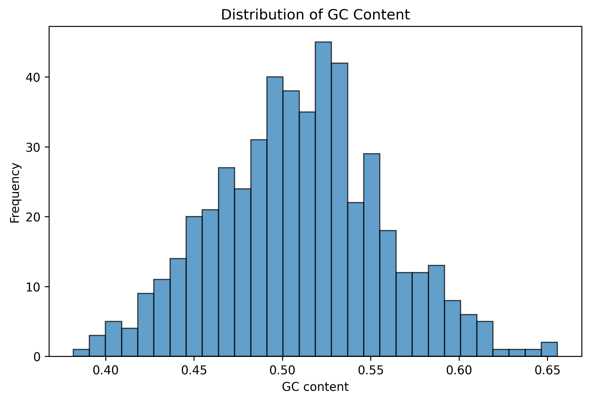
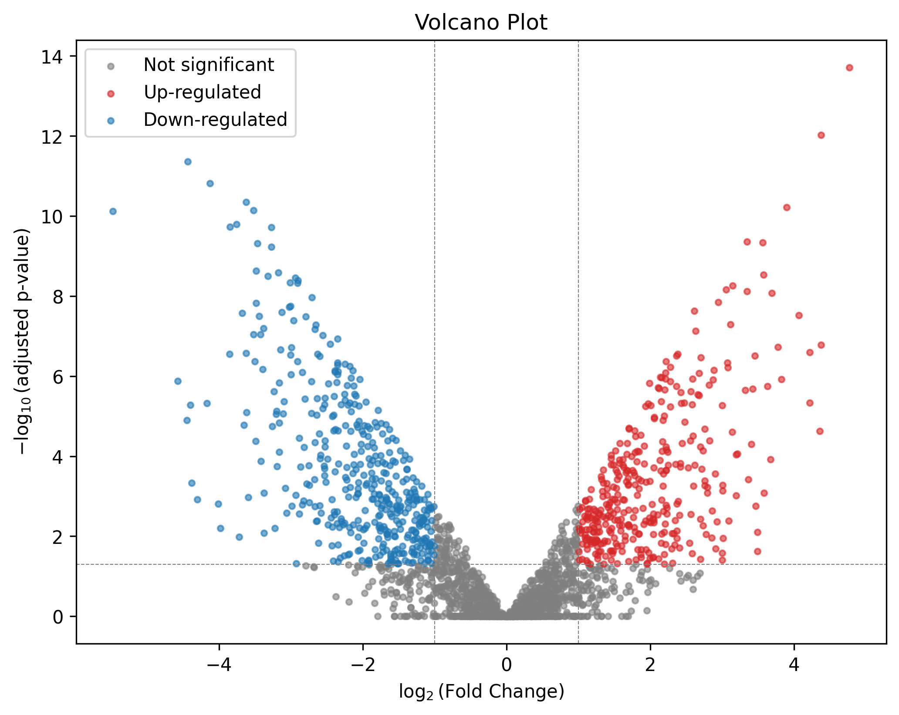
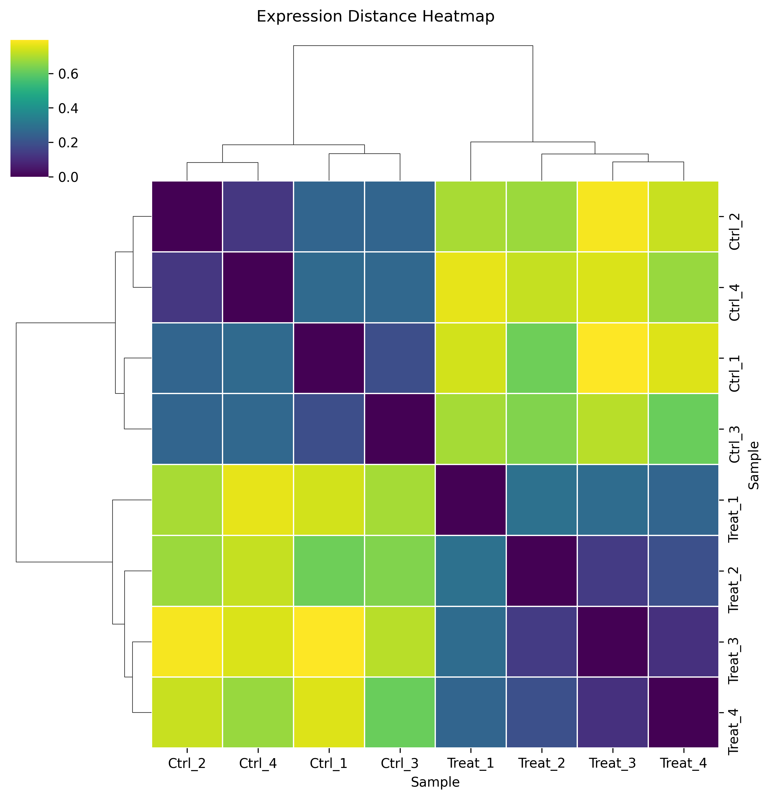
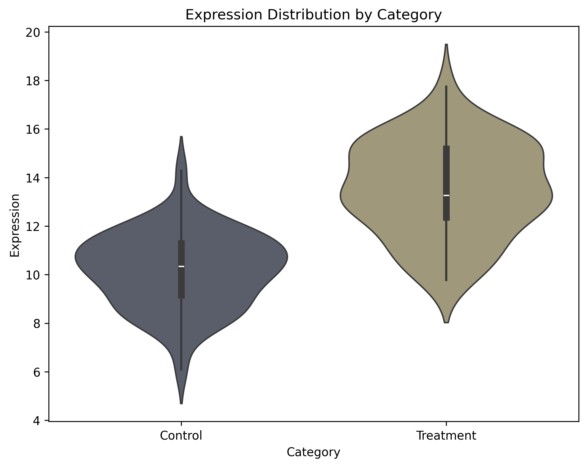
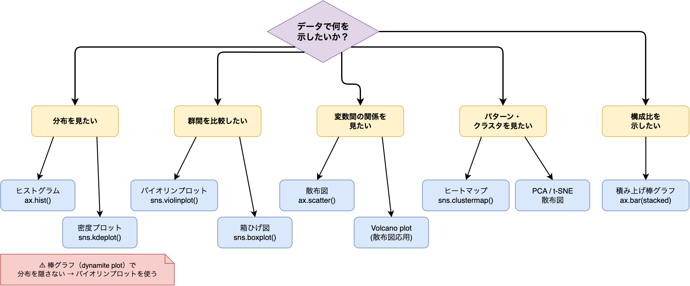
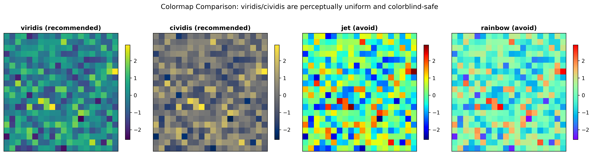

# §13 可視化の実践 — Matplotlib・Seaborn・Plotly

> "Above all else show the data."
> （何よりもまず、データを見せよ。）
> — Edward R. Tufte, *The Visual Display of Quantitative Information* (Graphics Press, 1983), p.92

[§12 データ処理の実践](./12_data_processing.md)では、NumPyのベクトル化演算、pandasによるテーブル操作、SciPyのライブラリ関数で効率的にデータを処理する方法を学んだ。しかし、処理結果が数値の羅列のままでは、生物学的な意味を読み取ることは難しい。データを「人間が解釈できる形」に変換するのが可視化の役割である。

AIエージェントにプロットコードの生成を依頼すると、動作するコードは得られる。しかし、**グラフの種類が適切か**、**色覚多様性に配慮しているか**、**軸ラベルや凡例が正しいか**——これらの判断は人間の仕事である。エージェントが `plt.plot()` で折れ線グラフを生成しても、データの性質上バイオリンプロットが適切なら、それを見抜いて修正を指示する力が必要になる。

本章では、Pythonの3つの主要な可視化ライブラリ（Matplotlib[1](https://doi.org/10.1109/MCSE.2007.55)[2](https://matplotlib.org/stable/)、Seaborn[3](https://doi.org/10.21105/joss.03021)[4](https://seaborn.pydata.org/)、Plotly[5](https://plotly.com/python/)）の使い方と、科学的可視化の原則を学ぶ。

---

## 13-1. Python可視化ライブラリ

### Matplotlibの基礎 — Figure/Axesのオブジェクト指向API

Matplotlibにはプロットを作成する方法が2つある。**暗黙的API**（`plt.plot()`, `plt.hist()` など）と**明示的API**（`fig, ax = plt.subplots()` でFigure/Axesオブジェクトを取得して操作する方法）である。

ここでいう**オブジェクト指向**とは、データとその操作をオブジェクトとしてまとめ、`ax.set_xlabel()` のように「対象.操作」の形で扱う考え方である。Matplotlib の Figure と Axes はそのオブジェクトにあたり、明示的APIではこれらを直接受け取って操作する。

```python
# 暗黙的API — エージェントが生成しがちなパターン
import matplotlib.pyplot as plt

plt.hist(gc_values, bins=30)
plt.xlabel("GC content")
plt.ylabel("Frequency")
plt.title("Distribution of GC Content")
plt.savefig("gc_hist.png")
plt.show()
```

暗黙的APIは短くて手軽だが、グローバルな状態に依存するため、複数のグラフを扱うときに混乱しやすい。再現可能なスクリプトには、明示的APIを推奨する:

```python
# 明示的API — 推奨パターン
import matplotlib.pyplot as plt
import numpy as np
from matplotlib.figure import Figure
from pathlib import Path

def gc_histogram(
    gc_values: np.ndarray,
    bins: int = 30,
    output_path: Path | None = None,
) -> Figure:
    """GC含量のヒストグラムを作成する."""
    fig, ax = plt.subplots(figsize=(8, 5))
    ax.hist(gc_values, bins=bins, edgecolor="black", alpha=0.7)
    ax.set_xlabel("GC content")
    ax.set_ylabel("Frequency")
    ax.set_title("Distribution of GC Content")

    if output_path is not None:
        fig.savefig(output_path, dpi=300, bbox_inches="tight")

    return fig
```



このパターンのポイントは3つある:

1. `fig, ax = plt.subplots()` で明示的にFigure/Axesを取得する。`ax.set_xlabel()` のように、操作対象のAxesが常に明確になる
2. GUIバックエンドがない環境（リモートサーバー、CI）でCLIスクリプトとして実行する場合は、`pyplot` の import 前に `matplotlib.use("Agg")` などの非対話バックエンドを選ぶ。再利用されるライブラリモジュールで常に固定するのは避ける
3. `plt.show()` を呼ばず `Figure` を返す。呼び出し側が表示・保存を判断できる設計で、テストも容易になる

エージェントが暗黙的APIで生成したコードをレビューするとき、「`plt.subplots()` を使って明示的APIに書き換えて」と指示するだけで、保守性の高いコードに変換できる。

### バイオインフォの定番プロット

バイオインフォマティクスでは、特定の解析結果に対応した定番の可視化パターンがある。ここでは、[§12](./12_data_processing.md)で処理したデータを入力として、2つの代表的なプロットを作成する。

#### Volcano plot

Volcano plotは、DEG（差次的発現遺伝子）解析の結果を一覧するための散布図である。x軸に発現変化量($\log_2$ Fold Change)、y軸に統計的有意性($-\log_{10}$ adjusted p-value)をとり、有意に発現が変動した遺伝子を色分けする:

```python
import matplotlib.pyplot as plt
import numpy as np
import pandas as pd
from matplotlib.figure import Figure

def volcano_plot(
    deg_df: pd.DataFrame,
    padj_threshold: float = 0.05,
    log2fc_threshold: float = 1.0,
    output_path: Path | None = None,
) -> Figure:
    """Volcano plotを作成する."""
    fig, ax = plt.subplots(figsize=(8, 6))

    df = deg_df.copy()
    df["-log10_padj"] = -np.log10(df["padj"].clip(lower=1e-300))

    # 分類: up-regulated, down-regulated, not significant
    is_up = (df["padj"] < padj_threshold) & (
        df["log2FoldChange"] >= log2fc_threshold
    )
    is_down = (df["padj"] < padj_threshold) & (
        df["log2FoldChange"] <= -log2fc_threshold
    )
    # np.select()は複数の条件に対応する値を一括で選択する関数である。
    # 第1引数に条件リスト、第2引数に対応する値リストを渡し、
    # どの条件にも当てはまらない場合はdefaultの値（"ns" = not significant）が使われる。
    df["category"] = np.select(
        [is_up, is_down], ["up", "down"], default="ns"
    )

    colors = {"up": "tab:red", "down": "tab:blue", "ns": "tab:gray"}
    labels = {
        "up": "Up-regulated",
        "down": "Down-regulated",
        "ns": "Not significant",
    }

    for cat in ["ns", "up", "down"]:
        subset = df[df["category"] == cat]
        if subset.empty:
            continue
        ax.scatter(
            subset["log2FoldChange"],
            subset["-log10_padj"],
            c=colors[cat],
            label=labels[cat],
            alpha=0.6,
            s=10,
        )

    # 閾値線
    ax.axhline(
        -np.log10(padj_threshold),
        color="gray", linestyle="--", linewidth=0.5,
    )
    ax.axvline(log2fc_threshold, color="gray", linestyle="--", linewidth=0.5)
    ax.axvline(-log2fc_threshold, color="gray", linestyle="--", linewidth=0.5)

    ax.set_xlabel("$\\log_2$(Fold Change)")
    ax.set_ylabel("$-\\log_{10}$(adjusted p-value)")
    ax.set_title("Volcano Plot")
    ax.legend()

    if output_path is not None:
        fig.savefig(output_path, dpi=300, bbox_inches="tight")

    return fig
```



入力は[§12-2](./12_data_processing.md#12-2-pandasとpolarsによるテーブルデータ処理)で扱った `filter_significant_genes()` と同じDEGテーブル（カラム: `gene`, `log2FoldChange`, `padj`）である。`np.select()` で3カテゴリに分類し、カテゴリごとに色を変えて `ax.scatter()` でプロットする。`ax.axhline()` と `ax.axvline()` で閾値線を引くことで、どの遺伝子が有意かを視覚的に判別できる。

`df["padj"].clip(lower=1e-300)` は、$p$ = 0 のときに $-\log_{10}(0) = \infty$ となるのを防ぐ処理である。

#### ヒートマップと階層クラスタリング

[§12-3](./12_data_processing.md#12-3-ライブラリ関数の活用--aiが再発明しがちなパターン)で作成した `expression_distance_matrix()` の出力（サンプル間の相関距離行列）を、ヒートマップとして可視化する。seabornの `clustermap()` を使えば、ヒートマップと階層クラスタリングのデンドログラムを同時に描画できる:

```python
import seaborn as sns

def expression_heatmap(
    distance_matrix: np.ndarray,
    sample_labels: list[str] | None = None,
) -> sns.matrix.ClusterGrid:
    """距離行列のヒートマップと階層クラスタリングを作成する."""
    if sample_labels is not None:
        df = pd.DataFrame(
            distance_matrix,
            index=sample_labels,
            columns=sample_labels,
        )
    else:
        df = pd.DataFrame(distance_matrix)

    g = sns.clustermap(
        df,
        cmap="viridis",
        figsize=(8, 8),
        linewidths=0.5,
    )
    g.ax_heatmap.set_xlabel("Sample")
    g.ax_heatmap.set_ylabel("Sample")
    g.figure.suptitle("Expression Distance Heatmap", y=1.02)

    return g
```



`clustermap()` は内部で `scipy.cluster.hierarchy.linkage()` を呼び出し、行と列を類似度に基づいて並べ替える。戻り値は `ClusterGrid` オブジェクトで、通常の `Figure` とは異なる点に注意する。`g.figure` で `Figure` にアクセスし、`g.ax_heatmap` でヒートマップ部分の `Axes` にアクセスできる。

カラーマップには `"viridis"` を指定している。この選択の根拠は[§13-2](#13-2-可視化の原則)で解説する。

### Seabornによる統計的可視化

SeabornはMatplotlib上に構築された統計的可視化ライブラリである。最大の特徴は**tidy data**（long form）を前提としている点で、[§4 データフォーマットの選び方](./04_data_formats.md)で学んだ `melt()` によるlong form変換が、そのままSeabornの入力になる。

バイオリンプロットは、カテゴリ別の分布形状を比較するのに適している。ボックスプロットでは見えない分布の「形」（双峰性、裾の長さなど）を可視化できる:

```python
import seaborn as sns

def expression_violin(
    expression_df: pd.DataFrame,
    category_col: str = "category",
    value_col: str = "expression",
) -> Figure:
    """カテゴリ別発現量のバイオリンプロットを作成する."""
    fig, ax = plt.subplots(figsize=(8, 6))

    sns.violinplot(
        data=expression_df,
        x=category_col,
        y=value_col,
        hue=category_col,
        ax=ax,
        palette="cividis",
        inner="box",
        legend=False,
    )

    ax.set_xlabel(category_col.replace("_", " ").title())
    ax.set_ylabel(value_col.replace("_", " ").title())
    ax.set_title("Expression Distribution by Category")

    return fig
```



seabornの多くのプロット関数は**tidy data**（整然データ）形式——1行が1つの観測値、1列が1つの変数——を前提としている。ワイド形式（列=サンプル、行=遺伝子）のデータは `pd.melt()` でtidy形式に変換する必要がある。

入力の `expression_df` は以下のようなtidy formatのDataFrameを想定している:

| category | expression |
|----------|-----------|
| control | 10.2 |
| control | 9.8 |
| treatment | 15.1 |
| treatment | 14.5 |

`inner="box"` を指定すると、バイオリン内部にボックスプロット（中央値と四分位範囲）が表示され、分布の要約統計量も読み取れる。`palette="cividis"` は色覚多様性に配慮したカラーパレットである。

### Plotlyによるインタラクティブグラフ

論文投稿や学会発表では静的なグラフが必要になる一方、探索的データ解析（EDA）では**インタラクティブグラフ**が威力を発揮する。静的図のファイル形式は投稿規定に依存するが、Plotly[5](https://plotly.com/python/)を使えば、探索段階でマウスホバーにより個々のデータ点の情報を確認できる。

Volcano plotにPlotlyを適用すると、ホバーで遺伝子名を確認できる。数千の遺伝子の中から注目すべき点を探索的に調べる場面で有用である:

```python
import plotly.express as px

def volcano_plot_interactive(deg_df: pd.DataFrame) -> None:
    """インタラクティブなVolcano plotを作成する."""
    df = deg_df.copy()
    df["-log10_padj"] = -np.log10(df["padj"].clip(lower=1e-300))

    fig = px.scatter(
        df,
        x="log2FoldChange",
        y="-log10_padj",
        hover_data=["gene", "padj"],  # ホバーで遺伝子名を表示
        color_discrete_sequence=["gray"],
    )
    fig.show()
```

静的グラフとインタラクティブグラフの使い分け:

| 用途 | 形式 | ライブラリ |
|------|------|-----------|
| 論文・プレゼン投稿 | 静的（PDF/SVG/TIFF/PNG など投稿規定に従う） | Matplotlib, Seaborn |
| 探索的データ解析 | インタラクティブ（HTML） | Plotly |
| ダッシュボード | インタラクティブ | Plotly + Dash, Streamlit |
| Jupyter Notebook | 両方 | いずれも対応 |

Plotlyのコードは本書のスクリプト集には含めていない。Plotly未インストールの環境でもMatplotlib/Seabornのコードがすべて動作するようにするためである。

#### エージェントへの指示例

可視化コードをエージェントに依頼するときは、「何を描きたいか」だけでなく、「どの形式で」「どのライブラリで」を明示すると、期待どおりのコードが得られやすい:

> 「DEG結果のDataFrame（カラム: gene, log2FoldChange, padj）からVolcano plotを作成する関数を書いて。Matplotlibの明示的API（fig, ax = plt.subplots()）を使い、Figureを返す設計にすること。有意遺伝子（padj < 0.05, |log2FC| > 1）を赤と青で色分けして」

> 「6サンプルの相関距離行列（NumPy配列）からヒートマップを作成して。Seabornのclustermap()を使い、カラーマップはviridisを指定すること」

> 「control群とtreatment群の発現量分布をバイオリンプロットで比較したい。入力はtidy format（category列、expression列）のDataFrame。Seabornを使い、palette='cividis'を指定して」

エージェントが暗黙的API（`plt.plot()`, `plt.show()`）でコードを生成した場合は、以下のように修正を指示する:

> 「plt.hist()ではなくfig, ax = plt.subplots()を使って書き換えて。plt.show()は削除し、Figureオブジェクトを返すようにして」

---

## 13-2. 可視化の原則

コードが動くかどうかだけでなく、図が「正しく伝わるか」を判断する力が必要である。本節では、エージェントが生成したプロットをレビューする際のチェックポイントを学ぶ。

### 適切なグラフ種類の選択

データの性質に応じたグラフ種類の選択は、可視化の最も基本的な判断である:

| データの性質 | 推奨グラフ | 非推奨 |
|-------------|----------|--------|
| 1変数の分布 | ヒストグラム、密度プロット、バイオリンプロット | 円グラフ、棒グラフ |
| 2変数の関係 | 散布図 | 折れ線グラフ（連続でないデータ） |
| カテゴリ別の分布比較 | バイオリンプロット、ボックスプロット | 棒グラフ（平均値のみ） |
| 行列データの全体像 | ヒートマップ | 3Dサーフェス |
| 時系列データ | 折れ線グラフ | 散布図 |
| DEG解析結果 | Volcano plot | 棒グラフ |
| サンプル間の距離 | ヒートマップ + デンドログラム | 数値テーブル |



エージェントは「グラフを描いて」という指示に対して、データの性質を考慮せずに `plt.plot()` で折れ線グラフを生成することがある。データの性質を理解した上で「バイオリンプロットで描いて」のように具体的に指示することが重要である。

棒グラフで平均値だけを示す「dynamite plot」は、分布の形状（外れ値、双峰性）を隠してしまうため、科学論文では避けるべきとされている[8](https://doi.org/10.1371/journal.pcbi.1003833)。バイオリンプロットやボックスプロットに個々のデータ点を重ねた表現（strip plot + box plot）のほうが情報量が多い。

### 色覚多様性への配慮

**色覚多様性**（Color Vision Deficiency; CVD）への配慮は、科学的可視化において不可欠である。日本人男性の約5%、世界的には約8%が赤緑色覚異常を持つとされており、赤と緑を区別するカラーマップは一部の読者にとって解読不能になる[6](https://doi.org/10.1038/s41467-020-19160-7)。

#### 推奨するカラーマップ

| カラーマップ | 特性 | 用途 |
|------------|------|------|
| `viridis` | 知覚的に均一、色覚バリアフリー | 連続値（デフォルト推奨） |
| `cividis` | 色覚バリアフリー最適化 | 連続値 |
| `inferno` | 暗い背景で視認性が高い | 連続値 |
| `coolwarm` | 正負の対比（青→白→赤） | 発散データ（log2FC等） |

#### 避けるべきカラーマップ

| カラーマップ | 問題 |
|------------|------|
| `jet` / `rainbow` | 知覚的に不均一、色覚バリアフリーでない |
| `hot` | 低値域が暗くて見えにくい |
| 赤-緑の2色対比 | 色覚異常者に区別できない |

Volcano plotで有意遺伝子を色分けする際、赤（up-regulated）と青（down-regulated）の組み合わせは色覚異常の影響を受けにくい。一方、赤と緑の組み合わせは避けるべきである。



エージェントが `cmap="jet"` や `cmap="rainbow"` を含むコードを生成した場合は、`cmap="viridis"` に置き換えるよう指示する。

### 軸ラベル・凡例・タイトルの必須化

エージェントが生成するプロットコードでは、軸ラベルや凡例が欠落していることが多い。以下のチェックリストでレビューする:

- [ ] **x軸ラベル** — 変数名と単位（例: `"GC content"`, `"log2(Fold Change)"`）
- [ ] **y軸ラベル** — 変数名と単位（例: `"Frequency"`, `"-log10(adjusted p-value)"`）
- [ ] **タイトル** — グラフの内容を端的に表す（探索的解析では省略可）
- [ ] **凡例** — 複数系列がある場合は必須。凡例の位置がデータと重ならないか
- [ ] **フォントサイズ** — 論文掲載時の縮小を考慮して十分な大きさか
- [ ] **軸の範囲** — 自動設定で問題ないか、データが見切れていないか

matplotlibでは、軸ラベルが設定されているかをプログラムで検証できる。テストコードに `assert ax.get_xlabel() != ""` を含めておけば、ラベルの欠落を自動的に検出できる。

### 出力形式の使い分け

科学論文では、図の出力形式が投稿規定で指定されることが多い。ベクタ形式を受け付ける投稿先もあれば、TIFF などのラスタ形式を要求する投稿先もあるため、最終的には投稿先の規定を確認する。

| 形式 | 種類 | 特徴 | 用途 |
|------|------|------|------|
| PNG | ラスタ | ピクセルデータ、軽量 | Webページ、プレゼン、レビュー共有 |
| SVG | ベクタ | 拡大しても劣化しない、テキスト編集可 | Web、ベクタ形式を受け付ける投稿先 |
| PDF | ベクタ | 拡大しても劣化しない | LaTeX組版、ベクタ形式を受け付ける投稿先 |
| TIFF | ラスタ | 高解像度ラスタとして扱いやすい | ラスタ形式指定の投稿先 |

`savefig()` のベストプラクティス:

```python
# PNG（プレゼン・Web用）
fig.savefig("plot.png", dpi=150, bbox_inches="tight")

# SVG（Webやベクタ形式を受け付ける投稿先）
fig.savefig("plot.svg", bbox_inches="tight")

# PDF（LaTeX組版やベクタ確認用）
fig.savefig("plot.pdf", bbox_inches="tight")

# TIFF（ラスタ形式指定の投稿先）
fig.savefig("plot.tiff", dpi=300, bbox_inches="tight")
```

`bbox_inches="tight"` は、ラベルが切れないように余白を自動調整するオプションである。これを指定しないと、長い軸ラベルが画像の外にはみ出すことがある。`dpi` はラスタ形式（PNG/TIFF）でのみ意味を持ち、ベクタ形式（SVG/PDF）では無視される。

### 再現可能なプロットスクリプト化

Excelやアプリケーション上で手作業で作成したグラフは、データが更新されるたびに同じ操作を繰り返す必要がある。プロットをPythonスクリプトとして記述すれば、データを差し替えるだけで同じ体裁のグラフを再生成できる。

#### スクリプト化のポイント

1. **データの読み込みからグラフ保存まで**を1つのスクリプトにまとめる
2. **スクリプトはGitで管理**する（[§7 Git入門](./07_git.md)参照）
3. **生成された画像は `.gitignore` に追加**する（スクリプトから再生成できるため）
4. **スタイル設定を統一**する（`rcParams` やスタイルシート）

プロジェクト全体でグラフのスタイルを統一するには、`Matplotlib.rcParams` を設定ファイルとして管理する。[§10 ソフトウェア成果物の設計](./10_deliverables.md)で学んだプロジェクト構造の中に `viz.py` や `plot_config.py` のようなモジュールを置く設計が有効である:

```python
# plot_config.py — プロジェクト共通のスタイル設定
import matplotlib.pyplot as plt

def apply_project_style() -> None:
    """プロジェクト共通のMatplotlibスタイルを適用する."""
    plt.rcParams.update({
        "font.size": 12,
        "axes.labelsize": 14,
        "axes.titlesize": 16,
        "figure.dpi": 150,
        "savefig.dpi": 300,
        "savefig.bbox": "tight",
    })
```

#### エージェントへの指示例

可視化の原則は、エージェントに「何を描くか」だけでなく「どう描くか」を指示する際に役立つ:

> 「このヒートマップのカラーマップを jet から viridis に変更して。色覚多様性に配慮するため」

> 「このグラフに軸ラベル、タイトル、凡例を追加して。x軸は 'log2(Fold Change)'、y軸は '-log10(adjusted p-value)' にすること」

> 「このプロットをPNGとSVGの両形式で保存するようにして。PNGは300 dpi、SVGはそのまま。bbox_inches='tight' を指定すること」

> 「プロジェクトのMatplotlib設定を統一するplot_config.pyを作成して。フォントサイズ12pt、軸ラベル14pt、保存時300 dpiを設定すること」

> 「このExcelで作った棒グラフをPythonスクリプトに書き換えて。Seabornのbarplot()を使い、Matplotlibの明示的APIでFigureを返す設計にして」

---

> ### 🧬 コラム: バイオインフォの専門可視化ツール
>
> Matplotlib/Seabornは汎用的な可視化ライブラリだが、バイオインフォマティクスには専門的な可視化が必要な場面がある。以下のツールはPythonスクリプトからは生成しにくい、または専用ツールのほうがはるかに効率的な可視化に使われる。
>
> **ゲノムブラウザ**（リードマッピングや変異の確認）
> - **IGV** — デスクトップ定番。BAM, VCF, BED, BigWig対応。バッチスクリプトで自動スクリーンショットも可能
> - **UCSC Genome Browser** — ウェブベース。カスタムトラックのアップロードに対応
> - **JBrowse 2** — 次世代ウェブブラウザ。構造変異の可視化に強い
>
> **アラインメントビューア**（MSAの確認・編集）
> - **Jalview** — MSA閲覧・編集の定番GUI。カラースキーム、保存度表示、系統樹連動
> - **AliView** — 大規模MSAの高速ビューア。数万配列でも動作する
> - **Seaview** — MSA編集と系統樹構築の統合環境
>
> **系統樹**
> - **FigTree** — Newick/Nexus系統樹のGUIビューア。論文用の出力に対応
> - **iTOL** — ウェブベース。注釈・装飾が豊富で、メタデータの重ね合わせが容易
> - **ETE Toolkit** — Pythonからプログラマティックに操作可能。自動化に適する
>
> **ゲノムトラック描画**（論文用の図）
> - **pyGenomeTracks** — マルチトラック図をINI設定ファイルで生成
> - **deepTools** — BAM/BigWigのシグナルヒートマップ。ChIP-seqの定番

---

> ### 🧬 コラム: ゲノムトラックの作成とブラウザでの可視化
>
> #### ゲノムトラックとは
>
> ゲノムブラウザは、染色体座標を横軸にとり、複数の情報レイヤーを縦に重ねて表示する。この情報レイヤーの1つ1つを**トラック**と呼ぶ。matplotlibの `subplots()` で複数の `Axes` を縦に並べるイメージに近い。各トラックが1つの情報種別（リードカバレッジ、ピーク領域、遺伝子アノテーション等）を表現し、同じゲノム領域について複数の実験データやアノテーションを同時に比較できる。
>
> #### トラックファイルの種類と作成
>
> トラック表示に使われる主要なファイル形式と、その作成方法を以下にまとめる。各形式の詳細な仕様や座標系（0-based vs 1-based）については[§4 データの形式](./04_data_formats.md)を参照。
>
> | データの種類 | トラック形式 | 作成ツール | 用途 |
> |---|---|---|---|
> | リードカバレッジ | BigWig | `deepTools bamCoverage` | RNA-seq/ChIP-seqシグナル |
> | ピーク領域 | BED / narrowPeak | MACS2等の出力 | ChIP-seq/ATAC-seqピーク |
> | カバレッジ値 | BedGraph → BigWig | `bedtools genomecov` + `bedGraphToBigWig` | 汎用カバレッジ |
> | アラインメント | BAM + BAI | `samtools sort` + `samtools index` | 個々のリード確認 |
> | 変異 | VCF | GATK/bcftools等 | SNP/Indelの位置 |
>
> BAMファイルからBigWigトラックを作成する典型的なコマンドを示す:
>
> ```bash
> # BAMからBigWigを生成（RPKMで正規化、ビンサイズ10 bp）
> deepTools bamCoverage \
>     --bam aligned.bam \
>     --outFileName coverage.bw \
>     --normalizeUsing RPKM \
>     --binSize 10 \
>     --numberOfProcessors 4
> ```
>
> `bamCoverage` はBAM内のリードカバレッジを計算し、指定したビンサイズで集約してBigWig形式で出力するコマンドである[10](https://pubmed.ncbi.nlm.nih.gov/27079975/)。`--normalizeUsing` でRPKM、CPM、BPM等の正規化方法を選択できる。
>
> BigWigが推奨される理由は、バイナリ形式かつ内部にインデックスを持つため、ゲノムブラウザが任意の領域を高速にランダムアクセスできる点にある。テキスト形式のBedGraphでは、ファイル全体を読み込む必要があり大規模データでは実用的でない。インデックス付きフォーマットの利点は[§4-3 フォーマット選択の判断基準](./04_data_formats.md#4-3-フォーマット選択の判断基準)で詳しく述べている。
>
> #### ゲノムブラウザでの表示
>
> 作成したトラックファイルをゲノムブラウザで表示する。主要な3つのブラウザの特徴を比較する:
>
> | ブラウザ | 種類 | カスタムトラックの方法 | 適した場面 |
> |---|---|---|---|
> | **UCSC Genome Browser** | ウェブ | URLまたはファイルアップロード | 公共データとの重ね合わせ、Track Hub |
> | **Ensembl Genome Browser** | ウェブ | "Custom tracks" メニューからURL/ファイル指定 | ヒト・モデル生物のアノテーション参照 |
> | **IGV** | デスクトップ | ファイルをドラッグ&ドロップ | 個々のリードレベルの確認、ローカルデータ |
>
> **UCSC Genome Browser**[9](https://genome.ucsc.edu/goldenPath/help/customTrack.html)でカスタムトラックを表示する手順は3ステップである:
>
> 1. トラックファイル（BigWig等）をウェブアクセス可能なサーバーに配置する
> 2. "My Data" → "Custom Tracks" からトラックヘッダ行（`track type=bigWig name="..." bigDataUrl=https://...`）を入力する
> 3. "Go" で表示。表示位置は `position=chr1:1000-2000` のようにゲノム座標で指定する
>
> **Ensembl Genome Browser**[12](https://www.ebi.ac.uk/training/online/courses/ensembl-quick-tour/searching-and-visualising-data/submitting-and-managing-your-own-data/)では、対象生物種のページから "Custom tracks" を選択し、ファイルURLまたはローカルファイルを指定する。EnsemblはGRC（Genome Reference Consortium）名（例: GRCh38）をリファレンス名に使う。UCSCはhg38のような独自名を使うため、同じリファレンスゲノムでも名前が異なる点に注意が必要である（[§4 データの形式](./04_data_formats.md)）。
>
> 大規模プロジェクトで多数のトラックを公開・共有する場合は、UCSC **Track Hub** の利用を検討する。Track Hubはディレクトリ構造と設定ファイル（`hub.txt`, `genomes.txt`, `trackDb.txt`）でトラックのメタデータを管理する仕組みで、ENCODEやRoadmap Epigenomicsなどの大規模コンソーシアムもこの形式でデータを公開している。
>
> #### 論文用トラック図の作成
>
> ゲノムブラウザのスクリーンショットは手軽だが、解像度が不足する、表示設定の再現が困難、図の体裁を統一できないといった問題がある。論文用のトラック図には**pyGenomeTracks**[11](https://pubmed.ncbi.nlm.nih.gov/32745185/)が適している。INI設定ファイルでトラックの種類・色・高さを宣言的に定義し、コマンド1つでベクタ形式の図を生成できる:
>
> ```ini
> # tracks.ini — pyGenomeTracks設定ファイル
> [coverage]
> file = coverage.bw
> title = RNA-seq coverage
> height = 4
> color = #2171b5
> min_value = 0
>
> [peaks]
> file = peaks.bed
> title = MACS2 peaks
> height = 1
> color = #e34a33
>
> [genes]
> file = genes.gtf
> title = Gene annotation
> height = 3
> fontsize = 8
> ```
>
> ```bash
> # INI設定ファイルからトラック図を生成
> pyGenomeTracks --tracks tracks.ini \
>     --region chr1:1000000-1500000 \
>     --outFileName tracks.pdf
> ```
>
> deepToolsの `plotHeatmap` も、ChIP-seqやATAC-seqのシグナルをTSS（転写開始点）周辺で集約したヒートマップの作成に広く使われる[10](https://pubmed.ncbi.nlm.nih.gov/27079975/)。トラック図もヒートマップも、設定ファイルやコマンドをGit管理すれば、[§14 解析パイプラインの自動化](./14_workflow.md)で学ぶワークフローに組み込んで再現可能にできる。
>
> #### エージェントへの指示例
>
> トラックファイルの作成やブラウザ設定は定型的なコマンド操作が多く、エージェントとの協働に適している:
>
> > 「このBAMファイルからRPKM正規化のBigWigファイルを生成するdeepTools bamCoverageコマンドを書いて。ビンサイズは10 bp、4スレッドで実行すること」
>
> > 「UCSC Genome Browserにカスタムトラックとして表示するためのトラックヘッダ行を作成して。BigWigファイルのURLは https://example.com/data/coverage.bw、トラック名は 'RNA-seq Rep1'、色は青にすること」
>
> > 「pyGenomeTracksのINI設定ファイルを作成して。coverage.bw（カバレッジ、青）、peaks.bed（ピーク、赤）、genes.gtf（遺伝子アノテーション）の3トラックを含めること。出力はPDF形式」

---

> ### 🤖 コラム: 機械学習の可視化ツール
>
> 機械学習プロジェクトでは、学習過程やモデル性能の可視化が不可欠である。
>
> | 場面 | ツール | 用途 |
> |------|--------|------|
> | 学習曲線の追跡 | **wandb** / **TensorBoard** | loss, accuracyなどのリアルタイム可視化 |
> | モデル性能評価 | **scikit-learn** metrics + matplotlib | confusion matrix, ROC曲線, precision-recall |
> | 次元削減の可視化 | **UMAP** / **t-SNE**（scanpy, sklearn） | 埋め込み空間のクラスタ構造の確認 |
> | attention可視化 | **bertviz** / カスタム描画 | Transformerモデルの注意機構の解釈 |
>
> 次元削減（UMAP, t-SNE）の可視化では、[§3 コーディングに必要な計算機科学](./03_cs_basics.md)で学んだ**乱数シードの固定**が特に重要である。t-SNEは確率的アルゴリズムであり、シードが異なると配置が大きく変わる。「同じデータなのに図が違う」という混乱を避けるため、`random_state=42` のようにシードを明示する。
>
> wandbやTensorBoardはリモートHPC上の学習をローカルのブラウザから監視できる（[§16 ポートフォワーディング](./16_hpc.md#ポートフォワーディング)を使う）。

---

## まとめ

本章で学んだ可視化の要素を整理する:

| 概念 | ツール/手法 | 目的 |
|------|-----------|------|
| 明示的API | matplotlib（Figure/Axes） | 再現可能で保守性の高いプロットコード |
| 定番プロット | Volcano plot、ヒートマップ、バイオリンプロット | バイオインフォのデータを適切に表現 |
| 統計的可視化 | seaborn（tidy data前提） | 分布の形状を含む豊かな可視化 |
| インタラクティブ | plotly | 探索的データ解析での効率化 |
| カラーマップ選択 | viridis, cividis | 色覚多様性への配慮 |
| 出力形式 | PNG/SVG/PDF | 用途に応じた形式選択 |
| スクリプト化 | Git管理 + rcParams統一 | 再現可能なグラフ生成 |

可視化は「データを正しく見せる」ための技術であると同時に、「データの誤った印象を与えない」ための倫理でもある[7](https://www.edwardtufte.com/tufte/books_vdqi)。カラーマップの選択、グラフ種類の判断、軸ラベルの確認——これらはエージェントに任せきりにできない、人間のレビューが不可欠な領域である。

次章の[§14 解析パイプラインの自動化](./14_workflow.md)では、本章までに学んだデータ処理と可視化のスクリプトを、再現可能な多段階パイプラインとして管理する方法を学ぶ。

---

## 演習問題

本章の内容を、エージェントとの協働を通じて実践する課題である。

### 演習 13-1: Volcano plotのレビュー **[レビュー]**

エージェントが生成したVolcano plotのコードを以下の4つの観点でレビューせよ。

1. **軸ラベル**: x軸に$\log_2$(fold change)、y軸に$-\log_{10}$(adjusted p-value)が明記されているか
2. **カラーマップ**: 色覚多様性に配慮したカラーマップ（viridis、cividis等）が使われているか。jet やrainbowが使われていないか
3. **閾値線**: fold changeと有意水準の閾値が破線で表示されているか
4. **タイトル**: 実験条件や比較対象が分かるタイトルが付けられているか

それぞれの観点について、問題がある場合の具体的な修正方法を述べよ。

（ヒント）jetやrainbowは色覚多様性に非対応であり、科学論文では使用を避けるべきである。viridisやcividisは知覚的に均一で、色覚の多様性に対応している。

### 演習 13-2: グラフ種類の選択 **[設計判断]**

以下の3つのデータについて、最適なグラフの種類を選び、その理由を述べよ。

- (a) 野生型とノックアウトの2群間における特定遺伝子の発現量比較（各群$n$ = 30）
- (b) 20サンプル間の遺伝子発現プロファイルの類似度（相関行列）
- (c) 4つの薬剤処理条件における1000遺伝子の発現分布

（ヒント）(a)はデータの分布形状が重要なためバイオリンプロットまたはボックスプロットが適切、(b)はサンプル間の関係を一覧するためヒートマップ（クラスタリング付き）が適切、(c)は条件間の分布比較のためファセット付きバイオリンプロットまたはリッジプロットが適切である。

### 演習 13-3: 論文品質の図の指示 **[指示設計]**

エージェントに論文投稿用の図（Volcano plot）を生成させるための指示文を書け。指示文には以下の要素を含めること。

- 解像度（dpi）
- フォントサイズ
- 出力形式（ファイルフォーマット）
- 色覚多様性への対応
- 図のサイズ（ジャーナルのカラム幅に合わせる）

（ヒント）まず投稿規定を確認する。よくある要件は、ラスタ図では dpi=300 以上、本文縮小後に 8 pt 前後を保てるフォントサイズ、出力形式は PDF/SVG/TIFF/PNG など投稿先指定の形式、色覚対応パレット使用、図幅はシングルカラム（約89mm）またはダブルカラム（約183mm）に合わせる、である。

### 演習 13-4: 暗黙的API vs 明示的API **[実践]**

エージェントに同じVolcano plotを以下の2つのスタイルで描かせ、それぞれのコードを比較せよ。

- **スタイルA**: `plt.plot()`を中心とした暗黙的API（pyplot API）
- **スタイルB**: `fig, ax = plt.subplots()`を使った明示的API（オブジェクト指向API）

比較のポイント:

1. コードの可読性（どちらが意図を追いやすいか）
2. 複数のサブプロットへの拡張性
3. Git管理との相性（実行順序への依存度）

（ヒント）暗黙的APIは内部で「現在のFigure」「現在のAxes」という状態を共有するため、実行順序に依存する。明示的APIは状態を共有しないため、コードの順序を入れ替えても結果が変わらず、再現性が高い。

---

## さらに学びたい読者へ

本章で扱ったデータ可視化の原則とツールをさらに深く学びたい読者に向けて、可視化の古典と実践書を紹介する。

### 可視化の原則

- **Tufte, E. R. *The Visual Display of Quantitative Information* (2nd ed.). Graphics Press, 2001.** https://www.amazon.co.jp/dp/1930824130 — データ可視化の古典。Data-ink ratio（データインク比）の概念など、本章で紹介した可視化原則の原典である。
- **Wilke, C. O. *Fundamentals of Data Visualization*. O'Reilly, 2019.** — 可視化のタイプ選択（いつ散布図を使い、いつヒストグラムを使うか）を体系的に解説する実践書。全文がオンラインで無料公開されている: https://clauswilke.com/dataviz/ 。
- **Rougier, N. P., Droettboom, M., Bourne, P. E. "Ten Simple Rules for Better Figures". *PLOS Computational Biology*, 10(9), e1003833, 2014.** — 科学論文の図表作成の10のルール。本章で扱った可視化原則を簡潔に要約した必読論文。

### 色の使い方

- **Crameri, F., Shephard, G. E., Heron, P. J. "The misuse of colour in science communication". *Nature Communications*, 11, 5444, 2020.** — カラーマップの誤用（rainbow/jetの問題）に関する重要論文。色覚多様性への配慮と、知覚的に均一なカラーマップの選択基準が解説されている。

### Matplotlibの実践

- **VanderPlas, J. *Python Data Science Handbook* (2nd ed.). O'Reilly, 2023.** — 第4章 "Visualization with Matplotlib" がMatplotlibの包括的ガイドとなっている。全文がオンラインで無料公開されている: https://jakevdp.github.io/PythonDataScienceHandbook/ 。

### ゲノムブラウザ

- **Robinson, J. T. et al. "Integrative genomics viewer". *Nature Biotechnology*, 29(1), 24–26, 2011.** — IGV（Integrative Genomics Viewer）の原論文。ゲノムブラウザでの可視化の基本を理解するための参照。

---

## 参考文献

[1] Matplotlib Development Team. "Matplotlib Documentation". [https://matplotlib.org/stable/](https://matplotlib.org/stable/) (参照日: 2026-03-19)

[2] Hunter, J. D. "Matplotlib: A 2D Graphics Environment". *Computing in Science & Engineering*, 9(3), 90–95, 2007. [https://doi.org/10.1109/MCSE.2007.55](https://doi.org/10.1109/MCSE.2007.55)

[3] seaborn Development Team. "seaborn Documentation". [https://seaborn.pydata.org/](https://seaborn.pydata.org/) (参照日: 2026-03-19)

[4] Waskom, M. L. "seaborn: statistical data visualization". *Journal of Open Source Software*, 6(60), 3021, 2021. [https://doi.org/10.21105/joss.03021](https://doi.org/10.21105/joss.03021)

[5] Plotly Technologies Inc. "Plotly Python Documentation". [https://plotly.com/python/](https://plotly.com/python/) (参照日: 2026-03-19)

[6] Crameri, F., Shephard, G. E. & Heron, P. J. "The misuse of colour in science communication". *Nature Communications*, 11(1), 5444, 2020. [https://doi.org/10.1038/s41467-020-19160-7](https://doi.org/10.1038/s41467-020-19160-7)

[7] Tufte, E. R. *The Visual Display of Quantitative Information*. 2nd ed., Graphics Press, 2001. ISBN: 978-0961392147

[8] Rougier, N. P., Droettboom, M. & Bourne, P. E. "Ten Simple Rules for Better Figures". *PLOS Computational Biology*, 10(9), e1003833, 2014. [https://doi.org/10.1371/journal.pcbi.1003833](https://doi.org/10.1371/journal.pcbi.1003833)

[9] UCSC Genome Browser. "Custom Tracks". [https://genome.ucsc.edu/goldenPath/help/customTrack.html](https://genome.ucsc.edu/goldenPath/help/customTrack.html) (参照日: 2026-03-23)

[10] Ramírez, F. et al. "deepTools2: a next generation web server for deep-sequencing data analysis". *Nucleic Acids Research*, 44(W1), W160–W165, 2016. [https://pubmed.ncbi.nlm.nih.gov/27079975/](https://pubmed.ncbi.nlm.nih.gov/27079975/)

[11] Lopez-Delisle, L. et al. "pyGenomeTracks: reproducible plots for multivariate genomic datasets". *Bioinformatics*, 37(3), 422–423, 2021. [https://pubmed.ncbi.nlm.nih.gov/32745185/](https://pubmed.ncbi.nlm.nih.gov/32745185/)

[12] Ensembl. "Submitting and managing your own data". [https://www.ebi.ac.uk/training/online/courses/ensembl-quick-tour/searching-and-visualising-data/submitting-and-managing-your-own-data/](https://www.ebi.ac.uk/training/online/courses/ensembl-quick-tour/searching-and-visualising-data/submitting-and-managing-your-own-data/) (参照日: 2026-03-25)
