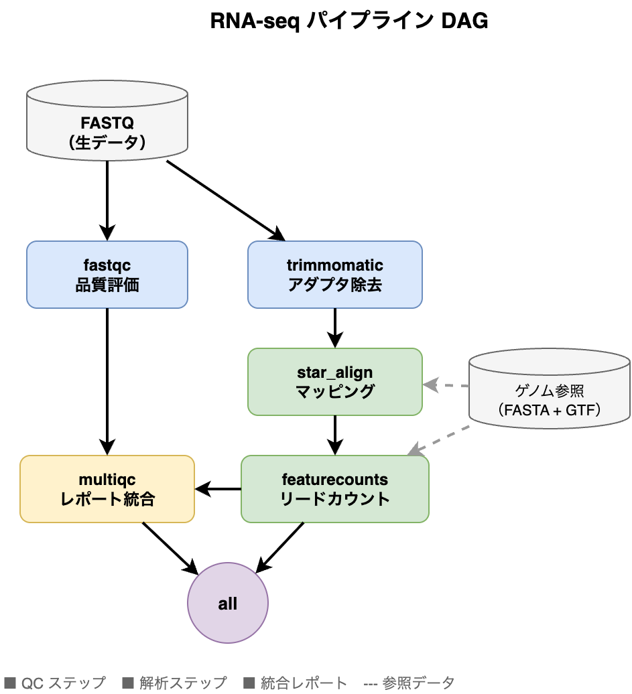
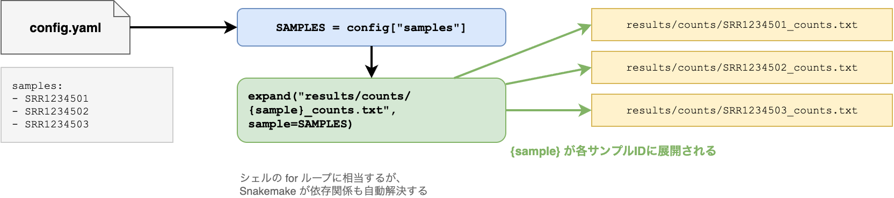

# §14 解析パイプラインの自動化 — Snakemake・Nextflow・CWL

> "Civilization advances by extending the number of important operations which we can perform without thinking about them."
> （文明は、考えずに実行できる重要な操作の数を増やすことによって進歩する。）
> — Alfred North Whitehead, *An Introduction to Mathematics* (1911), ch. 5

[§13 可視化の実践](./13_visualization.md)では、matplotlib・seabornによるプロットの作成と、科学的可視化の原則を学んだ。しかし、データ処理と可視化のスクリプトが個別ファイルのまま増えていくと、「どのスクリプトをどの順番で実行するのか」「入力ファイルが更新されたらどこまで再実行すればよいのか」という管理上の問題が生じる。

この問題を解決するのが**ワークフロー言語**（workflow language）である。ワークフロー言語は処理ステップ間の依存関係を宣言的に記述し、実行順序の決定・並列化・途中からの再開をエンジンに委ねる仕組みである。代表的なツールとしてSnakemake、Nextflow、CWL、makeがあり、いずれもバイオインフォマティクスのパイプライン構築で広く使われている。

AIエージェントはSnakemakeやNextflowのコードを生成できる。しかし、ルール間の依存関係が正しいか、wildcard展開がサンプルリストと一致しているか、中間ファイルの管理方針が適切か——これらの設計判断は、パイプラインの全体像を把握している人間がレビューしなければならない。

本章では、ワークフロー言語（Snakemake、Nextflow、CWL、make）の基礎と、再現可能なパイプラインを設計するためのベストプラクティスを学ぶ。

---

## 14-1. なぜワークフロー言語が必要か

### シェルスクリプトの限界

RNA-seq解析を例に考える。典型的なパイプラインは以下の7ステップで構成される:

1. QC（FastQC）
2. アダプター除去・トリミング（Trimmomatic）
3. リファレンスへのマッピング（STAR）
4. BAMのソート・インデックス（samtools）
5. リードカウント（featureCounts）
6. 差次的発現解析（DESeq2）
7. 可視化（[§13 可視化の実践](./13_visualization.md)のVolcano plot等）

これをシェルスクリプトで書くと、以下のような問題に直面する:

```bash
#!/bin/bash
# run_pipeline.sh — シェルスクリプトによるRNA-seqパイプライン（問題のある例）

SAMPLES="SRR1234501 SRR1234502 SRR1234503"

for sample in $SAMPLES; do
    fastqc data/raw/${sample}.fastq.gz -o results/qc/
    trimmomatic SE data/raw/${sample}.fastq.gz results/trimmed/${sample}_trimmed.fastq.gz \
        ILLUMINACLIP:TruSeq3-PE.fa:2:30:10 LEADING:3 TRAILING:3 MINLEN:36
    STAR --runThreadN 8 --genomeDir data/raw/genome/star_index \
         --readFilesIn results/trimmed/${sample}_trimmed.fastq.gz \
         --readFilesCommand zcat --outSAMtype BAM SortedByCoordinate \
         --outFileNamePrefix results/aligned/${sample}_
    featureCounts -T 4 -a data/raw/genome/GRCh38.gtf \
        -o results/counts/${sample}_counts.txt \
        results/aligned/${sample}_Aligned.sortedByCoord.out.bam
done
```

一見動きそうに見えるが、実用上の問題が3つある:

**部分的な再実行ができない。** STARのマッピングが3サンプル目で失敗した場合、スクリプト全体を最初から再実行するか、手動で失敗箇所を特定して部分実行するしかない。サンプル数が数十になると、この手動管理は破綻する。

**サンプル展開が手動である。** サンプルリストの変更がスクリプト先頭のハードコーディングに依存している。設定ファイルからの読み込みも可能だが、「どのサンプルが完了済みか」の追跡は自前で実装する必要がある。

**HPC並列化が困難である。** 各サンプルのマッピングは独立に実行できるが、シェルスクリプトのforループでは逐次実行になる。HPCのジョブスケジューラに投入するには、ジョブ間の依存関係を手動で記述しなければならない。

### 依存関係の自動解決 — DAGとしてのワークフロー

ワークフロー言語は、処理を**DAG**（Directed Acyclic Graph; 有向非巡回グラフ）として定義する。各処理ステップ（ノード）は入力と出力を宣言し、ワークフローエンジンがファイルの依存関係を自動的に解決する。



この構造には3つの利点がある:

1. **変更されたルールだけ再実行**: 出力ファイルのタイムスタンプを入力と比較し、更新が必要なルールだけを実行する
2. **並列実行**: 独立したルール（上図のfastqcとtrimmomatic）を自動的に並列実行する
3. **途中再開**: 成功済みステップを保ったまま必要箇所だけ再実行できる。Snakemake では通常の up-to-date 判定に加えて `--rerun-incomplete` で不完全出力をやり直し、Nextflow では `-resume` でキャッシュを再利用する

### 導入タイミング

[§10 ソフトウェア成果物の設計](./10_deliverables.md)のパターン4（シェルスクリプト）からパターン5（ワークフロー言語）への移行サインを思い出そう:

- サンプルごとにコマンドをコピペしている
- 途中で失敗したら最初からやり直している
- HPCのジョブ管理が手動になっている

これらに1つでも心当たりがあれば、ワークフロー言語への移行を検討する時期である。逆に、ステップが2〜3個で固定、サンプルも1つだけという場合は、シェルスクリプトやMakefileで十分である。

#### エージェントへの指示例

パイプラインの複雑化に気づいたとき、エージェントに移行の判断材料を求めることができる:

> 「`run_pipeline.sh` を読んで、ステップ間の依存関係をDAGとして図示してください。Snakemakeへの移行が妥当か、判断材料を整理してください」

> 「このシェルスクリプトの各ステップを、Snakemakeのruleに変換してください。`config.yaml` でサンプルリストとパラメータを外出しにして、各ルールに `log:` ディレクティブを付けてください」

> 「現在のパイプラインは5サンプルですが、今後50サンプルに増える予定です。スケーラビリティの観点から、シェルスクリプトのままで問題になる箇所を指摘してください」

---

## 14-2. ワークフロー言語

### Snakemake — Pythonベースのワークフロー言語

Snakemake[1](https://doi.org/10.12688/f1000research.29032.2)[4](https://snakemake.readthedocs.io/)はPythonベースのワークフロー言語で、バイオインフォマティクス分野で最も広く使われているものの一つである。「ruleベースのMake」とも呼ばれ、GNU makeの概念をPythonの文法で拡張したものと考えるとわかりやすい。

#### ruleの基本構造

Snakemakeのワークフローは**rule**（ルール）の集合として定義する。各ルールは `input`（入力）、`output`（出力）、`shell`（実行コマンド）の3要素で構成される。以下のルールで使われている `{sample}` は**wildcard**（ワイルドカード）と呼ばれ、Snakemakeが出力ファイル名のパターンから自動的に値を推定する変数である（詳細は後述）:

```python
rule fastqc:
    input:
        "data/raw/{sample}.fastq.gz",
    output:
        html="results/qc/{sample}_fastqc.html",
        zip="results/qc/{sample}_fastqc.zip",
    log:
        "logs/fastqc/{sample}.log",
    threads: 4
    shell:
        "fastqc {input} --outdir results/qc --threads {threads} 2> {log}"
```

このルールは以下のように読める:

- **入力**: `data/raw/{sample}.fastq.gz` — `{sample}` はwildcard（後述）
- **出力**: `results/qc/` 以下にFastQCのHTML・ZIPレポート
- **ログ**: `logs/fastqc/{sample}.log` — 標準エラー出力を保存
- **実行**: `fastqc` コマンドを4スレッドで実行

Snakemakeは「出力ファイルから逆算して」必要なルールを決定する。最終的に欲しい出力を `rule all` の `input` に列挙する:

```python
rule all:
    input:
        expand("results/counts/{sample}_counts.txt", sample=SAMPLES),
        expand("results/qc/{sample}_fastqc.html", sample=SAMPLES),
```

#### wildcards — サンプル展開の自動化

`{sample}` は**wildcard**（ワイルドカード）と呼ばれ、Snakemakeがファイル名のパターンから自動的に値を推定する。`expand()` 関数と組み合わせることで、サンプルリストからすべての出力パスを生成できる:

```python
# config.yamlからサンプルリストを読み込む
configfile: "config.yaml"
SAMPLES = config["samples"]  # ["SRR1234501", "SRR1234502", "SRR1234503"]

# expand()でサンプルごとの出力パスを生成
# → ["results/counts/SRR1234501_counts.txt",
#    "results/counts/SRR1234502_counts.txt",
#    "results/counts/SRR1234503_counts.txt"]
expand("results/counts/{sample}_counts.txt", sample=SAMPLES)
```



シェルスクリプトのforループと異なり、wildcardの利点は:

- サンプルの追加は `config.yaml` を編集するだけでよい
- 各サンプルの処理が独立に並列実行される（`snakemake -j 8` で8並列）
- 完了済みサンプルは自動的にスキップされる

#### 設定ファイル — パラメータの外出し

`configfile:` ディレクティブで設定ファイルを読み込み、パラメータをワークフロー定義から分離する:

```yaml
# config.yaml
samples:
  - SRR1234501
  - SRR1234502
  - SRR1234503

genome:
  fasta: "data/raw/genome/GRCh38.fa"
  gtf: "data/raw/genome/GRCh38.gtf"
  index: "data/raw/genome/star_index"

params:
  star:
    threads: 8
    overhang: 100
  featurecounts:
    strandedness: 2
```

Snakefileからは `config["genome"]["gtf"]` のようにアクセスする。これにより、異なるリファレンスゲノムや異なるパラメータセットでの実行が、Snakefileの修正なしに可能になる。コマンドラインから `--config samples='["s1","s2"]'` のように上書きすることもできる。

#### conda / container統合

Snakemakeはルールごとにconda環境やコンテナを指定できる:

```python
rule deseq2:
    input:
        counts=expand("results/counts/{sample}_counts.txt", sample=SAMPLES),
    output:
        "results/deg/deseq2_results.csv",
    log:
        "logs/deseq2.log",
    conda:
        "envs/deseq2.yaml"  # このルール専用のconda環境
    script:
        "scripts/run_deseq2.R"
```

`conda:` ディレクティブを使うと、`snakemake --use-conda` 実行時にルールごとに隔離された環境が自動作成される。これは[§15 コンテナによるソフトウェア環境の再現](./15_container.md)で詳しく扱う再現性確保の第一歩である。`container:` ディレクティブでDockerやApptainerイメージを指定することもできる。

#### Snakefileの完全な例

本書のサンプルコード（`scripts/ch14/Snakefile`）に、QC → トリミング → マッピング → 定量の4ステップで構成されるRNA-seqワークフローの完全な例を配置している。以下にその構造を示す:

```python
configfile: "config.yaml"

SAMPLES = config["samples"]

rule all:
    input:
        expand("results/counts/{sample}_counts.txt", sample=SAMPLES),
        expand("results/qc/{sample}_fastqc.html", sample=SAMPLES),

rule fastqc:
    input:
        "data/raw/{sample}.fastq.gz",
    output:
        html="results/qc/{sample}_fastqc.html",
        zip="results/qc/{sample}_fastqc.zip",
    log:
        "logs/fastqc/{sample}.log",
    threads: config["params"]["fastqc"]["threads"]
    shell:
        "fastqc {input} --outdir results/qc --threads {threads} 2> {log}"

rule trimmomatic:
    input:
        "data/raw/{sample}.fastq.gz",
    output:
        trimmed=temp("results/trimmed/{sample}_trimmed.fastq.gz"),
    log:
        "logs/trimmomatic/{sample}.log",
    # ... パラメータはconfig.yamlから読み込み
    shell:
        "trimmomatic SE {input} {output.trimmed} ... 2> {log}"

rule star_align:
    input:
        fastq="results/trimmed/{sample}_trimmed.fastq.gz",
        index=config["genome"]["index"],
    output:
        bam=temp("results/aligned/{sample}_Aligned.sortedByCoord.out.bam"),
    log:
        "logs/star/{sample}.log",
    threads: config["params"]["star"]["threads"]
    shell:
        "STAR --runThreadN {threads} ... 2> {log}"

rule featurecounts:
    input:
        bam="results/aligned/{sample}_Aligned.sortedByCoord.out.bam",
        gtf=config["genome"]["gtf"],
    output:
        counts="results/counts/{sample}_counts.txt",
    log:
        "logs/featurecounts/{sample}.log",
    shell:
        "featureCounts -a {input.gtf} -o {output.counts} {input.bam} 2> {log}"
```

注目すべきポイント:

- **中間ファイルの自動削除**: trimmomatic・star_alignの出力に `temp()` を付けている。下流のルールが完了すると中間ファイルが自動削除され、ディスク使用量を抑えられる
- **`log:`**: 全ルールにlog:ディレクティブがあり、実行ログが `logs/` に保存される
- **`configfile:`**: パラメータがすべて `config.yaml` から読み込まれている

#### QCツールとトリミングパラメータの選択

上のSnakefileではFastQCとTrimmomaticを使っているが、ツールの選択とパラメータの設定には判断が必要である。

**QCツールの選択**: FastQCはQCレポートの生成に特化しており、トリミングは行わない。一方、**fastp**はQCレポートの生成とトリミングを1ステップで実行できる。MultiQCは複数サンプルのQCレポートを統合する。新規パイプラインでは、FastQC + Trimmomaticの2ステップを fastp + MultiQC に置き換える構成が有力な候補になるが、既存手順や論文再現では元のツールチェーンを優先することも多い。

**トリミングパラメータの判断基準**: クオリティのトリミング閾値にはQ20（エラー率1%）とQ30（エラー率0.1%）がよく使われる。一般的なRNA-seq解析ではQ20で十分だが、バリアントコールなど塩基レベルの精度が求められる場合はQ30を選択する。最小リード長は、マッピングの感度とのトレードオフで決める。短すぎるリードはマルチマッピングを増やすため、通常20〜36 bpを下限とする。

**アダプター除去**: fastpはアダプター配列を自動検出する機能を持ち、多くの場合アダプター配列の手動指定が不要である。cutadaptやTrimmomaticではアダプター配列を明示的に指定する必要がある。

**低発現遺伝子のフィルタリング**: マッピング・定量の後、DEG解析の前に低発現遺伝子を除外するステップを入れるのが一般的である。典型的な基準は「CPM > 1 を $n$ サンプル以上で満たす」であり、$n$ は最小群のサンプル数とする。

---

### Nextflow — チャネルベースのワークフロー言語

Nextflow[2](https://doi.org/10.1038/nbt.3820)[5](https://www.nextflow.io/docs/latest/)はDSL2構文を採用したワークフロー言語で、データの流れを**チャネル**（channel）として表現する。Snakemakeの「ファイルベース」の依存解決とは設計思想が異なる。

#### DSL2の基本構文

Snakemakeのfastqcルールに対応するNextflowのprocess定義を示す:

```groovy
// fastqc.nf — Nextflow DSL2

params.samples = ["SRR1234501", "SRR1234502", "SRR1234503"]
params.outdir  = "results"

process FASTQC {
    publishDir "${params.outdir}/qc", mode: 'copy'

    input:
    path(fastq)

    output:
    path("*_fastqc.html"), emit: html
    path("*_fastqc.zip"),  emit: zip

    script:
    """
    fastqc ${fastq} --outdir .
    """
}

workflow {
    ch_fastq = Channel.fromPath("data/raw/*.fastq.gz")
    FASTQC(ch_fastq)
}
```

Snakemakeとの主な違い:

| 観点 | Snakemake | Nextflow |
|------|-----------|----------|
| 依存解決 | ファイルパスのパターンマッチ | チャネルによるデータの受け渡し |
| 記法 | Python風（Snakefileの中でPythonコードが書ける） | Groovy風のDSL2 |
| 再開 | 出力ファイルとメタデータに基づく再実行判定。必要に応じて `--rerun-incomplete` | `-resume`（ハッシュベースのキャッシュ） |
| HPC対応 | プロファイルやクラスタ実行オプション（版によりCLIが異なる） | `executor` 設定（SLURM, PBS, AWS Batch等） |

Nextflowのチャネルモデルは、データの流れが直感的に追いやすい一方で、ファイル名に基づく柔軟なパターンマッチはSnakemakeに比べてやや冗長になる場合がある。

Snakemake の HPC 連携に使う CLI は版によって差がある。`--cluster`、`--slurm`、executor / profile ベースの指定のどれを使うかは、使用している版の公式ドキュメントを確認すること[4](https://snakemake.readthedocs.io/)。

#### nf-core — 既存パイプライン群の活用

実際のプロジェクトでは、パイプラインをゼロから書く前に、nf-core[3](https://doi.org/10.1038/s41587-020-0439-x)[8](https://nf-co.re/)の既存パイプラインを検討するべきである。たとえばRNA-seq解析であれば:

```bash
# nf-coreのRNA-seqパイプラインを実行
nextflow run nf-core/rnaseq \
    --input samplesheet.csv \
    --genome GRCh38 \
    --outdir results/ \
    -profile docker
```

この1コマンドで、QCからカウント行列生成まで——本章で扱った全ステップに加えてMultiQCレポート生成まで——が実行される。

> 🧬 **コラム: QCメトリクスの読み方**
>
> 数値の「合格ライン」を知る。
>
> パイプラインの最初のステップであるQC（Quality Control）は、下流の全解析の前提となる。QCの結果を読めなければ、低品質なデータをそのまま解析に回してしまい、マッピング率の低下や偽陽性の増加を招く。以下に主要なQCメトリクスの目安をまとめる:
>
> | メトリクス | 確認ツール | 目安 | 不合格時の対処 |
> |---|---|---|---|
> | Per base quality | FastQC / fastp | Q30以上 | トリミング閾値の調整 |
> | GC content分布 | FastQC | 理論分布と一致 | コンタミネーション調査 |
> | Duplication rate | FastQC / Picard | ライブラリ依存 | dedup要否の判断 |
> | Adapter content | FastQC / fastp | 5%未満 | fastp / cutadaptで除去 |
> | Mapping rate | samtools flagstat | RNA-seq: 70%以上 | リファレンス確認 |
> | Uniquely mapped | STAR Log.final.out | 70%以上 | マルチマッパー処理方針の検討 |
>
> 多サンプルの実験では、**MultiQC**を使って全サンプルのQC結果を1つのHTMLレポートに統合すると、外れ値サンプルを一目で発見できる。上のSnakefileの例に `multiqc results/qc/` を追加するだけで統合レポートが生成される。
>
> これらの目安は生物種や実験手法によって異なる。たとえばメタゲノムではマッピング率が低くても正常であり、Amplicon-seqではduplication rateが高いのは想定内である。AIエージェントに「このサンプルのマッピング率は75%だが、ヒトRNA-seqとしては正常か？」と聞けるようになることが、本コラムの目標である。

> 🧬 **コラム: nf-coreエコシステム**
>
> nf-core[3](https://doi.org/10.1038/s41587-020-0439-x)[8](https://nf-co.re/)は、Nextflowベースのバイオインフォマティクスパイプラインを開発・共有するコミュニティ主導のプロジェクトである。2026年時点でも多数のパイプラインが公開されており、RNA-seq、ATAC-seq、メタゲノム、系統解析など主要な解析タイプをカバーしている。
>
> **ゼロから書くか、nf-coreを使うか** の判断基準:
>
> - **nf-coreを使う**: 標準的な解析パイプライン（RNA-seq, variant calling等）で、カスタマイズが最小限の場合。論文でのcitationも容易
> - **自前で書く**: 解析手法が新しくnf-coreにパイプラインがない、または独自の前処理が多い場合
> - **nf-coreをフォークして改変**: 基本構造はnf-coreを流用し、特定ステップだけカスタマイズする中間的なアプローチ
>
> nf-coreパイプラインは厳格なコーディング規約とCIテストを課しているため、品質が安定している。初めてワークフロー言語に触れる場合でも、`nf-core/rnaseq` の設計を読むことで、ベストプラクティスの実例として学べる。

---

### CWL — ポータブルなワークフロー言語

**CWL**（Common Workflow Language）[9](https://www.commonwl.org/)は、特定のプログラミング言語に依存しない**YAML宣言型**のワークフロー記述仕様である。SnakemakeがPython、NextflowがGroovyに紐づいているのに対し、CWLはワークフローの**定義**と**実行エンジン**を分離している。同一の`.cwl`ファイルを、リファレンス実装の`cwltool`[10](https://github.com/common-workflow-language/cwltool)、Toil、AWS上のSeven Bridgesなど、異なるエンジンで実行できる。このポータビリティこそがCWLの最大の特徴である。

CWLが特に重要になるのは、[§20 コードとデータのセキュリティ・倫理](./20_security_ethics.md)で紹介したTRE（Trusted Research Environment）を使う場合である。Seven BridgesのCancer Genomics CloudはCWLを標準ワークフロー形式として採用しており、Dockstore[11](https://dockstore.org/)（ワークフロー共有レジストリ）でもCWLは主要な記述形式の一つである。

#### CommandLineToolの基本構造

CWLでは、個々のコマンドラインツールを**CommandLineTool**として定義する。以下はFASTQファイルの品質フィルタリング（fastp）をCWLで記述した例である:

```yaml
# fastp_filter.cwl — FASTQの品質フィルタリング
cwlVersion: v1.2
class: CommandLineTool
baseCommand: fastp

requirements:
  DockerRequirement:
    dockerPull: biocontainers/fastp:0.23.4--hadf994f_0

inputs:
  fastq_r1:
    type: File
    inputBinding:
      prefix: --in1
  fastq_r2:
    type: File
    inputBinding:
      prefix: --in2
  sample_name:
    type: string

outputs:
  filtered_r1:
    type: File
    outputBinding:
      glob: $(inputs.sample_name)_filtered_R1.fastq.gz
  filtered_r2:
    type: File
    outputBinding:
      glob: $(inputs.sample_name)_filtered_R2.fastq.gz
  report_html:
    type: File
    outputBinding:
      glob: $(inputs.sample_name)_fastp.html

arguments:
  - prefix: --out1
    valueFrom: $(inputs.sample_name)_filtered_R1.fastq.gz
  - prefix: --out2
    valueFrom: $(inputs.sample_name)_filtered_R2.fastq.gz
  - prefix: --html
    valueFrom: $(inputs.sample_name)_fastp.html
```

Snakemakeの`rule`やNextflowの`process`と対比すると構造がわかりやすい。`inputs`が入力、`outputs`が出力、`baseCommand`が実行コマンド、`DockerRequirement`がコンテナ指定に対応する。CWLではこれらをすべてYAML形式で宣言的に記述する。

#### Workflowの定義

複数のCommandLineToolを組み合わせてパイプラインを構成するには、`class: Workflow`を使う:

```yaml
# rnaseq_pipeline.cwl — RNA-seq解析ワークフロー
cwlVersion: v1.2
class: Workflow

inputs:
  fastq_r1: File
  fastq_r2: File
  sample_name: string
  genome_index: Directory

outputs:
  bam:
    type: File
    outputSource: align/bam_output
  fastp_report:
    type: File
    outputSource: filter/report_html

steps:
  filter:
    run: fastp_filter.cwl
    in:
      fastq_r1: fastq_r1
      fastq_r2: fastq_r2
      sample_name: sample_name
    out: [filtered_r1, filtered_r2, report_html]

  align:
    run: hisat2_align.cwl
    in:
      fastq_r1: filter/filtered_r1
      fastq_r2: filter/filtered_r2
      genome_index: genome_index
      sample_name: sample_name
    out: [bam_output]
```

`steps`の各ステップが`in`と`out`でデータの流れを定義する。Nextflowのチャネルに似た構造だが、CWLではYAMLの中で明示的にステップ間の接続を記述する。

#### 入力ファイル（ジョブファイル）

CWLの大きな特徴は、ワークフロー定義（`.cwl`）と入力パラメータ（`.yml`）が**完全に分離**されていることである:

```yaml
# inputs.yml — 入力パラメータ
fastq_r1:
  class: File
  location: data/raw/sample_A_R1.fastq.gz
fastq_r2:
  class: File
  location: data/raw/sample_A_R2.fastq.gz
sample_name: sample_A
genome_index:
  class: Directory
  location: data/ref/hisat2_index/
```

実行は以下のコマンドで行う:

```bash
# cwltoolでローカル実行
cwltool rnaseq_pipeline.cwl inputs.yml
```

ワークフロー定義を変えずに入力ファイルだけを差し替えられるため、同じパイプラインを異なるサンプルやデータセットに繰り返し適用しやすい。これはTRE環境で標準化されたパイプラインを多数のサンプルに適用する運用と相性がよい。

#### CWLを使う場面

CWLは学習コストがSnakemake/Nextflowより高い（YAMLの記述量が多く、Pythonのように柔軟にロジックを書けない）。そのため、以下の場面で特に価値がある:

- **TRE環境**（Seven Bridges、Terra、AnVIL）でワークフローを実行する場合
- **Dockstore**でワークフローを公開・共有する場合
- **異なる実行環境への移植性**を最優先する場合
- 既存のCWLワークフローを**再利用する**場合（自分で一から書くよりも頻繁）

逆に、ローカルPCやHPCでの日常的な解析にはSnakemakeやNextflowのほうが生産性が高い。CWLの記述は冗長になりやすいが、エージェントに「このSnakefileをCWLに変換して」と依頼すれば変換コードを生成してくれるため、CWLの文法をすべて暗記する必要はない。

#### エージェントへの指示例

> 「このSnakefileをCWL v1.2形式に変換してください。各ルールをCommandLineToolとして分離し、全体をWorkflowで繋いでください。DockerRequirementにはBioContainersのイメージを指定してください」

> 「DockstoreからCWLワークフローをダウンロードして、ローカルのcwltoolで実行するための入力YAMLファイル（inputs.yml）を作成してください。サンプルはdata/raw/配下のFASTQです」

---

### make — 古典的だが今も有用

GNU make はソフトウェアビルドのために設計されたツールだが、小規模なデータ処理パイプラインにも有用である[7](https://pubmed.ncbi.nlm.nih.gov/27013646/)。リファレンスゲノムのダウンロードとインデックス構築のような準備ステップに適している:

```makefile
# Makefile — リファレンスゲノムの取得とインデックス構築
GENOME_URL := https://ftp.ensembl.org/pub/release-111/fasta/homo_sapiens/dna/...
GENOME_DIR := data/raw/genome
GENOME_FA  := $(GENOME_DIR)/GRCh38.fa

.PHONY: all clean

all: $(GENOME_FA).fai

$(GENOME_FA).gz:
	mkdir -p $(GENOME_DIR)
	curl -L -o $@ $(GENOME_URL)

$(GENOME_FA): $(GENOME_FA).gz
	gunzip -k $<

$(GENOME_FA).fai: $(GENOME_FA)
	samtools faidx $<
```

`make all` を実行するとダウンロード → 解凍 → インデックス構築が依存順に実行される。途中で止まっても、完了済みのステップはスキップされる。

makeの利点は、追加のインストールが不要で、ほぼすべてのUNIX環境で利用可能なことである。一方、wildcardの展開やconda/container統合、HPCジョブスケジューラとの連携といったバイオインフォマティクス固有の要件は自前で記述する必要があり、パイプラインが複雑化すると管理が難しくなる。

---

### ツール選択の判断基準

| 基準 | make | Snakemake | Nextflow | CWL |
|------|------|-----------|----------|-----|
| 学習コスト | 低 | 中 | 高 | 高 |
| Python親和性 | 低 | 高（Snakefile内でPythonが書ける） | 低（Groovy/DSL2） | 低（YAML宣言型） |
| HPC対応 | 手動（ジョブスクリプト記述） | プロファイルやクラスタ実行オプション | 組み込み（executor設定） | 実行エンジン依存 |
| conda/container統合 | なし | `conda:`, `container:` | `container` プロファイル | `DockerRequirement` |
| 既存パイプライン | 少ない | Snakemake Catalog | nf-core（100+パイプライン） | Dockstore、Seven Bridges |
| 向いている規模 | 小規模（前処理・準備） | 中〜大規模 | 大規模・クラウド | TRE環境・クラウド |

**迷ったらSnakemakeから始めることを推奨する。** PythonベースでありNumPy・pandasとの親和性が高く、本書の読者にとって学習コストが最も低い。プロジェクトがクラウド環境やHPCの大規模利用に移行する段階でNextflowへの乗り換えを検討すればよい。TRE環境でCWLが求められる場合は、エージェントに既存ワークフローの変換を依頼するのが実践的なアプローチである。

#### エージェントへの指示例

ワークフロー言語の選択や移行をエージェントに相談できる:

> 「このプロジェクトのパイプラインをSnakemakeで実装してください。サンプルリストは `config.yaml` から読み込み、各ルールに `log:` ディレクティブと `threads:` を設定してください」

> 「既存のSnakefileを読んで、同等のNextflow DSL2コードに変換してください。チャネルの設計も提案してください」

> 「RNA-seqの解析をしたいのですが、nf-core/rnaseqで対応できますか？ 必要なsamplesheet.csvの形式と最小限の実行コマンドを教えてください」

---

## 14-3. ワークフローのベストプラクティス

ワークフロー言語を使うだけでは再現性は保証されない。以下のベストプラクティスに従うことで、自分自身が半年後に再実行でき、他の研究者が再現できるパイプラインになる。

### 入力データは読み取り専用

`data/raw/` ディレクトリの内容は決して変更しない。これは[§7 Git入門](./07_git.md)で学んだ原則と同じである。ワークフローの中で入力ファイルを上書きすると、「元のデータで再実行」ができなくなる。

```
project/
├── data/
│   └── raw/          # 読み取り専用 — 生データ
├── results/          # ワークフローの出力
│   ├── qc/
│   ├── trimmed/
│   ├── aligned/
│   └── counts/
├── logs/             # 実行ログ
├── Snakefile
└── config.yaml
```

Snakemakeのルールで入力に `data/raw/` を使い、出力を `results/` に書くことで、入出力の方向を一方向に保つ。

### 中間ファイルと最終出力の分離

BAMファイルやトリミング後のFASTQファイルは中間ファイルであり、最終出力ではない。Snakemakeの `temp()` マーカーを使うと、下流のルールが完了した時点で自動削除される:

```python
rule trimmomatic:
    input:
        "data/raw/{sample}.fastq.gz",
    output:
        trimmed=temp("results/trimmed/{sample}_trimmed.fastq.gz"),
    # ...
```

`temp()` を使わない場合、RNA-seqの全中間ファイルがディスクに残り続ける。BAMファイルは1サンプルあたり数GBになることもあり、サンプル数が増えるとディスク容量を圧迫する。

`protected()` は逆に、誤って削除されないようにファイルを保護する。計算コストの高いステップの出力に付けるとよい:

```python
rule star_align:
    output:
        bam=protected("results/aligned/{sample}.bam"),
    # ...
```

### パラメータの設定ファイル化

本書全体の規約である「ハードコーディング禁止」はワークフローでも同様である。パラメータをSnakefileに直書きすると、異なる条件での再実行時にワークフロー定義自体を編集することになり、変更の追跡が困難になる。

```python
# ❌ パラメータのハードコーディング
rule star_align:
    threads: 8
    shell:
        "STAR --sjdbOverhang 100 ..."

# ✅ config.yamlからの読み込み
rule star_align:
    threads: config["params"]["star"]["threads"]
    shell:
        "STAR --sjdbOverhang {config[params][star][overhang]} ..."
```

### ログの保存

[§11 コマンドラインツールの設計と実装](./11_cli.md)で学んだロギングの原則はワークフローにも適用される。Snakemakeの `log:` ディレクティブは、各ルールの実行ログを指定したパスに保存する:

```python
rule star_align:
    log:
        "logs/star/{sample}.log",
    shell:
        "STAR ... 2> {log}"
```

`log:` ディレクティブのないルールでは、エラー発生時に原因特定が困難になる。本書のサンプルSnakefileでは、`rule all` を除くすべてのルールに `log:` を付けている。

### `--dry-run` / `--dag` による事前確認

ワークフローを本番実行する前に、必ずドライランで確認する:

```bash
# ドライラン — 実際のコマンドは実行せず、実行計画を表示
snakemake -n

# DAGの可視化 — 依存関係グラフをSVGで出力
snakemake --dag | dot -Tsvg > dag.svg
```

`-n`（`--dry-run`）は「何が実行されるか」を確認するためのオプションで、実際のコマンドは発行されない。新しいルールを追加した後や、設定ファイルを変更した後は、まずドライランで実行計画を確認する習慣をつけるとよい。

### テスト用の小規模データ

[§8 テスト技法](./08_testing.md)で学んだテストの原則はワークフローにも適用される。パイプライン全体を実データで実行すると数時間かかる場合、テスト用の小規模データセットを用意して高速にフィードバックを得る:

```bash
# テスト用のサブサンプルを作成（先頭10,000リード）
head -n 40000 data/raw/SRR1234501.fastq > test_data/SRR1234501.fastq

# テスト用configで実行
snakemake --configfile test_config.yaml -j 4
```

この方法により、ワークフローの論理的な正しさを短時間で検証できる。テスト用データと設定は[§15 コンテナによるソフトウェア環境の再現](./15_container.md)で扱う再現性パッケージングにも含める。

### ベストプラクティスの自動チェック

本書のサンプルコード（`scripts/ch14/validate_workflow.py`）に、Snakefileのテキストを解析してベストプラクティス準拠を検証するバリデータを用意している:

```python
from scripts.ch14.validate_workflow import validate

snakefile_text = open("Snakefile").read()
result = validate(snakefile_text)

for item in result.passed:
    print(f"✅ {item}")
for item in result.warnings:
    print(f"⚠️  {item}")
```

このバリデータは以下の4項目をチェックする:

1. **`configfile:` の使用** — パラメータがハードコーディングされていないか
2. **`log:` ディレクティブの有無** — 全ルール（`rule all` を除く）にログ出力があるか
3. **中間ファイル管理** — `temp()` によるディスク管理マーカーが付いているか
4. **入出力パスの分離** — 入力ディレクトリに出力を書き込んでいないか

#### エージェントへの指示例

ベストプラクティスの適用をエージェントに依頼できる:

> 「このSnakefileを読んで、`log:` ディレクティブのないルールを洗い出してください。それぞれに適切なlogパスを追加してください」

> 「ワークフローの中間ファイルを特定して、`temp()` で囲むべき出力を提案してください。最終的にユーザーが必要とする出力は `results/counts/` と `results/qc/` のファイルです」

> 「このSnakefileに `--dry-run` を実行して、結果を説明してください。想定どおりのルールが実行される計画になっているか確認してください」

> 🤖 **コラム: 機械学習パイプラインのワークフロー管理**
>
> 機械学習プロジェクトでも、データ前処理 → 特徴量エンジニアリング → モデル学習 → 評価という多段階パイプラインが発生する。SnakemakeやNextflowで管理できるが、機械学習特有の要件——ハイパーパラメータの追跡、メトリクスの比較、モデルチェックポイントの管理——にはMLOps専用ツールの方が適している場合がある。
>
> **DVC**（Data Version Control）は、大規模なデータやモデルファイルのバージョン管理を主目的とするツールであり、`dvc.yaml` によるパイプライン定義機能も備えている。一方、**MLflow** は実験のメトリクス追跡・モデルレジストリ・デプロイ管理を担うプラットフォームである。両者の性質は異なるため、以下の対照表で使い分けの指針を示す。
>
> | 要件 | Snakemake/Nextflow | DVC（データ・モデル版管理） | MLflow（実験追跡・モデル管理） |
> |------|-------------------|-----|--------|
> | ファイル依存の解決 | 得意 | 得意 | 限定的 |
> | ハイパーパラメータ追跡 | 手動（configで管理） | `dvc params` | 組み込み |
> | メトリクス比較 | なし | `dvc metrics diff` | UIで比較 |
> | モデルレジストリ | なし | なし | 組み込み |
> | バイオツール連携 | conda/container | なし | なし |
>
> バイオインフォマティクスの文脈では、配列解析パイプライン（外部ツール呼び出しが中心）はSnakemake/Nextflow、機械学習実験（Pythonコードが中心）はDVC/MLflowと使い分けるのが現実的である。両方を含むプロジェクトでは、Snakemakeのワークフロー内でMLflowのトラッキングを呼び出す組み合わせも有効である。

---

## まとめ

| 課題 | シェルスクリプト | ワークフロー言語 |
|------|----------------|-----------------|
| 部分的再実行 | 手動で特定・再実行 | 変更部分だけ自動再実行 |
| サンプル展開 | forループ・コピペ | wildcards・expand() |
| 並列実行 | 手動（`&`, `xargs`） | `-j N` で自動並列 |
| HPC連携 | ジョブスクリプト手書き | プロファイルやクラスタ実行オプションで自動投入 |
| 中間ファイル管理 | 手動削除 | `temp()` で自動削除 |
| ログ管理 | リダイレクト忘れがち | `log:` で強制 |
| 再現性 | 低（環境依存） | conda/container統合 |

ワークフロー言語の導入は、パイプラインが3ステップ以上・サンプルが複数ある時点で検討に値する。本章で紹介した `configfile:`、`log:`、`temp()`、入出力の分離といったベストプラクティスは、どのワークフロー言語を選んでも共通の原則である。

次章の[§15 コンテナによるソフトウェア環境の再現](./15_container.md)では、ワークフロー言語で構築したパイプラインの実行環境をDockerやApptainerで固定し、**コンテナイメージ + ワークフロー + バージョン固定**の「三点セット」として論文の再現性を保証する方法を学ぶ。

---

## 演習問題

本章の内容を、エージェントとの協働を通じて実践する課題である。

### 演習 14-1: パイプライン化の判断 **[設計判断]**

以下の3つのシナリオについて、Snakemake/Nextflow のようなワークフロー言語で管理すべきかどうかを判断し、その理由を述べよ。

- (a) 3ステップ、1サンプルの解析を1回だけ実行する
- (b) 10ステップ、20サンプルの解析を実行する
- (c) 3ステップ、1サンプルの解析だが、月次で繰り返し実行する

（ヒント）ステップ数×サンプル数の積と繰り返し頻度が判断基準である。1回きりの小規模解析にワークフロー言語を導入するのは過剰だが、繰り返しがある場合は小規模でも自動化の価値がある。

### 演習 14-2: Snakefile のレビュー **[レビュー]**

エージェントが以下の Snakefile を生成した。再現性・保守性の観点から問題点を指摘せよ。

```python
rule all:
    input: "results/counts.tsv"

rule trim:
    input: "/home/user/data/{sample}.fastq.gz"
    output: "trimmed/{sample}.fastq.gz"
    shell: "fastp -i {input} -o {output}"

rule align:
    input: "trimmed/{sample}.fastq.gz"
    output: "aligned/{sample}.bam"
    shell: "bwa mem /home/user/ref/hg38.fa {input} | samtools sort -o {output}"
```

（ヒント）rule ごとに `log:` と `threads:` が定義されているか確認する。また、入力パスやリファレンスパスがハードコーディングされていないか、`configfile:` で外部化されているかを確認する。

### 演習 14-3: パイプラインの指示設計 **[指示設計]**

RNA-seq 解析パイプライン（FASTQ → トリミング → マッピング → カウント）を Snakemake で構築するための指示文を書け。以下の要素を含めること。

- サンプル名を `configfile:` で外部化する
- `wildcards` でサンプルごとに処理を展開する
- 各 rule に `log:` ディレクティブを設定する
- `threads:` で並列数を制御する

（ヒント）サンプル名を `config.yaml` で外部化し、`wildcards` で展開するパターンが基本形である。指示文には入力ファイルの命名規則（例: `{sample}_R1.fastq.gz`）と出力ディレクトリの構成も明記する。

### 演習 14-4: DAG の理解 **[概念]**

Snakemake が生成する DAG（有向非巡回グラフ）とは何か説明せよ。また、以下のシナリオでは DAG のどの部分が再実行されるかを具体的に述べよ。

- 3サンプル（A, B, C）の trim → align → count パイプラインを実行済み
- サンプル B の入力 FASTQ ファイルを差し替えた

（ヒント）DAG は rule 間の依存関係をグラフとして表現したものである。入力ファイルを変更した場合、その変更の「下流」にあるルールだけが再実行される。

---

## さらに学びたい読者へ

本章で扱ったワークフロー管理ツールをさらに深く学びたい読者に向けて、原論文と公式リソースを紹介する。

### ワークフローツールの原論文

- **Mölder, F. et al. "Sustainable data analysis with Snakemake." *F1000Research*, 10, 33, 2021.** https://doi.org/10.12688/f1000research.29032.2 — 本章の参考文献 [1] で引用。Snakemakeの設計哲学、DAGベースの実行モデル、再現性確保の仕組みが詳述されている。
- **Di Tommaso, P. et al. "Nextflow enables reproducible computational workflows." *Nature Biotechnology*, 35(4), 316–319, 2017.** https://doi.org/10.1038/nbt.3820 — 本章の参考文献 [2] で引用。NextflowのDSL2データフロープログラミングモデルの設計思想を理解できる。

### パイプラインフレームワークの比較

- **Leipzig, J. "A review of bioinformatic pipeline frameworks." *Briefings in Bioinformatics*, 18(3), 530–536, 2017.** https://pubmed.ncbi.nlm.nih.gov/27013646/ — バイオインフォパイプラインフレームワークの比較レビュー。Snakemake/Nextflow以外の選択肢（CWL、WDL、Luigi等）も含めた全体像を把握できる。

### 公式チュートリアル

- **Snakemake Documentation. "Tutorial".** https://snakemake.readthedocs.io/en/stable/tutorial/tutorial.html — 公式チュートリアル。本章で概要を扱ったSnakemakeの機能（wildcard、configfile、conda integration等）を段階的に学べる。
- **nf-core Community.** https://nf-co.re/ — コミュニティ管理のNextflowパイプライン集。ベストプラクティスに従ったパイプライン設計の参考例として活用できる。特にDeveloper Tutorialsが自作パイプラインの学習に有用。

---

## 参考文献

[1] Mölder, F. et al. "Sustainable data analysis with Snakemake." *F1000Research*, 10, 33, 2021. [https://doi.org/10.12688/f1000research.29032.2](https://doi.org/10.12688/f1000research.29032.2)

[2] Di Tommaso, P. et al. "Nextflow enables reproducible computational workflows." *Nature Biotechnology*, 35(4), 316–319, 2017. [https://doi.org/10.1038/nbt.3820](https://doi.org/10.1038/nbt.3820)

[3] Ewels, P. A. et al. "The nf-core framework for community-curated bioinformatics pipelines." *Nature Biotechnology*, 38(3), 276–278, 2020. [https://doi.org/10.1038/s41587-020-0439-x](https://doi.org/10.1038/s41587-020-0439-x)

[4] Snakemake Development Team. "Snakemake Documentation". [https://snakemake.readthedocs.io/](https://snakemake.readthedocs.io/) (参照日: 2026-03-20)

[5] Seqera Labs. "Nextflow Documentation". [https://www.nextflow.io/docs/latest/](https://www.nextflow.io/docs/latest/) (参照日: 2026-03-20)

[6] Grüning, B. et al. "Bioconda: sustainable and comprehensive software distribution for the life sciences." *Nature Methods*, 15(7), 475–476, 2018. [https://doi.org/10.1038/s41592-018-0046-7](https://doi.org/10.1038/s41592-018-0046-7)

[7] Leipzig, J. "A review of bioinformatic pipeline frameworks." *Briefings in Bioinformatics*, 18(3), 530–536, 2017. [https://pubmed.ncbi.nlm.nih.gov/27013646/](https://pubmed.ncbi.nlm.nih.gov/27013646/)

[8] nf-core Community. "nf-core — A community effort to collect a curated set of analysis pipelines". [https://nf-co.re/](https://nf-co.re/) (参照日: 2026-03-20)

[9] Common Workflow Language Project. "Common Workflow Language". [https://www.commonwl.org/](https://www.commonwl.org/) (参照日: 2026-03-31)

[10] Common Workflow Language Project. "cwltool — CWL reference implementation". [https://github.com/common-workflow-language/cwltool](https://github.com/common-workflow-language/cwltool) (参照日: 2026-03-31)

[11] Dockstore. "A platform for sharing Docker-based tools and workflows". [https://dockstore.org/](https://dockstore.org/) (参照日: 2026-03-31)
