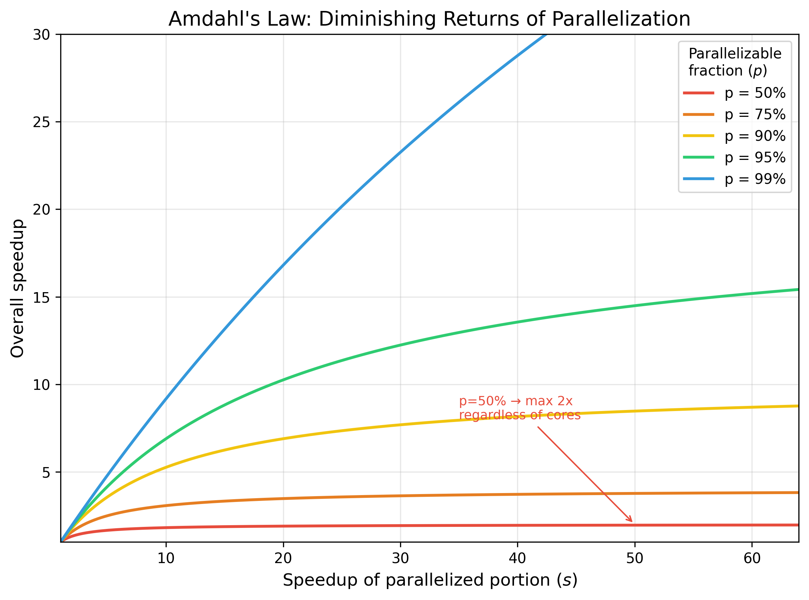
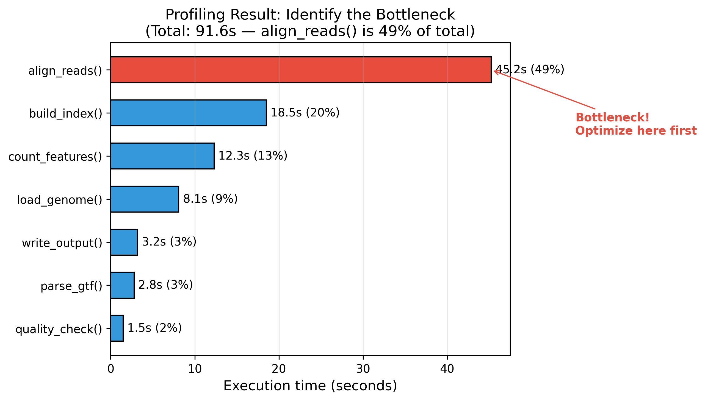

# §17 コードのパフォーマンス改善 — プロファイリングと高速化

> "We should forget about small efficiencies, say about 97% of the time: premature optimization is the root of all evil."
> （小さな効率のことは、97%の場合は忘れるべきだ。早すぎる最適化は諸悪の根源である。）
> — Donald Knuth, *ACM Computing Surveys*, 6(4), 268 (1974)

[§16 スパコン・クラスタでの大規模計算](./16_hpc.md)では、HPCクラスタへのジョブ投入とリソース管理を学んだ。しかし、`sacct` で確認した実行時間やメモリ使用量が想定を大きく超えていた場合、コードのどこに問題があるのかを特定する力がなければ、リソースを増やすだけの対処しかできない。

プロファイリングの知識があれば、エージェントが生成したコードの性能ボトルネックを自分で診断し、「この関数が全体の80%の時間を消費している。$O(n^2)$ のループを$O(n)$ に改善して」と具体的に指示できる。この知識がなければ「遅いから速くして」という曖昧な指示しか出せず、エージェントが的外れな箇所を最適化してしまうリスクがある。エージェントは高速化コードの生成が得意だが、「どこを最適化すべきか」の優先順位づけ——寄与率の大きさ、メモリ制約とのトレードオフ、可読性の維持——は計測データを見て人間が判断する必要がある。

本章では、プロファイリングによるボトルネック特定（17-1）、高速化テクニック（17-2）、大規模データのメモリ効率的な処理（17-3）を学ぶ。

---

## 17-1. プロファイリング

### 最適化の第一原則: 計測してから改善する

コードの高速化に取りかかる前に、もっとも重要な原則がある。**推測するな、計測せよ**。

Donald Knuthの有名な格言がある:

> "Premature optimization is the root of all evil."
> （時期尚早な最適化は諸悪の根源である）[1](https://doi.org/10.1145/356635.356640)

これは「最適化するな」という意味ではない。「計測に基づかない最適化は害になる」という意味である。計測なしに「ここが遅そうだ」と推測して最適化すると、実際のボトルネックではない箇所に時間を費やし、コードの可読性だけが低下する結果になりかねない。

もう一つ知っておくべきなのが**Amdahlの法則**（アムダールの法則）[2](https://doi.org/10.1145/1465482.1465560)である。プログラム全体のうち、ある処理が占める割合を $p$ とすると、その処理を $s$ 倍高速化しても全体の高速化率は:

$$
\text{全体の高速化率} = \frac{1}{(1 - p) + p/s}
$$

たとえば、全体の10%しか占めない関数をいくら高速化しても、全体の速度改善は最大でも約11%にしかならない。逆に、全体の80%を占める関数を2倍速くすれば、全体は約1.7倍速くなる。だからこそ、**まずボトルネックを計測で特定する**ことが重要なのである。



### 実行環境の把握

プロファイリング結果を正しく解釈するには、まず実行環境のハードウェア構成を知る必要がある。CPU コア数を知らなければ並列ワーカー数を決められないし、RAM 容量を知らなければ `memory_profiler` の結果が深刻かどうか判断できない。ディスク容量を知らなければ中間ファイルの書き出し戦略も立てられない。[§3-5 計算機アーキテクチャの基礎](./03_cs_basics.md#3-5-計算機アーキテクチャの基礎)で学んだメモリ階層やI/Oの理論が、ここで実践に結びつく。

#### CPU の確認

`lscpu` はCPUの詳細情報を表示するコマンドである。モデル名、物理コア数、スレッド数（ハイパースレッディング）、キャッシュサイズなどがわかる:

```bash
# lscpu: CPU のアーキテクチャ情報を表示
# 注目すべき項目: CPU(s), Thread(s) per core, Core(s) per socket, Model name
lscpu
```

`nproc` は利用可能な論理プロセッサ数だけを返す。並列ワーカー数の上限を見積もる目安にはなるが、HPC のジョブ内では `SLURM_CPUS_PER_TASK` や cpuset 制約を優先して解釈する:

```bash
# nproc: 利用可能な論理プロセッサ数を表示
nproc
```

より詳細な情報（クロック周波数、CPUフラグなど）が必要な場合は `/proc/cpuinfo` を確認する:

```bash
# /proc/cpuinfo: 各論理CPUの詳細情報を表示
# head -20 で最初のCPU分だけ確認
cat /proc/cpuinfo | head -20
```

実用的な読み方の例: `lscpu` で「Core(s) per socket: 8」「Thread(s) per core: 2」と表示されたら、物理8コア、論理16コアである。ローカル実行なら `ProcessPoolExecutor(max_workers=物理コア数)` が目安になるが、ジョブスケジューラ配下では「マシン全体のコア数」ではなく「自分に割り当てられたコア数」を上限にする。

#### メモリの確認

`free` コマンドはシステムのメモリ使用状況を表示する。`-h` オプションで人間が読みやすい単位（GB, MB）になる:

```bash
# free -h: メモリの合計、使用量、空き容量をGB/MB単位で表示
# 注目すべき項目: total（物理メモリ合計）、available（実際に利用可能な量）
free -h
```

`/proc/meminfo` ではさらに詳細な情報を確認できる。`MemTotal`（物理メモリ合計）と `MemAvailable`（利用可能メモリ）が特に重要である:

```bash
# MemTotal と MemAvailable だけを抽出
grep -E "MemTotal|MemAvailable" /proc/meminfo
```

実用的な読み方の例: `free -h` で total=64GB、available=50GB と表示された環境で、`memory_profiler` のピーク使用量が45GBなら、他のプロセスと合わせてスワップが発生する危険域である。

バイオインフォマティクスでは、処理前にメモリ見積もりを立てる習慣が重要である。たとえば遺伝子数 × サンプル数 × 8バイト(float64) でカウント行列のメモリ量を概算できる。20,000遺伝子 × 1,000サンプルなら約160 MBだが、100,000遺伝子 × 10,000サンプルでは約8 GBになる。

#### ストレージの確認

`df` コマンドはマウントポイントごとのディスク使用率と空き容量を表示する。`-h` オプションで人間が読みやすい単位になる:

```bash
# df -h: マウントポイントごとの使用率・空き容量を表示
# /tmp や /scratch など中間ファイルの書き出し先を事前チェック
df -h
```

`du` コマンドはディレクトリやファイルの実サイズを確認する。`-s` でサマリー、`-h` で単位変換する:

```bash
# du -sh: 指定ディレクトリ/ファイルの合計サイズを表示
# ワイルドカードで複数ファイルのサイズを一括確認
du -sh *.bam
du -sh /data/project/
```

`lsblk` はブロックデバイスの一覧を表示する。SSD か HDD かの判別に使える:

```bash
# lsblk: ブロックデバイスの一覧（名前、サイズ、タイプ、マウントポイント）
lsblk
```

実用的な読み方の例: `du -sh *.bam` で入力ファイルの合計が200GBとわかり、`df -h /tmp` で空き容量が300GBしかなければ、中間ファイルの書き出し戦略を事前に検討する必要がある。

#### リアルタイムモニタリング

プロファイラで事前に計測するだけでなく、実行中のプロセスをリアルタイムで監視することも重要である。

`top` はほぼすべてのLinuxシステムに標準で入っているプロセスモニタである:

```bash
# top: CPU使用率、メモリ使用率の上位プロセスをリアルタイム表示
# 主要カラム: PID（プロセスID）, %CPU, %MEM, RES（物理メモリ使用量）, COMMAND
# キー操作: q(終了), M(メモリ順ソート), P(CPU順ソート), 1(コアごとの使用率表示)
top
```

`htop` は `top` の改良版で、CPUコアごとのバーグラフ表示やマウス操作に対応している。`btm`（bottom）はRust製のモダンなシステムモニタで、グラフ表示やディスクI/Oも一画面で確認できる:

```bash
# htop: 対話的なプロセスモニタ（インストールが必要な場合あり）
htop

# btm: Rust製のモダンなシステムモニタ（グラフ表示、ディスクI/O込み）
btm
```

使い分けの目安: `top` は標準装備のためどの環境でも確実に使える。`htop` や `btm` は視覚的にわかりやすいが、別途インストールが必要である。

> ### コラム: macOSでの環境確認 — BSDとLinuxの違い
>
> 本節で紹介したコマンドの多くはLinux固有であり、macOSでは `command not found` になる。これはmacOSのカーネル（Darwin）がBSD系UNIXに由来するためである。一般的な大学・研究所のPCクラスタや解析サーバはほぼすべてLinux（GNU/Linux）で動いており、`lscpu`, `free`, `nproc` などはGNUプロジェクトやLinuxカーネルが提供するツールである。macOS（BSD系）はこれらとは別系統のユーティリティ群を持つため、同じ情報でも異なるコマンドで取得する必要がある。
>
> | 情報 | Linux (GNU/Linux) | macOS (BSD系) | Homebrew で導入 |
> |------|-------------------|---------------|----------------|
> | CPUモデル・コア数 | `lscpu` | `sysctl -n machdep.cpu.brand_string` (モデル名), `sysctl -n hw.physicalcpu` (物理コア), `sysctl -n hw.logicalcpu` (論理コア) | — |
> | 論理プロセッサ数 | `nproc` | `sysctl -n hw.logicalcpu` | `brew install coreutils` → `gnproc` |
> | メモリ合計・使用量 | `free -h` | `sysctl -n hw.memsize` (合計バイト数), `vm_stat` (ページ単位の使用状況) | — |
> | ブロックデバイス | `lsblk` | `diskutil list` | — |
> | リアルタイムモニタ | `htop`, `btm` | 同左 | `brew install htop bottom` |
>
> `df -h`, `du -sh`, `top` は両OSで使える（`top` の出力形式は異なる）。
>
> Homebrew（[§6 Python環境の構築](./06_dev_environment.md)参照）を使えば、一部のGNUコマンドをmacOSにインストールできる:
>
> ```bash
> # coreutils: nproc 等の GNU コマンドを g 接頭辞付きで提供
> brew install coreutils
> gnproc   # nproc 相当
> ```
>
> ただし `lscpu` や `free` にはHomebrew版がないため、macOSでは `sysctl` を使うことになる。OS差異を気にせず使えるのがPythonの標準ライブラリである。次の「Pythonから実行環境を取得する」で紹介する `os.cpu_count()` や `shutil.disk_usage()` はLinuxでもmacOSでも同じコードで動作する。

#### Pythonから実行環境を取得する

スクリプト内からハードウェア情報を取得すれば、環境に応じたパラメータの自動設定ができる:

```python
import os
import shutil
import platform

# os.cpu_count(): 論理コア数を取得（nproc 相当）
print(f"論理コア数: {os.cpu_count()}")

# shutil.disk_usage(): 指定パスのディスク使用状況を取得
usage = shutil.disk_usage("/")
print(f"ディスク空き: {usage.free / (1024**3):.1f} GB")

# platform.machine(): CPUアーキテクチャ（x86_64, arm64 など）
# platform.system(): OS名（Linux, Darwin など）
print(f"アーキテクチャ: {platform.machine()}, OS: {platform.system()}")
```

並列ワーカー数の設定では、全コアを占有しないよう1つ余裕を持たせるパターンがよく使われる:

```python
import os

n_workers = min(os.cpu_count() - 1, len(tasks))
```

#### エージェントへの指示例

実行環境を把握していれば、エージェントへの指示にハードウェア制約を織り込める。環境を無視した最適化は、本番環境で動かないコードを生む原因になる。

> 「`lscpu` で物理8コア確認した。このパイプラインの並列ワーカー数を8に設定して」

> 「`free -h` でメモリ32GBしかない。この50GBのCSVをチャンク処理に変更して」

> 「`du -sh` で入力BAMが合計200GBある。`/scratch` の空き容量を `df -h` で確認したら300GBしかないので、中間ファイルを最小限にする方針で」

### timeコマンドによる全体計測

最も手軽なプロファイリングは、プログラム全体の実行時間を測ることである。

シェルの `time` コマンドは、コマンドの実行時間を3つの指標で報告する:

```bash
# time コマンドでスクリプト全体の実行時間を計測
# real: 実際に経過した時間（壁時計時間）
# user: CPU がユーザ空間で処理した時間
# sys:  CPU がカーネル空間で処理した時間
time python3 my_pipeline.py
```

`real` が `user + sys` よりはるかに大きい場合、I/O待ちやネットワーク待ちが律速している可能性が高い（I/Oバウンド）。逆に `user` が支配的なら計算が律速している（コンピュートバウンド）。この分類については[§3-5](./03_cs_basics.md#3-5-計算機アーキテクチャの基礎)で詳しく解説した。

Pythonの `timeit` モジュールは、短い処理の実行時間を正確に測定するためのツールである。自動的に複数回実行して平均を取るため、ばらつきの影響を抑えられる:

```python
import timeit

# timeit.timeit(): 指定した文（stmt）をnumber回繰り返し、合計時間を返す
# setup: 計測前に1回だけ実行される初期化コード
elapsed = timeit.timeit(
    stmt="sum(range(10000))",    # 計測対象のコード
    number=1000,                 # 繰り返し回数
)
print(f"1000回の合計: {elapsed:.3f}秒")
```

### cProfileによる関数レベルのプロファイリング

全体の実行時間がわかったら、次に「どの関数が遅いのか」を特定する。Python標準ライブラリの `cProfile` はC言語で実装されたプロファイラで、オーバーヘッドが小さい[3](https://docs.python.org/3/library/profile.html)。

以下では、RNA-seqカウント行列のTPM正規化を題材にプロファイリングする。まず、forループで1要素ずつ計算する素朴な実装を用意する:

```python
import numpy as np


def normalize_tpm_slow(
    counts: np.ndarray, gene_lengths: np.ndarray
) -> np.ndarray:
    """forループによるTPM正規化（遅い版）."""
    n_genes, n_samples = counts.shape
    lengths_kb = gene_lengths / 1000.0

    # RPK（Reads Per Kilobase）を1要素ずつ計算
    rpk = np.empty_like(counts, dtype=np.float64)
    for i in range(n_genes):
        for j in range(n_samples):
            rpk[i, j] = counts[i, j] / lengths_kb[i]

    # サンプルごとのスケーリングファクタでTPMに変換
    tpm = np.empty_like(rpk)
    for j in range(n_samples):
        col_sum = 0.0
        for i in range(n_genes):
            col_sum += rpk[i, j]
        scaling_factor = col_sum / 1_000_000
        for i in range(n_genes):
            tpm[i, j] = rpk[i, j] / scaling_factor

    return tpm
```

この関数を `cProfile` で計測する。`cProfile.run()` の第1引数に実行したい式を文字列で渡す。結果は `pstats` モジュールで整形・解析する:

```python
import cProfile
import pstats
from io import StringIO

# テストデータ: 5000遺伝子 × 10サンプルのカウント行列
rng = np.random.default_rng(42)
counts = rng.integers(0, 1000, size=(5000, 10)).astype(np.float64)
gene_lengths = rng.integers(500, 5000, size=5000).astype(np.float64)

# cProfile で計測
profiler = cProfile.Profile()
profiler.enable()
normalize_tpm_slow(counts, gene_lengths)
profiler.disable()

# pstats で結果を整形（累積時間の降順でソート）
stats = pstats.Stats(profiler)
stats.sort_stats("cumulative")
stats.print_stats(10)  # 上位10関数を表示
```

出力の読み方を押さえておこう:

| カラム | 意味 |
|--------|------|
| **ncalls** | 呼び出し回数 |
| **tottime** | その関数自身の実行時間（呼び出し先を除く） |
| **percall** | tottime / ncalls |
| **cumtime** | その関数と呼び出し先を含む累積時間 |
| **percall** | cumtime / ncalls |

`tottime` が大きい関数がボトルネック候補である。上位に来る関数から順に改善を検討する。

### line_profilerによる行レベルのプロファイリング

cProfileで「どの関数が遅いか」がわかったら、次は「その関数のどの行が遅いか」を特定する。`line_profiler` は行単位の実行時間を計測する外部パッケージである[4](https://github.com/pyutils/line_profiler)。

```bash
# line_profiler のインストール
pip install line_profiler
```

プロファイル対象の関数に `@profile` デコレータを付け、`kernprof` コマンドで実行する:

```python
# profiling_target.py
# @profile デコレータを付けた関数が計測対象になる
@profile
def normalize_tpm_slow(counts, gene_lengths):
    n_genes, n_samples = counts.shape
    lengths_kb = gene_lengths / 1000.0
    rpk = np.empty_like(counts, dtype=np.float64)
    for i in range(n_genes):
        for j in range(n_samples):
            rpk[i, j] = counts[i, j] / lengths_kb[i]
    # ... 省略 ...
```

```bash
# kernprof: line_profiler の実行コマンド
# -l: 行単位プロファイルを有効化
# -v: 実行後に結果をターミナルに表示
kernprof -l -v profiling_target.py
```

出力には各行の実行回数（Hits）、行あたりの時間（Time）、全体に占める割合（% Time）が表示される。「% Time が大きい行 = 改善効果が高い行」である。

### memory_profilerによるメモリプロファイリング

実行時間だけでなく、メモリ使用量の計測も重要である。とくにゲノムデータのように大きなデータを扱う場合、メモリ不足（`MemoryError`）でプログラムが落ちることがある。`memory_profiler` はPythonの関数の行ごとのメモリ使用量を計測する[5](https://pypi.org/project/memory-profiler/)。

```bash
# memory_profiler のインストール
pip install memory_profiler
```

`line_profiler` と同様に `@profile` デコレータを付けて計測する:

```python
# memory_target.py
from memory_profiler import profile


# @profile デコレータを付けた関数のメモリ使用量が行ごとに計測される
@profile
def load_large_data():
    # 10万行 × 100列の行列を生成（約80 MB）
    data = np.random.default_rng(42).random((100_000, 100))
    # 平均を計算（追加メモリはほぼ不要）
    means = data.mean(axis=0)
    return means
```

```bash
# memory_profiler を使ってスクリプトを実行
python3 -m memory_profiler memory_target.py
```

メモリの時系列変化を可視化するには `mprof` コマンドを使う:

```bash
# mprof run: メモリ使用量を時系列で記録
mprof run python3 my_script.py

# mprof plot: 記録結果をグラフとして表示
mprof plot
```

> ### 🤖 コラム: GPU利用率モニタリング
>
> 機械学習でGPUを使う場合、GPUの利用率やメモリ使用量の監視も重要である。
>
> `nvidia-smi` はNVIDIA GPU の状態を確認する標準コマンドである。`watch` コマンドと組み合わせると定期的に更新される:
>
> ```bash
> # nvidia-smi: GPU の利用率、メモリ使用量、温度、実行中のプロセスを表示
> nvidia-smi
>
> # watch -n 1: 1秒ごとにコマンドを再実行して表示を更新
> watch -n 1 nvidia-smi
> ```
>
> `gpustat` はより見やすい出力を提供するサードパーティツールである:
>
> ```bash
> pip install gpustat
> gpustat --watch
> ```
>
> PyTorchを使っている場合、Pythonコード内からGPUメモリの詳細を確認できる:
>
> ```python
> import torch
>
> # torch.cuda.memory_summary(): GPU メモリの割り当て状況を詳細に表示
> # ピーク使用量、断片化、キャッシュ量などがわかる
> print(torch.cuda.memory_summary())
> ```
>
> GPU利用率が低い場合、データローダがボトルネックになっている可能性がある。`DataLoader` の `num_workers` パラメータを増やしてCPU側のデータ前処理を並列化するのが定石である。

### ボトルネックの特定と分類



プロファイリングの結果を見たら、ボトルネックを分類する。[§3-5](./03_cs_basics.md#3-5-計算機アーキテクチャの基礎)で学んだI/Oバウンドとコンピュートバウンドの区別がここで活きてくる:

| 分類 | 症状 | 改善の方向 |
|------|------|-----------|
| **コンピュートバウンド** | `tottime` が大きい関数に計算ループが集中 | ベクトル化、アルゴリズム改善、並列化 |
| **I/Oバウンド** | `time` で `real >> user + sys`、ファイル読み書き関数が上位 | ストリーミング処理、圧縮形式、非同期I/O |
| **メモリバウンド** | `memory_profiler` でピーク使用量がRAMに近い | ジェネレータ、チャンク処理、データ型の最適化 |
| **ストレージバウンド** | `df -h` で空き容量不足、`du -sh` で中間ファイル肥大 | 圧縮形式、ストリーミング処理、中間ファイル削除 |

最適化の優先順位は以下の手順で決める:

1. Amdahlの法則に基づき、**全体に占める割合が大きい**ボトルネックから着手する
2. **アルゴリズムの改善**（計算量のオーダーを下げる）が最も効果が大きい
3. 次に**ベクトル化や並列化**で定数倍の改善を狙う
4. 可読性との**トレードオフ**を常に意識する——2%の速度改善のためにコードが3倍複雑になるなら、その最適化は見送るべきである

#### エージェントへの指示例

プロファイリングの結果を読み解けるようになると、エージェントへの指示の精度が格段に上がる。漠然と「速くして」と頼む代わりに、計測データに基づいた具体的な指示を出せる。

> 「cProfileの結果で `normalize_tpm_slow` が全体の85%を占めている。二重forループをNumPyのブロードキャスティングに置き換えて高速化して」

> 「`memory_profiler` の結果、`load_all_samples` 関数でメモリが4 GB急増している。ジェネレータを使ってストリーミング処理に書き換えて」

> 「`time` コマンドの結果、real=120s に対して user=5s しかない。I/Oバウンドなので、gzip圧縮のままストリーミング読み込みする方式に変更して」

---

## 17-2. 高速化テクニック

### ベクトル化 — forループを避ける

[§12-1](./12_data_processing.md#12-1-numpyによるベクトル化演算)で学んだNumPyのベクトル化は、Pythonの高速化で最も効果的な手法の一つである。ここでは、17-1でプロファイルしたTPM正規化を実際に改善する。

forループ版の `normalize_tpm_slow` をベクトル化した `normalize_tpm_fast` は以下のようになる。ブロードキャスティングを活用し、ループを完全に排除する:

```python
def normalize_tpm_fast(
    counts: np.ndarray, gene_lengths: np.ndarray
) -> np.ndarray:
    """NumPyベクトル化によるTPM正規化（速い版）."""
    # gene_lengths を列ベクトル化してブロードキャスティング可能にする
    # [:, np.newaxis] で shape (n_genes,) → (n_genes, 1) に変換
    lengths_kb = gene_lengths[:, np.newaxis] / 1000.0

    # RPK をブロードキャスティングで一括計算
    rpk = counts / lengths_kb

    # サンプルごとのスケーリングファクタ（axis=0 で列方向に合計）
    scaling_factors = rpk.sum(axis=0) / 1_000_000

    # TPM を一括計算
    return rpk / scaling_factors
```

`timeit` で比較すると、5000遺伝子 × 10サンプルの場合、ベクトル化版はforループ版の数十〜数百倍速い。これはPythonのforループのオーバーヘッドを排除し、NumPyの内部C実装で計算を行うためである。ベクトル化の詳しい原理については[§12-1](./12_data_processing.md#12-1-numpyによるベクトル化演算)を参照されたい。

### 並列処理: multiprocessingとconcurrent.futures

ベクトル化だけでは対応できない場面もある。たとえば、数百本のFASTQファイルそれぞれのGC含量を計算する場合、1ファイルの処理はNumPyで高速化済みでも、ファイル数が多ければ全体の処理時間は依然として長い。こうした「独立した処理を複数回繰り返す」パターンでは、**並列処理**が有効である。

#### プロセスとスレッド — 2つの並列実行単位

並列処理を理解するには、まず**プロセス**（process）と**スレッド**（thread）の違いを知る必要がある。

**プロセス**は、独立したメモリ空間を持つ実行単位である。OSが各プロセスに専用のメモリを割り当てるため、プロセス間でデータが干渉することはない。その代わり、プロセスの起動にはオーバーヘッド（追加コスト）がかかり、プロセス間でデータを共有するにはシリアライズ（データの変換）が必要になる。

**スレッド**は、同一プロセス内でメモリを共有する軽量な実行単位である。メモリ共有のおかげでデータの受け渡しが高速だが、複数のスレッドが同じデータを同時に読み書きすると**競合状態**（race condition）が発生するリスクがある。

どちらを使うかは、処理の性質で判断する。ファイルの読み書きやAPIリクエストのように**待ち時間が支配的な処理**（I/Oバウンド）にはスレッドが適している。一方、数値計算やデータ変換のように**CPU演算が支配的な処理**（CPUバウンド）にはプロセスが適している。この使い分けは、[§3-5](./03_cs_basics.md)で学んだI/Oバウンドvsコンピュートバウンドの概念に直結する。

| 処理の性質 | 適した並列化 | Python標準ライブラリ |
|-----------|-------------|---------------------|
| I/Oバウンド（API呼び出し、ファイルI/O） | スレッド | `threading`, `asyncio` |
| CPUバウンド（GC含量計算、数値変換） | プロセス | `multiprocessing`, `concurrent.futures` |

#### GIL（Global Interpreter Lock）の制約

CPythonには**GIL**（Global Interpreter Lock）と呼ばれるロック機構があり、同一プロセス内では一度に1つのスレッドしかPythonバイトコードを実行できない。つまり、純粋なPythonコードが支配的なCPUバウンド処理では、`threading` モジュールによるスレッド並列は高速化に寄与しにくい。

CPUバウンドな処理を並列化するには、`multiprocessing` モジュールまたは `concurrent.futures` モジュールの `ProcessPoolExecutor` を使い、**別プロセス**を起動するのが基本である[6](https://docs.python.org/3/library/concurrent.futures.html)。各プロセスは独自のGILを持つため、真の並列実行が可能になる。ただし、NumPy などのC拡張が内部でGILを解放する場合は、スレッドでも効果が出ることがある。

#### ProcessPoolExecutorの実践例

以下は、複数のDNA配列のGC含量を並列に計算する例である。`ProcessPoolExecutor` は `concurrent.futures` モジュールが提供する高水準APIで、プロセスプールの管理を自動化してくれる:

```python
from concurrent.futures import ProcessPoolExecutor


def gc_content_single(sequence: str) -> float:
    """単一DNA配列のGC含量を計算する."""
    if not sequence:
        return 0.0
    seq_upper = sequence.upper()
    gc_count = seq_upper.count("G") + seq_upper.count("C")
    return gc_count / len(seq_upper)


def gc_content_parallel(
    sequences: list[str], n_workers: int = 2
) -> list[float]:
    """ProcessPoolExecutorで並列GC含量計算."""
    if not sequences or n_workers <= 1:
        return [gc_content_single(seq) for seq in sequences]

    try:
        with ProcessPoolExecutor(max_workers=n_workers) as executor:
            # executor.map() は入力順序を保持して結果を返す
            return list(executor.map(gc_content_single, sequences))
    except (NotImplementedError, OSError, PermissionError):
        # 制限付き環境では process pool を作れないことがある。
        return [gc_content_single(seq) for seq in sequences]
```

`executor.map()` は組み込みの `map()` と同じインターフェースで、各要素を並列に処理する。結果は入力順序が保持されるため、安心して使える。

#### 並列処理の注意点

- **pickle可能性**: `ProcessPoolExecutor` はデータをプロセス間で受け渡すためにpickleシリアライゼーションを使う。ラムダ式やネストした関数は pickle できないため、トップレベル関数として定義する必要がある
- **オーバーヘッド**: プロセス起動とデータ転送にはオーバーヘッドがある。処理が軽すぎるとオーバーヘッドが支配的になり、逐次版より遅くなる
- **`if __name__ == "__main__":` ガード**: スクリプトとして実行する場合、`multiprocessing` はモジュールを再インポートするため、このガードがないと無限にプロセスが生成される
- **実行環境の制約**: サンドボックスや一部のCI環境では named semaphore や process pool の生成が制限される。教育用コードでは逐次版へのフォールバックを用意しておくと、環境依存で落ちにくい

> ### 🧬 コラム: バイオインフォでの並列処理パターン
>
> バイオインフォマティクスでは、並列処理のパターンが大きく3つに分かれる:
>
> 1. **サンプル並列**: 各サンプルを独立に処理する。RNA-seqのアライメント、GC含量計算など。最も実装が容易で、[§16](./16_hpc.md)で学んだSlurmアレイジョブとの相性がよい
> 2. **チャンク並列**: 1つの大きなファイルを分割して並列処理する。大規模VCFの変異フィルタリングなど
> 3. **パイプライン並列**: 処理ステージをパイプラインとして連結し、ステージ間でデータを流す。Snakemakeのワークフローが典型例
>
> Python内の `ProcessPoolExecutor` はサンプル並列やチャンク並列に適している。パイプライン並列はワークフローエンジン（Snakemakeなど）やSlurmの依存ジョブ（`--dependency`）で実現するほうが堅牢である。
>
> 使い分けの目安:
> - 数十〜数百タスクのサンプル並列 → Slurmアレイジョブ（[§16](./16_hpc.md)）
> - 1スクリプト内の軽い並列化 → `ProcessPoolExecutor`
> - 複数ステップの依存関係 → Slurmの依存ジョブまたはワークフローエンジン

### ジェネレータによるメモリ効率化

大きなFASTQファイルを処理するとき、全レコードをリストに読み込むとメモリを大量に消費する。Pythonの**ジェネレータ**は、要素を1つずつ遅延生成する仕組みで、メモリ使用量を劇的に削減できる。

#### リスト版 vs ジェネレータ版

以下は、FASTQファイルから条件に合うリードを抽出する2つの実装を比較する:

```python
from Bio import SeqIO

# リスト版: 全レコードをメモリに保持してからフィルタリング
# → ファイルサイズに比例してメモリを消費
def filter_reads_list(path, min_length):
    all_records = list(SeqIO.parse(path, "fastq"))  # 全件メモリに展開
    return [r for r in all_records if len(r.seq) >= min_length]


# ジェネレータ版: 1レコードずつ処理し、条件に合うものだけ yield
# → メモリ使用量は一定（ファイルサイズに依存しない）
def filter_reads_generator(path, min_length):
    for record in SeqIO.parse(path, "fastq"):
        if len(record.seq) >= min_length:
            yield record
```

`yield` キーワードを使う関数はジェネレータ関数となる。呼び出すとジェネレータオブジェクトが返り、`for` ループで1要素ずつ取り出せる。重要なのは、**次の要素が要求されるまで処理が中断される**点である。これにより、ファイル全体をメモリに載せずに処理できる。

#### ジェネレータチェーン

ジェネレータの真価は、複数のフィルタを連結（チェーン）できることにある:

```python
from collections.abc import Generator
from pathlib import Path

from Bio import SeqIO
from Bio.SeqRecord import SeqRecord


def read_fastq_records(path: Path) -> Generator[SeqRecord, None, None]:
    """FASTQレコードを1件ずつ読み出すジェネレータ."""
    yield from SeqIO.parse(path, "fastq")


def filter_by_length(records, min_length: int):
    """配列長でフィルタリングするジェネレータ."""
    for record in records:
        if len(record.seq) >= min_length:
            yield record


def filter_by_quality(records, min_avg_quality: float):
    """平均品質スコアでフィルタリングするジェネレータ."""
    for record in records:
        qualities = record.letter_annotations["phred_quality"]
        if sum(qualities) / len(qualities) >= min_avg_quality:
            yield record


# パイプライン: read → 長さフィルタ → 品質フィルタ
records = read_fastq_records(Path("reads.fastq"))
long_enough = filter_by_length(records, min_length=50)
high_quality = filter_by_quality(long_enough, min_avg_quality=20)

# 最終結果のみリスト化（通過したレコードだけがメモリに載る）
result = list(high_quality)
```

この連結では、各レコードが3つのジェネレータを順に通過する。途中のジェネレータはレコードを保持せず、条件を満たすものだけを次に渡す。`memory_profiler` で計測すると、ファイルサイズが増えてもメモリ使用量が一定であることが確認できる。

#### itertools活用

標準ライブラリの `itertools` モジュールは、ジェネレータと組み合わせて使える便利な関数を提供する:

```python
from itertools import islice, chain

# islice(): ジェネレータから最初のN件だけ取得
# 全件を生成せず、必要な分だけで停止する
first_100 = list(islice(read_fastq_records(path), 100))

# chain(): 複数のジェネレータを1つに連結
# 複数ファイルをまとめて1つのストリームとして扱う
all_records = chain(
    read_fastq_records(Path("sample1.fastq")),
    read_fastq_records(Path("sample2.fastq")),
)
```

### 適切なデータ構造の選択

アルゴリズムの計算量は、使うデータ構造によって大きく変わる。[§3-1](./03_cs_basics.md#3-1-データ構造と計算量)で学んだ計算量の知識がここで直接活きる。

実践例として、SNP座標のリストから特定の区間に含まれるSNPを検索する場合を考える:

```python
import bisect

positions = sorted([100, 250, 500, 750, 1000, 1500, 2000, 3000])

# リスト全走査: O(n) — 全要素を1つずつ確認
# データが大きくなるほど遅くなる
result_linear = [p for p in positions if 400 <= p <= 1200]

# bisect（二分探索）: O(log n) — ソート済みリストの利点を活かす
# bisect_left(): 挿入位置（左端）を二分探索で取得
# bisect_right(): 挿入位置（右端）を二分探索で取得
left = bisect.bisect_left(positions, 400)
right = bisect.bisect_right(positions, 1200)
result_bisect = positions[left:right]

# どちらも結果は同じ: [500, 750, 1000]
```

$n$ = 100万個のSNP座標で比較すると、リスト全走査($O(n)$)に対して二分探索($O(\log n)$)は数千倍高速になる。

### Cython・Numbaによる高速化（上級）

NumPyのベクトル化や並列処理でも不十分な場合、Python関数をJIT（Just-In-Time）コンパイルして機械語に変換するアプローチがある。**Numba**はデコレータ1つで数値計算関数を高速化できるライブラリである[9](https://numba.readthedocs.io/)。

```python
from numba import jit
import numpy as np


# @jit(nopython=True): 関数をLLVMで機械語にコンパイルする
# nopython=True: Pythonオブジェクトを使わず、型推論で最適化
@jit(nopython=True)
def pairwise_distance(x: np.ndarray) -> np.ndarray:
    """全ペア間のユークリッド距離を計算する."""
    n = x.shape[0]
    d = x.shape[1]
    result = np.empty((n, n), dtype=np.float64)
    for i in range(n):
        for j in range(i, n):
            dist = 0.0
            for k in range(d):
                diff = x[i, k] - x[j, k]
                dist += diff * diff
            result[i, j] = np.sqrt(dist)
            result[j, i] = result[i, j]
    return result
```

Numbaは初回呼び出し時にコンパイルが走るため最初だけ遅いが、2回目以降は純粋なPythonの数十〜数百倍の速度が出る。

**いつNumbaを使うべきか**の判断基準:

1. まずNumPyのベクトル化を試す（最も簡単で保守しやすい）
2. ベクトル化が困難な複雑なループ構造がある場合にNumbaを検討する
3. Numbaが対応していない操作（文字列処理、辞書操作など）がある場合は`Cython`を検討する
4. いずれの場合も、**プロファイリングで確認されたボトルネック**にのみ適用する

#### エージェントへの指示例

高速化テクニックを知っていることで、エージェントに「何をすべきか」だけでなく「どうすべきか」まで具体的に指示できる。

> 「この遺伝子発現量正規化関数のforループをNumPyのブロードキャスティングに書き換えて。`gene_lengths` を `[:, np.newaxis]` で列ベクトルにしてから除算する方針で」

> 「100サンプルのFASTQファイルそれぞれのGC含量を計算するスクリプトを書いて。`concurrent.futures.ProcessPoolExecutor` を使い、ワーカー数は `SLURM_CPUS_PER_TASK` があればそれを優先し、なければ `os.cpu_count() - 1` を上限にして」

> 「このFASTQフィルタリング関数をジェネレータに書き換えて。`list()` で全件読み込んでいる箇所を `yield` に変更し、メモリ使用量をファイルサイズに依存しないようにして」

---

## 17-3. 大規模データの扱い

### ストリーミング処理 — 全データをメモリに載せない

バイオインフォマティクスでは数GB〜数十GBのファイルを扱うことが珍しくない。全データをメモリに読み込むと、RAMの容量を超えてプログラムがクラッシュする。**ストリーミング処理**は、データを少しずつ読み込んで処理することでメモリ使用量を抑える手法である。

`Bio.SeqIO.parse()` はもともとイテレータを返すため、ストリーミング処理に適している:

```python
from Bio import SeqIO
from pathlib import Path


def count_long_sequences(fasta_path: Path, min_length: int) -> int:
    """FASTAファイルから指定長以上の配列数をカウントする.

    Bio.SeqIO.parse() はイテレータを返すため、
    ファイル全体をメモリに載せずに1レコードずつ処理する。
    """
    count = 0
    for record in SeqIO.parse(fasta_path, "fasta"):
        if len(record.seq) >= min_length:
            count += 1
    return count
```

重要なのは、`list(SeqIO.parse(...))` のように全件をリストに変換しないことである。リストにすると全レコードがメモリに展開されてしまう。

### チャンク処理: pandasのchunksize

pandas の `read_csv()` は `chunksize` パラメータを指定すると、DataFrameを分割して順に返すイテレータになる[10](https://pandas.pydata.org/docs/user_guide/io.html#iterating-through-files-chunk-by-chunk)。これにより、メモリに載りきらない巨大なCSVファイルを逐次処理できる。

以下は、サンプル × 遺伝子の発現量テーブル（行=サンプル、列=遺伝子）から、遺伝子ごとの平均と分散をチャンク処理で計算する例である。Welfordのオンラインアルゴリズムのバッチ版を用いて、チャンクごとに統計量を逐次更新する:

```python
import numpy as np
import pandas as pd
from pathlib import Path


def compute_stats_chunked(
    path: Path, chunksize: int = 1000
) -> dict[str, pd.Series]:
    """チャンク処理で遺伝子ごとの統計量を逐次集約する."""
    n_total = 0
    running_mean = None
    running_m2 = None  # 偏差平方和

    # chunksize=1000: 1000行（サンプル）ずつ読み込む
    reader = pd.read_csv(path, index_col=0, chunksize=chunksize)
    for chunk in reader:
        batch_count = len(chunk)
        batch_mean = chunk.mean(axis=0).astype(np.float64)
        # 母分散 × サンプル数 = 偏差平方和
        batch_m2 = chunk.var(axis=0, ddof=0).astype(np.float64) * batch_count

        if running_mean is None:
            n_total = batch_count
            running_mean = batch_mean
            running_m2 = batch_m2
        else:
            # Welford のバッチ更新（並列結合公式）
            delta = batch_mean - running_mean
            new_count = n_total + batch_count
            running_mean = running_mean + delta * batch_count / new_count
            running_m2 = (
                running_m2
                + batch_m2
                + delta**2 * n_total * batch_count / new_count
            )
            n_total = new_count

    # 不偏分散: 偏差平方和 / (n - 1)
    variance = running_m2 / (n_total - 1)
    return {"mean": running_mean, "var": variance}
```

チャンク処理のポイント:

- `chunksize` が小さいほどメモリ使用量は少ないが、I/Oオーバーヘッドが増える
- 統計量（平均、分散）は**オンラインアルゴリズム**で逐次集約できる。単純に「チャンクごとの平均の平均」を取ると、チャンクサイズが不均一な場合に誤差が生じる
- 合計やカウントのような単純な集約は、チャンクごとの結果を足し合わせるだけでよい

### 適切なファイル形式の選択

[§4](./04_data_formats.md)ではデータフォーマットの種類と構造を学んだ。ここでは**性能の観点**からファイル形式を比較する。

#### CSV vs Parquet

| 観点 | CSV | Parquet |
|------|-----|---------|
| **形式** | テキスト（行指向） | バイナリ（列指向） |
| **ファイルサイズ** | 大きい | 小さい（内部圧縮） |
| **読み込み速度** | 遅い | 速い |
| **列選択読み込み** | 不可（全列読み込み） | 可能（必要な列だけ読める） |
| **型情報の保持** | なし（すべて文字列） | あり（int, float, string等） |
| **人間の可読性** | あり | なし |
| **エコシステム** | ほぼすべてのツール | pandas, polars, R (arrow) |

コード例で比較する:

```python
import pandas as pd
from pathlib import Path


def save_as_csv(df: pd.DataFrame, path: Path) -> None:
    """DataFrameをCSV形式で保存する."""
    df.to_csv(path, index=True)


def save_as_parquet(df: pd.DataFrame, path: Path) -> None:
    """DataFrameをParquet形式で保存する.

    Parquetは列指向バイナリフォーマットで、圧縮効率が高い。
    pyarrow パッケージが必要: pip install pyarrow
    """
    df.to_parquet(path, index=True)
```

Parquetは「中間データの保存」に特に適している。解析パイプラインの途中結果をParquetで保存しておけば、次のステップでの読み込みが高速になり、型情報も失われない。最終的に人間が確認する出力のみCSVやTSVで書き出す、という使い分けが実用的である。

#### BAM vs CRAM

アラインメント結果のファイル形式にも性能差がある:

| 観点 | BAM | CRAM |
|------|-----|------|
| **圧縮方式** | gzip (DEFLATE) | 参照ゲノムベースの差分圧縮 |
| **ファイルサイズ** | 基準 | BAMの30〜60% |
| **参照ゲノム** | 不要 | 必要（読み込み時に参照） |
| **互換性** | ほぼすべてのツール | samtools 1.0+, GATK 4+ |
| **変換** | — | `samtools view -C -T ref.fa in.bam > out.cram` |

CRAMは参照ゲノムとの差分のみを保存するため、大幅にサイズを削減できる[8](https://samtools.github.io/hts-specs/CRAMv3.pdf)。長期保存やストレージコストが問題になる場合はCRAMへの変換を検討する。

> ### 🧬 コラム: バイオインフォの大規模データファイル形式
>
> バイオインフォマティクスの大規模データには、専用のファイル形式が多数存在する:
>
> - **BAM → CRAM**: アラインメントデータの圧縮。参照ゲノムベースの差分圧縮で30〜60%のサイズ削減
> - **Zarr / HDF5**: 多次元配列の分割保存。シングルセルRNA-seqの数百万細胞 × 数万遺伝子の行列に使われる。チャンク単位でのランダムアクセスが可能
> - **Feather / Arrow**: DataFrameのバイナリ保存。PythonとR間のデータ交換に高速。Parquetより読み書きが速いが圧縮は弱い
>
> 選択の指針:
> - 列選択が多い集計処理 → **Parquet**
> - 多次元配列の部分アクセス → **Zarr** / **HDF5**
> - Python/R間の高速な受け渡し → **Feather**
> - アラインメントの長期保存 → **CRAM**

### 圧縮ファイルの直接読み込み

バイオインフォのデータはほとんどがgzip圧縮されている。展開してから処理するとディスク容量が数倍必要になるため、圧縮されたまま直接読み込むのが望ましい。

Pythonの標準ライブラリ `gzip` モジュールで圧縮ファイルを直接開ける（[§2](./02_terminal.md)でも `gzip.open` を使った例を紹介した）:

```python
import gzip
from pathlib import Path


def count_reads_gzip(file_path: Path) -> int:
    """gzip圧縮FASTQのリード数をカウントする.

    gzip.open() で圧縮ファイルを直接開く。
    "rt" モードはテキストモードで読み込むことを意味する。
    """
    line_count = 0
    with gzip.open(file_path, "rt") as f:
        for _line in f:
            line_count += 1
    # FASTQは1リードあたり4行
    return line_count // 4
```

pandasも圧縮ファイルを直接読み込める:

```python
# compression パラメータで圧縮形式を指定
# 拡張子が .gz なら自動検出されるため、通常は明示不要
df = pd.read_csv("expression.csv.gz", compression="gzip", index_col=0)
```

#### bgzip + tabix — インデックス付き圧縮

通常の `gzip` は先頭から順に読むしかないが、`bgzip`（block gzip）はブロック単位で圧縮するため、インデックスを使った**ランダムアクセス**が可能になる。`tabix` はbgzip圧縮されたTSV/VCFファイルにインデックスを作成するツールである:

```bash
# bgzip: ブロック単位でgzip圧縮（通常のgzipと互換性あり）
bgzip variants.vcf

# tabix: bgzip圧縮ファイルにインデックス（.tbi）を作成
# -p vcf: VCF形式として解釈
tabix -p vcf variants.vcf.gz

# インデックスを使って特定の領域だけを高速に取得
# 全ファイルを読まずに、chr1:1000000-2000000 の範囲だけ取り出す
tabix variants.vcf.gz chr1:1000000-2000000
```

数十GBのVCFファイルから特定領域の変異だけを取り出す場合、全ファイルを走査すると数分〜数十分かかるが、tabixインデックスがあれば数秒で完了する。

#### エージェントへの指示例

大規模データの扱い方を知っていると、エージェントに対してメモリ効率やファイル形式を意識した指示を出せる。

> 「この発現量テーブル（10 GB CSV）の遺伝子ごとの平均と分散を計算して。`pd.read_csv(chunksize=10000)` でチャンク処理し、Welfordのオンラインアルゴリズムで逐次集約する方針で」

> 「解析パイプラインの中間データをCSVで保存しているのをParquetに変更して。`pyarrow` を使い、最終出力のCSVはそのまま残して」

> 「このVCFフィルタリングスクリプトを大規模データ対応にして。入力が `.vcf.gz` の場合は `gzip.open` で直接読み込み、出力も `bgzip` 圧縮する方式で」

---

## まとめ

本章で学んだパフォーマンス最適化の主要概念を整理する。

| 概念 | 要点 |
|------|------|
| **計測優先** | 推測ではなくプロファイリング結果に基づいて最適化する |
| **実行環境の把握** | `lscpu`, `free -h`, `df -h` でハードウェア制約を事前に確認 |
| **Amdahlの法則** | 全体に占める割合が大きいボトルネックから改善する |
| **cProfile** | 関数レベルの実行時間を計測。`tottime` が大きい関数がボトルネック |
| **line_profiler** | 行レベルの実行時間を計測。`@profile` + `kernprof` で使用 |
| **memory_profiler** | 行レベルのメモリ使用量を計測。ピーク使用量の特定に有用 |
| **ベクトル化** | forループをNumPy演算に置き換え、数十〜数百倍の高速化 |
| **並列処理** | `ProcessPoolExecutor` でCPUバウンドな処理を並列実行 |
| **ジェネレータ** | `yield` で要素を遅延生成し、メモリ使用量を一定に保つ |
| **チャンク処理** | `pd.read_csv(chunksize=N)` で巨大CSVを逐次処理 |
| **Parquet** | 列指向バイナリ形式。CSVより小さく速く、型情報を保持 |
| **bgzip + tabix** | インデックス付き圧縮でランダムアクセスを実現 |

次章の[§18 コードのドキュメント化](./18_documentation.md)では、最適化した解析パイプラインの使い方や設計意図を記録し、未来の自分やチームメンバーに知見を引き継ぐためのドキュメント化技術を学ぶ。

---

## 演習問題

本章の内容を、エージェントとの協働を通じて実践する課題である。

### 演習 17-1: 最適化の優先順位 **[設計判断]**

プロファイリングの結果、解析スクリプトの実行時間の内訳が以下のとおりであった。

- (a) ファイル読み込み: 60%
- (b) 距離計算: 25%
- (c) 結果出力: 5%
- その他: 10%

Amdahl の法則に基づき、最適化すべき箇所の優先順位を決定せよ。仮に (a) を10倍高速化した場合と (b) を10倍高速化した場合、全体の速度向上はそれぞれ何倍になるか計算せよ。

（ヒント）Amdahl の法則により、全体の高速化率は $1 / (1 - p + p/s)$ ($p$: 対象部分の比率, $s$: その部分の高速化率) で求まる。全体比率が最大の箇所を最初に改善するのが原則である。

### 演習 17-2: 不適切な並列化の検出 **[レビュー]**

エージェントが以下のコードを生成した。CPU バウンドなタスク（配列間の編集距離計算）を `ThreadPoolExecutor` でマルチスレッド化しているが、期待どおりの高速化が得られない。原因を説明し、正しい並列化手法を提案せよ。

```python
from concurrent.futures import ThreadPoolExecutor

def calc_edit_distances(seq_pairs: list[tuple[str, str]]) -> list[int]:
    with ThreadPoolExecutor(max_workers=4) as executor:
        results = list(executor.map(
            lambda pair: edit_distance(pair[0], pair[1]),
            seq_pairs
        ))
    return results
```

（ヒント）CPython の GIL（Global Interpreter Lock）により、純粋なPythonコードが支配的な CPU バウンドタスクは `ThreadPoolExecutor` では高速化しにくい。CPU バウンドには `ProcessPoolExecutor`、I/O バウンドには `ThreadPoolExecutor` が適切である。

### 演習 17-3: プロファイリングの指示 **[指示設計]**

解析スクリプト `analyze_variants.py` の実行が遅い。エージェントに2段階のプロファイリングを依頼する指示文を書け。以下の手順を含めること。

1. `cProfile` で全体のボトルネック関数を特定する
2. 特定した関数を `line_profiler` で行レベルで分析する

（ヒント）まず `cProfile` で `tottime`（関数自体の実行時間）が大きい関数を特定し、その関数だけを `line_profiler` の `@profile` デコレータで行レベル分析する。2段階に分けることで、不要な行レベル分析を避けられる。

### 演習 17-4: メモリ最適化の検証 **[実践]**

エージェントに FASTA ファイルの配列長を集計するスクリプトを2パターン生成させよ。

- **リスト版**: 全配列をリストに読み込んでから集計する
- **ジェネレータ版**: `yield` で1配列ずつ読み込みながら集計する

100万配列の FASTA ファイルで両者のピークメモリ使用量を比較し、ジェネレータ版がメモリ効率に優れることを検証せよ。

（ヒント）`memory_profiler` の `@profile` デコレータでピークメモリを測定する。リスト版は全配列をメモリに保持するため配列数に比例してメモリが増加するが、ジェネレータ版は常に1配列分のメモリで済む。

---

## さらに学びたい読者へ

本章で扱ったパフォーマンス最適化の原則と手法をさらに深く学びたい読者に向けて、教科書と原典を紹介する。

### Pythonの高速化

- **Gorelick, M., Ozsvald, I. *High Performance Python* (2nd ed.). O'Reilly, 2020.** https://www.amazon.co.jp/dp/1492055026 — Pythonの高速化に特化した実践書。プロファイリング、NumPyの最適化、Cython、multiprocessing、asyncioを包括的に扱う。邦訳: 相川愛三訳『ハイパフォーマンスPython 第2版』オライリー・ジャパン, 2021.

### 最適化の原則

- **Knuth, D. E. "Structured Programming with go to Statements". *Computing Surveys*, 6(4), 261–301, 1974.** — 本章の参考文献 [1] で引用。「早すぎる最適化は諸悪の根源である（premature optimization is the root of all evil）」の出典。最適化の前にプロファイリングする本章の哲学の原典である。

### コンピュータシステムの理解

- **Bryant, R. E., O'Hallaron, D. R. *Computer Systems: A Programmer's Perspective* (3rd ed.). Pearson, 2015.** https://www.amazon.co.jp/dp/013409266X — メモリ階層、キャッシュ、パイプラインの仕組みを解説する教科書（通称 CSAPP）。「なぜNumPyが高速なのか」「なぜ行優先・列優先のメモリレイアウトが重要なのか」の背景知識が得られる。邦訳: 鹿野桂一郎訳『コンピュータシステム 基礎から応用まで プログラマの視点で学ぶ（第3版）』東京化学同人, 2025.

### プロファイリングツール

- **Python Documentation. "The Python Profilers".** https://docs.python.org/3/library/profile.html — cProfile/profileモジュールの公式ドキュメント。本章で扱ったプロファイリングツールの詳細なAPIリファレンス。

---

## 参考文献

[1] Knuth, D. E. "Structured Programming with go to Statements". *Computing Surveys*, 6(4), 261-301, 1974. https://doi.org/10.1145/356635.356640

[2] Amdahl, G. M. "Validity of the Single Processor Approach to Achieving Large Scale Computing Capabilities". *AFIPS Conference Proceedings*, 30, 483-485, 1967. https://doi.org/10.1145/1465482.1465560

[3] Python Software Foundation. "The Python Profilers". https://docs.python.org/3/library/profile.html (参照日: 2026-03-21)

[4] Robert Kern and others. "line_profiler". https://github.com/pyutils/line_profiler (参照日: 2026-03-21)

[5] Fabian Pedregosa and others. "memory_profiler". https://pypi.org/project/memory-profiler/ (参照日: 2026-03-21)

[6] Python Software Foundation. "concurrent.futures — Launching parallel tasks". https://docs.python.org/3/library/concurrent.futures.html (参照日: 2026-03-21)

[7] Apache Software Foundation. "Apache Parquet". https://parquet.apache.org/ (参照日: 2026-03-21)

[8] Samtools/Hts-specs. "CRAM format specification (v3.1)". https://samtools.github.io/hts-specs/CRAMv3.pdf (参照日: 2026-03-21)

[9] Numba Development Team. "Numba: A High Performance Python Compiler". https://numba.readthedocs.io/ (参照日: 2026-03-21)

[10] pandas Development Team. "IO tools: Chunking". https://pandas.pydata.org/docs/user_guide/io.html#iterating-through-files-chunk-by-chunk (参照日: 2026-03-21)
