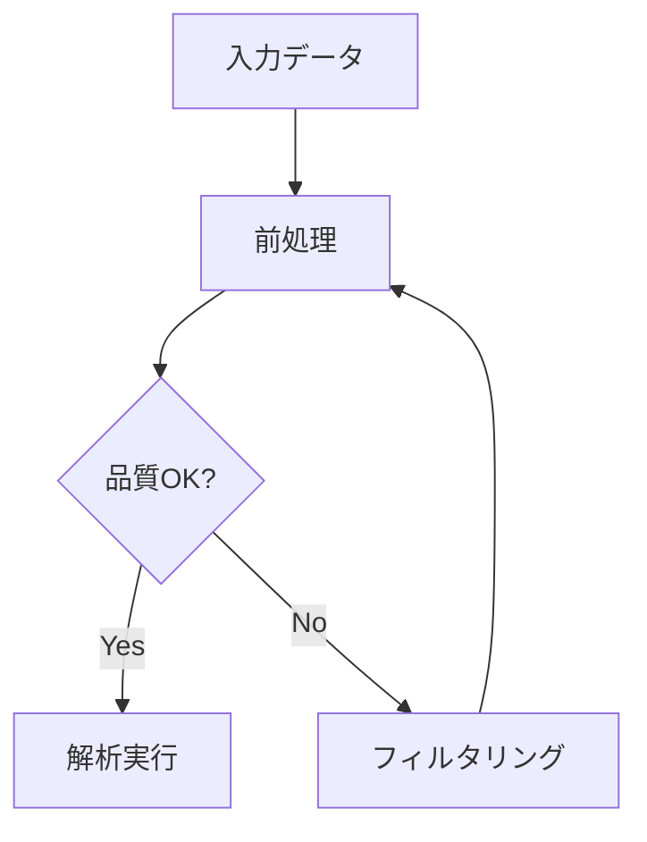
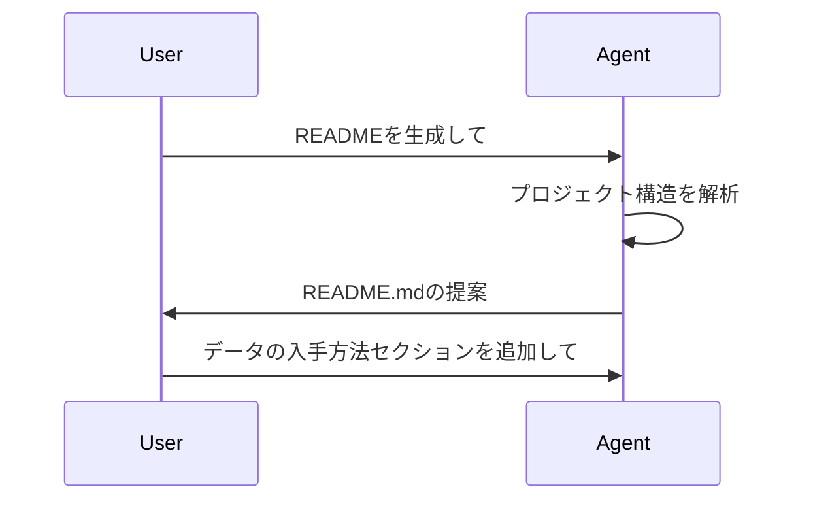

# §18 コードのドキュメント化

[§17 コードのパフォーマンス改善](./17_performance.md)までで、コードを書き、テストし、デバッグし、高速化する技術を学んだ。ここからは「共有と公開」のフェーズに入る。最適化した解析パイプラインも、使い方や設計意図が記録されていなければ、半年後の自分にも共同研究者にも伝わらない。本章では、そのドキュメント化の技術を体系的に学ぶ。

ドキュメントの構成パターン——README、docstring、研究ノート——を知っていれば、エージェントに「NumPy style docstringを全関数に追加して」「READMEに再現手順を書いて」と構造的な指示を出せる。これらのパターンを知らなければ「ドキュメントを書いて」という曖昧な指示しか出せず、断片的で不統一なドキュメントが返ってくる。

エージェントとの役割分担はこうなる。エージェントはdocstring雛形の生成、READMEテンプレートの展開、CHANGELOGの下書きを得意とする。一方、「何を記録すべきか」の判断と「書かれた内容の正確性」の検証は人間が行う。特にバイオインフォマティクスでは、パラメータ選定の根拠やデータの出典のような科学的判断が伴う情報は、エージェントの出力を鵜呑みにせず必ず確認する。

本章では、まず[18-1節](#18-1-markdownの習得)でMarkdownの書き方とMermaid記法、文芸的プログラミングの思想を学ぶ。次に[18-2節](#18-2-プロジェクトドキュメント)でREADME・CHANGELOG・API自動生成を含むプロジェクトドキュメントの実践を解説する。最後に[18-3節](#18-3-研究ノート)で解析の再現に必要な情報の記録方法を紹介する。

---

## 18-1. Markdownの習得

Markdownは、プレーンテキストに軽量な記法を加えるだけで、見出し・リスト・表・コードブロックなどの構造化されたドキュメントを記述できる書式である。GitHub上のREADME、Issue、Pull RequestはすべてMarkdownで記述する。また、Jupyter NotebookのテキストセルやQuartoの `.qmd` ファイルもMarkdownベースである。プログラマにとって最も基本的なドキュメント記法であり、バイオインフォマティクスの解析記録からプロジェクト文書まで、あらゆる場面で使う。

### Markdownの基本記法

以下に、日常的に使う基本記法をまとめる。

| 記法 | 用途 | 記述例 |
|------|------|--------|
| `# 見出し` | 見出し（レベル1〜6） | `## 2レベルの見出し` |
| `- 項目` | 箇条書きリスト | `- 項目1` |
| `1. 項目` | 番号付きリスト | `1. 手順1` |
| `` `コード` `` | インラインコード | `` `python3 --version` `` |
| ` ``` ` | コードブロック | 言語名を指定してシンタックスハイライト |
| `**太字**` | 強調（太字） | `**重要**` |
| `*斜体*` | 強調（斜体） | `*注意*` |
| `[テキスト](URL)` | ハイパーリンク | `[GitHub](https://github.com)` |
| `` | 画像の埋め込み | `` |

コードブロックは、バッククォート3つで囲み、開始行に言語名を指定するとシンタックスハイライトが有効になる。

````markdown
```python
# 言語名を指定するとコードに色が付く
def greet(name: str) -> str:
    return f"Hello, {name}"
```
````

テーブルはパイプ `|` とハイフン `-` で記述する。2行目のハイフン行がヘッダとボディの区切りとなる。

```markdown
| ツール | 用途 |
|--------|------|
| FastQC | 品質管理 |
| STAR   | アラインメント |
```

### GitHub Flavored Markdown

GitHubはMarkdownの標準仕様に加え、GitHub Flavored Markdown（GFM）と呼ばれる拡張記法をサポートしている[1](https://github.github.com/gfm/)。

**タスクリスト**は、Issue やPull Requestで進捗管理に使える。`- [ ]` で未完了、`- [x]` で完了を表す。

```markdown
- [x] FastQCで品質チェック
- [ ] トリミング条件の決定
- [ ] アラインメント実行
```

**脚注**は、本文中に `[^1]` と書き、文末で `[^1]: 内容` と定義する。

```markdown
解析にはSTAR[^1]を使用した。

[^1]: Dobin et al., 2013. STAR: ultrafast universal RNA-seq aligner.
```

**アラート構文**は、注意書きや補足情報を目立たせるブロックである。

```markdown
> [!NOTE]
> このパイプラインはPython 3.10以上が必要である。

> [!WARNING]
> 生データを直接上書きしないこと。
```

GitHubでは `[!NOTE]`、`[!TIP]`、`[!IMPORTANT]`、`[!WARNING]`、`[!CAUTION]` の5種類のアラートが使える。

### Mermaid記法による図の埋め込み

Mermaid[2](https://mermaid.js.org/)は、テキストベースの記法から図を生成するツールである。GitHubではMarkdownファイル内の `mermaid` コードブロックが自動的に図としてレンダリングされる。フローチャート、シーケンス図、ガントチャートなどを、画像ファイルを作成せずにコードとして管理できるため、バージョン管理との相性が良い。

**フローチャート**は、`flowchart` に続けて方向（`TD`: 上から下、`LR`: 左から右）を指定する。ノードを角括弧 `[]` で定義し、矢印 `-->` でつなぐ。

````markdown

````

上のコードをGitHubで表示すると、以下のような図になる。


上の例では、`A[入力データ]` が四角形のノード、`C{品質OK?}` が菱形（判断分岐）のノードである。`-->|Yes|` のようにエッジにラベルを付けられる。

**シーケンス図**は、複数のアクター間のやり取りを時系列で表現する。

````markdown

````

上のコードをGitHubで表示すると、以下のような図になる。


> **🧬 コラム: 解析パイプラインをMermaidで図示する**
>
> RNA-seqの典型的な前処理パイプラインをMermaidで表現すると、各ステップの依存関係と使用ツールが一目でわかる。
>
> ````markdown
> ```mermaid
> flowchart TD
>     A[FASTQ] --> B[FastQC]
>     A --> C[Trimmomatic]
>     C --> D[STAR]
>     D --> E[featureCounts]
>     E --> F[DESeq2]
>     B --> G[MultiQC]
>     D --> G
> ```
> ````
>
> 上のコードをGitHubで表示すると、以下のような図になる。
>
> ```mermaid
> flowchart TD
>     A[FASTQ] --> B[FastQC]
>     A --> C[Trimmomatic]
>     C --> D[STAR]
>     D --> E[featureCounts]
>     E --> F[DESeq2]
>     B --> G[MultiQC]
>     D --> G
> ```
>
> このようなパイプライン図は、[§14 解析パイプラインの自動化](./14_workflow.md)で作成するSnakemakeワークフローのルール依存関係と対応させると、コードとドキュメントの一貫性を保ちやすい。エージェントにSnakefileを渡して「このワークフローのMermaid図を生成して」と指示すれば、自動的にフローチャートを作成できる。

以下のPythonヘルパー関数を使えば、パイプラインのステップ一覧からMermaid図を自動生成できる。`PipelineStep` はステップの名前と表示ラベルを保持するデータクラスで、`generate_pipeline_diagram` はステップの順序に従って `flowchart TD` 形式のMermaid記法を生成する。

```python
# パイプラインのステップを定義する（name: ノードID、label: 表示名）
steps = [
    PipelineStep(name="A", label="FASTQ"),
    PipelineStep(name="B", label="FastQC"),
    PipelineStep(name="C", label="STAR"),
    PipelineStep(name="D", label="featureCounts"),
]

# ステップの順序からMermaidフローチャートを生成する
diagram = generate_pipeline_diagram(steps)
print(diagram)
# flowchart TD
#     A[FASTQ]
#     B[FastQC]
#     C[STAR]
#     D[featureCounts]
#     A --> B
#     B --> C
#     C --> D
```

### 文芸的プログラミング

**文芸的プログラミング**（Literate Programming）は、Donald Knuthが1984年に提唱したプログラミングのパラダイムである[3](https://doi.org/10.1093/comjnl/27.2.97)。従来の「コンピュータが実行するコードの中にコメントとしてドキュメントを埋め込む」アプローチを逆転させ、「人間が読むドキュメントの中にコードを埋め込む」という発想である。

この思想の系譜に、現在のバイオインフォマティクスで広く使われるツールがある。

| ツール | 特徴 |
|--------|------|
| Jupyter Notebook | Python/Rのコードセル + Markdownセル。対話的実行 |
| R Markdown | Rのコードチャンク + Markdown。knitrでレンダリング |
| Quarto | 多言語対応（Python/R/Julia）。`.qmd` ファイル |

[§10 パターン7](./10_deliverables.md#パターン7-jupyter-notebook解析レポート)で学んだ「ロジックは `.py` に抽出し、Notebookは呼ぶ側にとどめる」という原則は、文芸的プログラミングの理想と実務上の制約を踏まえた実践的妥協である。

文芸的プログラミングの理想では、コードとドキュメントは完全に一体化している。しかし実際には、以下のような限界がある。

- **テストの困難さ**: Notebook内の関数にユニットテストを適用しにくい（[§8 テスト技法](./08_testing.md)参照）
- **バージョン管理の困難さ**: `.ipynb` はJSON形式で、差分が読みにくい
- **実行順序依存**: セルの実行順序がコードの正しさに影響する

これらの限界を認識したうえで、「文書としての読みやすさ」と「コードとしての保守性」のバランスを取るのが、[§10](./10_deliverables.md#パターン7-jupyter-notebook解析レポート)のロジック分離原則である。

**Quarto**[4](https://quarto.org/)は、この問題に対するもう一つの解答である。`.qmd` ファイルはプレーンテキストベースのMarkdownであるため、Gitでの差分表示が容易になる。Python、R、Juliaのコードブロックを含めることができ、`quarto render` コマンドでHTML、PDF、Wordなどのドキュメントにレンダリングする。

```bash
# .qmdファイルからHTMLドキュメントを生成する
# render: レンダリング実行、--to: 出力形式の指定
quarto render analysis.qmd --to html
```

#### エージェントへの指示例

Markdownの記法やMermaid図は、エージェントが得意とする領域である。書きたい内容を自然言語で伝えれば、適切な記法に変換してくれる。

> 「このテーブルをMarkdownのテーブル記法に変換して。ヘッダは『ツール名・用途・URL』の3列で」

> 「以下のRNA-seqパイプラインのステップをMermaidのフローチャートにして。方向は上から下（TD）で: FASTQ → FastQC → Trimmomatic → STAR → featureCounts → DESeq2」

> 「Quartoプロジェクトの雛形を作って。Python用の `.qmd` ファイルで、冒頭のYAMLヘッダにtitle、author、date、format: htmlを含めて」

> 「このIssueの内容をGitHub Flavored Markdownのタスクリストに変換して。完了済みの項目は `[x]` にして」

---

## 18-2. プロジェクトドキュメント

コードが正しく動作するだけでは、他の人（あるいは3ヶ月後の自分自身）がそのプロジェクトを利用・保守することはできない。プロジェクトに必要な文脈——何のためのツールか、どうインストールするか、どう使うか——をドキュメントとして整備することが不可欠である。

### README.mdの構造

README.mdはプロジェクトの「玄関」である。GitHubでリポジトリを開いたとき最初に表示されるファイルであり、訪問者が最初に読むドキュメントとなる。

[§7-2 GitHubの活用](./07_git.md#7-2-githubの活用)では、READMEの最低限4項目（何をするか、インストール方法、簡単な使用例、ライセンス）を紹介した。ここではより詳細な構成を解説する。

汎用的なPythonプロジェクトのREADMEは、以下の構造をベースにする。

```markdown
# プロジェクト名

1〜2文でプロジェクトの目的を説明する。

## 概要

プロジェクトの背景、解決する問題、主要な機能を説明する。

## インストール

pip install、conda install、またはソースからのインストール手順。

## クイックスタート

最小限の使用例。コピー&ペーストで動くコードブロック。

## 使い方

より詳しい使い方。主要なオプション、設定ファイルの説明。

## ライセンス

MIT License 等のライセンス表記。
```

READMEを書く際のポイントは以下のとおりである。

- **コピー&ペーストで動く例を載せる**: インストールコマンドや使用例は、読者がそのまま端末に貼り付けて実行できる形にする
- **前提条件を明示する**: Pythonのバージョン、OS、必要な外部ツール（SAMtools等）を記載する
- **スクリーンショットや出力例を載せる**: CLIツールなら実行結果の出力、可視化ツールなら図の例を載せると理解しやすい

以下のバリデータを使えば、READMEに必須セクションが含まれているか、空のセクションがないかを自動チェックできる。`check_required_sections` 関数は「概要」「インストール」「使い方」「ライセンス」の4セクションの存在を検証し、`check_empty_sections` 関数は見出しだけで中身のないセクションを検出する。

```python
from scripts.ch18.validate_readme import validate

# README.mdの内容を読み込んで検証する
text = Path("README.md").read_text()

# 汎用プロジェクト向けの検証
result = validate(text)
print(f"OK: {result.ok}")
for w in result.warnings:
    print(f"  警告: {w}")
# OK: True（必須セクションがすべて存在し、空セクションがない場合）

# 研究リポジトリ向けの追加チェック
result = validate(text, research=True)
# 目的、依存関係、実行手順、データの入手方法、引用方法も検証される
```

### 公開リポジトリのドキュメント

論文に伴ってコードを公開する場合、READMEには研究の再現に必要な追加情報を含める。[§15-5 論文投稿時の再現性パッケージング](./15_container.md#15-5-論文投稿時の再現性パッケージング)ではDocker前提の再現性パッケージを解説したが、ここでは汎用的な公開リポジトリ向けのREADME構成を示す。

```markdown
# 論文タイトルの短縮版

論文「タイトル」(DOI: 10.xxxx/xxxxx) の解析コード。

## 目的

このリポジトリが何をするものか。論文のどの図・表を再現するか。

## 依存関係

- Python 3.11
- Snakemake >= 8.0
- STAR 2.7.11a
- R 4.3（DESeq2用）

## 実行手順

テストデータで結果を再現する具体的なコマンド。

## データの入手方法

生データ: GEO アクセッション GSE123456
ゲノム: Ensembl release 110

## 引用方法

CITATION.cff を参照、または以下の形式で引用:
著者名 et al. (2026). タイトル. 雑誌名.

## ライセンス

MIT License
```

「データの入手方法」は特に重要である。バイオインフォマティクスでは生データが数十GB〜数TBに及ぶことが多く、リポジトリに含めることができない。GEO/SRAのアクセッション番号やダウンロードスクリプトを明記することで、第三者が解析を再現できるようになる。

引用方法には、[§7-2](./07_git.md#7-2-githubの活用)で紹介したCITATION.cffへのリンクを含めるのが望ましい。

> → 投稿前の最終確認は[付録C 論文投稿前チェックリスト](./appendix_c_checklist.md)を参照

### CHANGELOG.md

CHANGELOG.md は、プロジェクトの変更履歴を時系列で記録するファイルである。[§7-4 セマンティックバージョニング](./07_git.md#7-4-セマンティックバージョニング)で紹介したKeep a Changelog[5](https://keepachangelog.com/)の形式に従う。

エージェントに `git log` からCHANGELOGを生成させる場合の注意点がある。

- **git logのコミットメッセージをそのまま列挙しない**: コミットメッセージは開発者向けの粒度であり、ユーザ向けのCHANGELOGとは粒度が異なる。エージェントには「ユーザに影響のある変更のみ抽出し、機能追加・変更・修正のカテゴリに分類して」と指示する
- **バージョン番号との対応を明示する**: 各エントリに対応するバージョンタグとリリース日を記載する
- **Unreleased セクションを活用する**: まだリリースされていない変更は `## [Unreleased]` にまとめ、リリース時にバージョン番号に書き換える

### docstringからのAPI自動生成

[§8-3 コード品質ツール](./08_testing.md#8-3-コード品質ツール)で学んだNumPy style docstringは、人間がソースコードを読む際の助けとなるだけでなく、API リファレンスドキュメントを自動生成するための元データにもなる。[§11-3](./11_cli.md#11-3-ロギング)で触れたように、CLIツールでは docstring が `--help` の説明文にも使われる。

本節では、docstringからWebベースのAPIドキュメントを生成するツールチェーンを紹介する。

**mkdocs + mkdocstrings-python**（初心者推奨）

mkdocs[6](https://www.mkdocs.org/) は、Markdownファイルからスタティックサイトを生成するツールである。mkdocstrings[7](https://mkdocstrings.github.io/) プラグインを組み合わせることで、Pythonソースコードのdocstringを自動的に取り込んだAPIリファレンスを生成できる。

セットアップは以下の3ステップで行う。

```bash
# mkdocsと関連プラグインをインストールする
# mkdocs: ドキュメントサイト生成ツール
# mkdocs-material: 見やすいテーマ
# mkdocstrings[python]: Python docstringの自動取り込みプラグイン
pip install mkdocs mkdocs-material "mkdocstrings[python]"
```

`mkdocs.yml` 設定ファイルでプロジェクト名やテーマを定義し、mkdocstringsプラグインを有効にする。

```yaml
# mkdocs.yml — mkdocsの設定ファイル
site_name: My Tool Docs      # サイトのタイトル
theme:
  name: material              # Material for MkDocsテーマ
plugins:
  - search                    # サイト内検索プラグイン
  - mkdocstrings              # docstring自動取り込みプラグイン
```

APIリファレンスページの Markdown で `::: モジュール名` と書くと、そのモジュールの公開API（関数・クラス）のdocstringがドキュメントに展開される。

```markdown
# API リファレンス

::: my_tool.core
```

```bash
# ローカルでドキュメントをプレビューする
# serve: 開発サーバを起動するサブコマンド
mkdocs serve
```

**Sphinx**（大規模プロジェクト向け）

Sphinx[8](https://www.sphinx-doc.org/)は、Pythonの公式ドキュメントにも使われている歴史あるドキュメント生成ツールである。高い拡張性とreStructuredTextベースの記法が特徴で、大規模プロジェクトに適している。ただし設定の学習コストが高いため、小〜中規模のバイオインフォマティクスプロジェクトでは mkdocs を推奨する。

docstringのカバレッジは、以下のチェッカーで確認できる。`check_coverage` 関数はPythonソースコードを `ast` モジュール（抽象構文木）で解析し、公開関数・クラスのdocstring有無をカウントする。`check_numpy_style` 関数は、docstringがNumPy style（セクション名 + アンダーラインの形式）に準拠しているか検証する。

```python
from scripts.ch18.docstring_checker import check_coverage, check_numpy_style

# Pythonソースコードのdocstringカバレッジを計測する
source = Path("my_tool/core.py").read_text()
result = check_coverage(source)
print(f"カバレッジ: {result.documented}/{result.total} ({result.ratio:.0%})")
# カバレッジ: 8/10 (80%)

# docstringがNumPy styleに準拠しているか検証する
for name in result.missing:
    print(f"  docstringなし: {name}")
# docstringなし: helper_func
# docstringなし: parse_args
```

> **🤖 コラム: MLプロジェクトのModel Card**
>
> 機械学習モデルを公開する際は、READMEに加えて**Model Card**の作成が推奨されている。Model Cardは、Mitchell et al. (2019)[9](https://doi.org/10.1145/3287560.3287596)が提唱したフレームワークで、モデルの以下の情報を体系的に記録する。
>
> | セクション | 内容 |
> |-----------|------|
> | Model Details | モデルの種類、アーキテクチャ、学習手法 |
> | Intended Use | 想定される用途と対象ユーザ |
> | Training Data | 学習データの出典、前処理、サイズ |
> | Evaluation | 評価指標、テストデータでの性能 |
> | Limitations | 既知の限界、バイアスのリスク |
> | Ethical Considerations | 倫理的配慮事項 |
>
> Hugging Face Hubでは、モデルリポジトリの `README.md` にModel Cardのメタデータを記述する仕組みが標準化されている。バイオインフォマティクスの文脈では、タンパク質構造予測モデルや変異の病原性予測モデルなどを公開する際に重要となる。

#### エージェントへの指示例

プロジェクトドキュメントの生成は、エージェントの自動生成能力が最も活きる領域である。ただし、内容の正確性——特に依存関係のバージョンやデータの出典——は必ず人間が確認する。

> 「このプロジェクトのREADMEを生成して。概要、インストール、クイックスタート、使い方、ライセンスのセクションを含めて。pyproject.tomlから依存関係を読み取ってインストール手順に反映して」

> 「src/ 以下のすべての公開関数にNumPy style docstringを追加して。既存のdocstringがある関数はスキップして。Parameters、Returns、Raisesセクションを含めて」

> 「mkdocsの設定ファイル（mkdocs.yml）を作成して。Material for MkDocsテーマとmkdocstringsプラグインを使う構成で。src/my_tool/ 以下の全モジュールのAPIリファレンスページも生成して」

> 「git logの直近20コミットから、Keep a Changelog形式のCHANGELOGエントリを作成して。ユーザに影響のある変更のみ抽出し、Added/Changed/Fixedのカテゴリに分類して」

---

## 18-3. 研究ノート

バイオインフォマティクスの解析は、一度きりで終わることは少ない。パラメータを変えて再実行したり、新しいサンプルを追加したり、レビュアーからの指摘で追加解析を行ったりする。「3ヶ月前の自分がどのパラメータで何を実行して、なぜその値を選んだか」を正確に思い出すのは不可能に近い。研究ノートは、その情報を未来の自分のために記録する手段である。

### 解析の再現に必要な情報の記録

解析の再現に最低限必要な情報は以下の4項目である。

| 項目 | 記録例 |
|------|--------|
| **パラメータ** | `--min-quality 20 --min-length 50` |
| **ツールバージョン** | `STAR 2.7.11a`, `samtools 1.19` |
| **実行環境** | OS、CPUコア数、メモリ量、GPUの有無 |
| **実行日時** | `2026-03-21 14:30 JST` |

これに加えて、**パラメータ選定の根拠**を記録することが重要である。「なぜ品質スコアの閾値を20にしたのか」「なぜアラインメントにSTARを使い、HISATではないのか」といった判断の理由は、コードや設定ファイルからは読み取れない。

実行環境の記録には、Pythonの `platform` モジュールを使うと便利である。以下のコマンドは、OSの種類、CPUアーキテクチャ、Pythonバージョンを出力する。

```bash
# 実行環境の情報を出力する
# platform.platform(): OS情報、platform.machine(): CPUアーキテクチャ
python3 -c "import platform; print(platform.platform(), platform.machine())"
```

ツールバージョンの記録は、[§15 コンテナによるソフトウェア環境の再現](./15_container.md)の `conda list --export` や `pip freeze` と組み合わせると、完全な依存関係のスナップショットが得られる。

### Jupyter Notebookの利点と限界

Jupyter Notebookは、[§10 パターン7](./10_deliverables.md#パターン7-jupyter-notebook解析レポート)で「解析レポート」として位置づけた成果物形式である。研究ノートとしての観点からも評価してみよう。

**利点:**

- **コード + 結果 + 解説の一体化**: 実行結果（図表、数値）がコードの直下に表示され、Markdownセルで解説を加えられる
- **対話的な探索**: セル単位で実行しながら、データの中身を確認できる
- **可視化との相性**: matplotlib、seaborn等のグラフがインラインで表示される

**限界:**

- **差分の可読性**: `.ipynb` ファイルはJSON形式であり、セルの出力（画像のBase64エンコード等）を含むため `git diff` の結果が読みにくい
- **実行順序依存**: セルを上から順に実行しないと、変数の状態が変わり結果が再現できないことがある
- **マージの困難さ**: 複数人が同じNotebookを編集すると、JSONレベルでコンフリクトが発生しやすい

差分の可読性に対しては、**nbstripout**[10](https://github.com/kynan/nbstripout)が有効である。nbstripoutはGitのフィルタとして動作し、コミット時にNotebookのセル出力（実行結果、画像）を自動的に除去する。これにより、差分がコードとMarkdownテキストのみになる。

```bash
# nbstripoutをインストールし、現在のリポジトリに設定する
# --install: Gitフィルタとして登録するサブコマンド
pip install nbstripout
nbstripout --install
```

設定後は、`git add` で `.ipynb` ファイルをステージングするたびに、出力が自動的に除去された状態でコミットされる。なお、[§16 スパコン・クラスタでの大規模計算](./16_hpc.md)で紹介したリモートサーバ上でのJupyter利用でも、ローカルにnbstripoutを設定しておけば、出力なしのクリーンなNotebookがバージョン管理される。

### テキストベースの研究ノート代替

Notebookの限界を踏まえ、テキストベースの代替手段も検討に値する。

**Quartoの `.qmd` ファイル**

[17-1節](#18-1-markdownの習得)で紹介したQuarto[4](https://quarto.org/)は、`.qmd` ファイル（プレーンテキストのMarkdown）にコードブロックを含める形式である。`.ipynb` と異なりJSON構造を持たないため、`git diff` で差分が明瞭に表示される。

```markdown
---
title: "RNA-seq解析レポート"
author: "解析者名"
date: 2026-03-21
format: html
---

## 品質管理

```{python}
# FastQCの結果を読み込んで可視化する
import pandas as pd
qc = pd.read_csv("results/multiqc_data.csv")
qc.plot(x="Sample", y="total_sequences", kind="bar")
```
```

**ANALYSIS_LOG.md**

最もシンプルな研究ノートは、プレーンなMarkdownファイルに日付ごとのエントリを追記していく方法である。

```markdown
# ANALYSIS_LOG

## 2026-03-21: 初回解析

- STAR 2.7.11aでアラインメント実行
- パラメータ: --outFilterMismatchNmax 10
- 根拠: ENCODE RNA-seq pipelineのデフォルト設定に準拠
- マッピング率: 85-92%（サンプル間で一貫）

## 2026-03-22: フィルタリング条件の変更

- 最低マッピング品質を10から20に引き上げ
- 理由: マルチマッピングリードの比率が15%を超えるサンプルがあった
- 影響: マッピング率が3-5%低下するが、偽陽性のリスクが減少
```

ANALYSIS_LOG.mdは技術的には何も特別なことをしていないが、「パラメータを変更した理由」を強制的に記録する習慣として効果的である。

> **🧬 コラム: MIAME/MINSEQE — 実験の最小記録要件**
>
> バイオインフォマティクスのドキュメント化を語るうえで、実験側の記録基準にも触れておきたい。
>
> **MIAME**（Minimum Information About a Microarray Experiment）[11](https://doi.org/10.1038/ng1201-365)は、マイクロアレイ実験の結果を公開する際に最低限記載すべき情報を定めた基準である。実験デザイン、サンプル情報、プロトコル、測定パラメータ、正規化手法を含む。GEOへのデータ登録時に準拠が求められる。
>
> **MINSEQE**（Minimum Information about a high-throughput Nucleotide SeQuencing Experiment）は、同様の考え方を次世代シーケンシング実験に拡張したものである。ライブラリ調製法、シーケンサの機種とパラメータ、リードの品質情報などが対象となる。
>
> これらの基準は「最低限何を記録すべきか」の参考になる。解析の再現性だけでなく、実験の再現性を支えるドキュメントの考え方として覚えておくとよい。

#### エージェントへの指示例

研究ノートのテンプレート作成やNotebookの変換は、エージェントに定型作業を任せやすい領域である。ただし、パラメータ選定の根拠など科学的判断が伴う部分は人間が書く。

> 「このプロジェクト用のANALYSIS_LOG.mdテンプレートを作成して。日付、使用ツールとバージョン、実行コマンド、パラメータの根拠、結果の要約をセクションに含めて」

> 「このJupyter Notebookの関数定義をsrc/以下の.pyモジュールに抽出して。Notebookにはimport文と関数呼び出しだけ残して」

> 「このリポジトリにnbstripoutを設定して。.gitattributesファイルの作成と、READMEのセットアップ手順への追記も行って」

---

## まとめ

本章では、コードを書くだけでは伝わらない情報——設計意図、使い方、判断の根拠——をドキュメントとして残す技術を学んだ。

| 概念 | 要点 |
|------|------|
| **Markdown** | プレーンテキストベースの軽量記法。README、Issue、Notebookで共通して使う |
| **GitHub Flavored Markdown** | タスクリスト、脚注、アラート構文。GitHubでの共同作業に便利 |
| **Mermaid** | テキストからフローチャートやシーケンス図を生成。コードと同様にバージョン管理できる |
| **文芸的プログラミング** | Knuth (1984) の思想。Notebook/Quartoの源流。ロジック分離原則は実践的妥協 |
| **README.md** | プロジェクトの玄関。概要、インストール、使い方、ライセンスを含む |
| **公開リポジトリのREADME** | 目的、依存関係、実行手順、データ入手方法、引用方法を追加で記載 |
| **CHANGELOG.md** | Keep a Changelog形式。git logからの自動生成はユーザ視点で要約する |
| **docstring → API自動生成** | mkdocs + mkdocstrings で docstring からWebドキュメントを生成 |
| **研究ノート** | パラメータ、バージョン、環境、判断の根拠を記録。3ヶ月後の自分は他人 |
| **nbstripout** | Notebookのセル出力をコミット時に自動除去。差分の可読性を改善 |
| **Quarto** | `.qmd` ファイルはプレーンテキストでdiff容易。Notebookの代替 |

ドキュメントにはデータの出典を明記することが重要であると繰り返し述べた。次章の[§19 公共データベースとAPI](./19_database_api.md)では、その出典元である公開データベースの利用と、API経由のデータ取得を学ぶ。

---

## 参考文献

[1] GitHub. "GitHub Flavored Markdown Spec". https://github.github.com/gfm/ (参照日: 2026-03-21)

[2] Mermaid. "Mermaid — Diagramming and charting tool". https://mermaid.js.org/ (参照日: 2026-03-21)

[3] Knuth, D. E. "Literate Programming". *The Computer Journal*, 27(2), 97-111, 1984. https://doi.org/10.1093/comjnl/27.2.97

[4] Quarto. "Quarto — An open-source scientific and technical publishing system". https://quarto.org/ (参照日: 2026-03-21)

[5] Keep a Changelog. "Keep a Changelog". https://keepachangelog.com/ (参照日: 2026-03-21)

[6] mkdocs. "MkDocs — Project documentation with Markdown". https://www.mkdocs.org/ (参照日: 2026-03-21)

[7] mkdocstrings. "mkdocstrings — Automatic documentation from sources, for MkDocs". https://mkdocstrings.github.io/ (参照日: 2026-03-21)

[8] Sphinx. "Sphinx — Python Documentation Generator". https://www.sphinx-doc.org/ (参照日: 2026-03-21)

[9] Mitchell, M. et al. "Model Cards for Model Reporting". *Proceedings of the Conference on Fairness, Accountability, and Transparency (FAT\* '19)*, 220-229, 2019. https://doi.org/10.1145/3287560.3287596

[10] nbstripout. "nbstripout — strip output from Jupyter and IPython notebooks". https://github.com/kynan/nbstripout (参照日: 2026-03-21)

[11] Brazma, A. et al. "Minimum information about a microarray experiment (MIAME) — toward standards for microarray data". *Nature Genetics*, 29(4), 365-371, 2001. https://doi.org/10.1038/ng1201-365

[12] Rule, A. et al. "Ten Simple Rules for Writing and Sharing Computational Analyses in Jupyter Notebooks". *PLOS Computational Biology*, 15(7), e1007007, 2019. https://doi.org/10.1371/journal.pcbi.1007007

[13] Wilson, G. et al. "Good Enough Practices in Scientific Computing". *PLOS Computational Biology*, 13(6), e1005510, 2017. https://doi.org/10.1371/journal.pcbi.1005510
